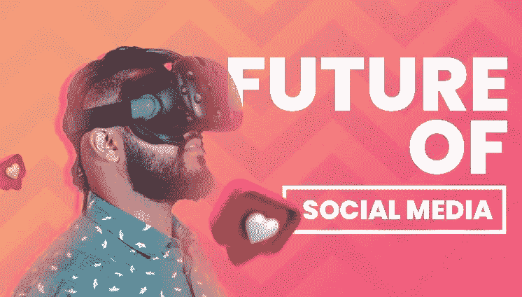

# 虚拟现实是社交媒体的未来吗？

> 原文：<https://medium.datadriveninvestor.com/is-virtual-reality-the-future-of-social-media-1af72852dff3?source=collection_archive---------1----------------------->

社交媒体是一个不断增长的领域，由脸书、Snapchat 等巨头主导。可以发现，惊人的 42%的世界人口至少有一个社交媒体账户。为了在游戏中保持领先，一个人需要满足用户的需求，并不断跟上所有最新和正在发生的趋势。一个这样的趋势话题是虚拟现实，因此问题出现了。虚拟现实是社交媒体的未来吗？

# 这个所谓的‘社交媒体的未来’有多近？

为此，我必须说它非常近。在未来几年，虚拟现实和增强现实(A.R .)将被引入营销领域的更多实际应用中。

 [## 人工智能和虚拟现实的融合-你能期待什么|数据驱动的投资者

### 在技术领域，融合是合乎逻辑的一步。就在几十年前，你可能需要一个专门的…

www.datadriveninvestor.com](https://www.datadriveninvestor.com/2018/08/30/the-convergence-of-ai-rv-what-you-can-expect/) 

人类是视觉动物。显然，图片、视频和身临其境的内容是社交媒体的未来。因此，如果公司想要保持在市场上的主导地位，它们真的需要跟上这股潮流。AR 和 VR 正迅速成为许多营销活动的重要组成部分，因此公司需要考虑在营销活动中融入这些技术的各个方面。

据报道，脸书、WhatsApp、Instagram、Snapchat、Bitmoji、微信和 QQ 个人通讯应用将在不久的将来利用 A.R 来增加广告收入。像谷歌这样的公司已经开始测试他们的交互式混合现实广告。

# 如何实现这一点？

融合 AR 和 VR 等技术的可能性是无限的，但看起来脸书已经想通了。

2014 年，脸书收购了一家承诺打造 VR 未来的公司。这家公司名叫 [Oculus](https://www.oculus.com/?locale=en_US) 。高端的吸引力赢得了数百万热情的早期个人电脑消费者和数百万获得早期服务的移动用户。早在 2016 年，脸书就已经播下了虚拟现实未来的种子。脸书在 Oculus Connect 活动(2016)上介绍了“脸书社交虚拟现实”演示。下面的视频会让你大吃一惊。

观看下面的视频，简要了解混合现实的可能性。

尽管成就非凡，但这种沉浸式世界的概念还是让我有点害怕。让我们来讨论一下，看看流行文化是如何看待这个问题的。

# 流行文化如何看待这一点

如果你喜欢科幻剧，那么你可能听说过《黑镜》。有一集叫做《急转直下》描述了社会是如何发展成这样一种情况的，在这种情况下，社会存在比真正的情感、性格和个性更受重视。我们正在谈论的这种社会存在是通过给予和接受彼此的个人评级来实现的。

基本上是 Instagram 或者脸书走进了生活。一个张贴假期、锻炼和描绘善行的人发现他/她自己处于社会的顶层，而一个对理想行为有任何一丝厌恶的人发现他/她自己处于这个未来社会的底层。

随着真实社交体验的现代趋势与虚拟社交世界之间的差距日益缩小，我们可以预计社交媒体的未来将使人们要么成为天生虚假的自我版本，要么迎合群体身份。

更可怕的是，同样的意识形态正在中国实施。

《连线》杂志的一篇文章披露了中国最近的一项“个人信用”计划，该计划与中国的一个移动支付平台有关，该平台根据用户的日常习惯为用户提供 350 至 950 的评级。

大多数功能看起来很简单，例如，偿还债务，例如，给你一个体面的评级，但其他一些参数似乎有点令人不安，例如你和谁在一起或你购买的东西来确定你的分数。

你对此有什么想法？

*阅读来源:#*