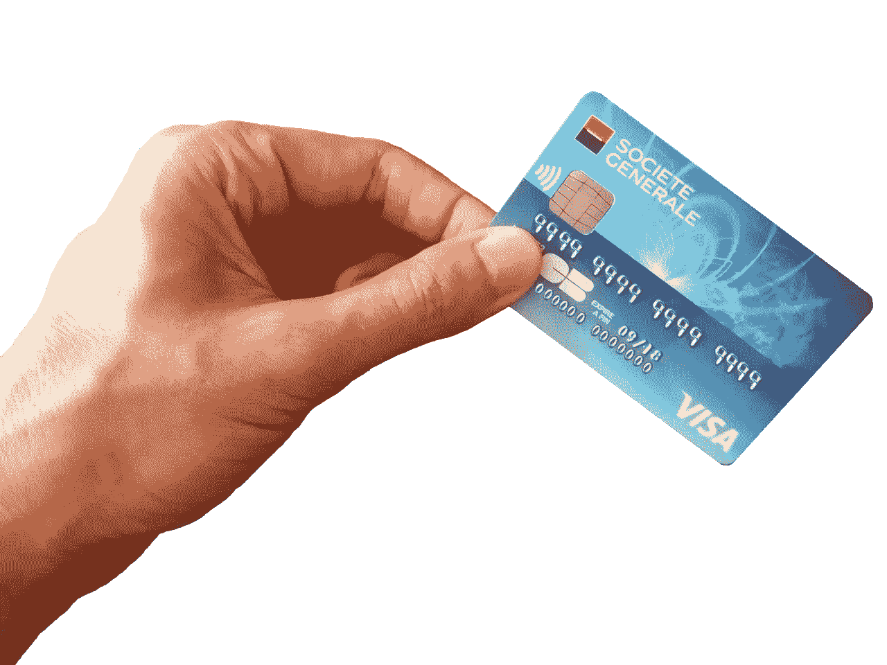
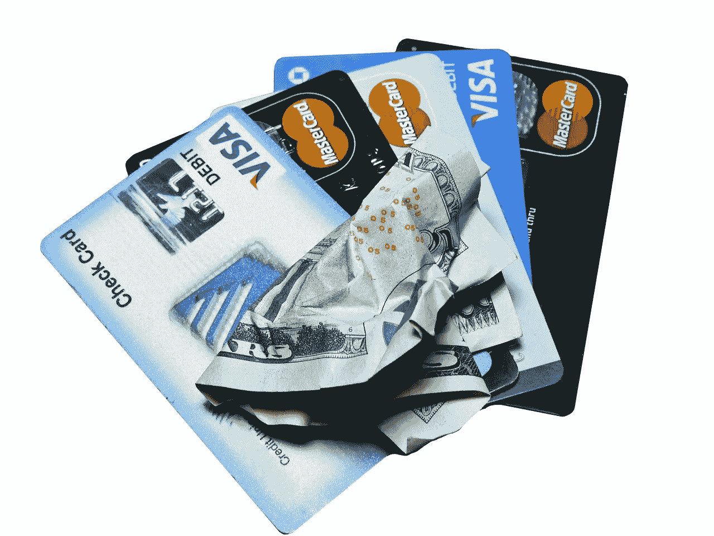
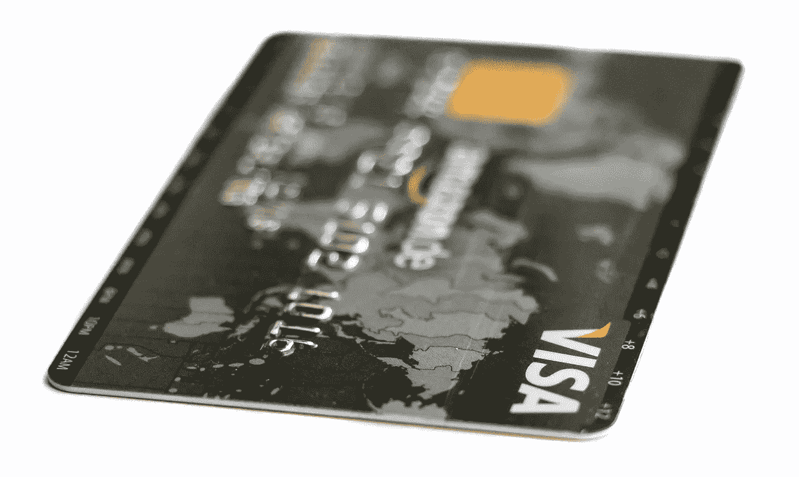
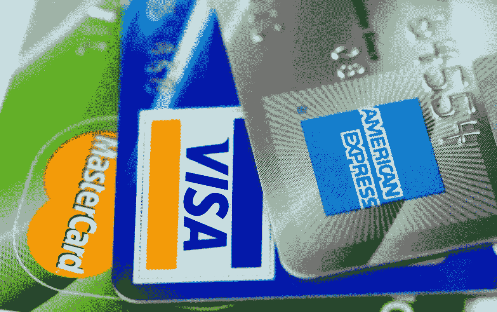

# Visa (V)赚钱吗？

> 原文：<https://medium.datadriveninvestor.com/is-visa-v-making-money-894b71c6129c?source=collection_archive---------22----------------------->

Visa(纽约证券交易所代码:V) 潜在价值远比许多人怀疑的要高。例如，美国支付处理器每年产生 900 亿美元的刷卡费。

每次使用信用卡或借记卡交易时，您都需要支付刷卡费。毫不奇怪，刷卡费是一项利润丰厚的业务。例如，彭博[估计](https://www.bloomberg.com/news/articles/2018-09-18/visa-mastercard-reach-6-2-billion-settlement-over-swipe-fees)美国刷卡费每年为支付处理商创造 900 亿美元。

在这种情况下，很容易理解为什么 Visa、**万事达卡(纽约证券交易所代码:MA)** 和其他公司会支付 62 亿美元来解决集体诉讼。彭博报道，零售商起诉 Visa 降低刷卡费用。

本案为*支付卡交换费和商户折扣反垄断诉讼，05-md-01720，美国地方法院*。据报道，该案件正在美国纽约东区(布鲁克林)地方法院审理。

**Visa(V)有多赚钱？**

因此，这场诉讼会让许多投资者问“Visa (V)的盈利能力如何？Stockrow 提供的答案很赚钱。

例如，Visa 报告 2018 年第二季度的毛利为 43.38 亿美元。引人注目的是，该毛利几乎与第二季度 54.2 亿美元的收入一样大。

最终，Visa (V)从刷卡手续费和交易中赚了很多钱。例如，Visa 报告 2018 年第二季度净收入为 23.29 亿美元，营业收入为 28.55 亿美元。

此外，Stockrow 认为 Visa 在 2018 年第二季度的运营现金流为 36.37 亿美元，自由现金流为 34.82 亿美元。这些数字表明，Visa 收取刷卡费的业务肯定是有利可图的。

重要的是，Visa (V)保留了大量资金。该公司于 2018 年 6 月 30 日报告了 133.88 亿美元的现金和短期投资。具体而言，Visa 报告第二季度现金及等价物为 99.92 亿美元，短期投资为 33.96 亿美元。

**Visa (V)是全球最大的支付平台**

Visa (V)是全球最大的支付平台。为了演示 Statista [报告](https://www.statista.com/statistics/618115/number-of-visa-credit-cards-worldwide-by-region/)2018 年第一季度全球流通的 Visa 卡有 7.55 亿张。特别是，2018 年第一季度，美国有 3.42 亿张 Visa 卡。

相比之下，Statista [估计【2018 年第二季度全球有 2.44 亿 **PayPal(纳斯达克:PYPL)** 账户。相应地，Statista](https://www.statista.com/statistics/218493/paypals-total-active-registered-accounts-from-2010/) [估计](https://www.statista.com/statistics/911914/number-apple-pay-users/)2017 年全球有 1.27 亿 Apple Pay 用户。重要的是，许多 Apple Pay 用户正在通过 Apple Pay 使用 Visa 进行支付。

因此，Visa (V)比任何潜在的竞争对手都有巨大的优势。它的平台几乎是 Apple Pay 的六倍，是 PayPal 的三倍多。

唯一一个用户数量超过 Visa 的支付平台是腾讯控股的微信支付。为了证明这一点，Statista [估计](https://www.statista.com/statistics/255778/number-of-active-wechat-messenger-accounts/)微信支付在 2018 年第二季度拥有 10.4 亿用户。值得注意的是，另一个大型移动支付解决方案蚂蚁金服的支付宝在 2017 年 8 月拥有 4 亿用户，Statista 计算。

**签证时的真实价值(V)**

显然，Visa 的真正价值在于其支付平台的规模和覆盖范围。如果 Visa (V)能在其他地方复制其在美国的成功，它就能产生大量资金。

Visa 可以在新兴国家挖掘大量机会。使用数字货币如 M-pesa 的“现收现付”( [PAYG](https://marketmadhouse.com/the-payg-revolution-will-bring-the-consumer-economy-to-everybody/) )系统甚至可以惠及最贫穷的个人。

许多公司正在使用基于 M-pesa 的支付计划向非洲人民销售商品。显然，PAYG 或 M-pesa 信用卡是 Visa (V)必须抓住的机会。

理论上比 M-Presa 更通用的加密货币可能更加有利可图。[**Pundi-X**](https://marketmadhouse.com/is-pundi-x-a-great-cryptocurrency-opportunity/)**【NPXS】**和[**DASH**](https://marketmadhouse.com/is-dash-dash-a-good-speculative-cryptocurrency/)**【DASH】**正在部署可与 Visa 在南美的平台整合的商户销售点(POS)系统。

Visa 最大的机会将是央行发行的加密货币和加密货币的即时转换。不幸的是，还没有央行加密货币，尽管中国人民银行正在研究一种。另一方面，[支持](https://marketmadhouse.com/why-uphold-is-most-disruptive-blockchain-application/)声称在 180 个国家兑换 35 种加密货币。

必须记住，数字货币只是 Visa 可以利用的一个有利可图的机会。Visa (V)技术提供的其他机会包括智能托管、基于智能手机的银行业务、汇款、外汇、货币兑换和基于区块链的电子商务。

因此，Visa 的真正价值在于当今世界提供的所有未来机会。没有哪家公司能比它更好地从新兴世界的消费者爆炸中获利。

**签证(V)将随中产阶级增长**

有趣的是，Visa 的历史可能会在新兴市场重演。20 世纪，Visa (V)因向美国中产阶级提供消费信贷而发展壮大。通过向新兴世界的中产阶级提供消费信贷，Visa 可以变得更大。

在一些新兴市场，中产阶级正在迅速壮大。例如，Livemint [估计](https://www.livemint.com/Opinion/TvcFydQcN6KEFkvdW7BprM/Indias-burgeoning-middle-class.html)印度的中产阶级从 2004-2005 年的 4540 万人增长到 2011-2012 年的 1.085 亿人。

很能说明问题的是，同期印度的中产阶级下层从 2.378 亿人增长到 4.463 亿人。更重要的是，印度的上层中产阶级从 2100 万人增加到 4950 万人，印度的富裕阶层从 750 万人增加到 2290 万人。

显然，所有这些中产阶级都是潜在的签证客户。尤其是富裕阶层会想要黄金车，中上阶层会想要信用卡，中下阶层会用礼品卡。Visa 提供所有这些产品。更重要的是，Visa 可以开始向所有这些印度人收取刷卡费。

**Visa(V)股票是否被低估**

我认为 Visa (V)的股票在 2018 年 9 月 26 日被低估了每股 149.27 美元，因为它的潜力。

而且，Visa (V)是很好的分红股。例如，其股东在 2018 年 9 月 4 日收到了 21 英镑的股息。股息从 2016 年的 14 英镑增长到 2017 年的 16.5 英镑和 19.5 英镑，再到 2018 年的 21 英镑。因此，Visa (V)能够实现显著的股息增长。

2018 年 9 月 25 日，Visa 股东的股息收益率为 0.56%，年化派息为 84，派息率为 18.2%。重要的是，Visa 已经报告了连续九年的股息增长。

换句话说，如果你正在寻找一只现在就有回报的成长型股票，那就调查一下 Visa(纽约证券交易所代码:V) 。很明显，Visa (V)是一个在全世界都有巨大增长潜力的赚钱机器。

这种傲慢的评论首次出现在 [*市场疯人院*](https://marketmadhouse.com/) 你的股票疯人院镜子。