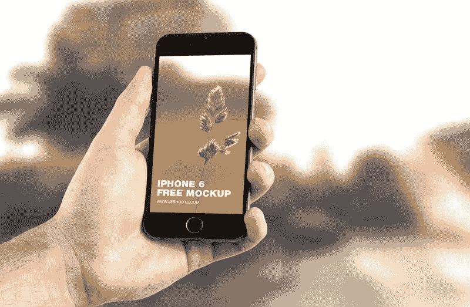

# 沃达丰赚钱了吗？—市场疯人院

> 原文：<https://medium.datadriveninvestor.com/is-vodafone-making-money-market-mad-house-43a0de8b282b?source=collection_archive---------17----------------------->

我想知道沃达丰赚钱了吗，因为电信的收入在 2018 年大幅下降。具体来说，**沃达丰集团(Vodafone Group PLC)的**营收从 2018 年 3 月的 659.53 亿美元降至 2019 年 3 月的 582.21 亿美元。

此外，斯托克罗[估计](https://stockrow.com/VOD/financials/income/annual)沃达丰同期的收入增长率下降了 10.36%。令人困惑的是，沃达丰在 2019 年 3 月 31 日报告的毛利为 180.08 亿美元，营业收入为 1.4 亿美元，净收入为-101.92 亿美元。

 [## 分散金融的出现|数据驱动的投资者

### 当前的全球金融体系为拥有资源、知识和财富的人创造了巨大的财富

www.datadriveninvestor.com](https://www.datadriveninvestor.com/2019/03/14/the-emergence-of-decentralized-finance/) 

所以沃达丰在亏损，营收在缩水。然而，沃达丰的客户群在一些市场略有增长。例如，在德国，沃达丰的用户数量从 2017-2018 年的 1026 万增长到 2018-2019 年的 1031 万，Statista [估计](https://www.statista.com/statistics/477192/revenue-vodafone-germany/)。相反，沃达丰的德国用户群仍低于 2014-2015 年 1068 万的高点。

# 沃达丰的客户群在萎缩吗？

沃达丰仍然有很大的价值，因为它在 2018 年为全球 26 个国家的超过 5 亿客户提供了服务。

令人印象深刻的是，沃达丰是 2019 年英国最有价值的品牌，Investopedia [声称](https://www.investopedia.com/articles/markets/030216/worlds-top-10-telecommunications-companies.asp)。此外，Investopedia 将沃达丰列为世界第四大电信公司，仅次于**中国移动有限公司(纽约证券交易所代码:CHL)**[**威瑞森**](https://marketmadhouse.com/is-verizon-a-value-investment/) **(纽约证券交易所代码:VZ)** 和 **AT &(纽约证券交易所代码:T)** 。

沃达丰 Idea 是印度领先的电信公司；Statista [估计](https://www.statista.com/statistics/258794/mobile-telecom-subscribers-in-india-by-company/)2019 年 5 月有 3.87 亿用户。值得注意的是，据 Statista 计算，沃达丰 Idea 在 2017 年 12 月拥有 2.1252 亿用户。

因此，沃达丰的客户群在增长，尽管其收入在缩水。不幸的是，财务数据显示沃达丰在印度市场可能赚不到钱。

# 沃达丰产生了多少现金？

沃达丰有很多客户，但它能产生多少现金？答案是很多，但沃达丰的现金也在下降。

例如，年度运营现金流从 2018 年 3 月的 189.78 亿美元降至 2019 年 3 月的 173.07 亿美元。此外，自由现金流从 2018 年 3 月的 121.67 亿美元降至一年后的 106.29 亿美元。然而，融资现金流从 2018 年 3 月的-100.89 亿美元上升至 2019 年 3 月的 59.16 亿美元。

令人印象深刻的是，沃达丰在 2019 年 3 月 31 日拥有 355.32 亿美元的现金和短期投资。具体而言，沃达丰拥有 181.83 亿美元的现金及等价物，以及 173.49 亿美元的短期投资。

因此，沃达丰是一家现金充裕的公司，可以轻松度过当前的收入下降。然而，沃达丰需要大幅增加收入才能生存。

# 数字货币能拯救沃达丰吗？

值得注意的是，沃达丰通过其在东非的子公司 [Safaricom](https://www.safaricom.co.ke/personal/m-pesa) 控制着世界上最成功的数字货币 [M-Pesa](https://www.mpesa.in/portal/) 。

M-Pesa 是一种未加密的数字货币，自 2007 年 3 月以来已经存在了 12 年。有趣的是，印度储备银行授权 M-Pesa 在该国使用。所以 M-Pesa 在印度有售。

沃达丰估计，2018 年 12 月，肯尼亚境外有 1340 万 M-Pesa 用户，*商业日报* [报道](https://www.businessdailyafrica.com/corporate/companies/M-Pesa-users-outside-Kenya-hit-13-4-million/4003102-4956208-16s8a9/index.html)。此外，2018 年，来自坦桑尼亚、刚果民主共和国、莫桑比克和莱索托的 M-Pesa 收入增长了 30.3%。商业日报*估计，2018 年，M-Pesa 在肯尼亚以外的收入为 6100 万美元或 62.8 亿肯尼亚先令。*

此外，商业日报称，M-Pesa 现在占沃达丰服务收入的 16.4%。沃达丰拥有 Safaricom 35%的股份。此外，沃达丰估计，2018 年 M-Pesa 生态系统每月处理 237 笔交易。此外，2017 年至 2018 年，M-Pesa 的使用量增长了 24.2%。

# 加密货币能提振沃达丰吗？

毫不奇怪，沃达丰正在研究下一代数字货币或加密货币。特别是，沃达丰是脸书(NASDAQ: FB) [项目 Libra](https://libra.org/en-US/partners/) 加密货币计划的合作伙伴。

Libra 是一种被提议的加密货币，脸书可以通过 WhatsApp、Instagram 和其他脸书社交媒体传输。Libra 加密货币的细节很少，但脸书可能会在 2020 年发布 Libra。脸书在 Libra 的目的是提供一种发展中国家的人们可以使用的加密货币。

沃达丰在 Libra 项目中的参与程度很难确定。此外，没有证据表明天秤座和 M-Pesa 之间有联系。

但是，我认为无论是数字货币还是加密货币，沃达丰都是不错的投资。重要的是，沃达丰是少数几家在现实世界中拥有数字货币经验的公司之一。

事实上，在印度和肯尼亚，人们可以使用 M-Pesa 来支付无线账单。此外，一些公司让非洲人用 M-Pesa 分期付款计划购买电器和电子产品。此外，慈善机构[give direct](https://www.givedirectly.org/)允许美国人通过手机应用程序向贫穷的非洲人发放 M-Pesa。

# 沃达丰是价值投资吗？

鉴于这些数字，许多人会怀疑**沃达丰(纳斯达克代码:VOD)** 是否是一项价值投资，因为其股票在 2019 年 7 月 30 日的交易价格为 18.32 美元。

此外，沃达丰将于 2019 年 8 月 2 日支付 46.4₵股息。该股息高于 2019 年 2 月 1 日 55₵的股息，但低于 2018 年 8 月 3 日的 1.95 美元。因此，我认为 VOD 是一个很好的股息股，但股息正在减少。

沃达丰在 2019 年 7 月 30 日给投资者的股息收益率为 4.96%，年化 91₵支付率为 64.4%。此外，Dividend.com 认为沃达丰有两年的股息增长。

总之，我认为沃达丰是一项价值投资，因为它是一家现金充裕、生态系统不断发展的公司。此外，沃达丰拥有一些有趣的技术能力和经验，这可能使其在加密货币商业化的竞争中占据优势。

*原载于 2019 年 7 月 30 日*[*https://marketmadhouse.com*](https://marketmadhouse.com/is-vodafone-making-money/)*。*