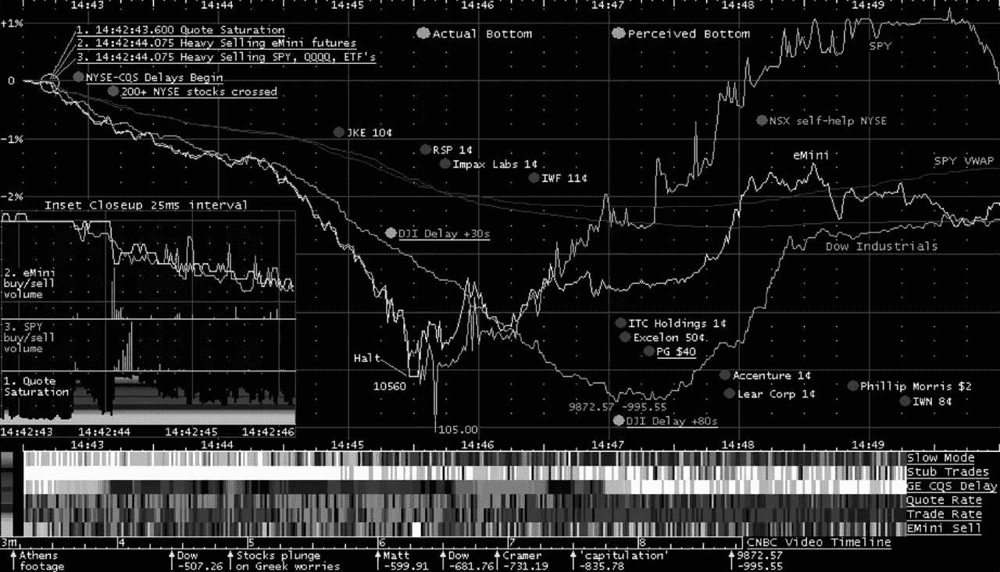
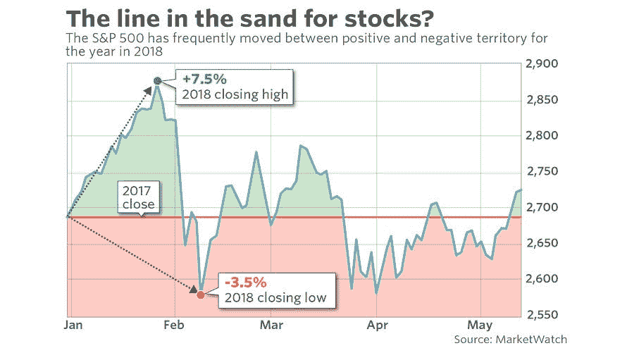
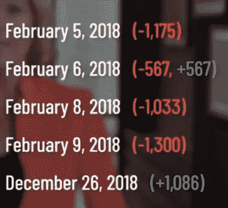
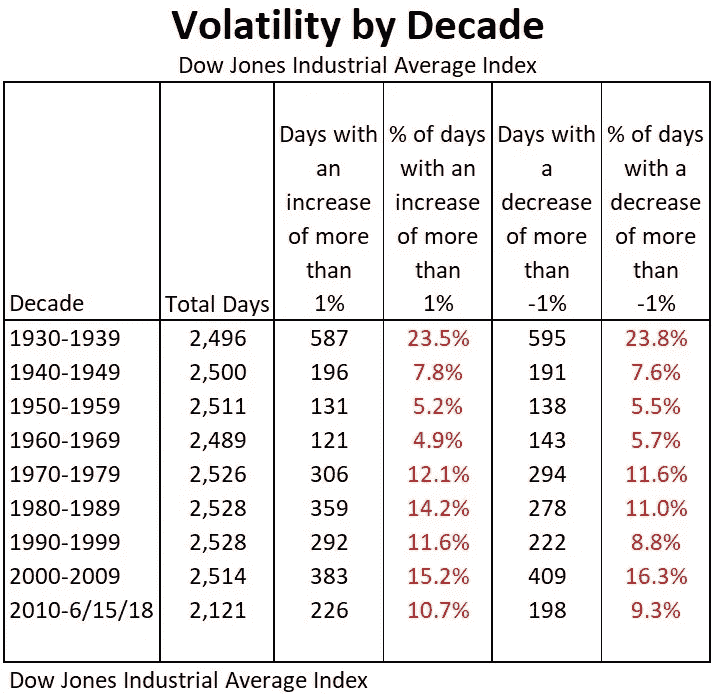
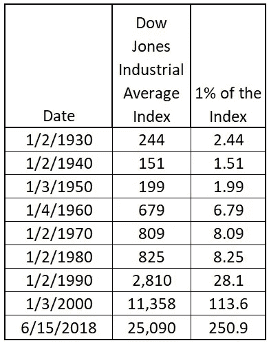
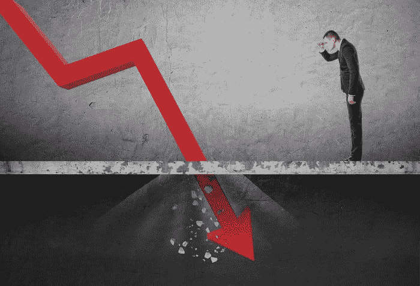
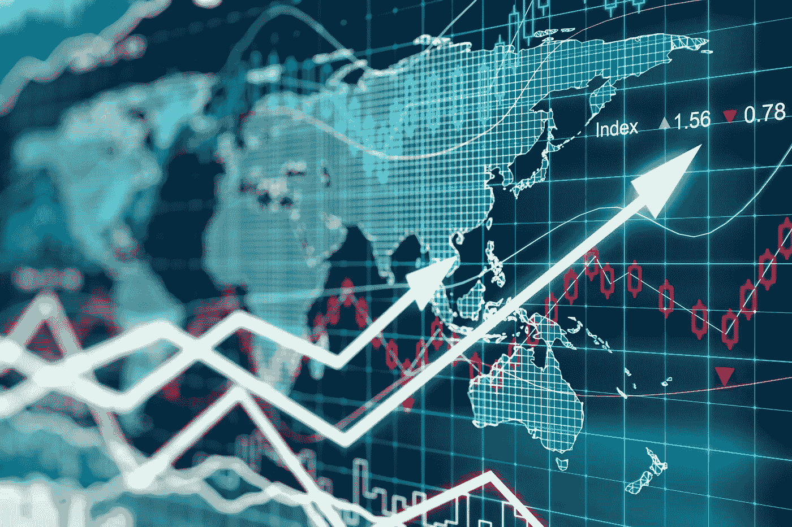

# 波动是新的标准吗？

> 原文：<https://medium.datadriveninvestor.com/is-volatility-the-new-norm-e5e677f66ec9?source=collection_archive---------36----------------------->

## 从特朗普到中国，前几年市场波动的破坏性超过了前一段时间。

## 作为一名投资者，波动性永远是获利过程中的重要组成部分，然而，在最近的全球经济和政治紧张局势中，令人担忧的投资者试图抓住那些从熊市转为牛市的股票不放。

## 由于缺乏稳定性，许多投资者受到损害其投资组合的资产的困扰。

## 这种情况会持续多久？

> 似乎很久了。

随着市场调整和崩溃将继续纠缠着*投资者，预测这种快速变化的模式将重新开始，随着最近的世界冲突，这些现有的交易似乎没有放缓。*

**

*在过去，我们已经看到了相关的经济流动，但似乎在我们最近的一天，我们的政治和经济混在一起，创造了一个怪物。*

*在过去的十年里，市场似乎比以往任何时候都更加不稳定，一天之内持续**200-300 点的波动。***

# *上周五，市场的每个部分都上涨了*

*随着 12 月份新增 32.1 万名员工(最初的 18.1 万人的目标数量让 analytics 的销量飙升)，人们对经济衰退的看法逐渐淡化。随着道琼斯工业平均指数上周五飙升 747.94 点，工资一直在增长，银行行长称之为“良好的经济”，这是最近事件的气候变化，这一点的平均水平是 30 只重要股票有史以来最重要的跳跃之一。*

*2018 年股市的记录暗示，在不久的将来，可能会出现“大波动”。*

*2018 年看到了五种不同的情况；一天内有超过 1000 点的波动，这在历史上只发生过三次。*

**

***波动**是“*旧常态*，**三十几岁*。*最近十年*的投资者，经历了一段*波澜不惊的熊市* **至今，**哪里 ***欧洲和中国政治经济状况的不确定性*** 让投资者惶惶不安。
*更不用说*了，美国和中国之间尚未解决的****贸易紧张局势已经在我们的股票交易中造成了*显著的*不确定性。许多投资者担心的是利息的仓促增长，这可能会破坏经济，造成衰退的前景。**

**" [*下图中的*](https://www.kiplinger.com/article/investing/T047-C032-S014-is-the-stock-market-more-volatile-now-than-ever.html) 看看从 20 世纪 30 年代开始的每十年，并勾勒出股市上涨或下跌超过 1%的天数。你会注意到，自 2010 年以来，这样的日子比过去四十年(1970 年至 2009 年)要少。十年来，11%的日子上涨超过 1%，9%的日子下跌超过 1%。”**

****

**[**Credit**](https://www.kiplinger.com/article/investing/T047-C032-S014-is-the-stock-market-more-volatile-now-than-ever.html)**

**当比较 ***平均指数大小*** 时，关于整个指数的*百分比*，这些年来，虽然看起来最近的点数下降超过了往年，但这只是因为指数增加了，因此暗示了*更高的点数下降。***

****

**[Credit](https://www.kiplinger.com/article/investing/T047-C032-S014-is-the-stock-market-more-volatile-now-than-ever.html)**

**自 2010 年**以来，以每日跌幅和涨幅衡量的波动性*一直低于过去几十年，尽管如此，就我们当前的事件而言， ***它肯定是最幽默的事件之一。********

# ***让我们回顾一下 2017-2018 年，以及我们的政治“朋友”对道琼斯市场的破坏。***

******

***我无意伤害任何人的感情，也无意反对任何人，但由于可见的影响，我必须说出这句话。***

> ***“交易是我的艺术形式。其他人在画布上画出美丽的图画或写出美妙的诗歌。我喜欢做交易，最好是大宗交易。”——唐纳德·川普，“交易的艺术”***

***唐纳德·j·特朗普，一个商人的偶像，几个道指市场破裂的唯一原因。***

***特朗普绝不是一个可怕的总统，尽管我不会给他太多恶名。***

***我倾向于与外交保持距离，但我有义务承认，唐纳德·特朗普(Donald Trump)曾以搅动市场为乐。***

***尽管有任何真正的裁决，唐纳德·特朗普本人对道琼斯市场产生了重大影响，他在社交媒体和报刊上的帖子给投资者带来了巨大的不幸。***

# ***Twitter 是仅次于脸书、Google+和 Instagram 的全球第四大社交网络。***

******

*   ***[1 亿日活用户](https://www.fxcm.com/insights/president-trumps-twitter-impact-forex-markets-stocks/)***
*   ***3.2 亿月活跃用户***
*   ***每天发送 5 亿条推文***
*   ***所有 Twitter 账户中有 77% 来自美国境外***

***总统在这个界面中解决了各种各样的*的问题，尽管有如此广泛的观众群，以及对这些社交工具的如此一致的使用，这就造成了紧张。众所周知，金融市场并不是百分之百的稳定，因此总是存在风险。*与姜懿翔特朗普、假新闻故事、敏感数据和个人观点的资产交换* ***危及*** *不断下降的价值波动。*****

> ****“特朗普总统的推文对整个美国股市的影响是整个金融界正在讨论的话题。交易员和投资者都越来越认识到总统的推特能够给市场带来的直接影响。****

****在唐纳德·特朗普总统的领导下，似乎没有一家公司是安全的。****

> ****[根据研究](https://www.fxcm.com/insights/president-trumps-twitter-impact-forex-markets-stocks/)，从 2016 年大选年到 2017 年第一季度，12 只股票受到特朗普推特发布的实质性影响。****

# ****特朗普发推特****

> ****“看来石油输出国组织又来了。到处都是创纪录数量的石油，包括海上满载的船只，石油价格被人为地抬高了！不行也不会被接受！”****

****“正如在货币和股票方面所观察到的那样，特朗普总统的推特信息是直接参与几个原油期货市场的催化剂。尽管石油输出国组织的推文没有从根本上改变全球石油估值，但它给市场带来了不确定性。”( [FXCM](https://www.fxcm.com/insights/president-trumps-twitter-impact-forex-markets-stocks/) )。****

********

****美国总统 T21 对全球贸易市场有很大的影响，随之而来的是它的后果。对于消费者来说，Twitter 是获取新闻、分享观点和在世界上宣传自己的一种常见方式。Twitter 是企业的资产。****

****我们当前的数字环境使用户能够以闪电般的速度进行交易操作，只要看着 Twitter 和其他应用程序，每一条帖子都可以极大地影响和搅动市场。****

******感谢您的阅读，******

****希望你喜欢，学到了一些东西，并有一个美好的一天，****

*******别忘了留个拍手，还是 50，*******

****一如既往，****

*****不断学习。*****

****欧文·桑顿****