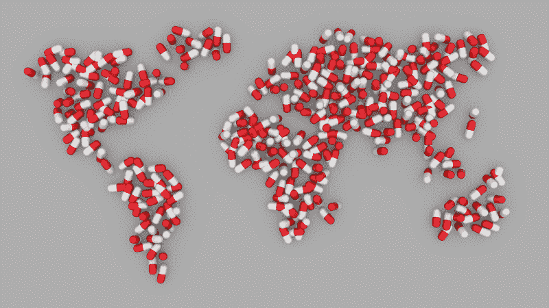
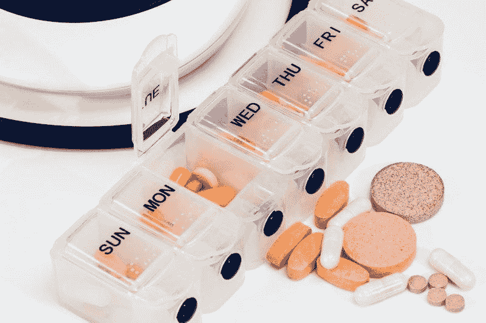
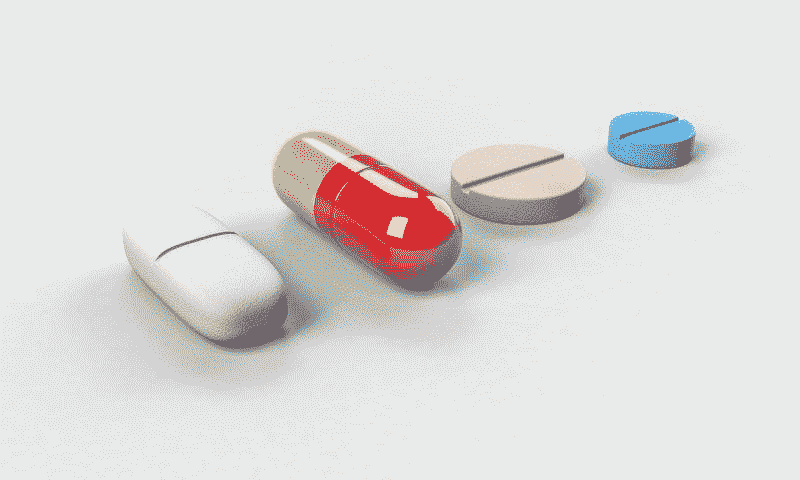
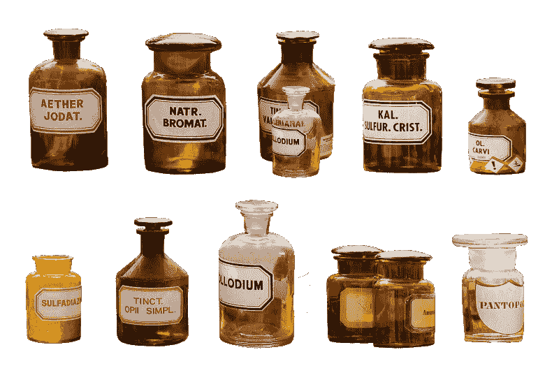
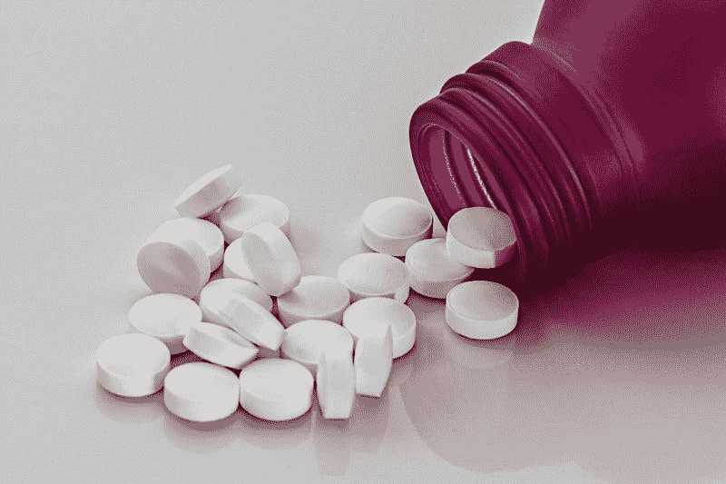

# 沃尔格林注定要失败吗？—市场疯人院

> 原文：<https://medium.datadriveninvestor.com/is-walgreens-doomed-market-mad-house-86c75379c533?source=collection_archive---------6----------------------->

药店巨人**沃尔格林靴子联盟(纳斯达克代码:WBA)** 上周，私有化的暗示吓坏了市场先生。

为了解释，谣言工厂声称沃尔格林公司首席执行官 Stefano Pessina 一直在与私募股权公司谈论对世界上最大的药店运营商进行杠杆收购。*巴伦周刊的* [推测](https://www.barrons.com/articles/lbo-walgreens-boots-alliance-skeptics-doubts-costs-51573069034)佩西纳已经雇佣了一名银行家来处理杠杆收购。

 [## 算法交易的机器学习|数据驱动的投资者

### 当你的一个朋友在脸书上传你的新海滩照，平台建议给你的脸加上标签，这是…

www.datadriveninvestor.com](https://www.datadriveninvestor.com/2019/01/30/machine-learning-for-stock-market-investing/) 

MaretWatch 估计沃尔格林杠杆收购的潜在价值为 700 亿美元。然而，雅虎！《金融》估计，截至 2019 年 11 月 11 日，沃尔格林的市值为 555.61 亿美元。因此，沃尔格林杠杆收购可能是华尔街多年来最大的交易之一。

彭博声称私募股权巨头 KKR 公司出价 700 亿美元收购沃尔格林。彭博估计，KKR 公司对沃尔格林的出价可能是迄今为止最大的私人杠杆收购。因此，沃尔格林的最大股东佩西纳可以从这笔交易中获利。

# 沃尔格林会私有化吗？

佩西纳可能对杠杆收购感兴趣，因为他认为市场先生低估了沃尔格林的股票。该公司的股价很低。交易员于 2019 年 11 月 11 日支付 62.25 美元购买**沃尔格林(NASDQ: WBA)** 股票。

[佩西纳](https://en.wikipedia.org/wiki/Stefano_Pessina)；沃尔格林最大的股东已经 78 岁了，所以他可能想退休。特别是，Pessina 可能厌倦了制药行业的头痛问题，如处方药价格下降、政治压力和公众对高药价的愤怒。

佩西纳可能想逃避的麻烦包括:英国永无止境的英国退出欧盟噩梦，以及美国对单一支付者医疗保健(全民医保)不断增长的需求。目前，Walgreens Boots Alliance 在英国拥有 2465 家药店，在美国拥有 9244 家药店。

沃尔格林在美国的麻烦越来越多。值得注意的是，该公司计划关闭 200 家美国药店，美国消费者新闻与商业频道声称。美国消费者新闻与商业频道称关闭是“削减成本的举措”

# 沃尔格林和阿片类危机

引人注目的是，*《华盛顿邮报》* [指控](https://www.washingtonpost.com/investigations/2019/11/07/height-crisis-walgreens-handled-nearly-one-five-most-addictive-opioids/?arc404=true)沃尔格林在 2006 年至 2012 年间在全美销售了 130 亿片羟考酮和氢可酮。澄清一下，羟考酮和氢可酮有很强的成瘾性；基于鸦片的止痛药批评家指责美国阿片类药物危机。

很能说明问题的是，2013 年，沃尔格林向美国缉毒署(DEA)缴纳了 8000 万美元罚款。《华盛顿邮报》声称，美国药品管理局指控沃尔格林故意向罪犯出售羟考酮和氢可酮，罪犯在黑市上出售。

沃尔格林是俄亥俄州针对阿片类药物经销商的联邦诉讼的被告。在诉讼中，两个县政府指控沃尔格林和其他公司故意向他们的社区大量供应阿片类止痛药。很明显，沃尔格林没有参与俄亥俄州两个县和阿片类药物经销商之间的和解。

沃尔格林否认了这些指控。然而，沃尔格林停止了受控物质的内部分配；包括阿片类药物。

很容易理解为什么佩西纳想要退出。药店生意越来越不受欢迎，也越来越有争议。

# 沃尔格林赚钱了吗？

然而，**沃尔格林(纳斯达克代码:WBA)** 从它的药店赚钱。沃尔格林在 2019 年 8 月 31 日报告了 72.27 亿美元的季度毛利。

沃尔格林的毛利来自 339.54 亿美元的季度收入。然而，沃尔格林的季度收入从 2019 年 5 月 31 日的 345.91 亿美元下降。然而，Stockrow 估计沃尔格林上个季度的收入增长率为 1.53%。

另一方面，沃尔格林的收入在下降。比如沃尔格林；季度净收入从 2019 年 5 月 31 日的 10.25 亿美元降至 2019 年 8 月 31 日的 6.67 亿美元。此外，营业收入从 2019 年 5 月 31 日的 12.18 亿美元降至 3 个月后的 9.83 亿美元。

相比之下，沃尔格林的现金流却在增长。沃尔格林的运营现金从 2019 年 5 月的 20.2 亿美元增长到 2019 年 8 月的 23.79 亿美元。此外，同期自由现金流从 15.67 亿美元增长至 19.23 亿美元。

然而，截至 2019 年 8 月 31 日，沃尔格林只有 10.23 亿美元的现金和等价物。因此，沃尔格林的安全边际很低，现金水平也在下降。

# 沃尔格林正在贬值吗？

有趣的是，沃尔格林正在贬值。沃尔格林的总资产价值从 2019 年 2 月 28 日的 704.34 亿美元下降到 2019 年 5 月 31 日的 685.86 亿美元，再到 2019 年 5 月 31 日的 675.98 亿美元。

与此同时，截至 2019 年 8 月 31 日，沃尔格林报告的流动负债总额为 257.69 亿美元，债务总额为 168.36 亿美元。因此，沃尔格林的资产正在贬值，而其债务却在增长。

因此，Pessina 可能考虑出售的另一个原因是，他认为药店利润较低。值得注意的是，当亚马逊(NASDAQ: AMZN) 加快步伐时，利润却在下降。

# 亚马逊的威胁与日俱增

亚马逊已经在化妆品、香水、盥洗用品和清洁用品等品类上与沃尔格林直接竞争。现在，亚马逊通过其 [PillPack](https://www.pillpack.com/get-started?utm_source=adwords&utm_medium=cpc_c&utm_campaign=PP_Brand_Exact&utm_content=pillpack_exact_search_311537936809&utm_term=pillpack_e&campaignid=1435897845&adgroupid=56000259597&adid=311537936809&gclid=Cj0KCQiAno_uBRC1ARIsAB496IWJ6zsHwcZG74NQG5vZo54YHhJLIdjoONCVDDVKWIGehdgPIaWrhNYaAkXWEALw_wcB) 子公司盯上了药店业务。药丸包运送处方给顾客。

此外， *Money* [声称](http://money.com/money/5659835/amazon-prime-free-shipping-one-day/)亚马逊对 2 美元的商品提供免费一日送达服务。因此，亚马逊正试图与药店等社区零售商直接竞争。

很明显，Amazon *Money* 描述的免费送货项目听起来像沃尔格林的购物清单。你现在可以从亚马逊上免费订购的商品包括:1.54 美元一盒的好奇湿巾、1.83 美元一管的高露洁牙膏、2.48 美元一包的口香糖和 3 美元一袋的棉球。

沃尔格林出售所有这些商品。因此，亚马逊 Prime 客户不再有任何理由去沃尔格林和其他社区商店。因此，Pessina 最大的担忧之一可能是亚马逊导致的客流量大幅下降。

# 沃尔格林是好的分红股票吗？

许多投资者喜欢沃尔格林(纳斯达克代码:WBA) ，因为它一直是一只很好的股息股票。

例如，dividends 估计沃尔格林的股息已经连续增长了 43 年。相应的，下一个预定的沃尔格林红利是 46₵；定于 2019 年 11 月 15 日举行。

沃尔格林的投资者在 2019 年 11 月 11 日获得了 3.12%的股息收益率，1.83 美元的年化股息，33.55%的派息率。

归根结底，沃尔格林是一只很好的低成本分红股票。因此，沃尔格林是一种价值投资，但它是一家表明零售环境变得多么不稳定和危险的公司。

亚马逊正在扰乱整个零售生态系统，并威胁到长期赚钱的历史稳定的品牌。因此，投资者目前需要小心零售股票。在亚马逊时代，即使是最好的零售商也会面临颠覆和厄运。

*原载于 2019 年 11 月 11 日*[*【https://marketmadhouse.com】*](https://marketmadhouse.com/is-walgreens-doomed/)*。*