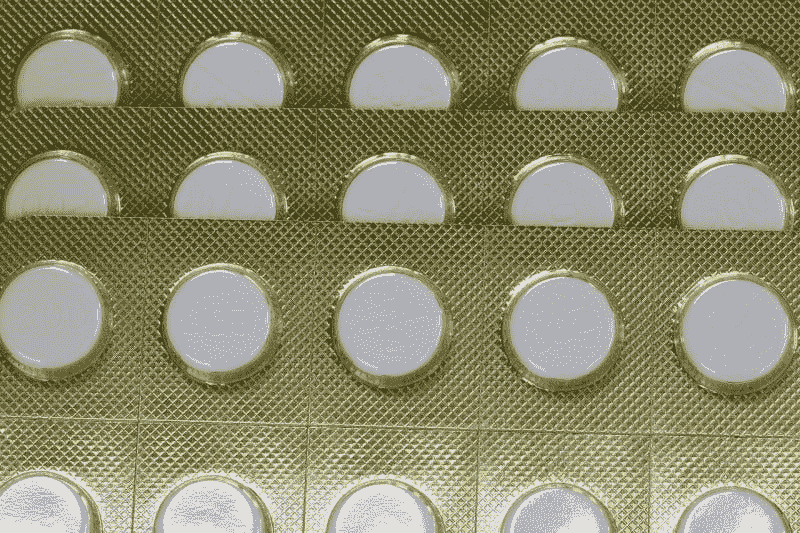
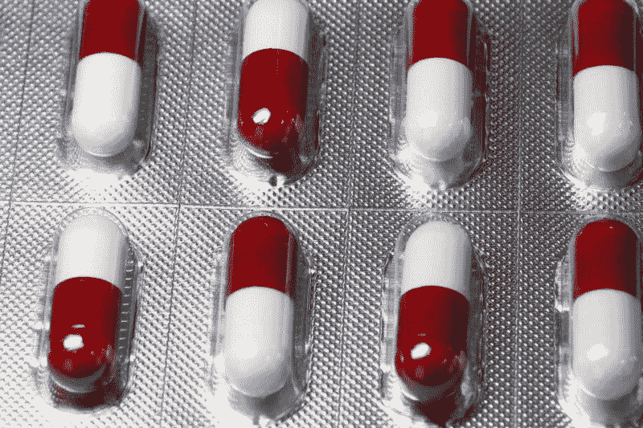
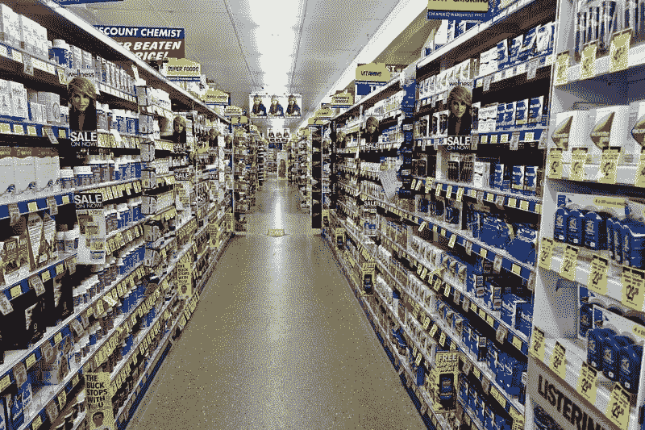
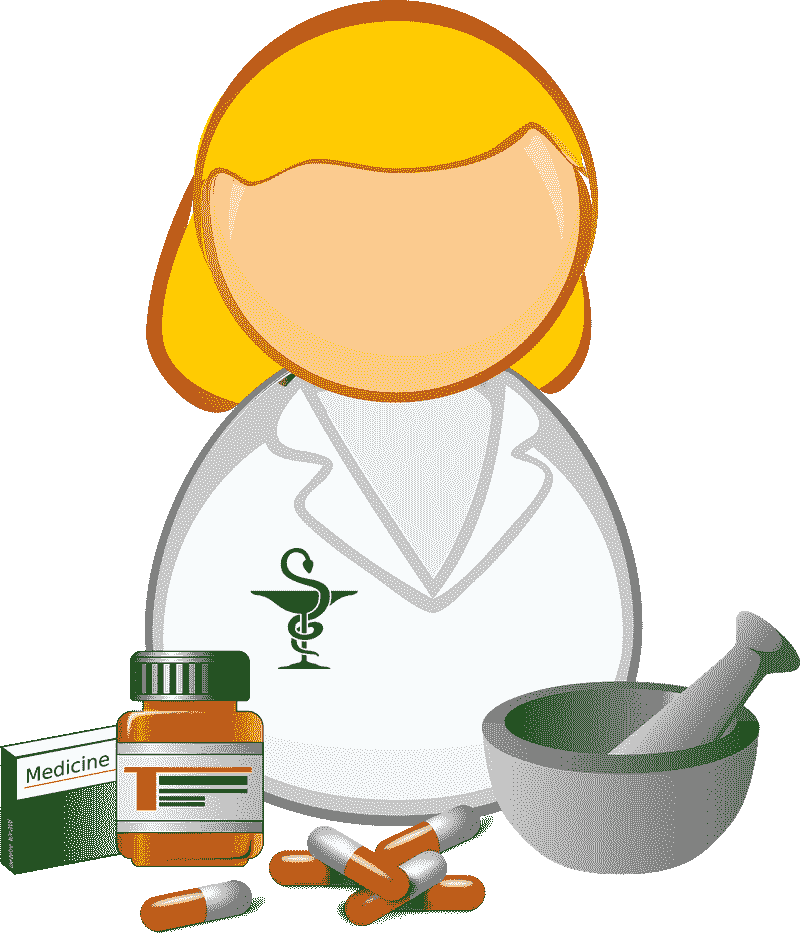
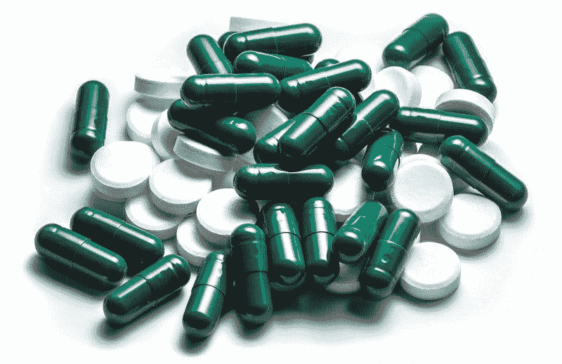
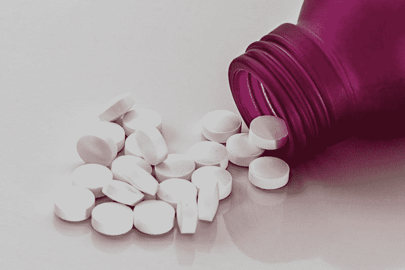
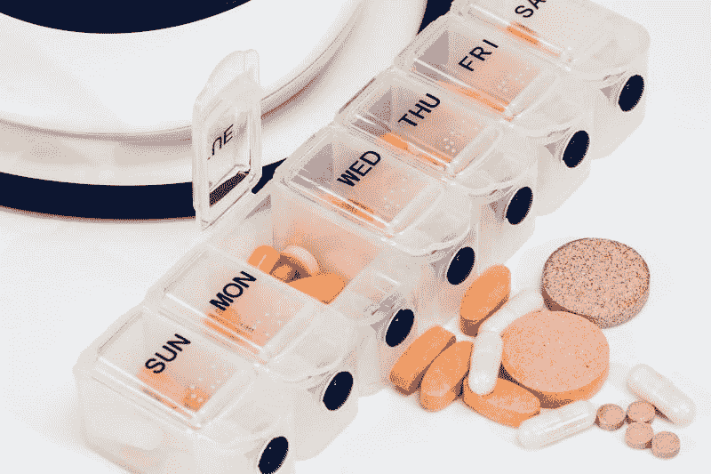
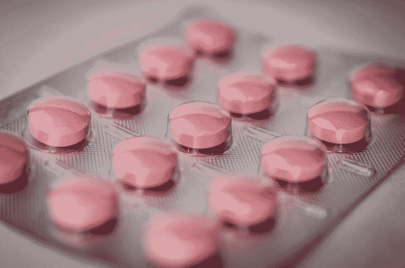
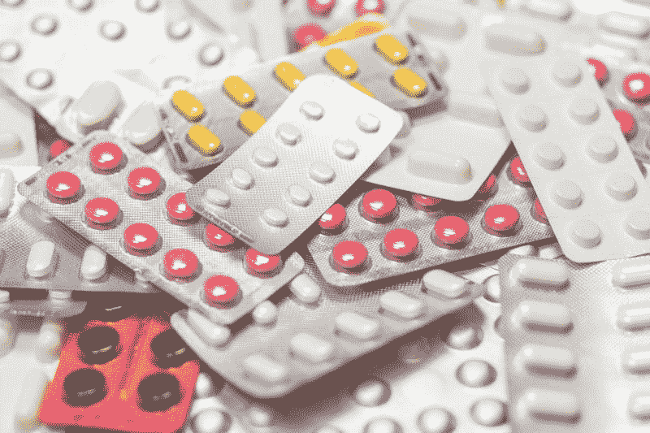

# 沃尔格林在赔钱吗？—市场疯人院

> 原文：<https://medium.datadriveninvestor.com/is-walgreens-losing-money-market-mad-house-7d80c5d7b6a3?source=collection_archive---------4----------------------->

许多人都在问沃尔格林是否在赔钱，因为这家药店巨头可能会关闭两个国家的 400 家门店。

**Walgreens Boots-Alliance(NASDAQ:WBA)**计划关闭其 9560 家门店中的 200 家，*《财富》* [报道](https://fortune.com/2019/08/07/walgreens-closing-200-stores/)。此外，WBA 将关闭英国 200 家 Boots-Alliance 药店。

 [## 数据驱动投资的兴起|数据驱动投资者

### 当 JCPenney 报告其 2015 年 2Q 的财务结果时，市场感到非常震惊。美国零售巨头…

www.datadriveninvestor.com](https://www.datadriveninvestor.com/2019/02/28/the-rise-of-data-driven-investing/) 

相反，沃尔格林上个季度的收入略有增长。具体而言，沃尔格林在 2019 年 2 月 28 日报告的收入为 345.28 亿美元，2019 年 5 月 31 日为 345.91 亿美元。

此外，Stockrow [给了沃尔格林 0.75%的季度收入增长率。然而，上个季度的收入增长率低于沃尔格林 2019 年 2 月 28 日报告的 4.56%。](https://stockrow.com/WBA/financials/income/quarterly)

# 沃尔格林赚钱了吗？

然而，沃尔格林药店的利润越来越少。例如，沃尔格林公司报告 2019 年 5 月 31 日的营业收入为 12.18 亿美元，低于三个月前的 151.8 万美元。

此外，沃尔格林的毛利从 2019 年 2 月的 77.55 亿美元降至 2019 年 5 月的 77.55 亿美元。与此同时，同期净收入从 11.56 亿美元降至 10.25 亿美元。

奇怪的是，沃尔格林正在创造更多的现金。具体而言，其运营现金流从 2019 年 2 月 28 日的 7.35 亿美元增长至 2019 年 5 月 31 日的 20.2 亿美元。令人印象深刻的是，Walgreens-Boot Alliance 的自由现金流从 2019 年 2 月 28 日的 4.12 亿美元增长到 2019 年 5 月 31 日的 15.67 亿美元。

鉴于这些数字，我认为沃尔格林看起来像一个价值投资，因为它从更少的收入中产生更多的现金。然而，沃尔格林的现金资源很少；该公司于 2019 年 5 月 31 日报告了 8.39 亿美元的现金和短期投资。

# 沃尔格林为什么要关店？

因此，沃尔格林正在缩小其门店规模，因为其创收能力正在下降。实际上，沃尔格林从商店赚的钱越来越少。

沃尔格林收入缩水有几种解释。首先，沃尔格林有太多的商店。目前，沃尔格林报告在美国经营着 9560 家商店。事实上，沃尔格林在佛罗里达州经营着 820 家商店。

经营所有这些商店是昂贵的。具体来说，每家沃尔格林商店都需要一名高薪药剂师。例如，PayScale [估计，田纳西州纳什维尔的药剂师平均年收入为 118，511 美元。](https://www.payscale.com/research/US/Job=Pharmacist/Salary/9c747d76/Nashville-TN)

而且 2017 年美国药剂师的平均工资是 124170 美元，*美国新闻&世界报道* [估算](https://money.usnews.com/careers/best-jobs/pharmacist/salary)。事实上，收入最低的 25%的药剂师平均年薪为 110，310 美元。

因此，我估计沃尔格林每家药店雇佣一名药剂师每年要支付 18.7 亿美元。由于沃尔格林可能在每家商店都雇佣了几名药剂师，因此实际数字无疑要高得多。

在这种情况下，沃尔格林关闭几百家门店可以节省一大笔钱。为了证明这一点，沃尔格林可以通过解雇两名药剂师每年节省 24.834 美元——如果这些药剂师的平均年薪为 124，170 美元的话。

# 沃尔格林能从药店赚钱吗？

其次，沃尔格林面临着巨大的、咄咄逼人的竞争对手，他们可以利用其他巨大的收入来源。

详细来说，Statista [列出了](https://www.statista.com/statistics/734171/pharmacies-ranked-by-rx-market-share-in-us/)2018 年美国六大药房运营商为:

1.  CVS Health-拥有 24.2%的市场份额。
2.  沃尔格林-拥有 17.5%的市场份额。
3.  cigna/Express Scripps Inc --拥有 11%的市场份额。
4.  联合健康集团(optimum rx)——拥有 6.1%的市场份额。
5.  沃尔玛拥有 4.9%的市场份额。
6.  Kroger 拥有 3.2%的市场份额。

沃尔格林最大的直接竞争对手[**CVS Health(NYSE:CVS)**](https://marketmadhouse.com/cvs-health-is-one-of-americas-biggest-grocers/)现在拥有一家主要的健康保险公司 Aetna。此外，CVS 是处方药计划的主要提供商。同时， [**联合健康集团(纽约证券交易所:UNH)**](https://marketmadhouse.com/can-unitedhealth-group-and-big-health-insurance-survive/) 和**信诺集团(纽约证券交易所:CI)** 是主要的健康保险公司。

# 沃尔格林能与大保险和沃尔玛竞争吗？

因此，CVS、UnitedHealth 和 Cigna 可以从保险费中提取浮存金。解释一下，浮存金就是人们每个月支付保险费时给保险公司的所有现金。由于雇主自动从他们的工资中扣除许多美国人的健康保险费，这保证了浮动收入。

与此同时，沃尔格林必须等待保险公司或政府报销大部分处方费用。然而，沃尔格林每月必须支付租金、工资、水电和保险等费用。

此外，**沃尔玛(纽约证券交易所股票代码:WMT)** 和**克罗格(纽约证券交易所股票代码:KR)** 都是折扣零售商巨头，它们利用处方药作为亏本产品来吸引客流量。[克罗格](https://marketmadhouse.com/kroger-and-the-future-of-grocery/)和沃尔玛管理层确实关心药店是否亏损，因为药店的顾客可能会在他们的店里购买其他东西。

例如，一位老爷爷在沃尔玛买处方药时，可能会买一加仑机油、一条链锯链和几袋食品。此外，当简在克罗格或金·索普斯药店拿药时，她可以买牛奶和比萨饼当晚餐。克罗格和沃尔玛赚钱，因为祖父和简必须用现金或信用卡支付其他购物。

# 亚马逊如何威胁沃尔格林

第三，沃尔格林面临着一个咄咄逼人的巨大竞争对手，他只涉足药店**亚马逊**。

亚马逊的药店业务规模很小，但是沃尔玛超市出售各种各样的商品。例如，亚马逊销售化妆品、盥洗用品、卫生纸、清洁用品、洗衣液、个人护理产品、护发产品和剃须刀。

与此同时，你可以通过每月支付 12.99 美元购买亚马逊 Prime，获得所有这些东西的免费送货服务。目前，Statista 估计美国有 1.03 亿亚马逊 Prime 用户。

在这种情况下，越来越多的人去沃尔格林仅仅是为了处方。因此，沃尔格林只卖可能得不到报酬的昂贵产品。或者几个月都拿不到工资。

这一发展可能会迫使沃尔格林关闭表现不佳的商店。特别是，它可能会迫使 WBA 关闭中产阶级地区的药店，那里的人们更有可能成为 Prime 会员。因此，沃尔格林只能在低收入社区经营药店，这让它的未来充满疑问。

# 英国退出欧盟如何威胁沃尔格林

第四，**Walgreens Boots Alliance(NASDAQ:WBA)**在英国有 2485 家药店、618 家眼镜店和 503 家 Boots Hearingcare 分店，对英国退出欧盟灾难有很大的风险敞口[。](http://www.boots-uk.com/about-boots-uk/about-boots/boots-in-numbers/)

与此同时，英国国内生产总值在 2019 年第二季度萎缩了 0.2%，因为英镑兑美元汇率在 2019 年 8 月 9 日跌至 1.08 美元的新低，英镑直播[报道](https://www.poundsterlinglive.com/gbp-live-today/11848-pound-sterling-drops-vs-euro-and-dollar-on-news-uk-economy-shrank-in-the-second-quarter)。观察家和投机者将英镑的损失归咎于英国退出欧盟。相反，谷歌计算出 2019 年 8 月 12 日英镑对美元的汇率为 1.21 美元。

英国可能会出现更大的经济混乱，因为首相鲍里斯·约翰逊(Boris Johnson)坚持认为英国退出欧盟没有交易。解释一下，在无交易的英国退出欧盟，英国只是离开了欧盟，没有计划应对贸易或海关等新的现实。最糟糕的情况是贸易中断、经济崩溃和英国解体。

# 没有英国，沃尔格林能生存吗？

鉴于这些现实和疲软的英镑，欧元区将对苏格兰人、北爱尔兰人以及潜在的威尔士人变得非常有吸引力。澄清一下，欧盟可能很快会向这些人提供英国可能很快就会缺乏的强势货币——欧元。

有趣的是，北爱尔兰、苏格兰和威尔士都有自己的议会，也有脱离英国的能力。事实上，一些英国观察家，如*卫报的*西蒙·詹金斯[认为](https://www.theguardian.com/commentisfree/2019/aug/09/independence-scotland-inevitable-scot-nicola-sturgeon)苏格兰独立不可避免。苏格兰民族主义者控制了苏格兰议会的大部分席位。

就我个人而言，如果英国和国民医疗服务体系崩溃或解体，我看不出沃尔格林-博姿联盟如何赚钱。一种可能的情况是，欧盟最终可能会掌管苏格兰、威尔士和北爱尔兰的国民健康。没人知道这会如何影响 WBA。

# 沃尔格林是价值投资吗？

因此，沃尔格林需要考虑一个没有 Boots-Alliance 的未来。然而，我认为在这种情况下，沃尔格林可能是一种价值投资。

解释一下，如果英国企业倒闭，美国企业仍能盈利。与此同时，首席执行官 Stefano Pessina 可以通过剥离 Boots Alliance 作为一个独立的业务来保护 Walgreens。

此外，如果英国退出欧盟最糟糕的情况没有发生，WBA 仍有可能盈利。因此，沃尔格林现在可能是一笔划算的交易。例如，沃尔格林的股票在 2019 年 8 月 12 日便宜到 51.86 美元，但该公司仍然赚钱。

# 沃尔格林是一个好的股息投资吗？

此外，沃尔格林支付了可观的增长股息。事实上，沃尔格林红利从 2019 年 6 月 12 日的 44₵增长到 2019 年 9 月 12 日的 45.75₵。因此，2019 年夏季，沃尔格林将在 1.75₵附近成长。

令人印象深刻的是，Dividend.com 将 43 年的股息增长归功于沃尔格林。截至 2019 年 8 月 12 日，沃尔格林股东的股息收益率为 3.53%，年化派息为 1.83 美元，派息率为 30.6%。

我想现在购买 WBA 的人会收到一个惊喜。公司便宜；它赚钱；它的股息很高，但对它的威胁最大。英国退出欧盟，可能是理论上的。

# 沃尔格林会有什么样的未来？

最后，沃尔格林的未来前景可能比愤世嫉俗者想象的更光明。事实上，美国有一些有趣的增长机会。

沃尔格林最大的机会是在医疗保险领域。沃尔格林可以与像 Humana 这样的健康保险公司合并，或者收购一家健康保险公司。重要的是，沃尔格林和 Human 正在试验一个名为初级保健伙伴的老年人联合健康诊所，*福布斯* [报道](https://marketmadhouse.com/is-walgreens-losing-money/#41d67e997e50)。

初级保健合作伙伴的重点是不断增长的医疗保险市场。目前，亨利·j·凯泽基金会估计美国有 5986.9 万医疗保险受益人。

# 送货是沃尔格林的未来吗？

沃尔格林的另一个有趣的合作伙伴是克罗格。值得注意的是，沃尔格林正在肯塔基州的商店里试验从克罗格杂货订单中取货。

随着克罗格在 [**奥卡多集团(LON: OCDO)**](https://marketmadhouse.com/is-ocado-the-future-of-groceries-and-does-it-make-money/) 和 Instacart 的帮助下扩大其送货业务，这项实验可能会在全国范围内推广。克罗格和奥卡多正计划在美国各地建立 20 个机器人履行中心，以支持杂货订单。此外，Kroger 计划为其 2764 家超市中的 1600 家提供 Instacart 送货服务。

这些实验为沃尔格林指出了两个有趣的未来。首先，沃尔格林商店可以作为亚马逊、沃尔玛、Instacart 和其他订单的落客点。

值得注意的是，**美国柯尔百货公司(纽约证券交易所代码:KSS)** 现在在其商店提供免费的亚马逊退货。这种增加可以在减少支出的同时推动客流量，因为沃尔格林可以减少员工数量和库存商品数量。此外，沃尔格林可以缩小足迹，降低房地产成本。

# 未来的沃尔格林可能不是药店

第二，Instacart、亚马逊，甚至 [**GrubHub**](https://marketmadhouse.com/is-grubhub-a-threat-to-kroger-kr/) **(纽约证券交易所代码:GRUB)** 都可以递送沃尔格林药房的订单。因此，未来的沃尔格林可能只是一家药店，或者是一家更大商店(如克罗格超市)内的药店。

因此，未来的沃尔格林可能不是药店。相反，未来的沃尔格林只会是一家药店。

此外，沃尔格林可以从几个大的地区药店而不是几十个零售点为市场服务。没有零售点将是必要的，因为他们将提供所有的处方。这种策略的一个优势是，沃尔格林可以将大型地区性药店设在履约中心内或租金更便宜的仓储区。

归根结底，**Walgreens Boots Alliance(NASDAQ:WBA)**是一个很好的价值投资，但面临一些有趣的挑战。如果沃尔格林幸存下来，它的股票可能会在未来几十年成为赚钱机器。

*原载于 2019 年 8 月 12 日*[*https://marketmadhouse.com*](https://marketmadhouse.com/is-walgreens-losing-money/)*。*