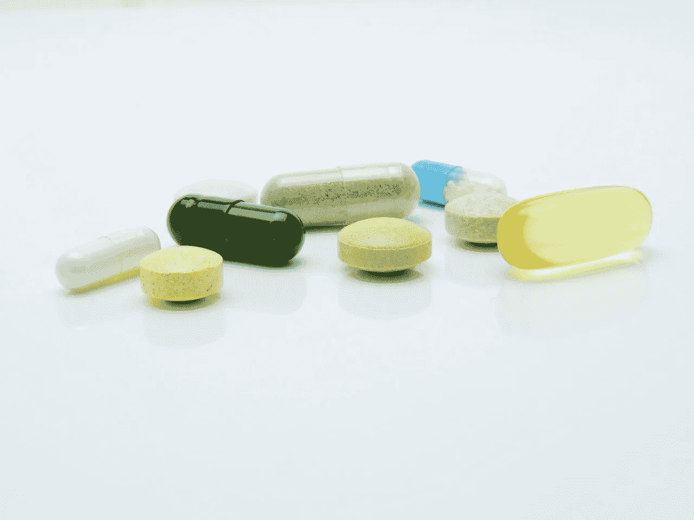

# 沃尔格林赚钱了吗？

> 原文：<https://medium.datadriveninvestor.com/is-walgreens-making-money-2780891e3dcd?source=collection_archive---------3----------------------->

我问沃尔格林是否在赚钱，是否是一种价值投资，因为这家药店运营商的股票在 2019 年 4 月 10 日的交易价格为 54.51 美元。然而**Walgreens Boots Alliance(NASDAQ:WBA)**仅在美国就经营着 9560 家店铺。

此外，沃尔格林[声称](https://news.walgreens.com/fact-sheets/frequently-asked-questions.htm)每月能开出 11 亿张处方。此外，沃尔格林还声称在 78%的美国人口的五英里范围内经营一家药店。

 [## 数据驱动投资的兴起——数据驱动投资者

### 当 JCPenney 报告其 2015 年 2Q 的财务结果时，市场感到非常震惊。美国零售巨头…

www.datadriveninvestor.com](https://www.datadriveninvestor.com/2019/02/28/the-rise-of-data-driven-investing/) 

是的，沃尔格林从这些大规模的经营中赚钱。Walgreens Boots Alliance 在 2019 年第一季度的季度收入为 345.28 亿美元，毛利润为 77.55 亿美元。此外，同期沃尔格林的净收入为 11.56 亿美元，营业收入为 15.18 亿美元。

事实上，沃尔格林在 2019 年 2 月 28 日的年收入为 1361.08 亿美元。因此，沃尔格林是美国最大的零售商之一，可与**好市多批发公司(纳斯达克代码:COST)** 相媲美，后者在 2019 年 1 月 31 日的年收入为 1472.4 亿美元。

# **沃尔格林能产生多少现金？**

毫不奇怪，沃尔格林在 2019 年 2 月 28 日记录了 7.35 亿美元的运营现金流和 4.12 亿美元的自由现金流。

然而，Walgreens Boots Alliance 在 2018 年 2 月 28 日报告了 8.18 亿美元的现金和短期投资。因此，尽管沃尔格林规模庞大，但它并没有多少资金。

相反，沃尔格林有一些有趣的价值属性。例如，股票所有权使沃尔格林的首席执行官斯特凡诺·佩西纳免受华尔街的干预。克雷恩的芝加哥商业 [报道](https://www.chicagobusiness.com/joe-cahill-business/heres-what-insulates-walgreens-ceo-wall-streets-wrath)解释说，佩西纳拥有沃尔格林博姿联盟 15%的股份，这使他免受激进投资者的影响。

# **沃尔格林是比你想象的更好的投资**

激进投资者是自认为知道如何经营公司的交易员或基金经理。特别是，激进投资者试图赶走任何不会抬高股价的首席执行官。

因此，Pessina 可以自由地寻求与克罗格(纽约证券交易所代码:KR)、T2 联合健康集团(纽约证券交易所代码:UNH)、T4 微软(纳斯达克代码:MSFT T5)等公司建立潜在的有利可图的合作关系。例如，克罗格和沃尔格林正在肯塔基州的商店测试杂货店提货。

此外，VillageMD 将在休斯顿的 Walgreen 药店开设初级保健诊所，新闻稿[称](https://www.businesswire.com/news/home/20190410005219/en/)。因此，沃尔格林可以在同一地点提供医疗保健和处方。

更重要的是，沃尔格林让这个在 11 个国家建立了 18500 家连锁店的人继续掌舵。除了美国的 9560 家 Walgreens 和 Duane Reade 商店之外，WBA [在英国经营着超过 2500 家 Boots Alliance 商店。沃尔格林经营的其他国家包括泰国、智利、挪威和爱尔兰。](https://marketmadhouse.com/can-walgreens-survive-brexit/)

# 市场低估了沃尔格林的价格

在这种情况下，我认为 Walgreens Boots Alliance 是一家被市场先生低估的好公司。例如，对亚马逊(NASDAQ: AMZN)理论制药业务的歇斯底里让一些投资者远离了沃尔格林。

值得注意的是，Walgreens Boots Alliance 是一只很好的分红股票。例如，dividends 报道说，WBA 的股息在过去 43 年里一直在增长。此外，截至 2019 年 4 月 10 日，沃尔格林股东的股息收益率为 3.22%，年化股息为 1.76 美元，股息支付率为 29.4%。

具体而言，沃尔格林于 2019 年 3 月 12 日支付了 44₵股息。4₵在 2018 年增加了股息，从 2018 年 6 月 12 日的 40₵增加到 2018 年 9 月 12 日的 44₵。

因此，沃尔格林是一只好的股息股，市场先生低估了它的价值。因此，价值投资者需要研究沃尔格林靴子联盟。

# 沃尔格林的强势地位

我喜欢沃尔格林，因为它在美国的药店业务中有很强的地位。

特别是，沃尔格林最大的竞争对手之一 Rite Aid 正在崩溃。此外，沃尔格林最大的直接竞争对手 **CVS Health (NYSE: CVS)** 对健康保险的兴趣大于药店。

事实上，CVS Health [收购了保险公司 Aetna](https://marketmadhouse.com/will-cvs-aetna-make-money/)。因此，沃尔格林拥有直接竞争对手的优势，这些竞争对手可能会离开这个行业。

# **沃尔格林的危险**

然而，沃尔格林面临着由全球最大的零售商**沃尔玛(纽约证券交易所:WMT)** 领导的一系列危险的竞争对手。

值得注意的是沃尔玛；该公司于 2019 年 1 月 31 日报告年收入为 5144.08 亿美元，在美国经营着 3956 家药店。沃尔格林的其他主要竞争对手包括克罗格和好市多。

对沃尔玛最大的威胁是像克罗格、沃尔玛和好市多这样的折扣店，它们利用处方药作为亏本产品来吸引顾客。值得注意的是，在亚马逊时代，像沃尔玛这样的公司利用药店来吸引不断下降的客流量。

# **亚马逊威胁到沃尔格林了吗？**

沃尔格林的一个长期威胁是一家直接送货上门的亚马逊药店。

亚马逊的 Pilpack 药房正在申请州和国家药房许可证，但法规可能会限制其运营，*医疗城新闻* [报道](https://medcitynews.com/2019/02/amazon-hints-at-national-online-pharmacy-plans-with-new-licenses/)。因此，沃尔格林；该公司在全美 50 个州都有业务，在处方配送方面比亚马逊更有优势。

然而，我认为亚马逊对沃尔格林没有直接威胁。解释一下，我认为亚马逊需要几年时间来建立一个真正的药店。

# **沃尔格林会提供处方配送服务吗**

因此，沃尔格林有几年时间为亚马逊的竞争做准备。特别是，沃尔格林可以使用 Instacart 这样的服务提供自己的处方配送。值得注意的是，沃尔格林的合作伙伴克罗格与 Instacart 密切合作。

重要的是，Instacart 正在加拿大测试非杂货项目的交付，包括主食办公用品，*超市新闻* [报道](https://www.supermarketnews.com/online-retail/instacart-kicks-pilot-staples-canada)。显然，沃尔格林的处方、化妆品、药品和其他物品是 Instacart 要交付的自然产品。

此外，据 TechCrunch [报道](https://techcrunch.com/2019/03/12/instacarts-alcohol-delivery-is-now-available-in-14-states/)，Instacart 现在在 14 个州提供酒精饮料。显然，送酒的服务可以送处方。

总之，**Walgreens Boots Alliance(NASDAQ:WBA)**是一家前景光明的好公司。我建议价值投资者考察沃尔格林。