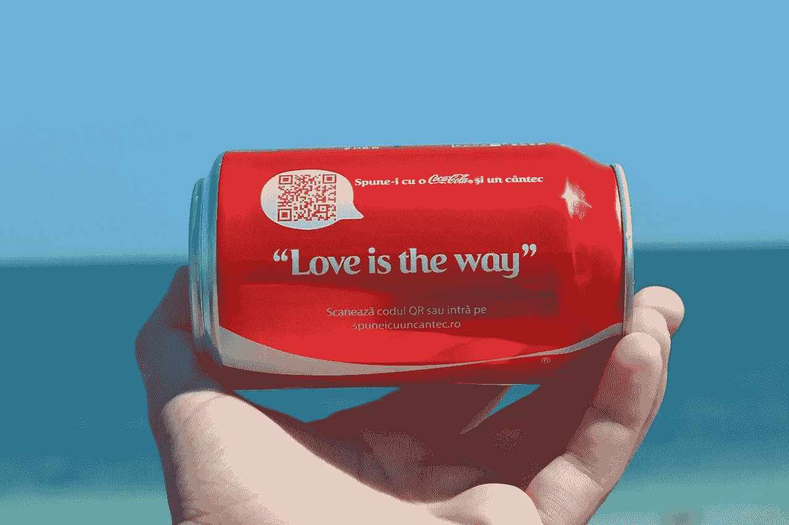
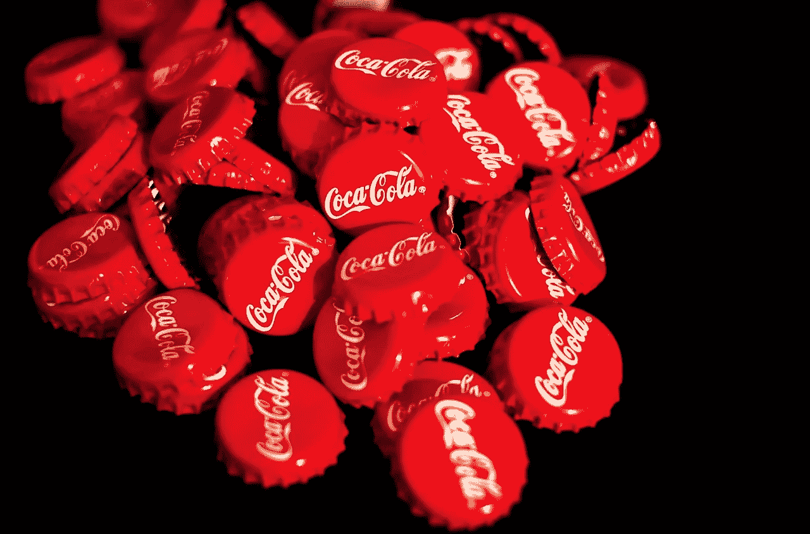
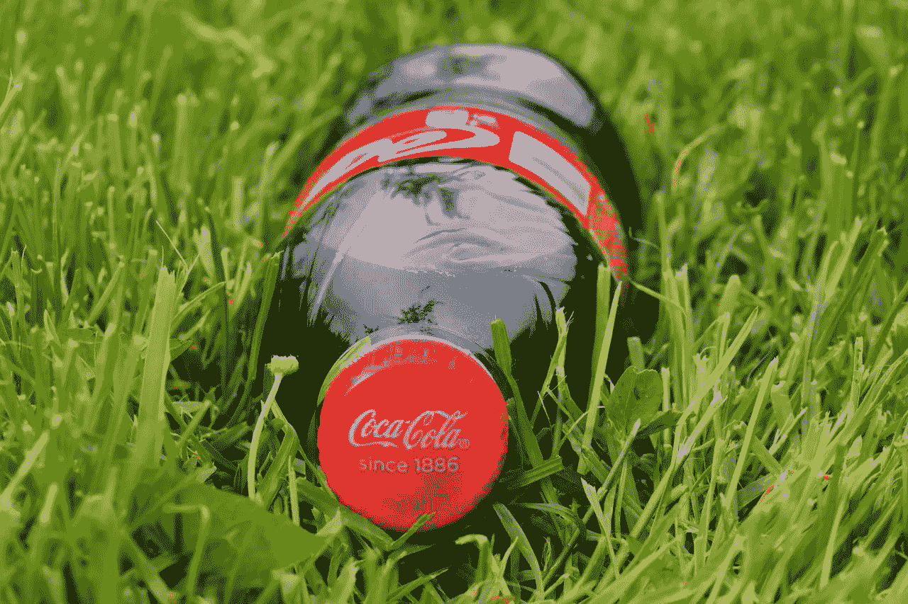
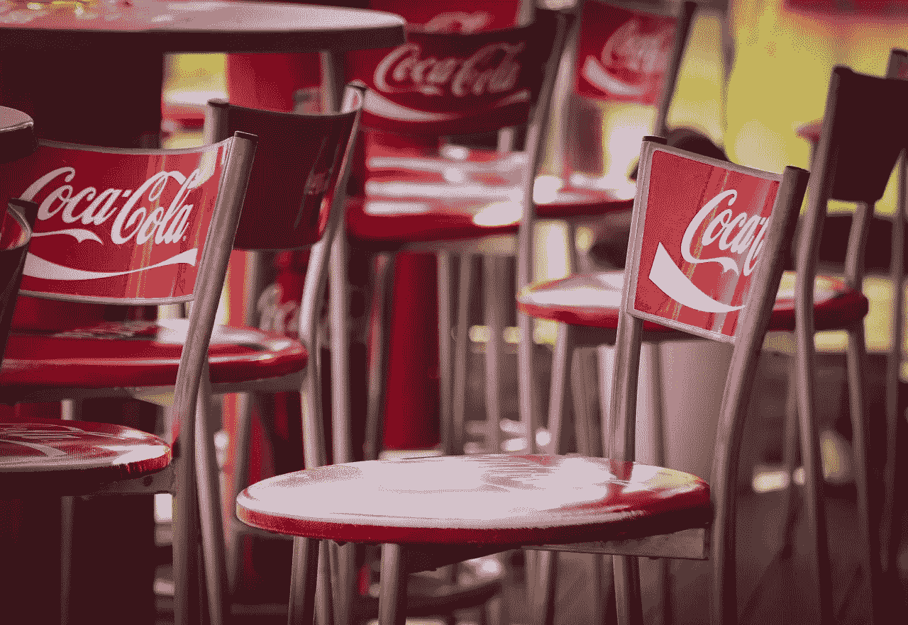

# 沃伦·巴菲特对可口可乐的看法正确吗？

> 原文：<https://medium.datadriveninvestor.com/is-warren-buffett-right-about-coca-cola-470458f879e7?source=collection_archive---------0----------------------->

我问沃伦·巴菲特对可口可乐公司的看法是否正确，因为,**伯克希尔·哈撒韦公司(纽约证券交易所代码:BRK)。B)** 拥有标志性软饮料品牌 9.4%的股份。

然而，巴菲特在他最新的[伯克希尔哈撒韦股东信](http://www.berkshirehathaway.com/letters/2018ltr.pdf)中承认，他的可口可乐股票损失了 2100 万美元的留存收益。因此，我不得不问为什么伯克希尔哈撒韦公司(纽约证券交易所代码:BRK。a)拥有如此多的可乐股票？

毕竟，可口可乐与伯克希尔哈撒韦的其他大型控股公司截然不同。解释一下，伯克希尔的五大持股分别是**美国运通(纽约证券交易所:AXP)** 、苹果**(纳斯达克:AAPL)** 、**美国银行(纽约证券交易所:BAC)** 、可口可乐**富国银行(纽约证券交易所:WFC)** 。

# **巴菲特为什么持有可口可乐的股票？**

可口可乐脱颖而出，因为它的收入和现金远远少于其他公司。例如，可口可乐 2018 年第四季度的收入为 70.58 亿美元。苹果报告 2018 年第四季度收入为 843.1 亿美元。

此外，富国银行报告 2018 年第四季度收入为 284.59 亿美元，美国银行 2018 年第四季度收入为 227.36 亿美元。然而，美国运通或美国运通报告 2018 年第四季度收入为 92.8 亿美元。

因此，与伯克希尔的其他股份相比，可口可乐的收入并不算多。此外，可口可乐没有那么多现金。

# 可口可乐没有那么多现金

如果可口可乐拥有大量现金，巴菲特持有可口可乐也情有可原。然而，与他的最爱相比，可口可乐的现金是有限的。

例如，美国运通在 2018 年 12 月 31 日拥有 274.45 亿美元的现金和等价物。与此同时，苹果在同一天拥有 864.27 亿美元的现金和短期投资。此外，富国银行在 2018 年新年前夕有 1732.87 亿美元的现金和短期投资，美国银行有 4468.28 亿美元。

 [## 忠诚度是一个简单的命题——数据驱动的投资者

### 万豪在数据泄露后面临集体诉讼，这是使用大数据的危险之一:值得吗…

www.datadriveninvestor.com](https://www.datadriveninvestor.com/2019/03/24/loyalty-is-a-simple-proposition/) 

相比之下，可口可乐同期报告的现金及等价物为 109.51 亿美元，短期投资为 50.13 亿美元。因此，可口可乐有 159.54 亿美元的银行存款，这对一家消费品公司来说是好事。然而，这对巴菲特最喜欢的人来说是个坏消息。

# 沃伦·巴菲特关于可口可乐赚钱的观点正确吗？

可口可乐的现金流也没有那么大。可口可乐 2018 年第四季度的运营现金流为 18.4 亿美元，投资现金流为 21.11 亿美元，自由现金流为 15.6 亿美元。

与此同时，苹果报告称，2018 年第四季度的运营现金流为 266.9 亿美元，投资现金流为 58.44 亿美元，自由现金流为 233.35 亿美元。然而，美国运通报告 2018 年末营业现金流为负-12.52 亿美元，投资现金流为负-54.44 亿美元，融资现金流为 32.4 亿美元，自由现金流为负-16.91 亿美元。

因此，可口可乐在赚钱，但没有积累那么多现金。因此，除了情绪之外，很难看出巴菲特在这只股票中看到了什么。众所周知，巴菲特对可乐情有独钟，据说这是他最喜欢的饮料。

# 可口可乐是好的分红股票吗？

因此，许多人会怀疑沃伦大叔是否拥有可口可乐，因为它是一只很好的分红股票。值得注意的是，巴菲特在伯克希尔股东信中称，他在 2018 年从可口可乐股息中获得了 6.24 亿美元。

相反，我认为可口可乐是一只可以分红的股票，因为其股东将在 2019 年 4 月 1 日收到 40₵股息。然而，这一股息标志着 1₵仅比 2018 年 12 月 14 日支付的 39₵有所增加。

相比之下，苹果公司在 2019 年 2 月 14 日支付了 73₵股息，但美国运通在 2019 年 3 月 11 日支付了 39₵股息。因此，可口可乐是比美国运通略好的股息股票。然而，我认为苹果比这两者都更适合分红。

奇怪的是，可口可乐股息最可靠的是它的可靠性。Dividend.com 声称可口可乐的股东已经享受了 56 年的股息增长。此外，2019 年 3 月 28 日，可口可乐向股东提供的股息收益率为 3.35%，年化派息为 1.56 美元，派息率为 75.4%。

# **为什么可口可乐股票定价过高**

因此，可口可乐是历史上可靠的股息股票。然而，我认为市场先生在 2019 年 3 月 28 日将其定价过高，为每股 46.66 美元。

我认为可口可乐的股票定价过高，因为它对企业构成了威胁。事实上，我认为由于这些威胁，可口可乐在不久的将来会走向衰落。

可乐；像其他传统消费品牌一样，面临着越来越复杂和危险的艰难消费市场。具体来说，零售、政治和文化环境的变化正在制造可能摧毁可口可乐的威胁。

# **可口可乐最大的威胁**

第一种；从理论上讲，可口可乐面临的威胁是健康问题。特别是，像罗伯特·利斯蒂格博士这样的健康斗士认为糖是对我们健康的致命威胁。

像反烟草斗士一样，糖斗士们在对汽水征税和限制汽水容量方面取得了一些成功。事实上，有证据表明苏打税是有效的，NPR 报道。因此，资金紧张的地方和州政府将会注意到额外的收入。

第二个；对可口可乐来说，更大的威胁是零售整合和自有品牌的结合。解释一下，像**沃尔玛(纽约证券交易所代码:WMT)** 和**克罗格(纽约证券交易所代码:KR)** 这样的大型杂货商控制了美国超市的大部分货架。海外的情况类似于英国的乐购、德国的阿尔迪、法国的家乐福等公司。

在这种情况下，杂货商；越来越多的折扣店，如 **Target(纽约证券交易所:TGT)、Dollar General(纽约证券交易所:DG)** 和 [Aldi](https://retailleader.com/aldi-accelerates-growth) ，有能力在货架上摆满自有品牌。事实上，克罗格、阿尔迪和塔吉特的商业模式都是基于自有品牌。

例如，Aldi 或 Kroger 可以以 1 美元或 2 美元的价格出售一升自有品牌汽水，作为亏本销售。与此同时，可口可乐不得不以每瓶 3 或 4 美元的价格出售，或者降低价格以匹配自有品牌，从而放弃利润。

# **是的，亚马逊对可口可乐是个威胁**

因此，零售商吸收了可口可乐的部分市场和利润。更糟糕的是，另一家激进的折扣店**亚马逊(NASDAQ: AMZN)** 正在大举进军杂货业务。

亚马逊正在一些城市开设自动化便利店，提供杂货配送，并考虑收购更多超市。如果亚马逊保持原样，它将向自有品牌的货架和订单发货。

因此，亚马逊可乐可能很快成为可口可乐在北美最大的竞争对手之一。在这种情况下，亚马逊汽水可能会成为美国人的最爱，因为他们会送货上门。

# **令人难以置信的，萎缩的可口可乐**

幸运的是，可口可乐还有其他市场可以开拓，比如便利店、快餐、自动售货机和发展中国家。然而，Stockrow 报告可口可乐的收入增长已经连续九个季度萎缩。例如，2018 年第四季度，可口可乐的收入增长下降了 6.85%。

因此，可口可乐的市场正在萎缩，该公司无力应对亏损。显然，这解释了可口可乐公司像研究大麻饮料这样绝望的举动。CNN [报道](https://www.cnn.com/2018/10/30/investing/coca-cola-cannabis/index.html)幸运的是，可口可乐首席执行官詹姆斯·昆西制止了这种愚蠢行为。

然而，我认为**可口可乐(纽约证券交易所代码:KO)** 看起来像是一家在萎缩市场中绝望的公司，不属于价值投资组合。我的结论是，伯克希尔哈撒韦公司迟早会出售所持的 KO 股票。所以，价值投资者应该远离可口可乐。