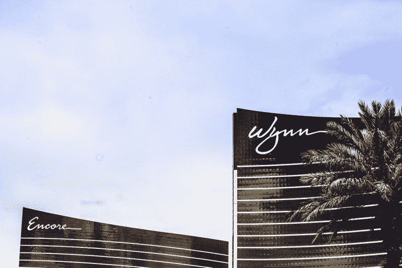
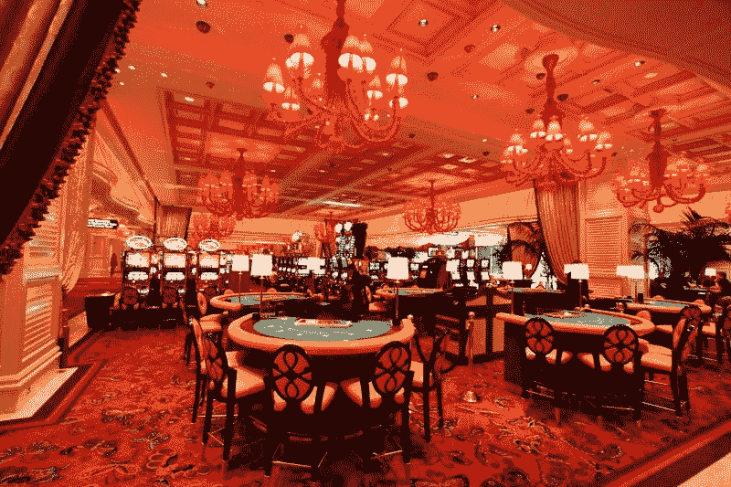

# 永利度假村赚钱了吗？—市场疯人院

> 原文：<https://medium.datadriveninvestor.com/is-wynn-resorts-making-money-market-mad-house-66406d160cc8?source=collection_archive---------12----------------------->

奇怪的是，赌场运营商**永利度假村(NASDAQ: WYNN)** 的股票今年一直在过山车上。

解释一下，永利在 2019 年 1 月 2 日以 104.4 美元开始 2019 年，在 2019 年 4 月 26 日飙升至 149.3 美元，在 2019 年 10 月 8 日跌至 103.28 美元。那么是什么推动了赌场公司的戏剧性变化呢？

 [## 值得购买的 4 大人工智能股票及其原因|数据驱动型投资者

### 人工智能(AI)在 2019 年继续进入大众意识。通过应用程序…

www.datadriveninvestor.com](https://www.datadriveninvestor.com/2019/03/06/top-4-artificial-intelligence-stocks-to-buy-and-why/) 

我怀疑，被收入不平等吓到的紧张的投资者正在寻找迎合富人的股票。[永利](https://www.wynnresorts.com/)；拉斯维加斯传奇人物史蒂夫·韦恩的创造，经营赌场，迎合富裕的赌徒或鲸鱼。

# 永利度假村能否从收入不平等和中国获利？

我猜投资者已经看到了显示富人越来越富的报告。

例如，布鲁金斯学会[声称](https://www.brookings.edu/blog/up-front/2019/06/25/six-facts-about-wealth-in-the-united-states/) 20%的美国人现在控制了美国 77%的财富。此外，布鲁金斯学会声称，只有前 20%的美国家庭从大衰退中复苏。

此外，永利可以从中国飞速的经济增长中获利。解释一下，永利在葡萄牙的旧殖民地澳门经营着赌场。澳门是中华人民共和国唯一允许开设赌场的地方。

值得注意的是，据市场观察[报道](https://www.marketwatch.com/story/us-economy-could-slip-from-top-spot-in-2020-and-keep-slipping-analysts-say-2019-01-14)，渣打银行声称中国可能在 2020 年取代美国成为世界头号经济体。为了解释这一点，渣打银行分析师推测中国的国内生产总值(GDP)将在 2020 年超过美国。

因此，永利可能拥有全球最大经济体中为数不多的几家合法赌场中的两家。因此，永利度假村可以利用越来越多的中国鲸鱼。从历史上看，新富们拿钱的第一个地方就是赌桌。

# 永利度假村赚钱了吗？

永利度假村(纳斯达克代码:WYNN) 可以在一个不断变化的世界中成长，但它赚钱了吗？

本杰明·格拉哈姆最重要的问题的答案是肯定的。永利度假村报告称，2019 年 6 月 30 日，季度收入为 16.58 亿美元，季度毛利为 6.41 亿美元。此外，永利在 2019 年 6 月 30 日报告的营业收入为 2.1872 亿美元，净收入为 9455 万美元。

然而，永利并没有产生多少现金。永利度假村在 2019 年 6 月 30 日的运营现金流为 245.59 美元。当天还出现了负现金流-8014 万美元，融资现金流-24279 万美元，投资现金流-32569 万美元。

# 永利度假村有多安全？

此外，永利度假村在 2019 年 6 月 30 日报告了 15.06 亿美元的现金和等价物。因此，就其规模而言，我认为永利是一家现金充裕的公司，但不是一支安全的股票。

然而，永利在截至 2019 年 6 月 30 日的季度中实现了 3.3%的健康收入增长率。值得注意的是，永利在此前一个季度的收入增长率为-3.73%。因此，永利在增长，但也面临着危险的增速下滑。

我认为对大多数投资者来说，永利度假村的安全边际太低了。澄清一下，永利虽然赚钱，但钱不够安全。然而，我认为永利比其他赌场运营商更安全，因为它在美国的足迹很小。

# 永利度假村会从美国博彩业的崩溃中幸存下来吗？

解释一下，永利只在两个美国城市经营赌场；拉斯维加斯和波士顿。我认为美国的赌场存在泡沫，因为它们太多了。特别是，在赌博向网上转移的时候，他们已经使全美国的赌场赌博合法化。

Statista [估计](https://www.statista.com/statistics/187972/number-of-us-commercial-casinos-since-2005/)2018 年美国有 465 家商业赌场。这一数字高于 2017 年的 460 家赌场，但低于 2016 年 524 家赌场的高点。

因此，我认为美国博彩业正走向崩溃，因为有太多的赌场。永利的小足迹可以使其免于在一个过度饱和的市场中全面崩溃。然而，2016 年至 2017 年间 64 家美国赌场的倒闭表明了商业赌博的波动性。

# 永利度假村是好的分红股吗？

奇怪的是，就其股价而言，永利度假村是一只不错的股息股。事实上，永利在 2019 年 8 月 15 日支付了 1 美元的季度股息。

此外，永利股息从 2019 年 9 月 14 日的 75₵增长到 2019 年 5 月 21 日的 1 美元。因此，永利的股息在 2019 年增长了 25%或 25₵。

Dividend.com 给**永利度假村(NASDAQ:Wynn)**3.87%的股息率，年化派息 4 美元，派息率 52.9%。因此，永利度假村是一个很好的收益股。

如果你必须拥有一只赌场股票，永利度假村是一个不错的选择。它支付了丰厚的股息，而且没有涉足过度建设的美国赌场业务。

*原载于 2019 年 10 月 8 日*[*【https://marketmadhouse.com】*](https://marketmadhouse.com/is-wynn-resorts-making-money/)*。*