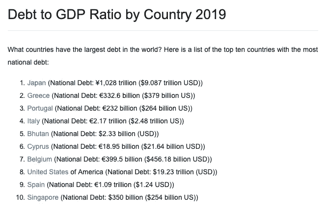

# 你的国家负债了吗？

> 原文：<https://medium.datadriveninvestor.com/is-your-country-in-debt-a6d730176346?source=collection_archive---------19----------------------->

Photo by [NASA](https://unsplash.com/@nasa?utm_source=unsplash&utm_medium=referral&utm_content=creditCopyText) on [Unsplash](https://unsplash.com/search/photos/world?utm_source=unsplash&utm_medium=referral&utm_content=creditCopyText)

在 [*我会教你变得富有*](https://www.iwillteachyoutoberich.com) 中阅读关于信用卡优化的文章让我对世界经济进行了反思。

快速的谷歌搜索让我找到了这些数字。

[Source: World Population Review](http://worldpopulationreview.com/countries/countries-by-national-debt/)

将这些数据与[国际货币基金组织的博客声明](https://blogs.imf.org/2019/01/02/new-data-on-global-debt/)结合起来:

> [全球债务](https://blogs.imf.org/2019/01/02/new-data-on-global-debt/)已经达到历史最高水平**，名义价值 184 万亿美元**，相当于 2017 年**GDP 的 225%。平均而言，目前世界人均债务超过 86000 美元，是人均收入的两倍多。**

 [## 区块链会引发全球金融体系的动摇吗？数据驱动的投资者

### 2008 年的金融危机表明(对一些人来说),大型金融机构需要被密切关注和…

www.datadriveninvestor.com](https://www.datadriveninvestor.com/2019/01/11/will-blockchain-trigger-a-shakedown-of-the-global-financial-system/) 

我开始怀疑欧洲货币联盟是否注定要失败。

在这篇博文中，我将总结欧元区斗争的历史进程以及我的解决方案。

# 欧洲合作基金会

以国家为行动者的欧盟的基础有两个起源神话:

*   两次世界大战后，欧盟的建立是为了确保欧洲大陆的和平
*   欧盟的建立是为了改善单个国家的经济。

在我看来，德国和法国创建了一个权力轴心来帮助他们实现各自的目标。

> 德国对欧洲来说太大了，但对世界来说又太小了。

德国有经济实力成为世界经济的一部分，但与美国、中国、巴西和俄罗斯这样的巨人相比，它的领土还很小。

因此，他们迫切需要一个政治联盟来简化欧洲的整体经济进程。

法国在第二次世界大战后被摧毁，需要资金来重建经济，重新站起来。

因此，法国为了农业资金的需要放弃了政治权力，而德国则用经济优势换取了政治一体化。

# 添加成员

从德法轴心开始，一个名为[欧洲煤钢共同体](https://en.wikipedia.org/wiki/European_Coal_and_Steel_Community)的政治合作发展起来，其目标是简化工业生产。

为了改进欧洲的食谱，比利时、意大利、荷兰和卢森堡被加入其中。

Photo by [Steve Johnson](https://unsplash.com/@steve_j?utm_source=unsplash&utm_medium=referral&utm_content=creditCopyText) on [Unsplash](https://unsplash.com/search/photos/currency?utm_source=unsplash&utm_medium=referral&utm_content=creditCopyText)

# 多种货币

为了改善欧洲条约的经济协调，外交官让·莫内在 1958 年提出了经济联盟的想法。

在此之前，每个国家都管理自己的货币。

德国人以马克为荣；同样，对于美元，他们权力的上升与硬币有关。

德国也在二战后被摧毁，但他们非常努力，货币成为民族毅力和骄傲的象征。

在荷兰，我们有居尔登，在法国，他们使用法郎，在大布里泰因，他们喜欢英镑。

历史上，欧洲国家在危机时期会通过控制通货膨胀率来稳定经济。

> 对于大多数政治家来说，放弃这一主权工具的想法是令人无法容忍的。

# 怀疑论

英国对经济和货币联盟的发展持怀疑态度，因为:

*   时局艰难时，团结是没有保证的。
*   没有哪个国家会不战而降地接受欧盟实施的紧缩措施。
*   缺乏金融控制、对银行的监督等。会导致沟通和执行问题。

他们最终在没有引入欧元的情况下加入了欧元区，因为他们实施了一项选择退出条款，这赋予了他们选择自己实施欧元的时间的权利。

回想起来，英国列出的所有潜在危险都在 2009 年的金融危机和经济衰退中暴露出来。

Photo by [Hasan Almasi](https://unsplash.com/@hasanalmasi?utm_source=unsplash&utm_medium=referral&utm_content=creditCopyText) on [Unsplash](https://unsplash.com/search/photos/battle?utm_source=unsplash&utm_medium=referral&utm_content=creditCopyText)

## 货币主义者对怀疑论者

在欧盟的前身，人们就引入货币联盟的最佳方法展开了激烈的辩论。

货币主义者相信，所有经济体的融合将导致成员国之间的纽带加强，从而在面临危机时加强政治一体化。

怀疑论者认为，欧元区远未准备好，因为德国等一些经济体与其他经济体相比，陷入困境。从长远来看，该经济区将能够承受债务危机或石油短缺等经济冲击。他们坚持认为，必须有一个政治联盟来应对这些问题，现在调整经济和商业利益将导致成员国之间未来的隔离。

货币主义者势头强劲，赢得了战斗。因此，2002 年引入了欧元。

# 银行传统的不同

多年来，欧盟加入了地中海国家，如希腊、葡萄牙和西班牙，后来又加入了东欧国家，如波兰、波罗的海国家等。

这个想法是，将这些州包括进来会创造一个更大的市场，这样每个人都会获利。

持怀疑态度的英国警告欧盟，这些国家的银行传统与德国或英国的银行非常不同。

德国银行有集权的历史，而英国银行最熟悉自由主义。

光谱的两端创造了欧洲中央银行。

这个欧洲央行只被允许调节通胀率，不能干预经济政策，这是民族国家的主权权利。

地中海银行的不同之处在于它们发放的信贷量。

例如，巴塞罗那足球俱乐部、皇家马德里足球俱乐部和其他足球俱乐部都欠了银行巨额债务。他们一直在花钱，直到国际足联在 2011-2012 年引入[金融公平竞赛条例](https://en.wikipedia.org/wiki/UEFA_Financial_Fair_Play_Regulations)。

## 退休文化

在欧盟将退休年龄提高到更高的年龄之前，T4 的退休年龄是 55 岁。

再加上东欧黑市的传统和更高的腐败率；很难理解为什么欧盟会首先引导他们加入。

# 欧洲央行滥用宪法

> 解决欧盟的债务危机。欧洲央行打开了原始合约中不允许的后门。

欧洲央行将购买这些国家的债务，这样通货膨胀率就会下降，希望外国投资会增加。

> 通过这样做，他们使欧洲央行成为市场上的积极参与者。

就像美国联邦政府一样，这只会吹大泡沫，直到它再次破裂。

> 在我看来，通过制造债务来对抗债务从来都不是一个好的解决方案。

Photo by [CloudVisual](https://unsplash.com/@cloudvisual?utm_source=unsplash&utm_medium=referral&utm_content=creditCopyText) on [Unsplash](https://unsplash.com/search/photos/fight?utm_source=unsplash&utm_medium=referral&utm_content=creditCopyText)

# 危机的政治反弹

在有英国退出欧盟之前，我们有希腊退出。

欧盟在 2012 年面临一场关于将希腊踢出去的危机，因为他们没有检查他们的账目。

话又说回来，即使在 2019 年，根据[欧盟委员会](https://www.youtube.com/watch?v=mE1rnOi8AFc)的说法，也没有任何成员国必须遵守[经济货币安全保障体系。](https://europa.eu/rapid/press-release_IP-19-3569_en.htm)

> 触发 EDP 的基础是一般政府赤字超过 GDP 的 3%,和/或债务水平超过 GDP 的 60%,并且不足以减少到该水平。**目前，在西班牙于 2019 年 6 月退出后，没有任何成员国属于该公约的纠正机构**

我们没有让希腊退出，而是让他们采取紧缩措施，这给欧盟在地中海国家造成了可怕的公关危机。

例如，在希腊，你会看到右翼极端主义政党金色黎明(Golden Dawn)和 T2 北方联盟(Lega Nord)。

在“更富裕”的西方，欧洲公民一直在想，他们是否能拿回流入希腊重组基金的钱。

# 解决方法

许多想法正在流传，以挑战欧盟内部的团结问题。

## 分割区域

其中一个概念是将欧元区分成两个不同货币的独立区域；N 欧元和 S 欧元。

目前的欧元将继续作为北欧欧元，并由德国、瑞典、芬兰和荷兰等国家来保护。

其他国家的经济还没有达到我们的水平，将被放在南部地区，如地中海和东欧国家。

在我看来，尽管法国和比利时位于北欧，但它们也将不得不采用欧元。法国有 96.2%的 GDP 赤字，比西班牙的 95.1%还要高。

与[荷兰的 50.9%](http://worldpopulationreview.com/countries/countries-by-national-debt/)和[德国的 55.7%](http://worldpopulationreview.com/countries/countries-by-national-debt/)相比，法国和[比利时是 99%](http://worldpopulationreview.com/countries/countries-by-national-debt/) 的逆差，低于标准杆。

有些人甚至提议为东欧国家再增加一个区域。

## 世界通货

尽管这可能永远不会发生，但一种世界货币将解决大多数问题。

问题在于，富人永远不会轻易放弃他们在世界上的主导地位。

此外，官僚主义的任务将超出这个世界。

但是随着技术的进步，我还是给它一个很好的机会。

## 政治联盟

作为阿姆斯特丹大学欧洲研究的学生和名为 Volt 的泛欧运动的成员，我倾向于欧洲一体化。

但如果说我从学习中学到了什么的话，那就是我们再也不能逃避现实，否定这些经济问题了。

我们必须意识到要前进。我们必须加快我们的欧洲游戏，这意味着要么成为超级国家的联盟。

到目前为止，欧盟只是一个双边合同，有好处也有坏处。

## 联盟

我在欧洲研究中的专业是文化和文学，我学到了很多关于国家建设和政治思想的知识。

我的结论是，在一个已经相互关联的世界里，主权被高估了，而且必须面对全球问题，如气候变化、世界债务、不平等等等。

Photo by [William Bossen](https://unsplash.com/@william_bossen?utm_source=unsplash&utm_medium=referral&utm_content=creditCopyText) on [Unsplash](https://unsplash.com/search/photos/climate-change?utm_source=unsplash&utm_medium=referral&utm_content=creditCopyText)

如果欧盟成为一个联邦，我们将面临美国同样的歧视、隔离、贫富差距等危机。

相反，我提议彻底废除过时的民族国家模式。

这种政治模式是 19 世纪在欧洲发明的，目的是将大量人群联系起来，这样当权者就可以创建更大的国家。

## 超自然现象

想想所有的文化，传统只是投射在一大群人身上的符号。

每个国家都有堕落者、天才、圣人、创意者、科学家和商人。

如果你认为美国梦、西方价值观或东方价值观是真实的，那你就是生活在梦里。

它们都是对生活的看法，对自我发现有用，但不应成为政治的一部分。

因此，我希望人类能在某个时刻意识到，我们只是同一个星球上的一个物种；为了最大化健康、幸福和归属感，我们必须在全世界范围内共同努力。

Photo by [The New York Public Library](https://unsplash.com/@nypl?utm_source=unsplash&utm_medium=referral&utm_content=creditCopyText) on [Unsplash](https://unsplash.com/search/photos/planet?utm_source=unsplash&utm_medium=referral&utm_content=creditCopyText)

注意:我不是经济学家或金融专家。以上是我对欧元区现状的看法。我很清楚我对我的国家荷兰有偏见，这篇博文中有许多固执己见的观点。在你发表意见之前，请考虑一下这一点。

*这篇博文是 30 天博客挑战的第 20 篇。*