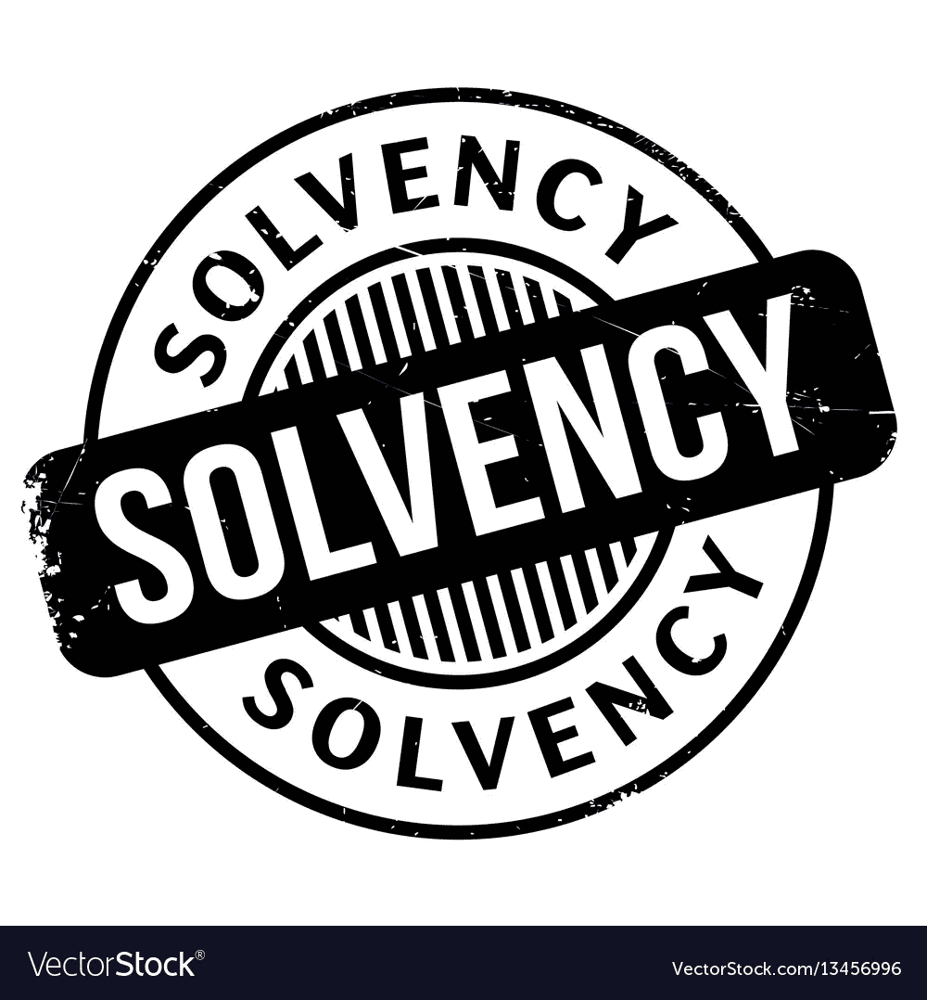
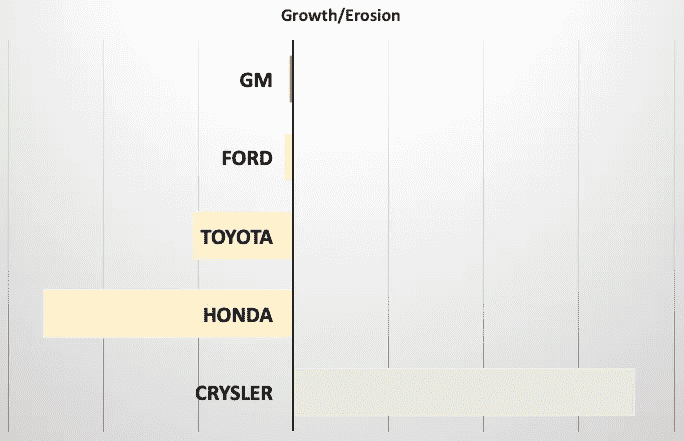
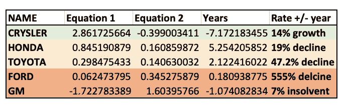

# 流沙测试:创新是溶剂吗？

> 原文：<https://medium.datadriveninvestor.com/is-your-money-in-solvent-innovation-bb49c4202457?source=collection_archive---------9----------------------->

## 一个快速测试，看看汽车还剩下多少时间

在 [的最后一篇流沙测试文章](https://medium.com/datadriveninvestor/income-erosion-40fb19f6b673)中，我们研究了快速测试公司真实收入或真实自由现金流的方法，不受债务成本的影响。该等式涉及两个独立收入比率的应用:

> **初级:** *(平均 5 年净负债/平均 5 年净收益)*
> 
> **次要:** *((收入年 5 —收入年 1) /收入年 1)/((债务年 5 —债务年 1)/债务年 1)*
> 
> **最终:**方程式 1/方程式 2

如果一切顺利，结果应该是一个负数。在发表了这个公式并与一两位会计师交谈后，我意识到，对于许多人来说，这可能是一种违反直觉的思考公式的方式，收入被债务侵蚀，而且也不一定太容易想象，尤其是在存在两种类型的负数(健康和不健康)的情况下。

因此，我开始更全面地思考这个公式，并意识到有一个潜在的公式改进可以真正增强它。或许我们可以使用公式的最简单和最有效的方法是将等式 2 表示为负指数或对数，以减少等式 1 中发生的任何情况的影响。这样，我们可以看到一个公司离真正的破产还剩多少时间。

当然，资不抵债不一定等同于亏损——例如，一家公司可能在技术上亏损，但仍有能力支付员工工资。然而，一家公司产生的真实自由现金流越来越少，而承担的债务越来越多，我们还能坚持多久，直到它走上不归路？(反过来说，一家公司将目前的实际 FCF 翻倍需要多长时间？)

为了做到这一点， ***我将等式 2* *的总和计算为负数(如果它已经是负数，例如在通用汽车的情况下，这次它变成正数)*** ，因为它衡量的是债务盖过公司收入的速度。然后，我用同样的方法将第一个结果除以第二个结果:

这产生了两个结果:我们消除了表现最好和表现最差的公司的双重负面表现，相反，负面表现只归因于表现最差的公司。此外，我们还可以得到一个近似值，即这些公司必须在多少年内达到 FCF 翻倍的水平，或者，嗯，破产，然后将结果除以 1，我们就可以得到现金流的加速消耗率(或者，在克莱斯勒的情况下，现金流的剩余增长率):

正如你所看到的，克莱斯勒的实际增长率约为每年 14%，这意味着大约 7 年后，克莱斯勒的 FCF 将是现在的两倍。另一方面，通用汽车约有 7%的资不抵债，这意味着该公司可能有约 7%的成本无法借入足够的资金来支付，只能通过剥离现有资产的过程来支付(从而进一步减少收入)。福特可能有大约半年的时间，因为它现在距离亏损大约 3 个月，或者我们可以描述为 1%的资不抵债。

目前疯狂借款的日本汽车制造商的情况也好不到哪里去，事实上，由于处于看起来更有利的位置，因此仍然能够借入大量现金，最终可能会比他们的美国同行更加困难。例如，丰田公司只剩下两年时间，从技术上讲，该公司不可能再盈利，它将开始进入破产阶段。这将是一项艰巨的工作，需要偿还大约 500 亿美元的债务。

鉴于目前借贷市场如此活跃，在将资金投入到看似无害的 3-5%稳定 AA 评级公司债券之前，进行这些计算可能是值得的。事实是，目前汽车行业和其他创新密集型行业的资不抵债情况比看上去更为严重。