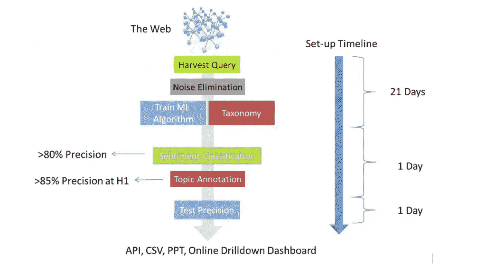

# 你的社交媒体监控工具适合市场调研吗？

> 原文：<https://medium.datadriveninvestor.com/is-your-social-media-monitoring-tool-appropriate-for-market-research-dff647e01d4f?source=collection_archive---------13----------------------->

本文旨在解释社交媒体监听和分析是如何恰当地用于市场研究目的的。需要理解和接受的最重要的概念是，与 DIY 社交媒体监测工具的工作方式不同，为了实现对市场研究目的至关重要的所需数据准确性，需要 3-4 周的人工设置阶段(见图 1)。一旦产品类别或任何其他特定语言主题的设置完成，从那时起，就可以像使用任何其他社交媒体监控工具一样，采用实时 DIY 方法。

*图 1:社交媒体收听&MR 分析流程(来源:2015 年 LT-Accelerate 大会上的 DigitalMR 演示文稿)*

洞察专家能够将倾听、提问和跟踪行为联系起来，这一点非常重要。为了做到这一点，洞察专家需要相信，所分析的成千上万的帖子实际上是关于感兴趣的品牌和产品类别的。这让我们想到了使用社交倾听进行市场调查时需要注意的三个问题中的第一个。

1.  [**消噪**](https://www.digital-mr.com/blog/view/tips-to-reduce-noise-in-social-listening)

用于从社交媒体和其他公共网站收集帖子的关键字集被称为“收获查询”。这个收获查询可以简单到一个单词，也可以复杂到多页布尔逻辑。仅获取相关帖子的问题是，我们还需要知道*所有*与我们的关键词不相关的同义词和同音异义词；我们从来不这样做。因此，需要一个迭代过程，当人们发现他们在前一次迭代中没有想到的新的不相关单词时，他们可以改进 harvest 查询。我们用来说明这一点的最常见的例子是这样的:当我们想要收集关于“苹果电脑”的帖子时，我们从一开始就知道会有关于苹果的帖子，所以我们创建了一个收集查询，排除了关于水果的帖子；但是，人人都在推特上谈论的(女演员)格温妮丝·帕特洛的女儿名叫苹果又是怎么回事呢？我相信你明白我的意思…

**2。** [**情绪准确度**](https://www.digital-mr.com/blog/view/The-Impact-of-Ambiguity-in-Social-Listening-and-Analytics)

有相当多的方法可以用情感来注释帖子，从手动到使用 NLP(自然语言处理)的语言学或统计学方法。每种方法都有优点和缺点，特别是当我们在查看一个包含 10，000 个或更少帖子的数据集时，该数据集将用于一次性报告。然而，对于任何连续的报告，甚至是超过 20，000 个帖子的一次性报告，使用人工而不是机器既昂贵又缓慢。在本系列的前一篇文章[中，我们讨论了正确的准确性指标:Precision & Recall。大部分社交媒体监测工具只能勉强达到 60%的情绪精度；事实上，在我们被要求检查的所有情况下，他们的准确性在 44%-53%之间。在市场研究的跟踪项目开始时，任何超过 70%的情感精确度都是可以接受的，但随后它应该在短时间内攀升到 80%以上。](https://rwconnect.esomar.org/introducing-the-social-media-listening-series-social-media-listening-is-here-to-stay/)

**3。** [**语义准确**](https://www.digital-mr.com/blog/view/are-you-willing-to-risk-your-life-for-social-listening-and-analytics)

当我们说语义分析时，我们指的是围绕感兴趣的产品类别分析在线对话的主题。与情感准确度类似，准确度和召回率是衡量语义准确度的合适指标。如果使用分层分类法(具有多个层/层次的字典，用人们在社交媒体帖子中使用的词语描述产品类别)来报告市场研究主题，则层次 1 主题的语义精确度可以达到 85%以上。您会注意到，尽管我们提到“召回”是准确性衡量标准之一，但在这个大数据分析领域，我们并没有用它来描述什么适合市场研究。语义分析的召回是指关于某个主题的数据集中实际存在的帖子中有多少被识别出来。在我们处理数百万帖子的大数据世界中，为了提高成本效率，只查看多次提到的关键词符合我们的利益。如果一个关键词在数百万的数据集中只被提到几次，如果我们试图用它来注释文章，我们将进入“收益递减区”。然而，最大化回忆是可能的，如果最终客户想以这种方式花费他们的金钱和时间，这应该是他们的决定。

如果你仍然不确定你的社交媒体监控工具是否适合客户洞察，那么试着在这张[信息图中问一些问题。](https://digital-mr.com/20-questions-to-ask-when-evaluating-social-media-listening-tools?hsCtaTracking=f1a58710-6a12-4648-be14-3813f3264caf%7Ca46d0485-0a65-4eca-882f-80701bb1156d)