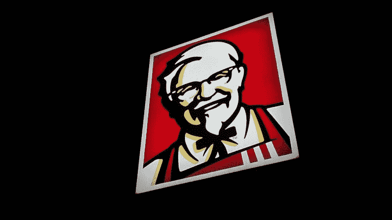
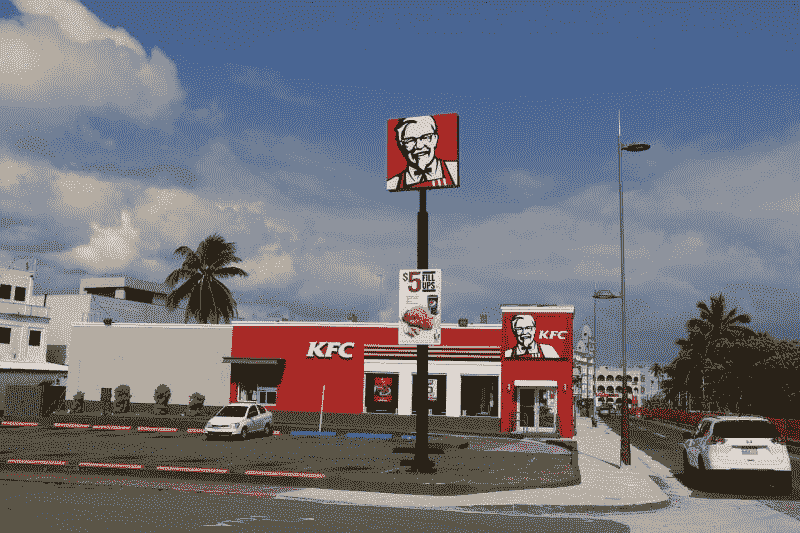
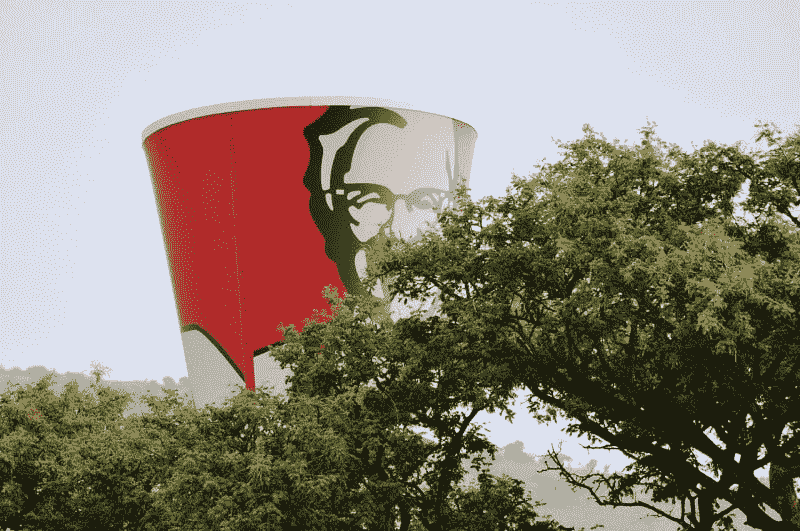
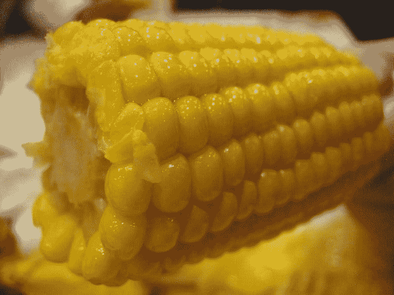
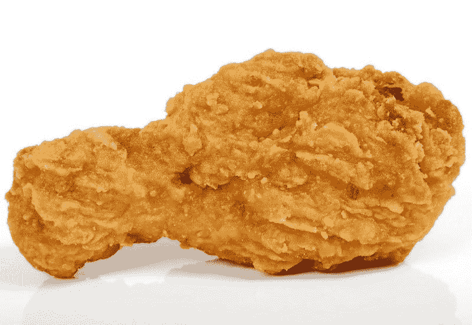
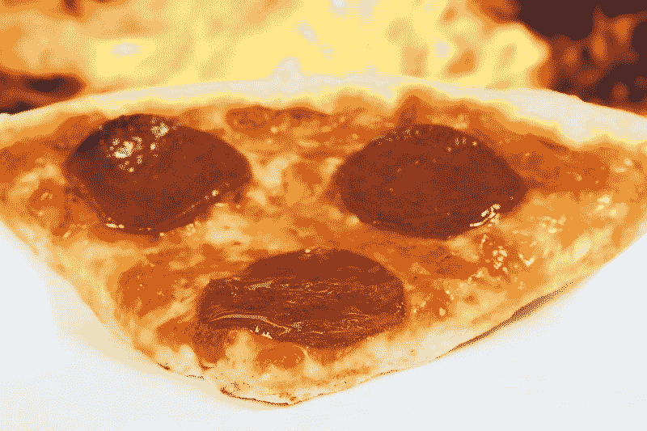
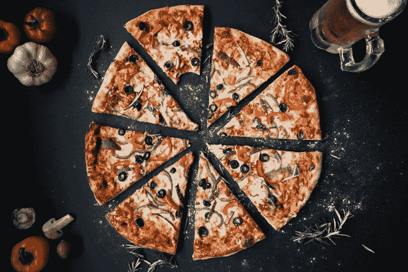
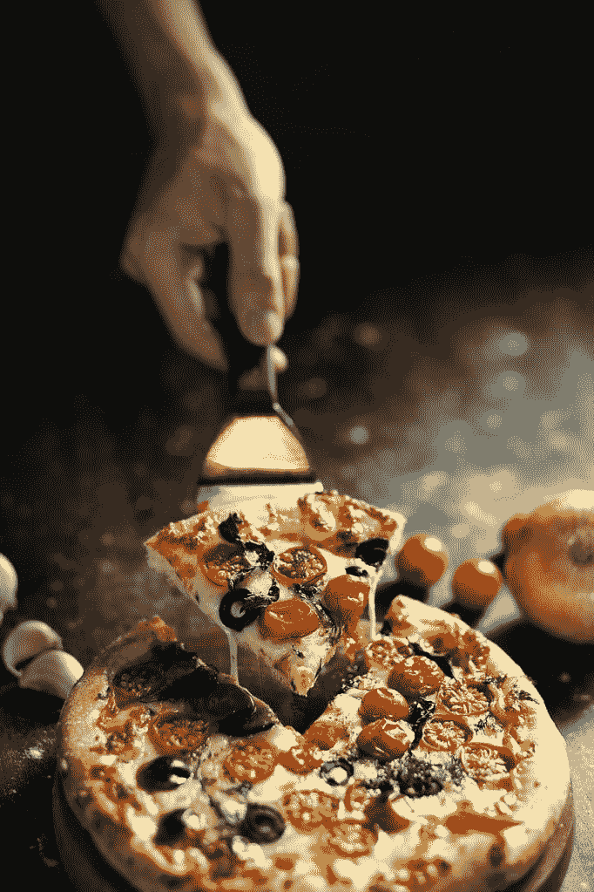

# 是百胜！品牌赚钱？—市场疯人院

> 原文：<https://medium.datadriveninvestor.com/is-yum-brands-making-money-market-mad-house-33235b4eb215?source=collection_archive---------10----------------------->

问的就是 Yum！品牌赚钱听起来很奇怪，因为该公司声称在超过 145 个国家经营超过 48，000 家餐厅。

然而，**吧唧！Brands (NYSE: YUM)** 对美中之间日益增长的贸易战有很大的敞口。例如，*商业内幕* [声称](https://www.businessinsider.com/most-popular-fast-food-chain-in-china-kfc-photos-2018-4)百胜在中国 1100 个城市经营超过 5000 家肯德基特许经营店。

 [## 模式和机器人:复杂的现实|数据驱动的投资者

### 哈耶克的名著《复杂现象理论》(哈耶克，1964)深入探讨了复杂性的话题，并断言…

www.datadriveninvestor.com](https://www.datadriveninvestor.com/2019/03/04/patterns-and-robotics-a-complex-reality/) 

对中华人民共和国的依赖可能会有问题，因为唐纳德·j·特朗普总统要求美国公司“开始寻找中国的替代品”，*纽约时报* [报道](https://www.nytimes.com/2019/08/23/business/china-tariffs-trump.html)。然而，尚不清楚特朗普是认真对待贸易战，还是试图通过抨击中国来为他的 2020 年连任竞选拉选票。

有趣的是，Yum！由于中国业务归另一家公司所有，布兰德限制了其在中国的脆弱性。不过，百胜！Brands 将其声誉押在了中国身上。

# 贸易战是真的吗？

值得注意的是，特朗普过去很快就放弃了贸易行动。例如，2019 年 8 月 13 日，特朗普将威胁关税的执行推迟到 2019 年 12 月，*晨间电话* [报道](https://www.mcall.com/trump-backs-down-again-delays-most-new-tariffs-on-china-until-december-story.html)。为了澄清，特朗普将关税推迟到 2019 年假日购物季之后，以避免冒犯选民。

目前，特朗普在一条推文中威胁要下令搜查从中国运出的包裹。我不认为特朗普的推文是认真的，因为推迟一揽子计划可能会激怒许多潜在选民。例如，从中国订购零件的商人。

贸易战影响百胜。品牌，因为它的肯德基餐厅是在前线。事实上，肯德基在 2016 年控制了中国快餐市场的 11.6%，*中国日报* [估计](http://usa.chinadaily.com.cn/china/2017-09/01/content_31433808.htm)。

# 能好吃！品牌在贸易战中幸存？

中美之间的恶劣关系可能会损害肯德基，因为该公司全球近四分之一的门店都在中华人民共和国。

为了澄清，Statista [估计](https://www.statista.com/statistics/256793/kfc-restaurants-worldwide-by-geographic-region/)2018 年全球共有 22671 家肯德基门店。如果这个估计是正确的，中国肯德基占百胜的 10%以上。美国在全球拥有超过 48，000 家[餐厅。](https://www.yum.com/wps/portal/yumbrands/Yumbrands/footer-pages/faq)

CNN 财经[估计](https://www.cnn.com/2019/03/05/business/kfc-fastfood-pizza-hut-china/index.html)中国大约有 2000 家必胜客增加了百胜的曝光率。然而，必胜客和肯德基都在中国失去市场份额，可能是因为爱国人士认为它们是“西方”或美国品牌。因此，面对日益富裕的中国中产阶级，这些连锁店正试图将自己打造成更高档的品牌。

一个问题好吃！Brands faces 是特朗普推文的所有新闻报道。由于从现在到 2020 年 11 月，特朗普的推文可能会变得更具攻击性，美国的声誉可能会在中国受到严重打击。

# 是百胜！品牌赚钱？

好吃！Stockrow [报道](https://stockrow.com/YUM/financials/income/quarterly)，Brands 正面临着一些严重的问题，包括七个季度的收入增长萎缩。

截至 2019 年 6 月 30 日的季度，百胜的收入增长收缩了 4.24%，截至 2019 年 3 月 31 日的季度收缩了 8.53%。此外，百胜的季度收入和毛利润在过去一年中有所下降。

比如百胜！2019 年 6 月 30 日报告的季度收入为 13.91 亿美元，毛利为 7.35 亿美元。一年后，这些数字分别缩减至 13.10 亿美元和 6.39 亿美元。

好吃！仍在以 2019 年 6 月 30 日报告的 4.78 亿美元运营收入和 2.89 亿美元净收入的形式赚钱。意义重大，好吃！的现金流很低。

# 好吃！品牌缺乏在贸易战中生存的资源

该公司于 2019 年 6 月 30 日报告了 1.29 亿美元的自由现金流和 4.61 亿美元的运营现金流。相比之下，好吃！2018 年 6 月 30 日报告了 3.81 亿美元的运营现金流和 1.49 亿美元的自由现金流。

最后，好吃！截至 2019 年 6 月 30 日，Brands 只有 2.52 亿美元的现金和等价物。这一数字低于去年同期的 3.13 亿美元现金等价物。

这些数字显示好吃！Brands 缺乏在贸易战中生存的资金。与麦当劳(纽约证券交易所代码:MCD) 不同，麦当劳在 2019 年 6 月 30 日报告了 28.28 亿美元的毛利。好吃！Brands 没有从特许经营中赚到足够的钱来度过任何严重的损失。

# 是百胜！品牌是价值投资吗？

我认为市场先生定价过高。Brands(纽约证券交易所:YUM)2019 年 8 月 27 日 117.041 美元。我认为这个价格太高是因为百胜在中国的大量投资，贸易战，以及美国混乱的快餐市场。

特别是，Yum！Brands 对美国食品市场的稳定模式转变有很大影响。像**克罗格(纽约证券交易所代码:KR** )和亚马逊的全食超市这样的美国杂货商正在慢慢地从销售生食转向零售预加工和预烹饪的食品。

例如，许多美国超市现在通过出售炸鸡直接与肯德基竞争。此外， [Kroger Marketplace](https://www.kroger.com/p/deli-pizza-to-go/0000000001801) 门店通过经营店内披萨店与必胜客展开竞争。此外，Kroger Marketplaces 通过经营店内玉米饼摊与 Taco Bell 竞争。

此外，克罗格提供熟食比萨饼，从它的许多商店。此外，Instacart 送货服务现已在美国 1600 多个 Kroger 市场提供。因此，克罗格很快成为百胜之一！品牌最危险的竞争对手。

# GrubHub 能拯救 Yum 吗？品牌？

好吃！Brands 正试图通过与 GrubHub(纽约证券交易所代码:GRUB)(T11)的联盟来削弱 Kroger 等杂货商带来的威胁。

解释一下，GrubHub 是一款送餐应用，[声称](https://about.grubhub.com/about-us/what-is-grubhub/default.aspx)为 2030 万活跃食客提供服务，每天处理 488900 份外卖订单。我认为 Grubhub 可以吹嘘好吃！通过把像肯德基和塔可钟这样受欢迎的舒适食品带到美国的家门口。

与 GrubHub 合作需要 Yum！品牌改变其商业模式。依赖送货可能会迫使必胜客和肯德基开设更小的商店，或者建立仅仅是厨房的新店。百胜还可以开设联合厨房，在同一个地方烹饪肯德基、必胜客和墨西哥玉米卷食品，以便送货上门。

# 机器人能拯救百胜吗？品牌？

另一方面，服务交付可能会削减 Yum！通过消除在店内为就餐者服务的需要来降低成本。相反，肯德基或必胜客可以只包括一个柜台，送货司机、顾客，可能还有机器人可以在那里取餐。

值得注意的是，一家名为 Starship Technologies 的公司正在印第安纳州的普渡大学测试送餐机器人，*今日美国* [报道](https://www.usatoday.com/story/news/nation/2019/08/22/food-delivery-robots-ready-roll-purdue-university-campus/2078984001/)。星际飞船机器人是一个有六个轮子的盒子，在校园里滚动。餐馆工作人员把食物放在盒子里。机器人把食物送到餐馆。

所以，百胜餐饮集团！会有更低的费用和更大的市场。然而，依赖机器人和送货应用是一种未经测试的商业模式。然而，应用程序和机器人可能是美味的！品牌的未来。

此外，像 Miso Robotics 的 [Flippy](https://misorobotics.com/flippy/) 这样的机器人厨师可以增加美味同时降低成本。目前，Flippy 做汉堡，但 Flippy 做墨西哥玉米卷或炸鸡也是可能的。

此外，一家名为 [Zume Pizza](https://zumepizza.com/) 的公司正在硅谷使用机器人制作披萨。*商业内幕* [报道](https://www.businessinsider.com/zume-pizza-robot-expansion-2017-6)Zume 正在从像 soft bank 这样的大投资者那里寻求资金来资助一次大规模扩张。Zume 的管理层认为，机器人可以降低生产成本，提高披萨业务的质量。如果 Zume 成功了，它可以创造一种商业模式，必胜客可以通过复制来增加产量和利润。

# 是百胜！品牌是好的红利股？

唯一的方面吧唧！我觉得有吸引力的股票是 42₵上一次于 2019 年 8 月 16 日支付的季度股息。

此外，6₵在 2019 年增加了季度股息，从 2018 年 11 月 23 日支付的 36₵增加到 2019 年 2 月支付的 42₵。然而，Dividend.com 认为百胜只有一年的股息增长。

因此，好吃！2019 年 8 月 27 日，Brands 的股息收益率为 1.44，年化派息为 1.68 美元，派息率为 48%。因此，百胜是一只不错的股息股，但我认为它赚不到足够的钱来维持股息。

我给投资者的建议是远离百胜！品牌，目前快餐业风险太大，无法成为可靠的收入或价值投资。相反，我建议投资者去看看 GrubHub，或者等到我们看到技术和贸易战如何扰乱快餐的未来。

[*最初发表于 2019 年 8 月 27 日的 https://marketmadhouse.com。*](https://marketmadhouse.com/is-yum-brands-making-money/)