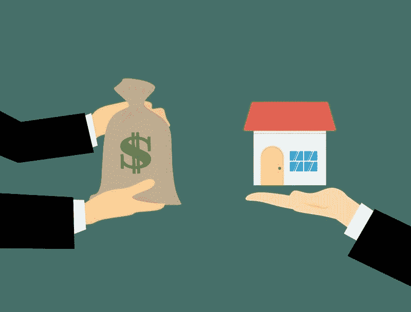
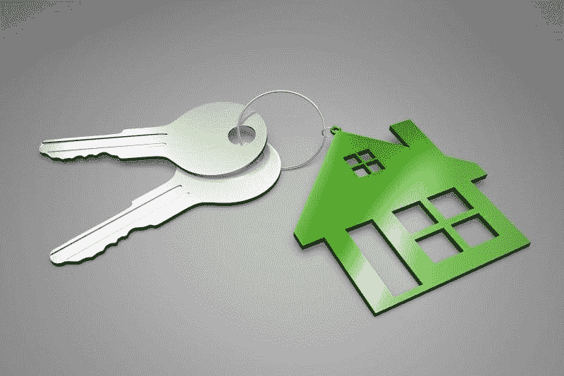
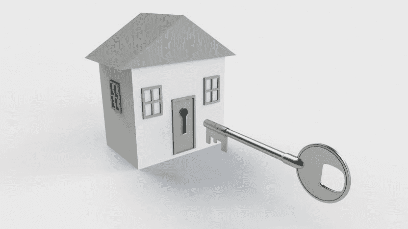
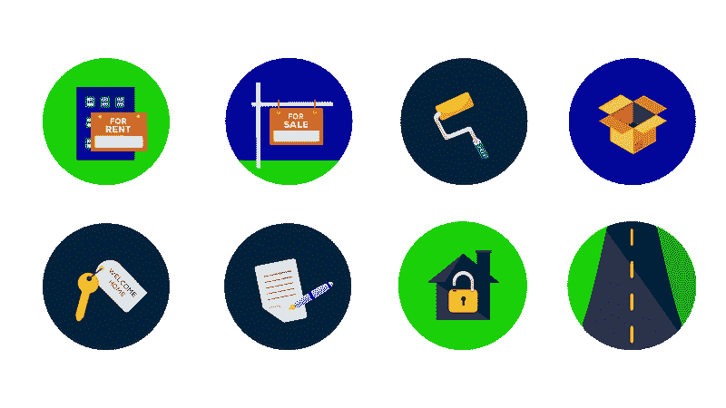
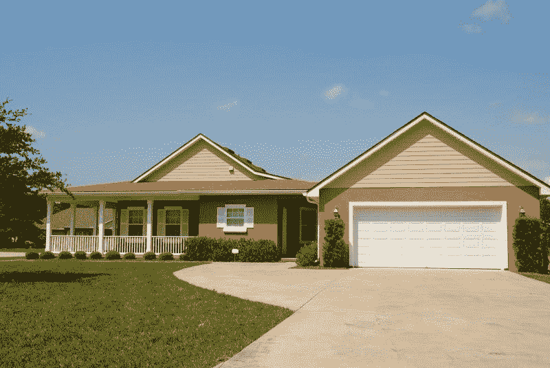

# Zillow 赚钱了吗？—市场疯人院

> 原文：<https://medium.datadriveninvestor.com/is-zillow-making-money-market-mad-house-36d5baef9755?source=collection_archive---------7----------------------->

投资人问 Zillow 赚钱是因为房产信息平台在卖房吗？事实上，对冲基金传奇史蒂夫·艾斯曼[告诉](https://marketmadhouse.com/should-you-be-afraid-of-the-bond-market/)彭博，他正在做空 **Zillow Group(纳斯达克股票代码:ZG)** ，因为它在转手。

“我最大的空头是一家名为 [Zillow](https://www.zillow.com) 的公司，”艾斯曼[说](https://www.bloomberg.com/news/videos/2019-05-09/eisman-says-recession-would-spur-massive-losses-in-corporate-debt-video)。“我认为这是一个有趣的短片的原因是，他们进入了一个新的业务，从他们的基本业务互联网平台公司。他们要去哪里，买房子，然后转手。”

 [## 为什么包容性财富指数比 GDP 更能衡量社会进步？-数据驱动…

### 你不需要成为一个经济奇才或金融大师就能知道 GDP 的定义。即使你从未拿过 ECON 奖…

www.datadriveninvestor.com](https://www.datadriveninvestor.com/2019/03/08/why-inclusive-wealth-index-is-a-better-measure-of-societal-progress-than-gdp/) 

为了澄清，该平台正在测试一项名为 Zillow 的服务，该服务在明尼苏达州的圣保罗等城市提供。在这项服务中，Zillow 购买精选的房屋，并通过当地的房地产中介转售。

有趣的是，艾斯曼长期以来一直对换房的危险感兴趣。事实上，迈克尔·刘易斯的书《大空头:世界末日机器内部》描述了艾斯曼在 2008 年大崩盘前对抵押贷款支持证券的押注。此外，艾斯曼是史蒂夫·卡瑞尔在电影 [*大短片*](https://www.theguardian.com/film/2016/jan/27/the-big-short-financially-accurate-adam-mckay-subprime-money-bale-gosling-pitt) 中的角色基础。

# 史蒂夫·艾斯曼对 Zillow 的看法是对的吗？

我认为艾斯曼的信念是，Zillow 将购买大量它卖不出好价钱的房子。特别是破旧的房子，水下的房子，以及市场上卖不出去的房产。

此外，转手可能会增加 Zillow 的运营费用，超出其承受能力。解释一下，Zillow 将不得不支付所有这些房屋的财产税，如果这些房屋卖不出去，还要支付维护费用。此外，Zillow 可能需要支付出租所有无法脱手的房屋的费用。

因此，我认为 Zillow Offers 看起来像是 21 世纪头十年的翻转计划，假设房屋市场永远存在。显然，抵押贷款危机证明了信念是妄想。

因此，我认为艾斯曼对 Zillow 以及 Redfin、Knock、OfferPad 和 Opendoor 等竞争对手的看法是正确的。可惜 Zillows 2019 年 5 月 15 日的股价；38.28 美元，显示出一些投资者正成为这种错觉的牺牲品。

# Zillow 赚钱吗？

因此，我们需要问 Zillow 是否赚钱，因为这种转手看起来像是管理层急需现金的行为。

相应的，Zillow 去年也没赚到钱。事实上，雅虎！财务部门给 Zillow 的 2018 年运营亏损为-4562.8 万美元，净亏损为-1.1985 亿美元。

此外，Zillow 报告称，2018 年收入为 13.34 亿美元，毛利为 11.80 亿美元。此外，Zillow 在 2018 年 12 月 31 日的运营中仅记录了 3850 美元的现金。与此同时，Zillow 从投资中损失了 6.22639 亿美元的现金，2018 年应收账款现金减少了 1255.6 万美元。

# Zillow 将如何融资？

因此，人们购买的是一家投资亏损的公司的股票，这家公司正在扩大其投资活动。本·格雷厄姆是对的，“市场先生疯了。”

此外，目前还不清楚 Zillow 将如何支付购买房屋的费用。例如，Zillow 在 2018 年 12 月 31 日只有 651，058 美元的现金和等价物，66，083 美元的应收账款和 903，867 美元的短期投资。因此，截至 2018 年底，Zillow 的资产为 18.92 亿美元。

因此，我认为 Zillow 融资的唯一方式是借钱或发行抵押债券。因此，Zillow 正在采用导致 2007 年至 2008 年抵押贷款灾难的商业模式。

# Zillow 会崩溃到什么程度？

不幸的是，Zillow 很容易借钱或发行债券来为其荒谬的翻转计划融资。毫不奇怪，艾斯曼预测债券市场将崩溃，并拖垮像 Zillow 这样的公司。

“你会看到 AAA 级企业债券、高收益债券等出现巨额亏损。，”艾斯曼预测道。“但你首先需要一场衰退。”

可悲的是，在这种情况下，Zillow 可以逃脱其翻转计划，甚至在几年内从中赚钱。然而，一旦出现衰退、加息或房地产价格下跌，Zillow 就会停止赚钱并崩溃。

# 翻转如何伤害普通人

最糟糕的是，炒房会推高房地产价格，伤害普通人。解释一下，Zillow 可以提供高房价，因为它可以以低利率借入大量资金。

因此，普通人被住房市场的价格压得喘不过气来。此外，Zillow 或其债权人可能会被大量无法脱手的房屋套牢。

Flippers 可以一次性将所有这些房屋抛售到市场上，从而压低房价。值得注意的是，这种抛售将压低房地产价值，伤害普通人，尤其是需要出售房屋来筹集现金的老年人。

我认为这可能会造成可怕的痛苦，因为有数百万老年人；或者是婴儿潮一代，背负巨额抵押贷款，没有退休储蓄。这些老年人中的许多人将不得不卖掉他们的房子来筹集现金，因为他们“除了社会保障什么都没有”来生活。然而，这些老年人可能会收到微薄的房屋后，脚蹼完成。

# 是时候禁止翻书了吗？

Zillow Offers 证明，联邦政府可能是时候禁止房地产交易了。

我们应该研究禁止房产交易，因为另一种选择是美联储提高利率。解释一下，美联储可以通过提高利率来给过热的经济踩刹车。如果利率上升，贷款就会变得过于昂贵，人们就会停止借贷。

因此，随着利率的提高，美联储可能会在一夜之间让 Zillow 和其他鳍状肢动物破产。利率上升会使抵押贷款成为更多的支出，从而摧毁房屋价值。

然而，我们可以通过将翻转视为非法来避免加息的需要。实现这一目标的一个显而易见的方法是禁止企业拥有住房。另一个可能是对企业销售的房屋征收 90%或 95%的税。

最后，Zillow 的行为可能违反反垄断法。因此，美国联邦贸易委员会(FTC)可能有权在 Zillow 的收购伤害到任何人之前，叫停它。

# Zillow 是反平台的

我和艾斯曼一样，认为 Zillow 是反平台或无平台的，尽管管理层[声称 Zillow 在 2018 年有 70 亿次观看。为了解释，Zillow 颠倒了平台商业模式。](https://investors.zillowgroup.com/overview/default.aspx)

理想情况下，一个平台通过向用户收取商品或服务的费用来赚钱和创造价值。然而，Zillow 通过提供服务扭转了这一局面；房地产列表，免费赠送。

因此，Zillow 对于每月 1.95 亿访客和 3200 万搜索 doe 租赁单元的人来说是一笔很好的交易，扩展了 2019 年 3 月的散漫估计数。此外，据报道，Zillow 对于使用它的 200 万房地产经纪人来说是一笔极好的交易。

事实上，Zillow 访客可以在 2019 年 3 月查看约 1.1 亿套房屋，扩展了漫无边际的估计。此外，2014 年 11 月 5 日，访问者在 Zillow 上每秒钟浏览 186 个家庭。

# Zillow 如何伤害社区和新闻业

然而，Zillow 对投资者来说是一笔糟糕的交易；谁被标签卡住了，和社区。

澄清一下，Zillow 这样的平台，是不可能让报纸这样的地方信息平台赚钱的。详细来说，房地产上市是报纸的主要收入来源。然而，今天没有人看分类广告，因为更多的信息可以在网上免费获得。

因此，报纸赔钱，最终关闭新闻编辑室，解雇记者。例如，在一个城市，人们失去了 2400 个媒体工作；仅纽约一地 2019 年 3 月，*商业内幕* [预估](https://www.businessinsider.com/2019-media-layoffs-job-cuts-at-buzzfeed-huffpost-vice-details-2019-2)。此外，据商业内幕计算，纽约在 2014 年至 2017 年间失去了 5000 个媒体工作岗位。

# Zillow 如何伤害新闻

在纽约以外，克利夫兰普通经销商*的 41 名新闻编辑室员工于 2019 年 3 月 15 日失去了工作。 *Business Insider* 报道称，这些工作是在 2019 年 5 月计划的 29 个新闻编辑室裁员之外的。*

另外，麦克拉奇公司。该公司旗下拥有《迈阿密先驱报》和《堪萨斯城星报》等报纸，今年将向 450 名记者提供自愿买断。与此同时，美国最大的本地报纸出版商之一 GateHouse Media 正在裁员，人数不详。最后，*达拉斯晨报*于 2019 年 1 月 7 日削减了 43 个新闻编辑室工作岗位，*哥伦比亚新闻评论* [报道](https://www.cjr.org/united_states_project/dallas-morning-news-layoffs.php)。

因此，这条新闻没有被报道，因为报道这条新闻的人正在开车去优步，或者在为他们的房地产考试而学习。结果，透明度从地方政府消失了，越来越多的州政府也消失了，因为没有人报道政客和官僚的活动。

# Zillow 股票一文不值，远离它

归根结底， **Zillow(纳斯达克代码:ZG)** 股票是投资者应该远离的垃圾。例如，Zillow 亏损，不支付股息，我认为市场先生在 2019 年 5 月 15 日将其高估为每股 38.28 美元。

因此，史蒂夫·艾斯曼对 Zillow 的看法是正确的。这只股票的唯一价值在于你做空它的能力。

*原载于 2019 年 5 月 15 日*[*【https://marketmadhouse.com】*](https://marketmadhouse.com/is-zillow-making-money/)*。*