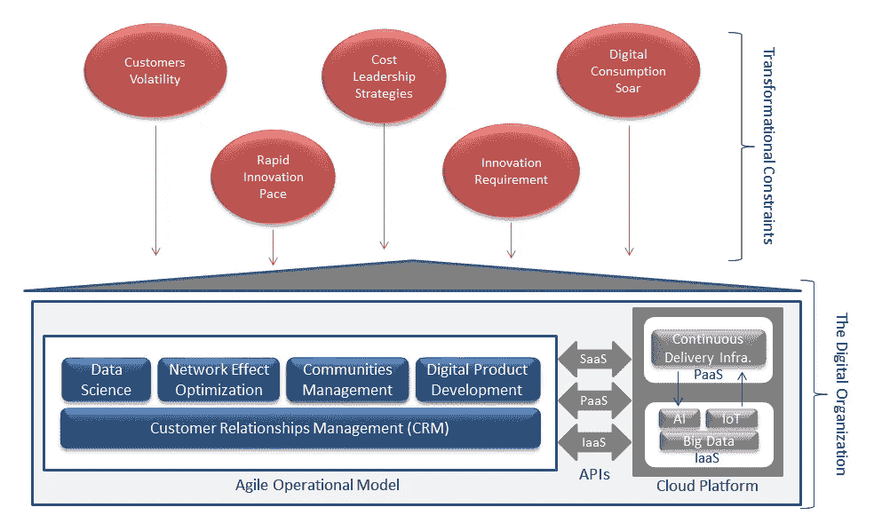
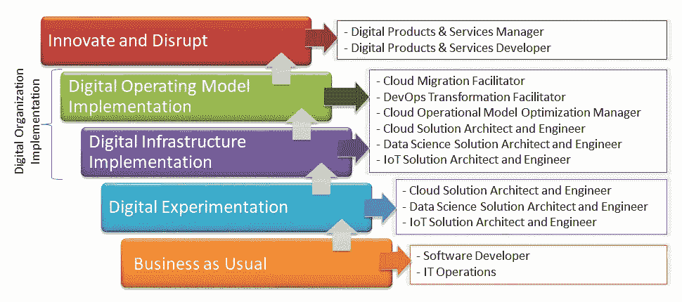

# IT 职业:如何让你的数字化之旅迅速而成功？

> 原文：<https://medium.datadriveninvestor.com/it-careers-how-to-make-the-digital-move-swift-and-successful-6ad21fcd4f60?source=collection_archive---------12----------------------->

全球经济中的数字业务扩张带来了某些 IT 专业人员没有准备好的变化；我看到的是沮丧的技术工人，他们被不得不改变数字技术职业的恐惧所麻痹。

正在发生的是，围绕最近 IT 创新的大规模营销——云计算、DevOps、大数据、容器、微服务、人工智能、区块链——使得新的 IT 格局变得模糊不清；这使得这些员工无法正确评估对其工作和职业生涯的影响，更重要的是，无法采取正确的行动。

 [## 敏捷管理:好的、坏的、丑陋的|数据驱动的投资者

### 公司不断重塑自己，以获得或保持竞争优势和市场份额。这是…

www.datadriveninvestor.com](https://www.datadriveninvestor.com/2019/03/26/agile-management-the-good-the-bad-and-the-downright-ugly/) 

忧心忡忡的科技工作者可以放心了，实现数字化转型并非不可逾越。这与以前的 It 革命没有什么不同，数字技术的影响是一样的，它们使公司的流程有效和高效，它们提高了员工的生产力，并迫使他们适应自己的哲学、原则和实践。

是什么让数字职业转换变得如此复杂？你需要什么来使它成功？有哪些挑战和机遇摆在桌面上？在这篇文章中，我提供了独特的答案和工具，不仅为您提供了关于正在进行的行业数字化转型的宝贵信息，还为您的数字化职业转变提供了指导。

> **小心！IT 供应商不计后果的营销误导了人们对数字技术工作的需求**

科技公司控制市场份额和增加收入的竞争迫使他们过度夸大数字技术的好处。他们的底线是卖，不一定是帮。这使得营销成为一个问题。

让我直说吧，诸如“*云已经成熟，90%投资了 it 的企业收入增加了 40%”，*，*投资了 DevOps 的企业竞争力增加了 70%*，*数字化转型只是为了实施最近的信息技术创新*之类的口号没有反映现实，它们是错误的。

关于云，有见地的调查显示，“[*90%的云投资集中在基础设施上，他们的主要目标是降低 it 开支和加快 IT 运营，希望 IT 能够促进业务发展。*](https://www.ibm.com/blogs/cloud-computing/2014/02/06/top-7-most-common-uses-of-cloud-computing/) "
问题是，在当今的数字商业环境中，快速和持续的创新是关键的竞争优势，但仍有一些人认为实施云基础设施足以赢得市场份额、加快收入增长和增加品牌资产，这怎么可能呢？

对于 DevOps 来说也是如此，仔细观察 90%的企业是如何实施 it 的，可以发现，“*部署连续部署(CD)基础架构受到了很大的压力，好像它本身就足以帮助应对许多竞争挑战。*“再说一次，这怎么可能，仍然有人相信自动化软件部署本身就足以帮助企业与谷歌、亚马逊、脸书、苹果、沃尔玛和其他亚洲科技巨头竞争？

DevOps 是一个典型的例子，说明奢侈的营销是如何有毒的；从"*主要是一种组织开发和 IT 运营工作的新的组织和文化方式，*"现在，它被有意地表现为"*持续部署(CD)基础设施的广泛使用，以加速软件交付。*”

关于云和 DevOps 的信息不仅被夸大了，而且给人的感觉是技术实现工作是唯一需要的。他们不是！今天的云和 DevOps 解决方案架构师和工程师主要是工具(AWS、Azure、Google、OpenStack)专家，而不是预期的数字化转型专家。句号。

在这一点上，关键的要点是，内容营销是数字化职业变化的重要信息来源。但是，请记住，因为他们的主要目标是推广特定的愿景、业务、技术、服务或产品，所以您非常喜欢的信息图、视频、文章、白皮书可能会提供不完整的信息。

> **理解数字颠覆不仅是迈向成功商业的第一步，也是迈向长期有益的数字技术职业的第一步。**

如果你想享受安全、令人兴奋和高薪的工作，拥有行业领先的公司，享受有回报和长期的数字职业生涯，你别无选择，只能了解什么叫做*数字颠覆*。IT 营销已经成为一个时髦词汇，但这一事实不应让人忽视，它是理解大多数行业正在发生的变化及其对工作和职业生涯的影响的关键。

简而言之，数字颠覆是指科技公司利用他们的平台商业模式和他们创造的创新数字产品和服务为客户提供更大价值的过程，这种方式迫使现有企业适应或死亡。

The Digital Organization Model — Credit: Designed and Developed by Philippe Abdoulaye

"*站台*？"你可能会问！了解数字业务的核心概念意味着什么，它如何工作以及如何影响你的行业，这不仅有助于你了解你的未来，还会让你具备成为顶级数字技术专家的一个特征:了解数字颠覆对业务的影响。
简单地说，平台是由市场技术支持的商业模式。它创造的价值涉及到社区中的三个参与者:平台所有者(T3)T4，它促进了提供服务的提供商(T5)和购买服务的消费者(T7)之间的交易。
[*社区*](https://whatis.techtarget.com/definition/virtual-community) 的概念及其相关的 [*网络效应*](https://www.investopedia.com/terms/n/network-effect.asp) 有助于理解科技公司是如何通过扰乱行业来赚钱的。网络效应是指一项服务被使用得越多，它对用户的价值就增加得越多。

如图所示，要想在谷歌、苹果、脸书和亚马逊(GAFA)对公司施加的转型限制中生存并取得成功，企业别无选择，只能转型为数字组织模式。这些限制包括:

*   由于客户被价格合理的创新数字产品和服务所吸引而导致的客户波动；它要求企业实现消费者社区以及保持他们忠诚度的机制。这是社区管理职能的目的。
*   包括 GAFA 在内的科技公司的快速创新步伐迫使企业采用敏捷哲学和原则。这就是对敏捷运营模型感兴趣的原因。
*   GAFA 和其他科技巨头采用的成本领先战略迫使企业寻找加速获取客户和确保收入增长的机制。 [*的用途是数据科学*](https://www.techopedia.com/definition/30202/data-science) 和网络效果优化功能。
*   数字产品和服务消费的飙升迫使公司承认，软件是当今数字业务的中心，投资于优秀的软件开发是必须的。这就是数字产品开发功能的目的。

第二个要点是，转变为数字化组织模式仍将是未来五年的重中之重；它决定了数字时代的 it 工作，它们看起来如何，以及它们将如何影响你的职业生涯。

> **使用数字组织模型来了解数字经济对技术人员的要求，并发现您的职业机会。**

数字技术工作与数字组织模式带来的变化相关，它们分为五个人员配备领域:

*   数据科学，其目标是帮助公司了解其市场、消费者、提供商，并通过从分析数据中获得的见解和知识来不断改进实践和绩效。
*   网络效应优化，其目标是通过鼓励客户消费或为采用、消费和推荐产品或服务提供折扣和激励，加快客户获取并确保收入增长。
*   社区管理，其目标是通过持续跟踪和改善体验来保持高客户忠诚度和参与度。
*   数字产品开发，通过各种云服务利用 DevOps 和 AI、物联网和大数据技术来设计、开发和部署创新的数字产品和服务。
*   云服务管理，其目标是确保云计算基础设施和服务—、 [PaaS](https://www.gartner.com/it-glossary/platform-as-a-service-paas/) 、 [IaaS](https://www.gartner.com/it-glossary/infrastructure-as-a-service-iaas/) —以最佳方式工作，以提供预期收益。

在运营层面上，每个人员配备领域都与两个角色相关联，包括*协调员*，其职责是帮助一组实施者了解他们的共同目标，并帮助他们计划如何实现这些目标；以及*实施者*，其主要职责是根据 DevOps 和云标准实施、测试和部署数字产品和服务。

第三个关键要点是，为了有效应对破坏性行业给他们带来的转型限制，在这些限制中生存并取得成功，企业必须将其数字业务模式构建为五个人员配置领域。在 IT 的操作层面，这些人员配备领域涉及两种类型的角色，包括促进者和实施者。

既然你已经意识到内容营销并不是百分百可靠的，你已经理解了五个转型限制对企业的影响，以及它们是如何转变为人员配备领域以及推动者和实施者角色的，你可能会想，“*我如何找到我梦想中的数字技术工作*？”

> **使用数字化转型之旅模型来发现你的数字技术梦想工作，并建立一个有益的长期职业生涯。**

数字化转型之旅(DTJ)是一个工具，它将帮助你找到你梦想的数字技术工作，并建立一个有益的长期职业生涯。其逻辑是，随着业务自下而上地跨越 DTJ，IT 组织扩展了其流程和实践的数字化成熟度，并且需要新的 IT 角色:

Digital Transformation Journey (DTJ) and Technology Job Opportunities — Credit: Philippe Abdoulaye

正如你所看到的，组织在达到最高阶段之前要经历四个步骤:持续创新和颠覆行业的能力*。*

在*正常业务阶段*，即最弱的成熟度级别，IT 组织的运作方式就好像数字化转型是虚构的，或者对其生存和发展没有威胁。最需要精通瀑布或敏捷实践和 ITIL 的软件开发人员和 IT 运营人员。

在*数字实验*阶段，IT 组织意识到数字颠覆是一个现实，更重要的是一种威胁。启动实验云迁移、DevOps 转型、数据科学(大数据和 AI)项目。需要具备扎实 IT 转型背景的云解决方案架构师、开发运维专家和数据科学专家。

在*数字组织实施*阶段，最具挑战性的是实施数字基础设施和运营模式。
项目主持人、解决方案架构师和工程师对数字颠覆的业务影响有着深刻的理解，在利用技术实现业务优势方面有着扎实的知识，并且精通新兴技术最佳实践，这些人都是焦点人物。

在最后一个阶段，*创新和颠覆*，组织在数字化方面变得成熟；在整个组织中采用数据科学、网络效果优化、社区管理和数字产品开发流程、实践和工具，使公司能够不断创新和颠覆。数字产品和服务经理和数字产品和服务开发人员精通 DevOps 环境下的创新管理和快速产品开发，是最需要的能力。

第四个要点是，如果你想快速成功地改变数字技术职业，过程很简单:

*   查看您所在行业的公司在数字化转型过程中所处的位置。他们处于第一阶段吗？2?3?4?
*   选择你梦想的工作和期望的知识、技能和能力。是辅导员吗？实施者？
*   参加一个在线培训，它不仅会教你工作和相关工具，还会教你快速获得数字技术工作的过程。

> **不要被骗了！许多人教授工具和技术，而不是工作！选择学习工作，因为它也包括工具和技术。**

在线 IT 课程的激增不应该让你认为它们都是好的。越来越多的人力资源经理和招聘经理指出的三个常见问题是:

*   他们专注于工具，对工作细节关注不够
*   它们太长了，而且没有考虑到转行者通常的紧急情况
*   它们不是基于旨在使学习变得简单快捷的教学策略

第五个也是最后一个要点是，品牌、声誉、价格和时长并不能决定有效的在线 IT 课程。在选择课程时，永远记住这一点:*有效的在线 IT 课程让你的学习变得简单快捷，它们让你为工作做好准备*。

获得更多关于需求越来越大的数字技术职位的见解: [DevOps 转型负责人](https://www.udemy.com/learn-devops-reboot-your-career/)和[企业云转型项目经理](https://www.udemy.com/managing-cloud-transformations/)。

祝你的数字技术事业好运！