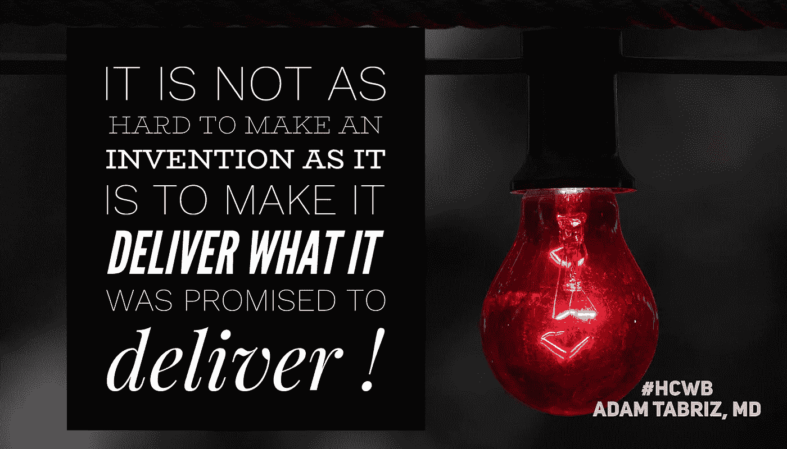

# 创造一项发明并不像让它实现承诺的那样困难

> 原文：<https://medium.datadriveninvestor.com/it-is-not-as-hard-to-make-an-invention-as-it-is-to-make-it-deliver-what-it-was-promised-to-deliver-e6bc30308fbd?source=collection_archive---------11----------------------->

**It is not as hard to make an invention as it is to make it deliver what it was promised to deliver**

M 被引入市场的任何技术和发明；大多数人使用一个与解决医疗保健中的一个问题或一个难题相关的流行词。不幸的是，通常情况下，目标是获得 10 亿美元的份额。这就是所谓的时髦的“淘金热”

> 但是这些发明家是谁呢？
> 
> 他们有资格宣称这样的发明会扰乱市场吗？
> 
> 在我看来，答案是:有也没有。

 [## 大笔资金和尖端技术:人工智能/人工智能投资将如何革新医疗保健…

### 在过去几年人工智能(AI)和机器学习(ML)的显著发展中…

www.datadriveninvestor.com](https://www.datadriveninvestor.com/2018/03/22/big-money-and-cutting-edge-technology-how-investment-in-ai-ml-will-revolutionize-the-healthcare-industry/) 

> 是的，因为他们是唯一被允许跳出框框思考的发明家；不，因为不是所有人都是他们领域的专家。

谈到医疗保健技术发明，医生是临床领域的专家。然而，他们与行业的脱节造成了一个巨大的真空，吸引了一些不太专业的人。它是准确的，而且它会一直存在，除非我们在自己内心修正它，否则它会变得更糟。

医疗保健信息是一项价值数十亿美元的业务。即使软件公司可能有一个令人信服的故事，让医生相信数据是加密的，但相信我，他们是创建软件的人，因此可以访问所有数据。所以读一下细则。

一个开源的应用程序接口(API)系统使我们能够与计算机和网络世界中的其他人联系起来，从而破解管道中的信息。

> 他们说只要我们保密病人的身份，分享其他数据如血压是可以的！

公司和研究团体为这些数据支付了数百万甚至数十亿美元，而这些数据都是患者和他们的医生单独创建的。但仍然无法为患者提供适当的医疗保健和医疗服务。如果我们在个体所有者之间重新分配这些数据，从成本和质量的角度来看，它将解决大多数医疗保健问题。

如果健康数据具有价值，那么患者、医生和提供者将有更多的动力来照顾他们的健康，并以信用换取治疗。他们将有更多的理由即兴创作将数据整合到系统中、加以利用、重新分配和提取的方法。因此，构建的技术将更符合他们的需求。

因此，在现实中，当前的技术只能解决公司的业务需求，而这些公司的发展只有一个中心焦点。那就是挖掘数据，从大数据中获利，快速创收。这是医生被动的可悲后果，导致提供给他们的实践的不合适的解决方案，导致医生的失败和不信任。这一趋势造就了 21 世纪少数大型企业实体的奴役。

> **这需要停止**
> 
> 我们正滑向自我毁灭。

医疗服务的质量必须在医疗系统的基础上进行评估和验证，即医生和患者的会面。负责人应通过自下而上的方法实施质量保证，而不是；典型的自上而下的方法意味着官僚主义和一些一刀切的措施。

> 我们必须当场奖励质量！

医生和病人需要对他们的关系负责。技术需要经过医生和医疗保健提供者的适当验证。它还需要患者根据他们的要求进行验证。它必须是透明的，他们必须通过透明的方式让其他人承担责任。

技术不仅仅奖励企业主。它需要对游戏中的每个人都有回报，需要每个利益相关者的贡献才能获胜。除非医生走出他们的舒适区，并要求真正属于他们的东西，否则医疗保健将在未来数年内遭受痛苦，并因公司化而失去个性化。

# 解决方案！

我们必须定制策略，以适应特定实践中每个患者和医生的需求。

我们需要实施几十年前没有的正确的技术、流程和资源。

我们需要支持精准医疗和个性化医疗，并从基于人口的医疗保健转型。这就像是争夺资源控制权的地盘之争。

我们需要走出困境，重新组织起来，自救。

如果我们敞开胸怀接受变革，并作为一个团队共同努力，我们将会取得胜利。

为患者提供对其记录的完全访问权限，并通过定制用户体验提供上述访问权限的身份认证能力，以实现流畅、完美的交流。

让我们创建一个以患者和提供者为核心的利益相关者可以快速方便地访问所有资源的环境，并提供一个全面、透明、易于每位医生理解的战略，然后是客观反馈和纠正行动计划。