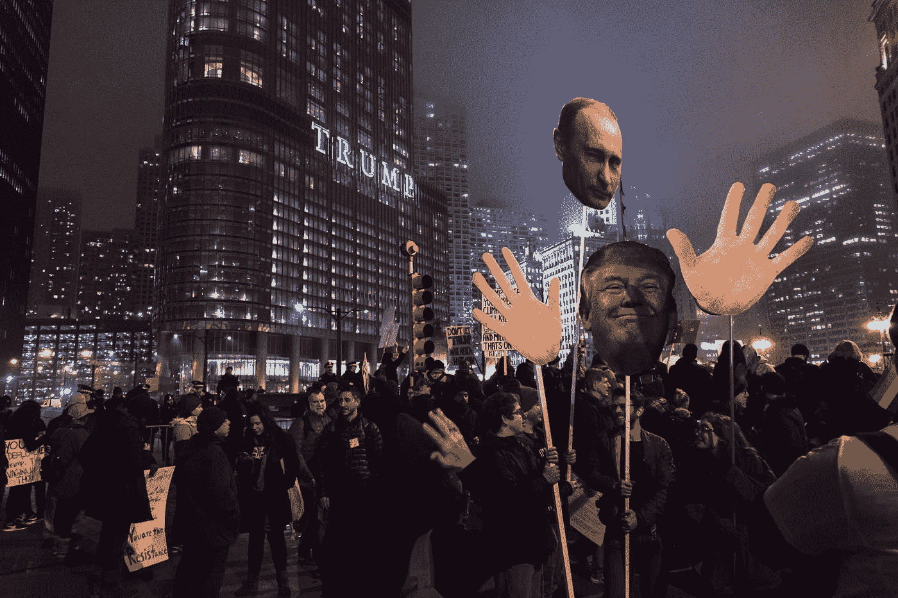

# 美国人民是时候给特朗普一个合适的绰号了:“本尼迪克特·唐纳德”。

> 原文：<https://medium.datadriveninvestor.com/it-is-time-for-the-american-people-to-give-trump-an-appropriate-nickname-benedict-donald-a790e4d75048?source=collection_archive---------6----------------------->

用这个名字是不是对本尼迪克特·阿诺德太侮辱了？

Photo by [rob walsh](https://unsplash.com/@robertwalsh0?utm_source=medium&utm_medium=referral) on [Unsplash](https://unsplash.com?utm_source=medium&utm_medium=referral)

在过去的几年里，特朗普给许多人起了不恰当的名字。这些名字包括波卡洪塔斯、瞌睡虫乔·拜登、滑头詹姆斯·科米、歪希拉里和低能杰布。这份名单并不完整，但这没关系。重要的是，我们的总统就像一个在校园操场上的五年级学生，给每个他不喜欢的人起了一个侮辱性的名字。这并不好笑。据说一个 70 多岁的男人永远不会超过 11 岁。更糟糕的是，尽管他比对手少获得三四百万张选票，我们美国人民还是以某种方式选了他。最糟糕的是，我们的参议员和众议员仍然支持这个人，尽管很明显，如果对他有利，他会出卖自己的国家。

为了使这个故事简短，我不打算详细谈论特朗普的许多指控罪行。参见我的故事 [*特朗普必须被弹劾的宪法理由*](https://medium.com/swlh/the-constitutional-reasons-that-trump-must-be-impeached-179cf4071dd2) 和 [*36 条特朗普不适合当总统的理由*](https://medium.com/datadriveninvestor/36-reasons-trump-is-not-fit-to-be-president-bf151aadd0d0) 了解更多关于特朗普的诸多劣迹。穆勒的报告很重要，但这个来自历史的令人不寒而栗的教训更重要，或者阅读辛克莱·刘易斯的书，这不可能发生在这里。我不是在这里推销我自己的故事。我只是不想重写已经为这个故事写好的东西。

 [## 保护主义、政治和经济动荡|数据驱动的投资者

### 美国股市昨日出现 400 多点的大幅反转，为未来的事情发出了警告信号。市场…

www.datadriveninvestor.com](https://www.datadriveninvestor.com/2018/06/28/protectionism-politics-economic-turmoil/) 

唐纳德·特朗普和本尼迪克特·阿诺德之间有很多不同之处。本尼迪克特·阿诺德是一名勇敢而称职的士兵。特朗普是一个依靠骨刺从越南战争中脱身的懦夫。没有本尼迪克特·阿诺德最初的帮助，美国可能无法熬过美国革命的最初几年。本尼迪克特·阿诺德在萨拉托加战役中对美国的胜利起了重要作用。只是在美国在萨拉托加战役中取得胜利之后，法国人才认为这场革命足够强大，他们才会与美国结盟。没有法国人，革命可能不会成功。特朗普为他的国家做过什么？至少本尼迪克特·阿诺德为美国做了些事情。除了自己，特朗普为别人做过什么？本尼迪克特·阿诺德是在为美国而战时受伤的。如果特朗普在战斗中受伤，他会起诉美国让他陷入如此危险的境地。所以，没错，用本尼迪克特·唐纳德这个名字称呼特朗普，对本尼迪克特·阿诺德比对特朗普更侮辱。

在周日节目中观看特朗普的辩护者时，我注意到林赛·格雷厄姆(Lindsay Graham)和鲁迪·朱利安尼(Rudy Giuliani)等律师有一个共同点:他们在法学院教授“法律”的那天肯定忘了去上课。或者，他们可能只是想侮辱美国人民的智慧。我将指出这些人提出的一些谎言或无知之处。首先，最新的特朗普丑闻不需要任何交换条件，因为它可能会根据贿赂法规或宪法的薪酬条款受到起诉。第二，有一个隐含的交换条件。当特朗普在乌克兰总统提到导弹后说他需要“帮助”时，这是一种交换条件。如果需要明确的交换条件，很少有人会在贿赂或勒索审判中被定罪。第三，Graham 和 Giuliani 在开始使用“道听途说”这一术语之前，需要查看联邦证据规则(FRE)第 803 条和依据该规则的判例法[《FRE 规则》第 803 条](https://www.law.cornell.edu/rules/fre/rule_803)显示了传闻规则的许多例外。第四，川普确实有权在审判中与原告**对质。总统没有权利在他选择的任何时候与原告对质。如果是这样的话，恐吓证人会更加普遍。总统的辩护者出现在周日的脱口秀节目中只有一个原因:迷惑公众。特朗普的捍卫者知道他们在说完全愚蠢的话。**

一个非常重要的事实是，在穆勒在国会作证后的一天，特朗普向乌克兰总统打了这个电话，但这个事实几乎被忽略了。特朗普知道听证会进行得不顺利，并认为这是针对他的努力的结束。一旦他感到一丝宽慰，他就露出了他的真面目，并做了穆勒调查所寻求的事情:他试图与外国合谋反对美国大选。

有非常有力的证据表明，特朗普在 2016 年大选中援助了外国势力俄罗斯对美国的攻击。他从交易中得到了什么？他在那些选举中得到了他们的帮助。俄罗斯想要什么？俄罗斯希望解除制裁。从迈克·弗林在过渡期间的努力开始，特朗普多次试图推迟制裁或取消制裁。只有在国会施加压力时，他才会对俄罗斯采取强硬态度。他为什么要帮助乌克兰对抗俄罗斯？他会帮助乌克兰对抗俄罗斯的利益，因为骗子之间没有荣誉可言。此外，俄罗斯人可能不认为我们给乌克兰人的少量援助是一个严重的威胁。

特朗普认为乌克兰人有他需要的东西。特朗普在所有针对许多民主党总统候选人的知名民调中远远落后。他绝望了。人们需要问自己，如果他逃脱了惩罚，他下一步会做什么？为了将个人利益置于美国安全之上，特朗普会不择手段吗？

特朗普的传记作者大卫·凯·约翰斯顿说，特朗普讨厌被直呼其名。特朗普已经为他的 2016 年和 2020 年竞选寻求外国帮助。换句话说，他愿意帮助外国势力攻击美国。**是时候让 Trump 尝尝自己的劣药了。该是他得到自己的侮辱性绰号的时候了。考虑到特朗普的许多罪行至少接近叛国，本尼迪克特·唐纳德这个名字是特朗普的完美昵称。**