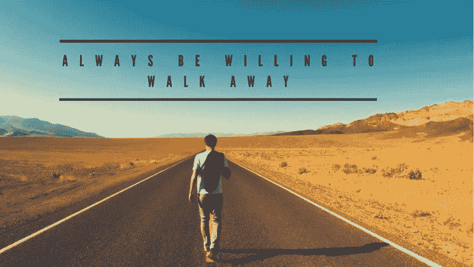
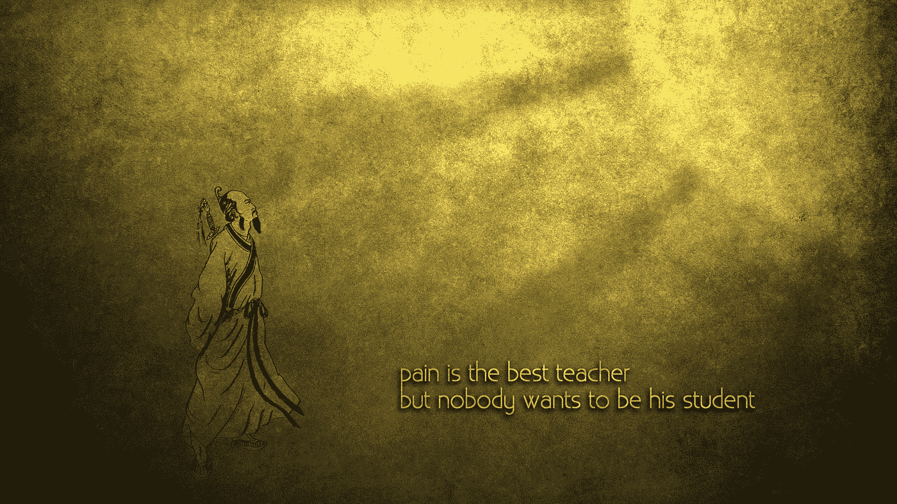
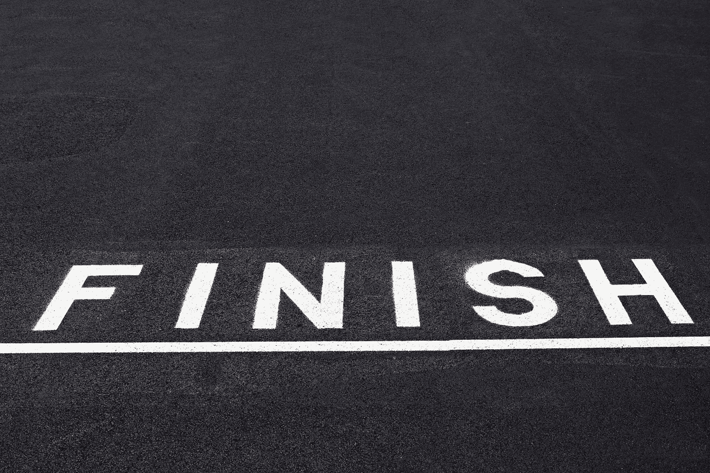

# 走开需要力量

> 原文：<https://medium.datadriveninvestor.com/it-takes-strength-to-walk-away-ca347dfe4816?source=collection_archive---------0----------------------->

Have The Strength and The COURAGE To Walk Away

把自己拉出困境需要力量——当人们试图把你拖进他们已经习以为常的有毒黏泥中。当有人试图把你拖进黑暗和消极的过去时，走向光明的未来需要生活的力量。

当人们不顾一切地让你停滞不前，困在一个地方时，离开是需要力量的。在一个害怕做自己的世界里，做自己需要力量。

 [## 幸福的算法？-数据驱动型投资者

### 从一开始，我们就认为技术正在使我们的生活变得更好、更快、更容易和更实用。社交媒体…

www.datadriveninvestor.com](https://www.datadriveninvestor.com/2019/03/08/an-algorithm-for-happiness/) 

对我来说，走开有时感觉像是我在犯傻。我成了受气包。我是一个…懦夫或弱者。

我经常问自己:

“他们凭什么这样对我？”

***“他们是谁，竟然想毁掉我的生活？”***

他们是谁来破坏我的形象和名誉？

有时，当我继续思考人们对我做的错事时，我发现这对我的情绪状态极具破坏性。

Become a student.

我们都不喜欢在生活中受到伤害(*我们当中有健康心态的人*)，但正是在痛苦、羞辱、失望、虐待、诽谤和不合理、不公正的仇恨中，我找到了力量。

坚强不是为了反击…而是为了前进。

看，我逐渐明白的，也是生活不断教给我的，力量不在于战胜别人…而在于战胜我们自己。

当一个人辱骂你并试图破坏你的形象时，这是一个信号，他们对自己的身份感到非常难过。我们知道这是显而易见的，因为当你快乐时，你希望别人快乐。当你难过的时候，你希望别人也难过。

“I’m Not Beautiful.”

人们倾向于把他们对自己的感受投射到别人身上。这不是什么新鲜事，而是社会大部分人完全不知道的事。

大多数人都有一种病态的渴望，想要比别人更好，这样他们就可以膨胀他们脆弱的小我(这不是一种辩论式的说法，而是任何心理学家都能发现的事实)。

当有人抨击你时，那是他们试图控制你的方式。他们试图从精神和情感上控制你。

如果他们能让你心烦意乱或焦虑不安，他们会觉得自己很强大。如果他们能让你关注他们，他们会觉得自己更重要。如果他们能让你实现你的梦想和目标，他们会觉得自己成功了(尽管他们实际上没有做任何建设性的有成效的事情)。

生活中大多数人都明显缺乏安全感。

我们都有一个消极的喋喋不休者，这可能是我们在生活中培养出来的(我说“ ***”可能*** “这里有许多精神障碍，为某些人创造了这种消极的喋喋不休者”)，可能来自我们的父母、兄弟姐妹、老师、“*朋友*”、“*配偶*”或“*恋人*”。人们有一种倾向，试图贬低你，这样他们就可以对自己感觉更好。

> *“如果我能让你看到* ***你的*** *瑕疵你就看不到地雷了。”*

这就是我所说的离开需要力量的地方。

想象一下，一个人和其他人一起跑马拉松。

但是对于这个人来说，他的腰上绑着一根绳子，这让他慢了下来。

这根绳子系在他身后的人身上；他的仇人，他的巨魔，他的扭曲的崇拜者(因为我们都知道仇人只不过是把自己的崇拜和爱与仇恨和嫉妒混淆了的人)。

然而，尽管他们试图阻止他，他还是跑了。

> 他跑…不是为了赢得比赛…而是为了完成*的比赛。*

*当他继续跑马拉松时，他身后的人让更多的人在场边凑钱，帮助他们的观众试图阻止跑步者。*

*尽管如此，决心跑完全程的跑步者不会回头看他们嘲笑他。他没有回头看他们得到更多的人。他没有回头看他们，试图提醒他有多少人……***反对他*** 。*

> *他不断向前推进。他一直向前看。他一直在前进。*

*尽管他可能不是第一名，但他还是赢了。*

**

*Keep your eyes on the prize*

*为什么？*

*因为这是一场马拉松… ***而不是赛跑*** 。*

*除了他自己，他不与任何人竞争。*

*他身后有一群人。*

*然而，他们仍然不能阻止他成功实现他的目标。*

*这就是我们的生活。*

*我们会有仇人。我们将会有阴谋家。我们会有很多人在生活中反对我们。*

*以及在生活中与我们作对 ***当我们不…甚至不知道…他们是谁*** 。*

*但是…*

*真正的力量不在于战胜大众，而在于战胜你自己。*

*屈服于他的愤怒和暴怒的人和大众没有什么不同。*

*如果这个故事中的那个人停下来与暴徒战斗，他永远也不会完成比赛；这正是他们想要的。*

*这就是我们的生活。*

*当人们试图用“我记得你什么时候这样做了”来阻止你的生活时*

*继续前进。*

*当人们试图阻止你的生活梦想时。*

*把它当成一条弯路，继续前进。*

*当人们诋毁你的竞选活动并试图暗杀你的时候。*

*让他们破坏他们的形象 ***认为*** 你是谁。*

*永远不要让他们毁掉你的真实性格。因为那…那是你真正失去和死亡的时候。*

*当这个世界试图阻止你的时候…最好的事情和唯一要做的事情就是…*

> *走开。*

*昂首离开。*

*你的自尊完好无损。*

*你的性格没有被那些没有成长和变得更好的欲望的有毒物质所标记。*

*在生活中向前走需要更多的力量…当你有一个 ***世界……***试图阻止你的时候。*

# *走开需要力量*