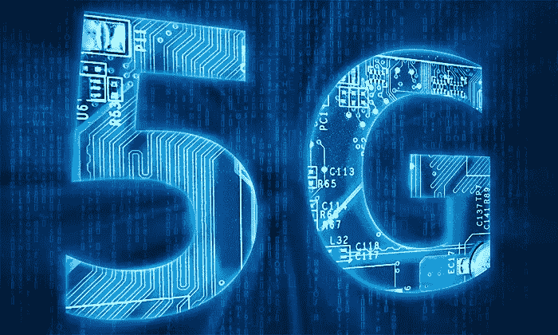

# Italy Helps Out the United States With 5G Technology Given Shaky China Relationship

> 原文：<https://medium.datadriveninvestor.com/italy-helps-out-the-united-states-with-5g-technology-given-shaky-china-relationship-afeccb2d9de2?source=collection_archive---------8----------------------->

## Aren’t those Italians so nice?

5G mobile technology certainly continues to make headlines all over — everything from [Germany’s bid](https://vigyaa.com/@pierre/5g-mobile-technology-getting-competitive-thanks-to-germany-bid-8c49d34d/), to [Verizon Wireless](https://vigyaa.com/@pierre/verizon-wins-with-5g-launch-in-chicago-and-minneapolis-4551ed2b/) and who knows what else might show up on someone’s radar. Long story short, everyone’s interested in just what 5G will do for the world as the world continues to hold a cellphone that needs to stay reasonably connected in ways that involve more than just calling or texting someone. These days we absolutely need to be able to surf the web, video call, stream and more, and while 4G served quite well, the newest [millennials](https://vigyaa.com/@pierre/the-millennial-how-technology-drives-the-younger-generation-towa-6e29a1e4/) and Gen’ Z’ers ache for something even bigger and better.

 [## The Path of Mobile App Development in 2019 - Data Driven Investor

### Anyone who works in the mobile app development industry, whether they focus on developing iOS apps in London or…

www.datadriveninvestor.com](https://www.datadriveninvestor.com/2019/01/15/the-path-of-mobile-app-development-in-2019/) 

# Of Course, the United States Has Been Running Into Some Issues Regarding Huawei and the Tension With China

So Italy has, in fact, stepped in to offer some strategic interests, easing U.S. concerns over a planned accord on Rome’s plans for infrastructure in agreement with China. What Italy will be planning to do is require private and public companies to notify the government of 5G technology purchases from non-European providers.

It’s simply called a “golden share” of powers. The Italian government can then actually veto any purchases from outside providers, such as in China or anywhere else, and keep everything balanced as to who has a piece of the 5G pie that’s bigger, or “tastier” if you will.

We can expect this to be approved very soon as Italian Prime Minister Giuseppe Conte will be signing a memorandum of understanding upon Chinese President Xi Jinping’s visit.

# What Is the United States’ Issue With Those 5G Purchases, Though?

Simply put, it’s all about *cyber-security* for the most part. Given the happenings recently regarding everything from cyber-attacks to hacks and more, naturally many businesses and not just the American government are concerned with a monopoly occurring regarding 5G mobile technology. Italy supports and shares that concern as well and has taken appropriate steps to ease the tension. We’re thinking, too, it probably wouldn’t hurt to include some authentic pizza and lasagna as well!

对 5G 有什么想法？ [**注册免费 VIGYAA 账号，开始发布！**](https://vigyaa.com/accounts/login/) [**请务必查看《数据驱动投资者》了解更多技术见解！**](http://datadriveninvestor.com/)