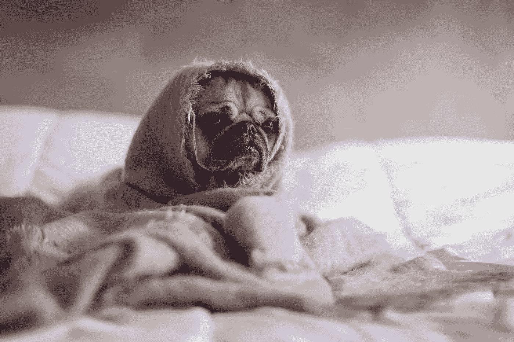
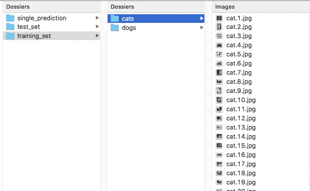
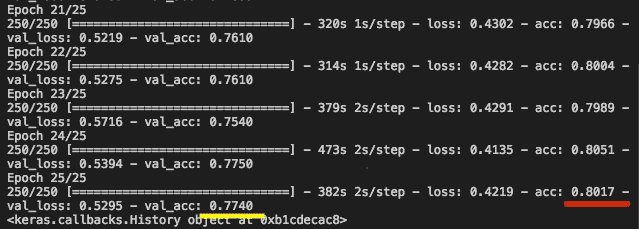
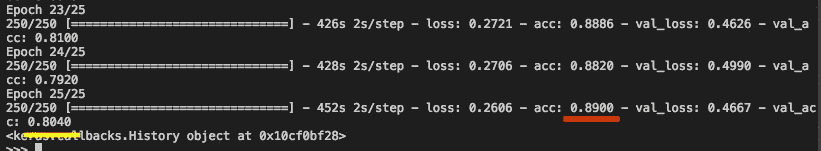
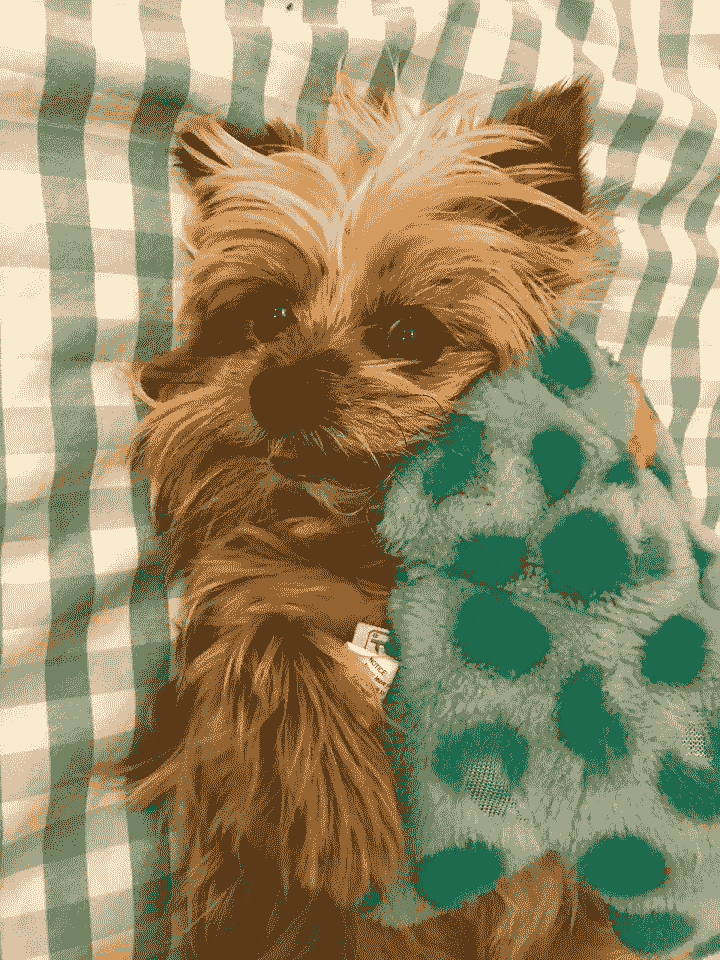
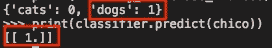

# 是狗还是猫？卷积神经网络简介

> 原文：<https://medium.datadriveninvestor.com/its-a-dog-or-a-cat-intro-to-convolutional-neural-networks-61d98c63d8c?source=collection_archive---------3----------------------->

从 2020 年 6 月起，我将不再使用媒体发布新故事。想继续看我的文章请访问我的个人博客:[*https://val lant . in*](https://vallant.in/)*。*

在你的手机上，在你的电脑上，很快就会出现在你的自动驾驶汽车上。卷积神经网络(CNN)是你电脑的眼睛。有了它们，机器就能“看见”物体，并告诉你它们在图像上认出了什么。了解 CNN 如何使用的一个很好的方法是看下面的视频。

这很酷——如果你想到科技是如何被利用的，这也很可怕。但这是真的。所以今天，我们将通过教我们的计算机回答这个问题来对 CNN 做一个简单的介绍:这是一只狗还是一只猫？

# CNN 是如何工作的？

卷积网络的工作原理是将图像上的像素转换成机器可以理解的信息。图像识别涉及的步骤有:

*   盘旋
*   联营
*   变平
*   全连接层

## 盘旋

第一步叫做卷积。在阅读一个图像时，CNN 会尽量简化它。它将接收输入图像，并使用一个过滤器，也称为**特征检测器**来寻找对识别图片很重要的特征。然后，它创建一个**特征图**，显示图像中最重要的部分在哪里。

这些特征是由机器选择的，对人类来说不一定重要。

比方说，对我们来说，识别狗的重要特征是它们的眼睛和下巴。对于计算机来说，可以是 nose 格式。这里保留什么？实际上，你不必为电脑选择功能。网络会根据它认为重要的事情自己做，而不是你。

## 联营

一旦特征检测器创建了特征图，它将创建一个**汇集的特征图。第二张地图是第一张的简化版。它仍然显示图像中最重要的区域，但以压缩的方式显示。**

## 变平

我之前没有提到的一件事是，地图是以二维矩阵的形式创建的。但是为了解释图像，计算机会将矩阵转换成矢量。这是展平步骤。

向量实际上是提交给神经元网络输入层的信息。

# 创建网络

网络创建实际上非常简单明了。我在从 A 到 Z 的课程[深度学习](https://www.udemy.com/le-deep-learning-de-a-a-z/learn/v4/overview)中复制了哈德林·德·庞特维斯和基里尔·叶列缅科提出的相同步骤(顺便说一下，这真的很好)。

如前所述，让我们尝试训练一个网络来发现图像上是否有猫或狗。作者使用的数据集和完整代码可以在他们的网站上找到，[这里](https://www.superdatascience.com/deep-learning/)。我们将使用第二部分“卷积网络”的文件。

这里一个有趣的细节是，作者解释说，预处理阶段始于你组织数据集的方式。在 CNN 的情况下，我们将不再使用表格。相反，我们将使用包含大量猫狗图片的文件。以下是文件夹结构:

所以，一旦你的电脑上有了这些文件，就该开始创建网络了。让我们首先用`Sequential()`类初始化 CNN。

然后，我们必须添加卷积层。这一层将把图像转换成每个像素的数字矩阵。然后，我们必须应用特征检测器来创建特征图。

我们将在这里使用`Conv2D`函数。该函数的第一个参数是我们想要创建的特征检测器的数量。我们将选择 32，因为这是开始第一层的标准。但这是一个试错的过程。如果你愿意，可以试试其他号码。

第二个参数是特征检测器的尺寸。步幅告诉我们必须移动特征检测器的像素数。输入 shape 参数指定图像的颜色数量(BW = 1，color=3)。

在同一个论点中，我们还指定了图像的大小。这很重要，因为我们有许多不同格式的图像。计算机需要对所有图像应用标准格式(这里是 64 x 64)，这样一切都变得一样。

对于激活函数，让我们选择 ReLu 来为我们的模型添加非线性。

下一步是汇集阶段。这里，我们将使用未来地图创建一个汇集的要素地图。最后一个将简化特征地图，使其更小。我们这样做是为了减少网络上神经元的大小，因为神经元越多意味着计算时间越长。

现在，是时候进入扁平化阶段了。在这一步，计算机将采取汇集的特征地图，并将其转换成一个矢量。我们不需要在这里指定任何参数。

在这之后，我们添加完整的连接层。在这里，我们指定了单元的数量，即该层中神经元的数量。这里用 128 吧。作为激活，我们也将使用 ReLu 函数。然后，我们添加输出层，只有一个神经元(因为我们的问题是只有一个二元变量的分类)。

一旦我们完成了，让我们编译网络。我们首先要选择使用哪种梯度算法。然后，我们必须选择损失函数(让我们使用二进制交叉熵，因为我们有一个二进制输出变量的分类问题)，然后我们测量性能。

避免模型过度拟合的一种方法是提供大量数据，以便它可以更好地训练并推广新数据。然而，查找数据并不总是容易的。创建新数据的一种方法是使用`ImageDataGenerator`函数从现有图像创建新图像。该函数对图像进行变换，如旋转、收缩等。然后它们被传送到网络，网络认为它们是新的图像。

最后要做的是拟合模型，同时使用测试集生成预测。我们通过使用函数`fit_generator`来实现。注意这里的两个论点:`steps__per_epoch`和`validation_steps`。为了计算步骤的数量，我们将训练集和测试集上的条目数量除以我们在最后一步中定义的`batch_size`。

顺便说一下，在执行下面的代码之前，要知道执行起来要花很多时间。所以，你可能想在晚上或者你有其他事情要做的时候做。

这是结果:

现在你有了一个训练有素的模型，能够识别猫和狗(或者差不多)。请注意，每次迭代后，精度都会发生变化。你需要注意的是红线和黄线。红线显示训练精度，而黄线显示实际精度，即模型在测试集上进行预测后得到的精度。如果值相差太大，则可能存在过度拟合问题。

如果我们能做得更好一点呢？为此，让我们添加第二个卷积层。我们将努力在不过度拟合的情况下获得更高的精度。为此，在步骤 2 和 3 之间添加以下代码。

结果是…

现在，我们对测试数据集有了更好的准确率:80%。但是，训练集的准确率也提高到了 89%。这可能表明有些过度拟合。

我们刚刚实现了目标的一部分。但这是可以的！例如在 ann 的例子中，有无限的方法来改进我们的模型。我们可以添加更多的图层，在`target_size`上调整图像大小等等。

# 奇科是狗吗？

让我们现在做一些有趣的事情。我给我的狗奇科拍了一张照片，并提交给我的网络，看看它是否能够检测奇科是狗还是猫。下面是我用的图片:

代码如下:

这是结果:

可以看到，网络定义猫为 0，狗为 1。最后，你得到了它对奇科的预测，1。所以，它能够检测到我们有一只狗在照片里！

然后*瞧啊*。现在你知道如何实现一个基本的 CNN。这不是很难，不是吗？如果你有时间，也读一读 ann 的文章介绍:

 [## 人工神经网络和深度学习的实践介绍—第 1 部分

### 人工神经网络(ann)并不新鲜，但现在它们成了下一件大事。而且这不是偶然发生的…

medium.com](https://medium.com/@wilamelima/a-hands-on-intro-to-deep-learning-690d1354bfc4)  [## 人工神经网络和深度学习的实践介绍—第 2 部分

### 第 1 部分在这里:

medium.com](https://medium.com/@wilamelima/a-hands-on-intro-to-anns-and-deep-learning-part-2-d776d6a93d21)