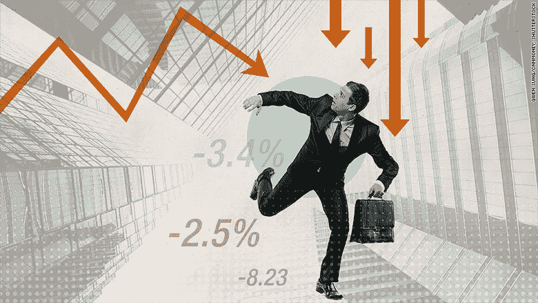
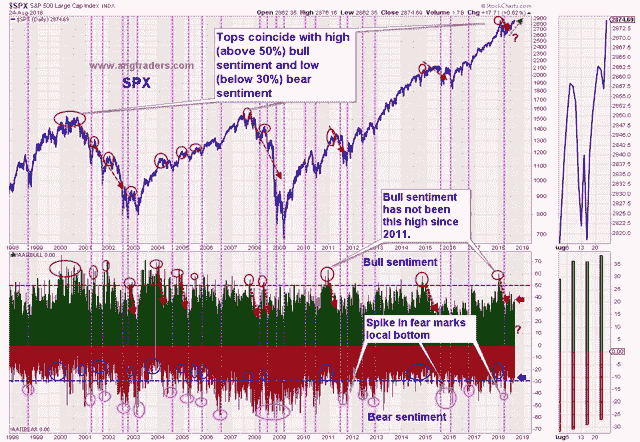
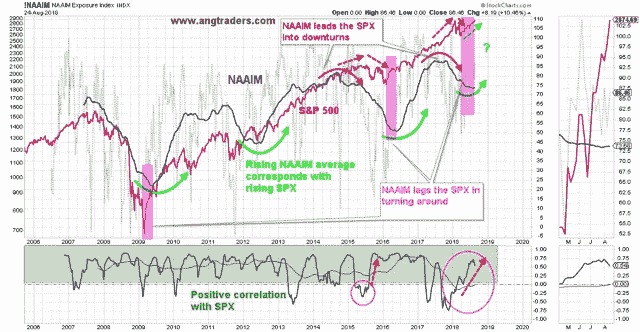
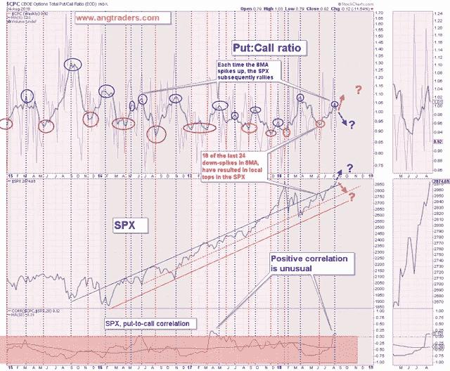
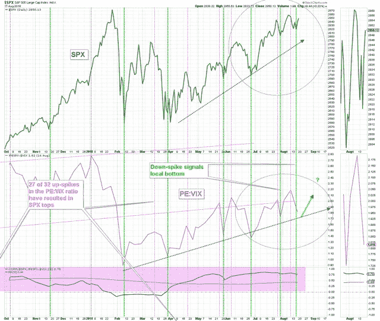
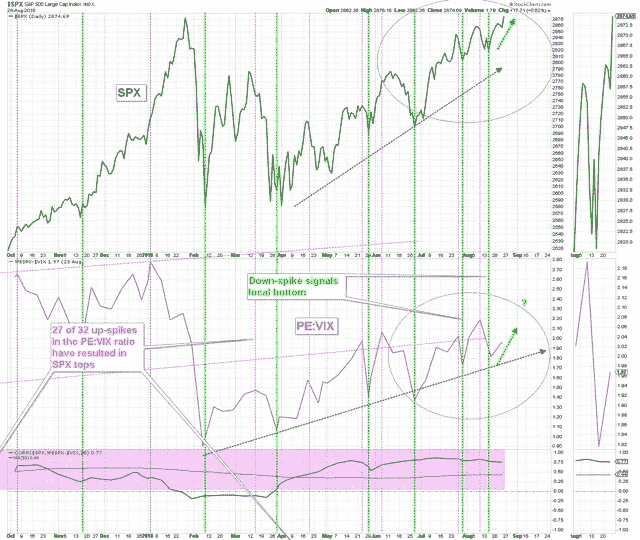
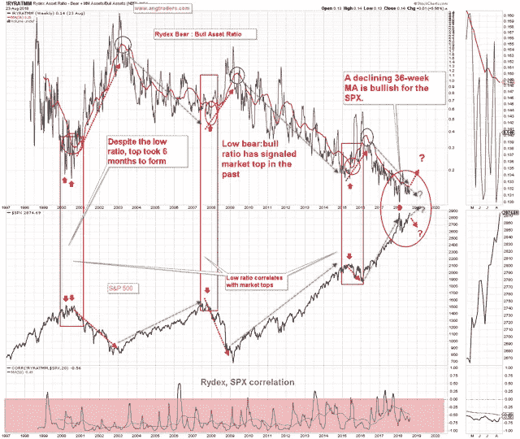

# 这都是因为恐惧

> 原文：<https://medium.datadriveninvestor.com/its-all-about-fear-b8d4b0742e53?source=collection_archive---------21----------------------->

试图给市场波动找原因是浪费时间。市场系统既复杂又混乱；复杂是因为有太多的变量，混乱是因为，即使我们了解所有变量是如何相互作用的(我们并不了解)，我们也永远无法知道所有变量的初始条件，这使得市场看起来像是混乱的。

新闻，无论是地缘政治新闻还是财经新闻，都不会与市场走势一致相关；有时候，坏消息有积极的作用，好消息也有不利的作用。新闻根本不重要！唯一不变的因素是恐惧的情绪…害怕失去…害怕错过(贪婪)。这一点永远不会改变。

人类的情感会在市场中留下重复的模式。我们需要找到这些模式，听听他们在说什么。

# 基于情感的模式

**AAII**

AAII 情绪调查显示只有 38%的人看多，市场转向的风险很小。**大多数市场在牛市情绪超过 50% *和熊市情绪低于 30%时才会见顶。市场对这一点成为市场顶部的担忧太多了(见下图)。***

**NAAIM**

美国国家积极投资经理协会(NAAIM)50 周 MA 敞口指数领先于市场下跌，落后于市场上涨。它变平了，并开始回升。这是一种在市场反弹开始时出现的模式，而不是在反弹结束时出现的模式(见下图)。

**卖出买入比率**

卖出看涨期权比率与 SPX(标准普尔 500)有很强的负相关性；8 周均线的向下尖刺表示市场的顶部，向上尖刺表示市场的底部。6 月初形成了一个向下的尖峰，标志着 SPX 的局部高点，此后，市场下跌，直到 6 月的最后一周。

从那时起，直到上周，8 周均线一直在上涨，这通常与 SPX 的下降相关，但这一次，SPX 随着看跌期权比率而上涨。本周，8 周均线出现上涨(蓝色椭圆形，最右边)，有将近 100%的概率出现反弹(如下图)。

PE:VIX

标准普尔 500 的市盈率与波动率指数(PE:VIX)之比与标准普尔 500 有很强的直接相关性；该比率中 85%的上涨峰值对应于当地市场顶部，而将近 100%的下跌峰值对应于市场低点。

上周我们写道:

> 过去的一周，一个向下的尖峰形成，暗示从这个点开始的反弹(如下图)。

这是本周的体育:VIX 图表:

这仍然是一个看涨的模式。

**VIX**

波动指数(VIX)本身与标准普尔 500 有很强的反向相关性；VIX 的下跌与市场高点相关。正如我们几周前所说的，目前的 VIX 形态有上升的潜力，但不会改变整体的看涨形态。然而，市场一直在不断上涨。这与我们在 9 月 17 日至 1 月 18 日的强劲反弹中看到的模式相似。上周，我们声明“这支持了市场将更早而非更晚达到新高的观点”，事实也确实如此(见下图)。

**Rydex 熊:牛资产配置比例**

Rydex 基金家族的熊市-牛市资产配置与 SPX 指数有很强的负相关性；Rydex 比率的 36 周 MA 下降对 SPX 有利。比率的下降，对应于市场的顶部。在其他每周总结中，我们指出了当前牛市的交易模式与 2000 年科技股牛市的相似之处。在科技股上涨的后期，Rydex 比率(名义)在 2000 年初出现下降，但 36 周 MA 继续走低，而 SPX 在达到第二个(也是最后一个)高点之前又上涨了 6 个月，Rydex 比率出现了第二个(也是最后一个)下降。看起来这种模式又开始形成了。

本周我们看到了 SPX 的新高，Rydex 熊牛比的 36 个月 MA 继续走低(如下图)。这仍然是一个看涨的模式，如果市场走弱，这不是你所期望的(见下图)。

所有上述模式都与牛市中普遍存在的潜在市场情绪相关。地缘政治或金融新闻甚至都不在考虑之列。**我们正处于本轮牛市的末尾*而非*。**

**我们为我们的用户提供独特的视角，这是我们在过去 40 年中形成的，这有助于我们站在市场的“正确一边”,远离人群。**

**特别通知:从 2018 年 9 月 5 日起，我们的订阅费率(仅适用于新订户)将为每月 50 美元或每年 400 美元。**

**我们邀请您在 2018 年 9 月 5 日之前加入我们，目前的价格为 30 美元/月或 240 美元/年，只要保持会员资格，这一价格就不会增加。**

**昂商**

在 www.angtraders.com 加入我们