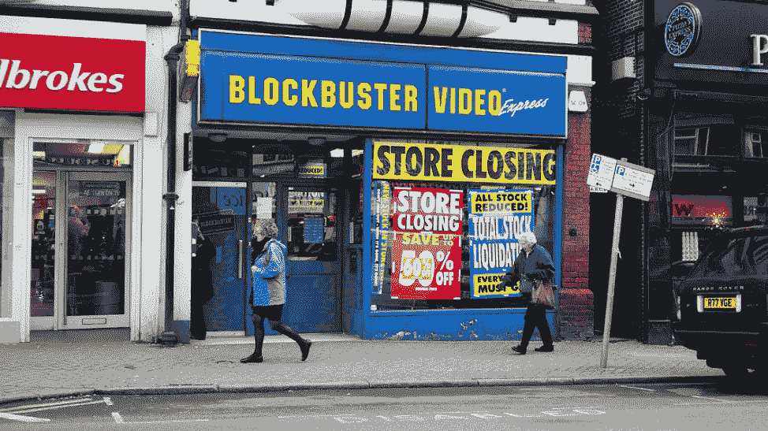

# 对大公司来说，购买他们的破坏性竞争比与他们对抗更好

> 原文：<https://medium.datadriveninvestor.com/its-better-for-big-companies-to-buy-their-disruptive-competition-than-to-fight-them-e002b97d8eaa?source=collection_archive---------4----------------------->

百事可乐刚刚以 32 亿美元收购了 SodaStream。这是一个例子，说明大公司越来越多地从战略上认识到，最好直接收购他们的破坏性竞争对手，而不是试图与之对抗。

未能认识到破坏性竞争是大公司内部反复出现的问题，鉴于当今技术变革和破坏的速度，这构成了一个生存问题。标准普尔 500 公司的平均寿命过去是 60 年，现在只有 20 年。而且，鉴于目前技术变革的速度，这一数字可能很快会降至 10。

现在，认识到行业内的颠覆性变化是必要的。如果做不到这一点，无论公司目前的规模如何，都可能意味着公司的生死存亡。众所周知，百视达视频公司有机会以仅 5000 万美元的价格直接收购网飞([纳斯达克 NFLX](https://finance.yahoo.com/quote/NFLX?p=NFLX&.tsrc=fin-srch) )。但其首席执行官约翰·安蒂奥科拒绝了这笔交易，因为当时网飞还没有盈利。

雅虎本可以只花 30 亿美元收购谷歌。他们也可以用 11 亿美元收购脸书([纳斯达克代码:FB](https://finance.yahoo.com/quote/FB?p=FB&.tsrc=fin-srch) )。但雅虎首席执行官特里·塞梅尔决定在这两个场合讨价还价，失去了拥有两家公司的机会。同样，威瑞森拒绝了苹果的 iPhone，再次讨价还价。

似乎是脸书开始了“不讨价还价”的策略，或许是出于偶然，它收购了 Instagram 和 WhatsApp。但这一策略的智慧很快变得显而易见。

尽管脸书对这两家公司的收购在当时似乎被严重高估，因为这两家公司都没有盈利，但它们考虑了两个非常重要的因素。

首先，如果它们被竞争对手收购，会发生什么？这会对脸书未来的业务产生重大的潜在负面影响吗？第二，如果他们保持独立，他们最终能否获得向脸书发起严重挑战所需的资源，甚至可能切断他们的业务或彻底推翻他们？

脸书管理层显然认定这两个问题的答案都是“是”，不再讨价还价，以当时看起来高得离谱的价格彻底收购了两家公司。

脸书后来改变了这一策略，试图迫使 Snapchat 以 30 亿美元的价格出售给他们，陷入了讨价还价的陷阱，威胁要在脸书推出类似的服务。但这一策略失败了，与之竞争的脸书服务也失败了，Snapchat 的估值甚至更高。

当谈到一项关键的收购后战略时，脸书似乎也在犹豫不决。这项战略是不干涉被收购公司，让它们独立运营以实现自己的使命。收购方的角色仅仅是提供被收购公司实现目标所必需的资源。这是一项关键要求。

这种母公司的干涉导致了 WhatsApp 出现了本可以避免的问题。

另一个潜在的收购后问题是试图迫使破坏性公司扭曲自己，以满足其新的母公司或合作伙伴的目标。

这是脸书和 WhatsApp 最近问题的一部分，但也发生在可口可乐收购了 Keurig ( [纽约证券交易所:KDP](https://finance.yahoo.com/quote/KDP?p=KDP&.tsrc=fin-srch) )的主要股份，然后试图通过一家合资企业利用这笔投资，试图开发一款名为“Keurig Cold”的家用汽水制造机，以与 Sodastream 竞争。但是这种将 Keurig 的“方钉”嵌入可口可乐的“圆孔”的尝试仅仅过了 9 个月就失败了。可口可乐的官僚作风使得 Keurig 无法在快速变化的市场中做出足够快的反应来改变产品。

Keurig 后来被德国食品和饮料集团 JAB Holdings 彻底收购，迄今为止，JAB Holdings 一直奉行正确的战略，允许 Keurig 管理层以自己的方式实现自己的目标，而不干涉他们的事情。

Keurig 现在正在尝试与比利时啤酒巨头百威英博([纽约证券交易所:BUD](https://finance.yahoo.com/quote/BUD?p=BUD&.tsrc=fin-srch) )建立另一家合资企业，基于他们旧的“Keurig Cold”技术，生产一种家庭酒精饮料系统，该系统将生产啤酒、烈酒、鸡尾酒和混合器。我们将拭目以待，看看这次与行业巨头的合资是否会比上一次与可口可乐的合资更成功，以及是否会避免以前的错误。

百事可乐在收购 SodaStream 后，现在的问题是，他们是否有管理纪律，让 SodaStream 管理层独自追求自己的目标，而不是试图强迫他们与百事可乐的文化和目标融合？

他们迈出了正确的第一步。现在，我们将不得不看看他们是否也能制定正确的收购后战略。

如果是这样的话，那么这可能会成为改变百事游戏规则的收购。