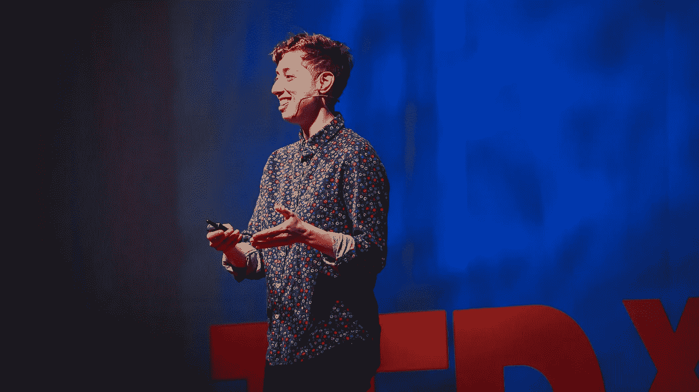

# 过时是很危险的

> 原文：<https://medium.datadriveninvestor.com/its-dangerous-to-be-obsolete-580e8bbce8d?source=collection_archive---------51----------------------->

任何一个聪明的傻瓜都可以把事情变得更大更复杂……但是反其道而行之需要很大的勇气。”—阿尔伯特·爱因斯坦

说明上述标题的短语出现在《21 世纪的 21 课》一书中，作者是决定吓唬所有人的人:尤瓦尔·诺亚·哈拉里。“人工智能的出现可以消灭大多数人类的经济价值和政治实力，”这位历史学家说。对他来说，生物工程和人工智能领域的技术崛起可能会导致人类分裂为一小类超级人类和一大类无用的智人。

在一个可能的未来场景中，大部分工作将由机器完成，这些机器实际上并不为他们所做的事情获得报酬，也不要求劳动权利，这可能会影响有血有肉的工人的经济和政治状况，这些人需要法律和权利才能在社会中生活。然而，一旦失去这种相关性，国家也可能失去对他们的健康、教育和社会福利投资的兴趣。将我们与机器联系在一起的激情可能是我们将被淘汰的原因。

你长大后想做什么？

对于许多富裕家庭来说，这个问题可能仍然有意义。但对于许多生活在不稳定条件下、没有希望的人来说，也许与其试图传授经济解放的方法，不如让他们准备好使用武器。当然我只是好奇，但是我们需要考虑一下。富裕的家庭将能够支付他们的孩子学习什么对他们最有利，并在必要时更容易改变方向和适应。贫困家庭几乎吃不上饭。他们通常能做的最大改变是把豆子放在米饭上面或下面。

看起来太灰暗了，但和一直以来没什么区别。

据我们所知，有几个人在指挥，一群人在服从。国王和鬣狗，狮子和宫廷小丑，中产阶级和平民，食肉动物和牛群。最后，在智人的例子中，我们预谋我们的行为；我们根据游戏规则和不同的利益群体，创造和操纵反对和赞成的系统。今天，知识是最强大的武器，最有价值的货币。我们把镜头和传感器放在世界的每个角落；在汽车里、角落里、人的皮肤上和皮肤下，以及任何可能的地方。

预测人类态度的能力是圣杯。谁不想知道到底会不会下雨，或者股票市场上什么样的股票会上涨，或者谁知道哪种产品会卖得最多呢？更好，人们会投谁的票？

这种力量迷惑和诱惑；谁拥有它，谁就能统治世界。

斯蒂芬·霍金认为，我们总是渴望理解世界的潜在秩序。对他来说，我们仍然渴望知道我们为什么在这里，我们从哪里来。“人类对知识的强烈渴望是我们不断探索的充分理由，”他说。但是代价是什么呢？丈夫和妻子愿意付出一切去了解他们的伴侣在想什么。听我说，世界各地的公司和政府也是如此。这一信息是无价的。随着数字技术的发展，我们能做的不仅仅是提出想法，而是决定你能做什么和应该做什么。

我们已经授权谷歌和许多算法告诉我们最好的决定。随着时间的推移，如果不询问电子设备我们是否在正确的轨道上，几乎不可能做出决定。

在 TEDxBend 观看了 Emilie Wapnick 的节目后，我开始思考，对于大多数尚未完全理解自己在生活中的角色的人来说，这种苦涩而灰暗的场景会是怎样的。她有趣地谈到了多潜能者的理论，即人们拥有多种潜能，但大多数时候，没有一种潜能真正得到很好的定义或开发。有很多焦虑的人；尝试一切，追随各种可能性，深入到释放出无法控制的激情的地方，在某个时刻，当火熄灭了，厌倦累积了，他的眼睛转向了另一个方向。他们又来了，寻找新的东西来保持他们的心脏以正确的速度跳动:尽可能的快。思维几乎爆炸。

当然，并不是每个人都是多潜能者，正如瓦普尼克所说的那些拥有一堆未被充分开发的才能的焦虑者。多才多艺的人有着超乎常人的好奇心，有着惊人的创造性天赋，充满能量和渴望去改变他们周围的宇宙。但是他们生活在一个坚持让他们成为某方面专家的世界里。是的，挫败感。小时候，他们问我们以后想做什么，但大多数时候是对我们给出的搞笑答案一笑置之。学校似乎有足够的时间来决定这一点，这些学校几乎不会敏感地提供机会来协调一些人拥有的许多天赋。

过时很危险吗？

当然啦！毫无疑问。但最重要的问题是:什么是过时？

保罗·布鲁姆，在 TED 的另一次演讲中，谈到了快乐的起源。有趣的是，事物的价值是如何根据其原创程度和历史而变化的。如果艺术作品被赋予了独特的属性，那么它们就具有过高的价值。例如，电话品牌、软饮料、汽车和葡萄酒比其他产品更贵，因为销售这些产品的广告公司讲得非常好。一支笔可能只值几美元，但一支签署了美国独立宣言的笔改变了一切。直到你发现那时候没有笔。

所有这些与那些不成功的天才和即将到来的让我们变得过时的天启有什么关系呢？

好问题！

不是每个人都能够克服不可避免地将很快困扰世界的挑战。将会有墙把“好”和“坏”分开。无论是身体上的还是社会上的，都无关紧要。真正重要的是学会处理我们自己的情感局限。多才多艺的学习者将他们的多种潜能联系起来，以建立更健康的创造过程，与那些更乐于培养天赋的人结盟，但以一种深入和专注的方式。这种结合可以给稳定的创造带来力量，充满了可能性，因为那些参与其中的人不会费心去测试所有可能的联系。因此，焦虑或许会减少。不是更少的机器，而是越来越人性化的设备，在一个共享知识被用来使我们的生活越来越好的宇宙中进行。

随着技术威胁着我们的过时，一些事情发生了。这种焦虑让我们朝着问题的方向前进。这一次，它将迈出更大的一步，更加危险，而且没有多少最终结果的确定性。然而，正如艾米莉·瓦普尼克所说，我们必须去寻找“真正的召唤”，即使我们没有任何把握是否走在正确的方向上，因为我们还没有一种电子设备能够回答每天困扰我们的问题；但是我们有由电脉冲驱动的心脏和大脑，与让我们如此恐惧的机器没有太大区别。