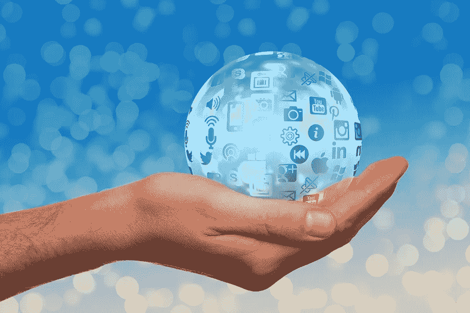

# 是我的数据，为什么不能有？

> 原文：<https://medium.datadriveninvestor.com/its-my-data-why-can-t-i-have-it-d366af7b8942?source=collection_archive---------67----------------------->

Source: Pixabay

弗朗西斯·培根爵士在他 1597 年的著作中说*知识本身就是力量*。从这个角度来看，今天我们发现自己正处在一个惊人的权力获取轨道上。技术发展使得测量、收集、存储和处理不断增长的数据成为可能，再加上人工智能/机器学习的发展，使我们能够以惊人的速度获得新的见解和新的知识。全新的企业已经建立，并且正在被设想利用数据和它所创造的知识，为了感受这种力量的获得，人们只需要看看今天排名前五的标准普尔 500 强公司，所有这些公司的核心都有大量的数据和分析。人们常说，今天存储的 90%的数据是在过去两年中创建的，由于数据的大规模增长，明年也将如此。在 2017 年营销趋势报告中，IBM 估计我们每天会产生 2.5 万亿字节(或 2.5 艾字节)的数据！现在，全球数字数据的数量是以吉字节(1，000 艾字节)来衡量的，随着技术的进步和数据生成速度的提高，我们最大的公制单位 Yotta (1，000 吉字节)很快将不足以衡量存储的数据。

当然，这种数据的大量生成来自于我们每个人每天直接或间接创建的数据。直接数据生成的例子包括我们的数字图片和记录、Twitter 帖子、脸书和其他社交媒体帖子、银行交易、人工智能个人助理请求、在线搜索、移动设备使用、可穿戴设备、在线购物，以及似乎无穷无尽的文本、应用程序使用、电子邮件和流媒体。间接数据生成的例子是我们活动的副产品，包括城市/交通/商店摄像头记录、跟踪我们运动和活动的传感器、智能家居设备、医疗保健监控器、车载 GPS 和数字排气系统，这些数据是系统在处理/收集/存储/传输/处理我们生成的数据时生成的。

前几天我看了一个同事的帖子，他问了一个问题——[你会为了科学放弃你的数据吗？](https://www.linkedin.com/pulse/would-you-give-up-your-data-science-matt-reaney/)这是一个很好的问题，前提是我们每个人分享的数据越多，我们对自己和彼此的了解就越多。这个问题让我开始思考我们每个人产生的数据，我开始怀疑。假设有一瞬间你不担心隐私或你的数据被滥用，我知道这很荒谬，但只是一瞬间*。*然后

> 如果你想为科学放弃你的数据，你能做到吗？
> 
> 你直接或间接产生的数据中有多少是你真正拥有的？
> 
> 随着时间的推移，您生成的数据中有多少是您实际存储并可以访问的？

我只看到了我们每个人每天产生多少数据的粗略估计，但正如上面的例子所示，我们实际上拥有和访问的数据量非常小，而且越来越少。人们当然可以留下所有的数码照片、录音和数字化文档(电子邮件、PDF 文件等)，这些都被忠实地保存了下来。然而，即使在考虑直接数据生成的情况下，我也往往不是唯一的“所有者”，例如，我可能拥有我所做的搜索，但搜索引擎和他们的合作伙伴也是如此，他们在这些数据上建立了非常成功的业务。即使我知道数据，比如说搜索，我也不一定有好的方法来跟踪它们(虽然搜索引擎有！)因此无法接触到其中的大部分，也无法将它留在身后。在间接数据的情况下，有很多数据我可能甚至不知道，也不拥有或访问，例如，安全摄像头或生物扫描仪记录。因此，即使是专门的生活日志记录者也很难留下他们的大部分数据，其中大部分超出了他们的知识和所有权。

我们每个人生成的大部分数据都由许多私人和公共组织和机构拥有和存储，包括我的手电筒应用程序，它希望我的地理位置只是照亮一盏灯！美国和海外都在进行与数据权利和道德相关的努力，例如明年生效的欧盟立法要求公司在收集和使用个人信息时获得用户的明确同意，以及美国消费者数据隐私在联网的世界白宫报告中。到目前为止，主要焦点似乎是确保公司获得我们的许可来收集数据，并在获得数据后合乎道德地使用数据，这两个方面都是需要关注的重要领域。但一旦获得许可，我可能仍然无法访问这些数据，并可能失去所有权，正如最近参议院关于 Equifax 违规的听证会所强调的那样，参议员们问 [*为什么消费者不应该有权查看这些公司收集的数据*](https://www.wsj.com/articles/senators-rip-credit-reporting-model-in-wake-of-equifax-breach-1507136171) *。*随着传感器和智能设备的部署，了解、拥有和访问我们所有数据的难度只会增加。

> 因此，虽然我拥有并有权为科学留下我的器官，但我没有能力或权利为科学的利益留下我的大部分数据。

除了数据遗产的问题，还有一个更大的问题，那就是我的数据权利。我认为，如果不先解决后者，我们就无法解决前者。

*这篇文章最初出现在我的数据驱动的未来博客上，时间是*[*【datapoweredfuture.com】*](http://datapoweredfuture.com/)