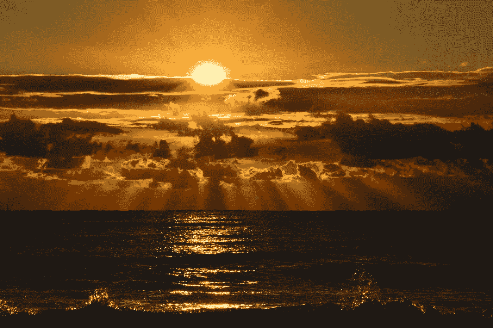

# 永远不会太晚…

> 原文：<https://medium.datadriveninvestor.com/its-never-too-late-1e43e2b39dd1?source=collection_archive---------32----------------------->

下周标志着我突发严重心脏病 6 周年。它让我在重症监护室，只有 11%的心脏功能和 3 个月的生命。这是一条漫长而艰难的路…但我会回来的。我带来的最重要的教训是永远不会太晚。

重新开始永远不会太晚。

按下暂停键。

去呼吸。

重新开始。

生活是美好的。

生活是不完美的。

生活是复杂的。

生活很乱。

我们是生活的一部分。

我们成长，我们改变。

我们欢笑，我们相爱。

我们破碎了，我们一起回来

生活没有倒带按钮。

但是永远不会太晚。

放手永远不会太迟。

重新开始永远不晚。

永远不会太晚。

坚定你的信念永远不晚。

深入你的灵魂永远不会太迟。

去寻找自我。

重塑，重塑自己。

成为你应该成为的人。

与世界重新联系

重新开始。

改变你的观点永远不会太晚。

让事情变得更好。

意识到你的杯子真的是半满的。

认识到没有什么是完美的。

你并不完美。

我并不完美。

我们会搞砸的。

有时候可能没有答案。

事情就这么发生了。

无论如何都不会太晚。

生活在不停地转动。

想转什么方向就转什么方向。

如果你不喜欢生活带你去的地方。

向右转。

向左转。

走后面的路。

无论如何你都要找到回去的路。

不要转身。

不要回头。

继续前进。

“永远不要后退，永远向前。一直都是。”

因为永远不会太晚。