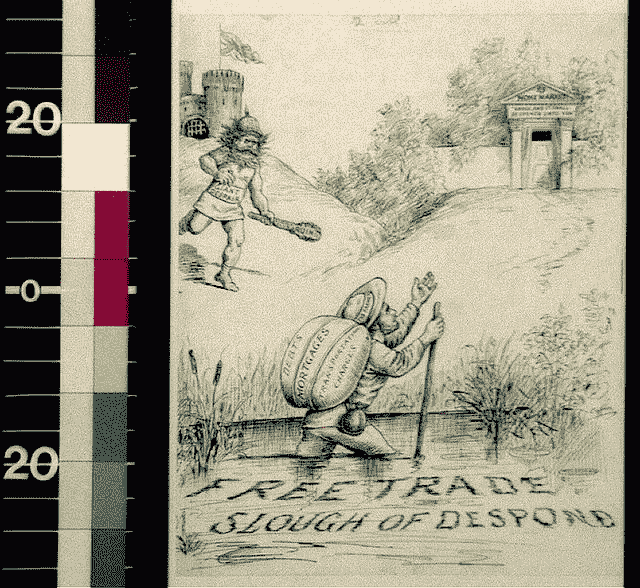

# 这不是关于自由贸易，而是关于思想的开放

> 原文：<https://medium.datadriveninvestor.com/its-not-about-free-trade-it-s-about-open-access-to-ideas-f2967c552e1?source=collection_archive---------19----------------------->

> 它将个人价值转化为交换价值，取代了无数不可取消的特许自由，建立了单一的、不合理的自由——自由贸易。一句话，用赤裸裸的、无耻的、直接的、野蛮的剥削代替了被宗教和政治幻想所掩盖的剥削。— 卡尔·马克思

Our entire perspective is out of wack. [(source)](https://picryl.com/media/free-trade-slough-of-despond)

F稀土贸易。对许多人来说，这两个词拼成了财富和富足的织锦，对其他人来说，*自由贸易*是一个简单的逻辑问题:从许多稍次于它的体系中选出最好的体系。然而，自由贸易，在实践中，已经不断地证明它自己创造了与马克思在上面的引用中归因于资产阶级的问题完全相同的问题。这是一个暴力和邪恶控制的系统，一个对怜悯、仁慈或同情不抱幻想的系统——更不用说它仍然是多么令人愉快的短视。

在现代政治格局中，自由贸易不仅仅意味着降低各种物质状态从一个时空点到另一个时空点的关税。即使在这一点上，我认为绝对无限制的贸易是无可非议的这一观点也是有问题的——但我这篇文章关注的更多的是这一主题的意识形态方法。

> 我认为需要质疑的不是这个过程，而是这个过程所依赖的整个前提。

米尔顿·弗里德曼(Milton Friedman)说，“经济学界几乎一致认同自由贸易的可取性。”然而，这丝毫没有考虑到那些支持它的经济学家背后的推理——他们更大的目标，他们的兴趣，他们的信仰是什么？这不是一个武断或不相关的问题，而是我试图阐明的基本观点:自由贸易，就像任何想法一样，依赖于其独立的前提；像任何其他意识形态一样，它有某些它认为是“最好”的结果，并努力以它认为可以接受的任何代价达到这些目标。我认为需要质疑的不是这个过程，而是这个过程所依赖的整个前提。与其进一步关注已经存在的关于自由贸易的经济论点，我更愿意考虑另一种哲学的一部分。

## **首先，我希望证明*开放思想*是一件好事。**

就这个概念而言，保护主义对人类的繁荣绝对是致命的。一个社会越闭关自守(通常是通过采纳某种特定的“受信任的”宗教或其他社会权力结构)，它就越快陷入分裂和衰退。拒绝新思想而支持现有的世界观是不健康的。从广泛的范围获取思想和知识，创造了对物种的长寿至关重要的特定类型的增长:社会中几乎完全不同的元素之间的合作，为公共利益的技术进步，不同社会和文化背景的成员之间的自由互动。

> 在一个致力于保护其公民并把所有基本需求确立为一种权利——而不是一种特权——的社会里，艺术家为了生存而出售作品的需求变得不那么重要或者完全不重要

然而，开放获取知识并不等同于“思想的交流”相反，它认为思想本身通常是非专有的。这种观点认为思想既是一个更大的公共整体的产物——因此，在某种程度上，被更大的整体“拥有”——并认为限制思想的获取会直接损害更大的整体。

现在，在一个重视个人主权的价值和绝对重要性的社会中，这种观点可能仍然需要某些调整:例如在艺术作品的情况下。虽然这主要只是在某种形式的稀缺经济学是主导因素的社会中的一个问题(因为，在一个致力于保护其公民和将所有基本需求确立为一种权利——而不是一种特权——的社会中，艺术家为了生存而*出售*他们的作品的需要变得不那么重要或者完全不重要。

然而，关于更大的概念，要点仍然是，对思想的限制只对那些有权力实施这种限制并在这些限制的障碍后面产生进一步思想的人有利。举例来说，这就是如何处理版权法的问题(尤其是在美国，但在国际上也是如此)；它的存在纯粹是为了促进那些将自身内部目标(即创造利润)置于社会整体最佳利益之上的经济行为。

我们可以看到开放获取思想的好处的一个地方是 STEM 学科。在这里，如果我们限制获取至关重要的知识，我们就阻碍了我们对宇宙理解的进步。同样，如果我们阻止科学进步的普遍应用，我们就损害了我们物种自我完善的能力。当然，这也有更微妙的地方需要考虑:例如，所有的新技术是否应该立即为每个公民所用？每当最新最伟大的技术到来时，我们应该仅仅采用它吗？在消费者世界里，这是当前的做法，每一部卖出数百万部的新款手机都表明了这一点。这就是为什么开放获取思想的模式不能局限于任何特定的知识领域。这也是为什么开放获取想法并不等同于所有想法的实际实施——相反，它是通过增加我们可用的知识库来增加我们的*潜在*行动，从而允许我们集体做出关于我们行动的更好的决定。

从根本上说，在我们对所有权的全球理解中，要实现这样一个巨大的变化，需要考虑很多问题。需要考虑的微妙之处有很多层，而*绝对*的实际执行去除思想的私有可能并不是最好的选择。然而，我们看到一些趋势——特别是在技术领域——朝着这种心态发展，这些趋势建立在广泛的推理基础上。我们也看到了对这些社会变革的考虑(例如保障基本需求权利的标准化——以普遍基本收入等形式),这将提供使开放获取思想成为现实所需的结构框架。

至少，考虑这样的话题可以让我们超越已知的框框，进入更大的想象空间。在这个更大的框架中，我们可以开始探索各种替代品，如果我们的物种要生存下去，这些替代品是极其需要的。这也是远离那些鼓励相信一个促进痛苦的系统在任何方面都是一个好系统的论点——以及对个人的尊重和整体利益的一些概念是可能的。