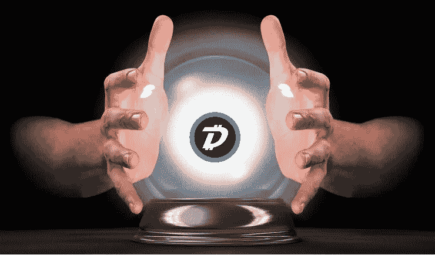

# 这不是关于 DigiByte 的未来，而是关于 DigiByte 的未来。

> 原文：<https://medium.datadriveninvestor.com/its-not-about-the-future-of-digibyte-it-s-about-a-future-with-digibyte-4c5d2564659e?source=collection_archive---------2----------------------->

你愿意拥有一个水晶球，能够看到未来的 DigiByte 吗？从现在起 5 到 10 年后，我们会在哪里？任何项目的未来都取决于不同的因素，如开发、营销、应用和实施、团队和条件。

*开发* DigiByte 已经被证明是最具前瞻性的项目之一。DigiByte 成为世界上第一个安装 SegWit(隔离见证)的区块链，这意味着交易确认与块内存储的信息分开保存，这有助于实现更快的交易。DigiByte 还是 MultiShield 和 DigiShield 的先驱。MultiShield 是原始 DigiShield 的高级版本(因为它的多算法挖掘)。它创建了一个非对称的实时难度调整，现在甚至在超过 25 个其他区块链广泛实施。

 [## 你对智能凭证了解多少，J-Coin & c-闪电-数据驱动型投资者

### 无数区块链/加密项目在我们周围涌现，承诺不同的真实世界用例。正在搜索…

www.datadriveninvestor.com](https://www.datadriveninvestor.com/2019/03/06/what-do-you-know-about-smart-credentials-j-coin-c-lightning/) 

随着最近推出的协议开发，DigiByte 再次证明了其前瞻性思维。
名为“蒲公英”的新功能将保护 DigiByte 用户的隐私和安全。它通过使交易来源的 IP 地址难以确定来保护您的位置。名为“Odocrypt”的新挖掘算法将是抗 ASIC 的，因为它每 10 天改变一次。这将为普通矿工带来公平、自由和信心，让他们使用普通硬件进行开采，让每个人都有平等的机会来保护网络，并使系统完全分散、分布和易于访问。

核心团队只专注于项目的开发。因为 DigiByte 不是一家公司，市场营销是由 DigiByte 社区的不同成员制作的。一些组织成小组，用他们的技能来创造意识和鼓励采用。像 DGBAT (DigiByte Awareness Team)和 DUN (DigiByte Unlimited)这样的团体是 DigiByte 的福气。
随着社区的不断发展，我们看到这些工作组也在不断发展和完善，将来会出现更多这样的工作组。

*应用* 

*团队* 正直是 DigiByte 团队成员最重要的特征之一。所有的核心成员都是值得信赖的，都是出于好意。当处理一个 ICO 项目或一个有受薪员工管理项目的公司时，总会有这样的风险，即人们只关注金钱，而不是真正致力于项目。在像 DigiByte 这样的分散式社区中，所有活跃的成员都是无偿的志愿者，贡献自己的空闲时间、资源和金钱来支持这个项目。
不会有欺诈、腐败或非法行为。历史已经证明，DigiByte 社区的去中心化本质会产生一个自我完善的系统。如果有人失败或似乎有错误的意图，它会得到其他人的注意，那个人会被阻止，忽视和排除在社区之外。

与许多其他项目相比，DigiByte 处于最可行的状态。DigiByte 不是一家公司，它不必应对破产和裁员等风险。任何人、任何事都无法关闭 DigiByte。DigiByte 没有“单点故障”,因为它在全球范围内具有无与伦比的分散性。没有任何实体能够关闭 DigiByte，除非他们关闭全世界的互联网。
DigiByte 使用 5 种不同的电力挖掘算法。攻击 DigiByte (51%)所涉及的成本不会得到回报。这是浪费时间和资源。
DigiByte 的强大之处在于它 100%由社区驱动，而且自 2014 年以来一直在运营和发展。这是一个开源项目，由真正分散的全球志愿者社区开发和支持。无论 DigiByte 项目涉及的人员或资源发生什么情况，这个强大的社区都将确保项目的连续性。

**是什么让 DigiByte 有别于其他项目？**

关于它的技术，我们可以说 DigiByte 就像比特币和莱特币。这是一个带有能量挖掘算法 UTXO 区块链。
DigiByte 是基于比特币和莱特币的代码。不是区块链的分叉，而是“代码的分叉”。DigiByte 是自己的区块链，有自己的 genesis 块。但与莱特币和比特币相比，我们可以说 DigiByte 更大，更快，更安全，交易费用更低。这也是一种更先进和发达的技术。
但 DigiByte 并没有像比特币和莱特币那样受到关注，但这种情况正在改变，未来它很可能会受到同样的关注。当然 DigiByte 值得拥有它。
如果我们将比特币与以太坊这样的平台进行比较，我们可以说以太坊是一种比比特币更灵活的协议，正在被公司用来提供区块链即服务。因为它更灵活，所以被用作运行智能合约或创建您自己的令牌的平台。
DigiByte 目前正在部署名为 DigiAssets 的协议。开发人员正在测试数字资产的发行和转移、资产浏览器、钱包集成等。由于 DigiByte 区块链的可扩展性，它可以被视为比以太坊更好的平台。Digibyte 核心团队还将致力于增加对 Solidity 的支持，Solidity 是一种基于以太坊的分布式应用程序编程语言(dApps)。如果实现了这一点，那么用 solidity 编写的 dApp 就可以在 Digibyte 区块链上运行。这是避免 2017 年末以太坊出现拥堵问题的一种方式。这也可能吸引那些考虑在以太坊上构建 dApp 的开发者，现在使用 DigiByte。
随着 DigiAssets 生态系统的发展，最新的隐私功能 Dandelion 和新的挖掘算法 Odocrypt，DigiByte 再次显示出能够保证其协议的持续发展。

【DigiByte 的主要使用案例

由于 DigiByte 是最安全和最分散的 UTXO 区块链，并且结合了交易速度等其他功能，该技术是网络安全解决方案的理想选择。

*Digi-ID/Antu mid* Digi byte 开发的应用之一就是 Digi-ID。Digi-ID 是一种快速、安全的身份验证方法，可替代密码登录在线应用程序。它通过使用基于区块链的签名来工作。这几乎是同一个系统，允许你签署一项交易，但现在你可以使用这些私钥来验证自己登录到一个网站或其他平台。这样做的好处是，你可以只使用一个应用程序来登录不同的应用程序，而不用向它们提供相同的数据。签名具有时效性，每次创建时都是唯一的。因此，如果一个网站遭受数据泄露，这没有问题，因为黑客不能重复使用签名来登录任何东西，不像密码。除了用户登录不同的网站，它甚至可以用来建立安全和取代门禁卡。Digi-ID 是匿名的，不会存储或传输任何信息。DigiByte 移动应用程序中没有保存任何个人信息，也没有任何形式的数据记录。这使得符合 GDPR 法规变得容易。Digi-ID 甚至被实现到支持多种加密货币的第三方钱包中，如 Coinomi。
Antum 是一家比利时公司，它将 Digi-ID 推向了另一个高度。有了 AntumID，他们已经通过使不同编程语言的集成变得非常容易而将 Digi-ID 商业化，并且他们正在提供支持。Antum 还允许用户创建私有和安全的在线身份。因此，通过使用个人 ID 进行注册和验证，可以使用 AntumID 来确认某人正在与真实可信的人进行在线交易。这在政府网站、交友网站、在线市场等平台上非常有用。
Digi-ID 要求网站运营商实施 Digi-ID。这可能会阻碍他们，因为这样做需要时间和发展支持。
但是多亏了 AntumID 和 DigiByte 的开发者，有了另一个解决方案。它甚至是一个比密码管理器更好的解决方案，因为它不需要将你的密码存储在你的电脑或云中。现在，您可以通过您的 Digi-ID 身份验证器完成所有这些工作。他们为谷歌 Chrome、火狐、Brave 和微软 EDGE 浏览器创建了浏览器插件。
这些应用程序将包含在主要的 DigiByte 应用程序中，也包含在独立的 iOS Authenticator 应用程序中。如果你使用手机访问某个网站，比如 Twitter 或脸书，你只需点击 Digi-ID/AntumID 按钮，它就会为你的浏览器当前打开的网站生成一个唯一的二维码。您可以使用 Digi-ID 验证器应用程序扫描二维码。它将为该网站生成一个唯一的密码。如果你使用的不是手机，而是电脑浏览器，你只需点击“发送”按钮，让它将密码发送到你的浏览器。密码由您的私钥加密生成，专门用于您正在访问的网站。它不会存储在任何地方，而是每次都为各自的网站重新创建相同的内容。

*Digusign* Digusign 是一家总部位于香港的第三方公司，使用 DigiByte 区块链安全地存储、公证和验证文档。您可以创建模板，发送文件&签订合同。

*V-ID* 一个非常有前途的用例是荷兰公司 V-ID。V-ID 保护任何数字文件免受非法操纵，从而保护企业免受任何形式的数字欺诈。使用 V-ID，您可以通过验证和确认这些文件来识别被操纵的数字文件。您可以验证传出的数字文件，以便任何接收者都可以验证内容是否来自您。任何人都可以验证传入的数字文件，以确保它未被更改并且是由预期的发送者发送的。想想证书、发票、文件等。他们为此使用的区块链之一是 DigiByte。他们看到越来越多令人印象深刻的客户，如空中客车航天&防务公司。他们希望在未来更多地使用 DigiByte 技术。因此，这绝对是一家值得关注的公司。在 2019 年 4 月的 DigiByte 全球峰会期间，他们一直在展示一个视频，其中他们使用 DigiByte 区块链来验证一幅伦勃朗的画作。这意味着 V-ID 应用程序也可以用于现实世界的资产。

*Digi-Assets* Digi Assets 是全球 DigiByte 区块链之上的一个安全、可扩展的二级层，允许资产、令牌、智能合同、数字身份等的分散发行。DigiAssets 可以用来安全和加密地表示我们在现实世界中发现的任何东西。从房地产、飞机、船只和汽车等现实世界的资产到稀缺的数字艺术和音乐作品。而且，诸如遗嘱、契约、采购订单、医疗账单和广告数据等签名文档也可以作为数字资产受到保护。借助 DigiAssets 平台，您可以在 DigiByte 区块链上启动“数字资产”。这些资产可以是可替代或不可替代的代币、股票、票证、硬币、财产等。数字资产的发行既可以在网络浏览器中进行，也可以通过 Android & iOS 应用程序进行。任何人都可以通过他们的手机创建 DigiAsset，它将受到 DigiByte 区块链的安全性和可扩展性的支持，这意味着 digi asset 将在 DigiByte 区块链上得到验证，从而使不可变的资产、不可伪造的资产以及供应和所有权透明。全球用户都可以交易、发送或接收这些数字资产。DigiAssets 利用了只有在 DigiByte 这样的区块链中才能找到的真正去中心化区块链的独特方面。这使得 DigiAssets 比市场上任何其他平台都更加安全、可扩展和分散。由于其他区块链在容量或集中验证方面存在问题，DigiByte 正在使 DigiAssets 成为发布任何资产的完美平台。DigiByte 具有链上可伸缩性、经过验证的安全性以及令人羡慕的各方面去中心化。

数字资产的示例:

赛事门票
DigiAssets 可以彻底解决门票倒票问题。用户既可以确定他们正在直接从官方卖主购买足球比赛或音乐会的原始门票，同时也可以确定该门票没有通过倒票服务被转售。

公司股票
数字资产可用于发行公司股票，也可用于融资和创业。一家公司可以通过交易网站在公开市场上发行股票。

房产契约
房屋或土地契约也可以存储为数字资产，并在区块链上公证房产所有权。DigiAssets 将允许在 DigiByte 区块链上进行点对点转让和所有权验证。
没有因欺诈性文件而产生的冲突。

*DigiByte POS 应用* 我还想提一下 DigiByte Pay 的一个用例。DigiByte Pay 开发了一款名为 DigiCafé的应用。这个销售点应用程序是一个有用且易于使用的 DigiByte 支付系统和应用程序，商家可以轻松地将其集成到日常支付交易中。app 界面非常简单。零售商将购买的商品添加到应用程序中，应用程序以当地货币计算销售总额，然后将总额转换为数字字节。该应用程序生成一个二维码，包含所有支付细节。客户点击 DigiByte 钱包中的“发送”并扫描二维码。客户发送资金。零售商然后点击一个按钮来验证确认。当交易成功时，应用程序会提示通过电子邮件发送客户收据。
有不同的支付处理器系统提供插件，允许 woo 商务网站进行 DigiByte 交易。最近 DigiByte Pay 开发了一个 woo 商务插件。因此，在线企业可以接受数字字节支付。

**数字字节的未来**

*digi assets&BLOCK 30 Labs* digi assets 平台将改变 DigiByte 的游戏规则。第一批使用 DigiAssets 平台的公司之一是 BLOCK 30 Labs。
BLOCK 30 Labs 的完整生态系统愿景与 DigiByte 和 DigiAssets 的愿景完美契合。通过利用 DigiByte 区块链的速度、可扩展性和安全性作为其产品的基础，BLOCK 30 Labs 将把消费者、商家和专业企业聚集在一起。他们正在开发 3 个核心应用程序

BLOCK 30 Marketplace
世界上第一个建立在 DigiByte 区块链的 Marketplace。它将汇集全球买家和卖家在区块链进行价值交换，包括音乐会门票、汽车、酒店、商业、土地、种植农场、葡萄酒厂、部分所有权、混合用途开发和商业房地产。

BLOCK 30 Pay
Block 30 Pay 正在提供一种数字钱包，这种钱包将在 BLOCK 30 Marketplace 的收银台提供，并通过一种名为 BLOCKS 的资产帮助全球客户和商家开始使用和采用数字资产而不是信用卡，当然，这种资产由 DigiByte 提供支持。

BLOCK 30 Financial
该部门将为 BLOCK 30 Pay 数字钱包持有者提供直接从他们的手机投资定制安全令牌的能力。他们将使用一个复杂的索引，称为 BLOCK 5、10、30 等。它跟踪最重要的全球市场，并提供专题板块覆盖。该指数对保护投资者也很重要，因为它为投资者提供了更全面的市场视角。

BLOCK 30 Labs 是全球大规模采用 DigiByte 生态系统的一个巨大里程碑。

*区块链 2035* 最后，我想劝你买下贾里德·泰特即将完成的那本书。这本书名叫《区块链 2035》。可以在[blockchain2035.com](http://www.blockchain2035.com)网站预购。区块链 2035 是对 Jared Tate 在过去 7 年中收到的数千个问题的回应，这些问题涉及区块链是什么以及它对未来意味着什么。这本书旨在驱散区块链的迷雾，并作为各种人的指南，帮助他们更好地了解这项技术是什么，以及他们如何在未来应用它。

DigiByte，从现在起的 5 年内，凭借其前瞻性思维方法、生存能力、发展及其技术的应用、项目、团队和社区的可持续发展，我认为我们不需要那个水晶球来合理准确地预测未来。