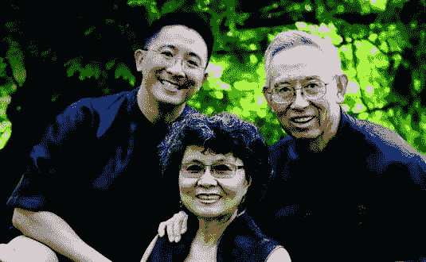

# 现在过你从未想过的生活还为时不晚

> 原文：<https://medium.datadriveninvestor.com/its-not-too-late-to-live-the-life-you-never-knew-you-wanted-23bf91b3f350?source=collection_archive---------31----------------------->

“yellow slice fruits” by [rawpixel](https://unsplash.com/@rawpixel?utm_source=medium&utm_medium=referral) on [Unsplash](https://unsplash.com?utm_source=medium&utm_medium=referral)

## 希望是能够看到黑暗中的光明——德斯蒙德·图图

你曾经感到绝望吗？

你是否曾经觉得你的处境已经无法挽回，你已经走得太远，没有什么好的未来可以期待？

如果是这样，你在一个很好的公司。

许多人都经历过你的处境，也许更糟，他们不仅活着去谈论它，他们已经变成了自己更好的版本。

你也可以有这样的故事。

因为哪里有生命，哪里就有希望。

# 从联邦监狱到新生活

Christopher Yuan*是一个有前途的年轻牙科学生，他一生都是明星学生、“模范少数民族”和“好儿子”。

但在年轻时发现色情后，他开始滑向一条(看似)不归的黑暗之路。

克里斯离开了家，和他的男朋友住在一起，并投身于毒品、性和派对的狂热生活中。他花了太多时间在派对上吸毒和贩毒，以至于在毕业前几个月被牙科学校开除了。

最终，他被联邦调查局发现，并被判入联邦监狱，在那里，当他发现自己感染了艾滋病毒时，他受到了又一次打击。

与此同时，克里斯的母亲安吉拉正计划自杀，因为她对这个任性的儿子感到悲伤。但是一群朋友介入了，帮助她发现对上帝的信仰，重拾希望，并告诉她如何无条件地爱自己的儿子。

尽管克里斯拒绝了他的父母，甚至在他们试图拜访他时把他们扔出家门，但当他陷入低谷时，他们一直在他身边。

当克里斯在监狱时，他的父母在外面为他祈祷，看望他，提醒他他们的爱。渐渐地，克里斯向他的父母敞开了心扉，接受了一种与导致他陷入困境的生活方式截然不同的生活方式。

今天，Christopher Yuan 是一位不吸毒、不滥交的作家、演说家和教师，拥有惠顿学院的硕士学位。

他完全修复了与父母破裂的关系，这个家庭定期被邀请到世界各地讲述他们的故事，并鼓励其他人面对他们自己可怕的噩梦。

Christopher, Angela, and Leon Yuan from [epm.org](https://www.epm.org/blog/2017/Feb/27/christopher-yuan-story)

你呢？

你吃过什么苦？

你后悔过什么？

你跌到了什么谷底？

如果你感到绝望或绝望，鼓起勇气。你的故事还没有结束。只要稍微调整一下你的视角，它最终可能会像克里斯托弗·袁的故事一样充满希望和快乐。

# 如何制作柠檬水

> **“上帝将生命设计成一种变革的体验”** —马克·维克多·汉森

你可能听过人们说:“当生活给你柠檬时，就做柠檬水。”

在我比较悲观的情绪中，我讨厌这条线。我觉得它陈腐、幼稚、毫无用处。

YouTuber 瑞安·比嘉在视频《愚蠢的励志名言》中说得最好:

> “柠檬水不仅仅是柠檬做的。这几乎是柠檬！主要是水和糖！生活没有给我们这些。”

但是想了想，才知道生活*确实*给了我们糖。我们都有一点点糖。

*   如果你还活着，那就是“糖”
*   如果你身心健康，那就是“糖”
*   如果你受过一些教育，那就是“糖”
*   如果你有人爱，有人爱你，那就是“糖”

生活伴随着糖而来，即使它不时向我们扔柠檬。

即使一种情况看起来不可挽回，我们仍然可以希望在比这更高的存在层面上，它*在某种程度上是可以挽回的。*

通过选择不在酸味中加入苦味(即愤世嫉俗的态度)，我们在用水“稀释”柠檬。

通过利用我们所拥有的工具和资源，我们正在“甜化”柠檬——可以说是制作柠檬水。

一些心怀不满的人可能会说，这种想法完全是天真的。也许是这样的，但是如果我宁愿天真、谦卑，并且*至少有一点点快乐，而不是痛苦、自以为是和不快乐——你不会吗？*

# 知道你被爱着

> **“每个人，每个人都想爱/每个人，每个人都想被爱，哦…每个人都用爱治愈”** —英格丽·迈克尔森

> 你被爱着，但你可能没有完全意识到。

然而，当你真正了解它时，它会从内到外改变你。你将能够面对任何事情。

为什么绝大多数流行歌手唱的都是爱情。然后我意识到，因为爱是唯一值得歌唱的东西——它是唯一值得为之而活的东西。

当 Chris Yuan 过着放荡的生活时，他在寻找爱情，但不知道它是什么。他认为性意味着爱，但实际上对他来说意味着麻烦。

克里斯拒绝了父母的爱，转而向性伴侣寻求接纳和归属。

但是当他的生活分崩离析时，他终于能够看到他一生渴望的深深的爱和接纳就在他的父母那里，在他父母的上帝那里。

误会不完全是克里斯的错。

克里斯小的时候，他的父母安吉拉和利昂也不知道什么是爱。他们互相争斗，互相排挤，并要求克里斯和他的兄弟有出色的表现。

感到透不过气来，克里斯开始反对他父母所支持的一切，就在那时，他们意识到他们并不了解爱情的真正本质。

克里斯的强烈反抗给安吉拉和利昂敲响了警钟。他们意识到他们不懂得长久的、宽容的、真实的和无条件的爱。他们必须学会爱和被爱。

这是救他们儿子的唯一方法。

# [只有爱才能永久地改变人](https://medium.com/the-mission/the-single-most-powerful-and-effective-way-to-change-someone-else-d26ea4be9c42)

> **人类的救赎是通过爱和爱来实现的**

行为矫正，激励性的演讲，规则和限制，心理上的小把戏，都只能浅层次的改变一个人，而且只能是暂时的。

但是已经跌到谷底的人需要的不仅仅是修饰。他们需要从内到外的转变。这只能来自于被爱。

但是对虚假爱情的错误追求让很多人(比如克里斯)陷入困境。

避免这个陷阱的关键是意识到你已经被爱了——被上帝爱着，通常也被你的朋友和家人爱着。

然后你可以学会爱别人，生活在和平、满足和快乐之中。

当然，这说起来容易做起来难。如果人类能够找出将头部知识转化为心脏知识的确切机制，我们就能解决许多问题。

然而，我们都需要的一件事就是花时间。我们经常忙着四处奔波，没有意识到*任何事情，因为我们只是在想我们要做的清单上的下一件事。*

但是如果你花一些时间停下来思考，其中一些可能会从“知道”渗透到“相信”

> 问题有多深，前景有多无望，纠纷有多混乱，错误有多大，都没有关系。对爱的充分认识将会化解这一切。—埃米特·福克斯

# 当生活真的很糟糕时

> **“更容易愤世嫉俗；接受改变是不可能的，政治是没有希望的，并相信我们的声音和行动无关紧要。但是如果我们现在放弃，那么我们就放弃了一个更好的未来**

“杀不死你的东西会让你变得更强大”在 99%的情况下都是正确的，如果你选择让你的可怕经历让你变得更强大，而不是放弃和变得痛苦。

苦涩从内而外的吞噬着人。这就像在你的柠檬水中加入砷，而不是水和糖。

当然，我们都是人，我们都经历过自怜。

只是不要呆在那里。

如果需要的话，哭一哭，抱怨一下，然后深呼吸，把注意力转移到如何开始准备柠檬水上。

# 忘记虚无主义；这一切都意味着什么

99%的时候，“杀不死你的会让你变得更强。”

另外 1%的时间，你可能不会变得更强，但你至少可以帮助别人，因为你经历了可怕的经历。

这意味着:即使你正在经历或已经经历的情况给你造成了不可挽回的伤害——至少它不是无意义的伤害。

正如大屠杀幸存者和心理学家维克多·弗兰克尔所说:

> 如果生命真的有意义，那么痛苦也一定有意义。

我们可能并不总是马上知道那是什么意思，但是请放心，那是有意义的，如果你坚持足够长的时间，你很可能会发现它是什么。

*   克里斯托弗·袁(Christopher Yuan)和他的父母没有想到，他的痛苦、监狱经历，甚至他的艾滋病毒感染状况，有一天会给世界各地成千上万的人带来希望和鼓励——但事实确实如此。
*   他们不知道克里斯托弗被学校开除是一个更好的职业道路的开始——但事实的确如此。
*   他们不知道克里斯托弗痛苦的反抗最终会在父母和儿子之间形成一种强大的关系，这种关系比克里斯托弗成长过程中的任何关系都更紧密、更真实——但事实确实如此。

同样，你也不是全知的，你也不知道你的故事会有怎样的结局。

现在事情可能看起来很黯淡，但即使是这种暂时的黯淡也会让你完成的故事变得更加美丽——就像偶尔的不和谐在最终转变为和谐时会给歌曲增添魅力一样。

记住:

> 凡事都互相效力，叫那些爱主并按他旨意被召的人得益处——罗马书 8:28

# 共同撰写你的故事

当然，并不是每个痛苦的故事都像克里斯托弗的故事那样幸福地结束，但请记住:

> 看似结束的事情，实际上可能并不是结束。

你可能认为你的生命结束了，但实际上，救赎和复活可能就在眼前。

有人说你是你的故事的作者，你可以控制你的生活如何展开。

但是你有一个合著者，他知道的比你多，不管你的生活到目前为止是什么样的混乱，如果你让上帝和其他人帮助，它会变得更好。

有时候我们和治愈之间唯一的障碍就是骄傲。

我们不想让人们看到我们崩溃和脆弱。我们不想承认错误或失败。我们认为我们需要自己振作起来。

但是我们不能。

我们都是合著者，不是完整作者。我们不会自己写我们的人生故事。

所以，当你试图向绝望屈服时，让别人帮你振作起来。

停下来，记住你是被爱着的，生活是有意义的，你永远不知道什么就在眼前——也许它会比你曾经梦想的更多。

不管你做什么，不要放弃希望。

这总是为时过早。

# 准备好成为一名出色的作家了吗？

我创建了优秀作家清单来帮助你阐明你的信息，接触更多的读者，用你的文字改变世界。

[点击这里获取清单！](https://mailchi.mp/412cd4fece2f/bbwchecklist)

更多关于 Christopher Yuan 博士及其工作的信息，请参见他的自传— [*《走出一个遥远的国度:一个同性恋儿子的上帝之旅，一个破碎的母亲寻找希望》(附属链接)*](https://www.amazon.com/dp/B004J4WK7E/ref=dp-kindle-redirect?_encoding=UTF8&btkr=1)