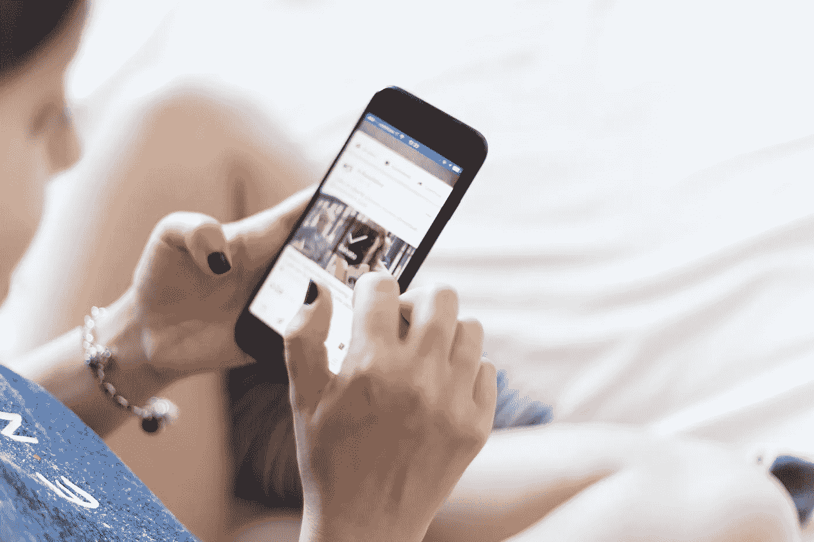

# 太吓人了！你的决定不是由你而是由互联网做出的？

> 原文：<https://medium.datadriveninvestor.com/its-scary-how-many-of-your-decisions-are-taken-by-the-internet-65660a8540a8?source=collection_archive---------3----------------------->

这很可怕，但这是真的，每天越来越多的你的许多决定都是由互联网做出的。你已经把你的一部分决策权交给了互联网，你会继续为你的大量小决策做下去。这对新时代的产品经理来说是一个好消息，他们现在控制你做什么，因为他们已经知道你会做什么决定。

登录你手机上的任何一个 app，有多少关于音乐、照片、电影、视频、餐厅、旅行目的地、购物的建议，其实都是基于你的输入。它们要么是 AI 基于你过去的用户行为生成的，要么是基于与你的资料相似的客户的用户行为生成的。你对这种建议并不在意，甚至还期待着它。事实上，你非常喜欢它，以至于你会定期登录查看列表上是否有新的条目。这里发生了什么？

 [## 睁大眼睛冲破多样性壁垒|数据驱动的投资者

### “科技女性”是蒂芙尼·霍兰的激情之一，最初她在 Twitter 上主持“科技女性”聊天。她也是一个…

www.datadriveninvestor.com](https://www.datadriveninvestor.com/2019/03/20/hurtle-diversity-barriers-with-eyes-wide-open/) 

# 我们每天上网看看它给我们带来了什么新东西。

我的意思是，如果你必须去办公室，走 1 号路还是 2 号路有什么关系。让谷歌决定什么是最好最快的路线。但随着你继续将小决策的控制权交给人工智能和互联网，更大的问题来了，你会慢慢开始将改变生活的大决策的控制权也交给互联网。选择你的生活伴侣怎么样？去 https://betterhalf.ai/，人工智能会帮你找到合适的伴侣。

几乎所有的东西都是推荐的，都是基于评论的。你孩子的下一所学校，你的下一辆车，你的下一台电视，你的下一个社区，也许你的下一份工作等等。

# 我们喜欢有人向我们推荐商品，现在这已经成为我们的习惯，我们甚至不会为此感到尴尬。

也许你甚至不会注意到什么是假的，什么不是。你会遵从互联网帮你做出的决定。互联网说它很好，你有理由依靠它。即使将来它变成了一个糟糕的决定，你也有可以责怪的人。哦，网上推荐而且收视率很高，所以我们就买了。我们信任 AI，为什么？也许我们相信没有偏见，机器不会做出有偏见的决定。人类可以。我们比人工智能更信任人类，因为我们已经确定了决策准确性的历史。艾的建议通常被证明是可以接受的。

# 我们不想做小决定，这似乎是显而易见的，相反，我们依赖人工智能来建议什么对我们最好。

这对一个在公司或者创业公司工作的产品经理来说意味着什么？这意味着他们不会要求用户完成常规任务，他们会自己完成。应用程序不会询问许可或建议，而是给用户一种控制感，但不会提供判断力。用户会相信，在产品漂亮的用户界面背后，一些人工智能算法会做出对用户最有利的明智判断。由于这种对基于人工智能的应用程序的信任，利用具有虚幻影响力的人工智能能力的“选择幻觉”。

# 用户现在更信任互联网，而不是自己的直觉。

根据一项研究，现在这种情况也发生在工作场所，与经理相比，大多数工人更信任机器人的命令。阅读更多[此处](https://www.weforum.org/agenda/2019/11/how-artificial-intelligence-is-redefining-the-role-of-manager)
未来任何人做常规决策都将基于某种机器人或人工智能。问题是公司将如何利用它。

人工智能允许产品不断从用户行为中学习，根据用户的意图逐渐交付越来越多的产品，并逐渐以有利于产品或公司的方式弯曲他们的倾向。你一定目睹了以下情况:

1.  向客户建议一条途径:趋势、流行等。这只是为用户建议的路径。关于追随什么人，什么产品热销，其他人在消费什么的建议只是带你走上某条路的建议。
2.  给人一种控制的错觉:询问用户对他们的 feed 的选择，给他们产品的选择，最终会把他们带到销售页面。这通常是在开始的时候，在提供个人资料的信息，加上各种选择。
3.  利用稀缺性:还剩最后一块，只剩两块。抓住一个有时间限制的机会。所有这些都是为了制造销售产品的紧迫感。公司利用制造一种稀缺的假象来加速购买决定。

最重要的是，互联网给当下带来了紧迫感，就在此时此刻。每条信息都必须马上回复，每封邮件都必须阅读，每条推文都必须回复。当我们点击刷新按钮时，一切又开始了。

> 你觉得有义务接受朋友的请求，回复那个评论。就像那个图像。这不仅是紧急的，而且现在是势在必行的。

人们标记位置，炫耀，点击图片，只是为了在互联网上发布。你的在线身份，你的社交网络不再是你一个人的功能。你被推动着加入人群，做每个人都做的事，或者感受一下 FOMO。现在这是一种社会压力，有时也是一种家庭压力。你可能没有做这些考虑，但间接地你不得不做。

互联网现在无情地要求做事情，这可能是屈服于小决定的关键原因之一，毕竟，我们需要喜欢那张照片，发布那张图片，发推特，购物，以及回复。所有这些努力都会消耗我们的能量，一旦你不知所措，你就不会介意机器或人工智能来帮助你。