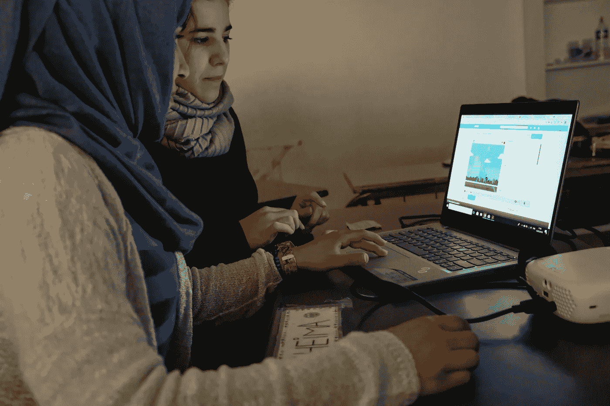

# 是时候投资难民人才了，不仅仅是在硅谷。

> 原文：<https://medium.datadriveninvestor.com/its-time-to-invest-in-refugee-talent-not-just-in-silicon-valley-b45b28d1691c?source=collection_archive---------4----------------------->

Refugee training at a Greek refugee camp, by [PAZ.ai](https://www.kickstarter.com/projects/1781579443/paz-never-plays-alone?ref=thanks_tweet).

如果你是一名科技投资者，你可能会在旧金山、纽约、伦敦、北京等地寻找项目。有很大的市场，成熟的商业模式，以及来自顶尖大学的创始团队和令人印象深刻的工作经验或几个成功案例。

其他人也一样，维辛纳伊尔。

当然，我有一种感觉，我们仍然会看到公司在“大联盟”环境中取得成功。但我也相信，由于其他原因被迫搬到另一个国家的大量人口正在创造一个机会，这将在未来几年带来一些最大的创新。

1.  **创意来源于生存的需要。**

我知道，在一个很酷的共同工作空间里创办一家公司更好，有来自财富 500 强公司的导师，可以接触到最优秀研究生的人才库，参加大型“TGIF 派对”以应对压力，并成为“全球领袖”网络的一部分。但根据我的经验，当一切似乎都失去了，压力非常大，每天都有几次冷汗顺着后背往下流的时候，指数想法就会出现。

难民非常了解这种感觉。

不幸的是，他们不得不经历戏剧性的经历，使得这种压力听起来很荒谬。如果你仔细想想，这是成为一名真正有影响力的企业家的绝佳起点。如果给你一个机会，你会全心全意为你的未来而奋斗。可能比其他“大联盟”的企业家更难。

**2。当你一旦失去了一切，你就没有什么可失去的了。**

当你生活在财富受到威胁的情况下，你的恐惧会阻止你，因为压力水平与你将要面对的个人和物质损失成正比:也许是你的家，你的朋友，你的地位，你的资源…

一个难民已经经历了这一切。

这就是为什么我相信，如果一个人能够克服这种情况给他或她的生活带来的巨大困难，毫无疑问，他/她将更有能力在未来面对类似的情况。没有“商业案例”或“团队模拟”可以让你为此做好准备，任何想要做相关事情的企业家都会在人生的某个时刻面临这种情况。

**3。无望的一代成为有希望的一代。**

除了支持难民相关项目的经济驱动因素之外，还有一个更大的利害攸关的问题:我们自身的全球可持续性。

绝望的一代会成为巨大的经济负担，变得依赖人道主义援助，并且由于缺乏资源而无法生产任何有价值的东西。然而，投资(以及小额投资，如 KIVA T1)产生了一个良性循环，增加了受危机影响的人口找到更美好未来的机会，减少了对所需人道主义援助的依赖。

*如果你想和我讨论这个问题，请和我一起参加这个* [*BrightTalk 网络研讨会*](https://www.brighttalk.com/webcast/5742/328431?utm_source=BrightTALK&utm_medium=brighttalk&utm_campaign=328431) *，今天，2018 年 6 月 25 日，英国夏令时下午 5 点，我们将讨论这个问题和其他与*[*Paz . ai*](https://www.kickstarter.com/projects/1781579443/paz-never-plays-alone?ref=cw1r83&token=ab98ea36)*相关的问题，我们创建这个社交企业是为了帮助难民获得他们成功所需的技术技能。*

