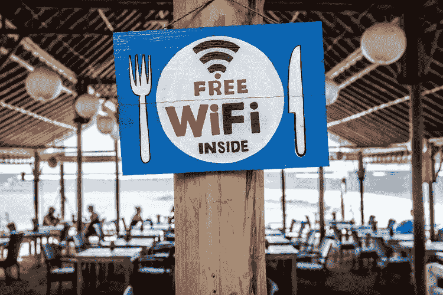

# 是时候采取位置数据驱动的决策来取得业务成功了

> 原文：<https://medium.datadriveninvestor.com/its-time-to-take-location-data-driven-decisions-for-business-success-94a8d3d81942?source=collection_archive---------5----------------------->

根据 Gartner 的研究，2020 年，将有 204 亿个联网“东西”在使用，高于 2017 年的 84 亿个。从智能手机到传感器到电器再到红绿灯，互联设备的指数级增长正在产生大量关于我们做什么、如何做以及在哪里做的数据。公司收集的大量数据都有空间成分。收集和分析这种类型的位置数据已经成为最强大和最重要的数据源之一，因为企业领导者知道，为了在当今的市场中保持竞争优势，他们必须了解和利用其数据的位置部分。

位置信息包含有关客户或其设备所在位置的信息，基于设备传感器、GPS 或 WiFi。连接到互联网的每台设备都被分配了一个编号，称为互联网协议(IP)地址。IP 地址通常用于标识设备连接到互联网的地理位置。例如，当消费者使用谷歌产品或与之互动时，他们的设备会向谷歌发送明确的位置信息，使他们能够提供各种定制服务。喜欢使广告更相关，如果一个人在他/她的移动设备中启用了位置历史并定期访问滑雪场，那么他/她以后可能会在 YouTube 上观看视频时看到滑雪设备的广告。

发现问题以防止错误也是位置数据的一个好处。例如，几个月前玩具反斗城表示，它打算清算其美国业务，并关闭其所有 735 家国内玩具店和婴儿反斗城商店。没有人会想到，这家有着 65 年历史、曾经在玩具零售领域占据主导地位的公司会有这么一天。他们的崩溃背后可能有几个原因，但作为一名数据分析人员，我认为其中一个原因是，如果随着时间的推移，他们会试图通过分析客户的购买行为、选择、收入和地理位置来了解客户不断变化的需求，那么他们肯定不会输掉与沃尔玛、塔吉特和亚马逊的玩具大战。

可以通过多种方式收集位置数据，最常见的方式是 Wi-Fi。Wi-Fi 定位不仅提高了用于导航目的的位置数据的准确性，而且还支持创建新的功能丰富的应用程序和服务。例如，下面是几个使用案例

1.  **提高本地销售:**本地优化，或在本地搜索中排名靠前的能力，对大多数企业来说都非常有价值。如果一家公司正在努力提高其本地性能，它需要研究地理围栏(一种虚拟的地理边界，使软件能够在移动设备进入或离开特定区域时触发响应。).由于这是一个基于位置的系统，人们可以在一个确定的地理区域内瞄准本地客户。一种方法是向周围地区的顾客发送促销信息。公司可以很容易地改变每天的促销活动，或者提供限时优惠，从而增加当地客户的销售额。
2.  **增加分析和指标分析工具:**本地销售可能难以衡量。是什么把顾客带到店里来的？如果公司没有机会调查每一个走进他们门口的顾客，这可能很难与他们的在线努力联系起来。然而，如果客户是带着公司的促销活动来的，公司可以衡量很多指标，包括他们的销售额，他们在你的商店呆了多长时间，以及他们访问你的公司的频率。所有这些都是有价值的信息，可以增加分析的深度。
3.  **为客户提供个性化服务:**位置数据的另一个好处是，它允许用户收集数据，以便为客户提供个性化服务。它给出了当地人口的统计数据，包括他们对什么样的优惠感兴趣，并让他们在商店里购物。通过查看购买历史，系统可以分析出当地客户更喜欢某种产品，因此可以相应地改变促销活动。

越来越多的企业——从购物中心到体育场——都在投资快速、免费的 WiFi。以下是一些特定于行业的使用案例，在这些案例中，Wi-Fi 位置数据分析可以提供更好的业务优势:

1.  **购物中心:**通过客人免费 wifi 服务，购物中心可以收集访客数据，并将访客分为不同类别，如周末访客、工作日访客、商务午餐时间访客、电影常客、酒吧访客等。将访问者分类将有助于他们发送定制的信息。例如，购物中心管理层可以向经常看电影的人发送免费可乐/爆米花的优惠券，以吸引他们在他们的影院观看电影。类似地，购物中心管理人员可以向经常光顾儿童商店的顾客发送电子邮件，通知他们购物中心内发生的儿童活动(如万圣节或圣诞节庆祝活动)。
2.  **零售店:**访客忠诚度数据库可以通过提醒顾客在进店时挑选他们最喜欢或购买最多的商品来创造个性化的体验。或者举例来说，如果一个人曾经每周去一次某个地方，但一个多月没有回来，那么一条有针对性的促销信息可能是阻止他的必要条件。成功的零售商将会创造相关的、个性化的顾客体验，并使用*位置数据*来做到这一点。
3.  **电子商店**:电子商店的系统可能会检测到客户在过去几个月内购买了某种设备，这意味着他可能对相关的配件、软件和升级感兴趣。因此，相关的购买建议可以通过电子邮件或短信发送给他。
4.  **球场:**一个球场是一个免费 WiFi 是必须要有的地方。因为游客在体育场和参观期间花费了大量时间，他们可能需要互联网来访问社交媒体以发布实时更新，或者他们可能需要查看办公室电子邮件或 slack 以应对工作紧急情况。除了通过 WiFi 满足客户需求之外，管理层还可以通过收集和维护访客数据库来从 WiFi 中获益。例如，如果一个人是体育场的常客，但不是俱乐部会员，那么他/她可以以折扣价获得俱乐部会员资格。或者可以向体育场的忠实观众发送关于免费座位升级的消息。了解顾客的喜好总是有帮助的。例如，如果一个人是体育场的常客，但只参加音乐会，那么通过发送关于音乐会的信息将有助于保持他阅读体育场发送的电子邮件的兴趣，否则，如果他得到关于每个事件的信息，他可能会感到沮丧并从邮件列表中取消订阅。
5.  **医院:**从急诊到非急诊，再到日常预防保健，位置跟踪技术可能会对我们未来的健康和福祉产生重大影响。例如，如果少数患者连接到 WiFi 的时间低于平均水平，那么这可能是由于患者寻求的服务不可用，因此他们很快就离开了医院。因此，预测/预测访问者的需求总是一个好主意，这样就可以在正确的时间、正确的地点提供正确的服务。

位置数据目前是我们日常生活的一部分，也是我们激动人心的未来的一部分。随着大量数据而来的是巨大的责任，技术玩家必须通过透明和对他们收集的信息负责来尊重这种潜力。现在是投资这样一个系统的最佳时机。如果一个人计划在个人层面上有效地与他们的客户打交道，那就别无选择。

谢了。快乐学习:)