# 杰克·博格尔:终极数据驱动型投资者

> 原文：<https://medium.datadriveninvestor.com/jack-bogle-the-ultimate-data-driven-investor-79038d3f6784?source=collection_archive---------17----------------------->

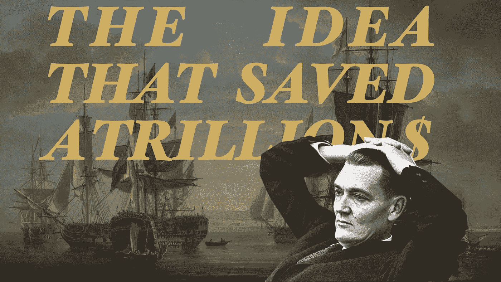

Bogle: the ultimate data-driven investor

** *这篇视觉短文改编自一个* [*视频的剧本:省下一万亿美元的想法***](https://youtu.be/4vwNgSKg67A)

我们钦佩那些凭借投资业绩成为亿万富翁的人。像巴菲特、索罗斯、伊坎这样的人，他们都是亿万富翁。然而，就为他人省钱的**而言，有一个人保持着可能永远不会被打破的记录:杰克·博格尔(Jack Bogle)，他于 2019 年 1 月 16 日去世。他用一种顽强的数据驱动方法做到了这一点，这导致了 Vanguard 的创建。如今，先锋集团是全球最大的资产管理公司之一，但这并不是一个容易的开始。他的故事表明，仅凭数据和学术研究无法动摇投资者的想法。**

# **万亿美元的想法**

**据估计，他为大大小小的投资者节省了一万亿美元，彭博称先锋为“私营部门的财富转移机器”。**

**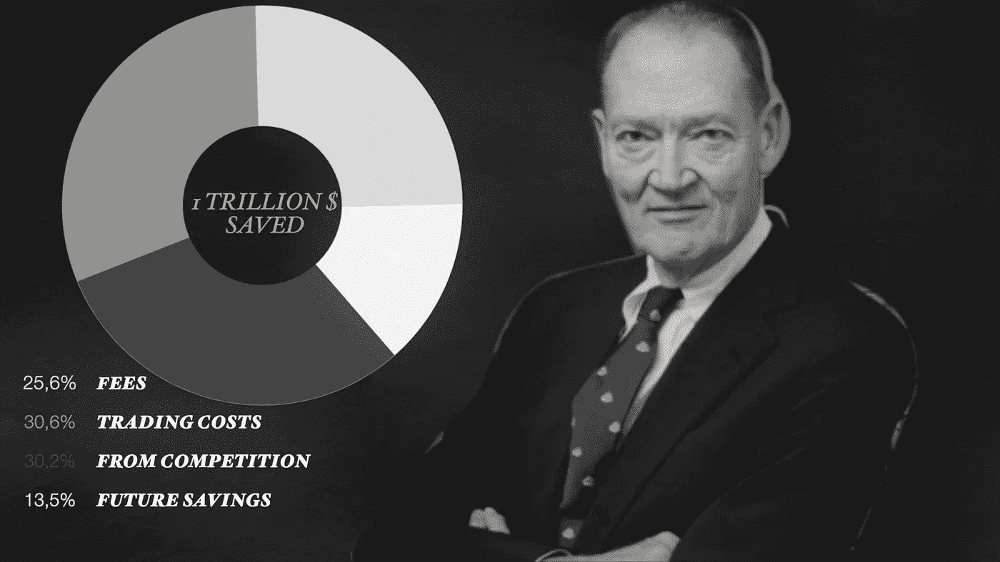**

**虽然这是一个基于未来影响的松散近似值，但毫无疑问，无论你如何计算，这个数字都是巨大的。**

# **处于思想的前沿**

**故事开始于 1951 年，在普林斯顿，Bogle 写了一篇关于基金管理的论文。报告最后对该行业的未来发展提出了以下建议:**

*   ***减少销售负荷和管理费***
*   ***不要宣称自己优于市场平均水平***

**基金经理 Wellington 的首席执行官沃尔特·摩根(Walter Morgan)对此印象深刻。他给了他一份工作。这是一家传统的基金管理公司，挑选股票来战胜市场。在那里，Bogle 得到了晋升，并在公司的早期因各种新产品和计划而受到好评。事实上，他做得非常好，最终他自己成为了首席执行官。**

**然而，事情可以用不同的方式来做的信念一直在他的脑海中，不断有研究来使这个概念变得越来越强大。**

## **大量研究**

**像未来的诺贝尔奖得主保罗·a·萨缪尔森这样的人正在挑战现状。**

**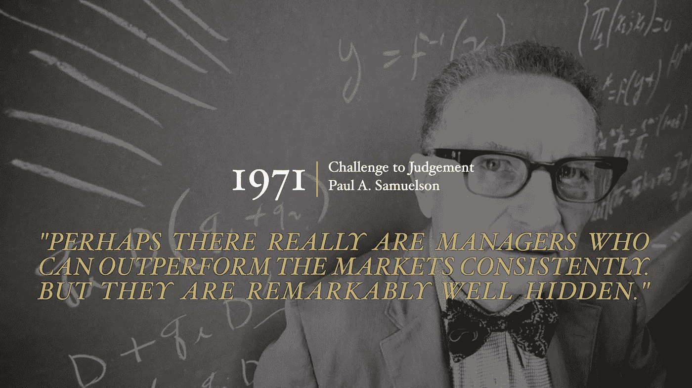**

**像《漫步华尔街》这样的书证明了“大多数人都在浪费时间试图跑赢股市”，并呼吁创建一个廉价的指数基金。**

**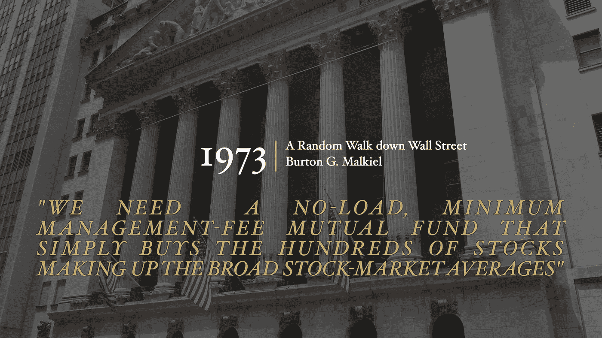**

**《输家的游戏》将股市比作一个赌场，投资者的胜算很小。他们的交易和研究成本在轮盘赌中扮演着绿色零的角色。**

**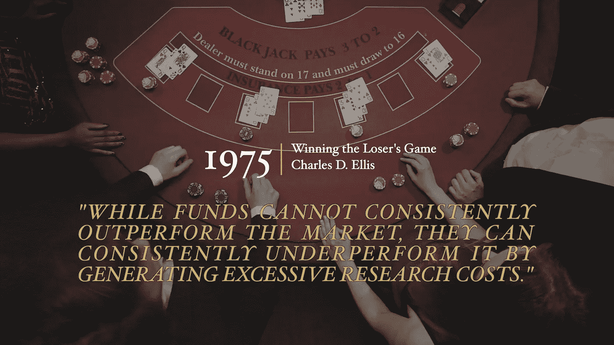**

**而且 Bogle 本人在他的[第一只指数基金的历史中提到的参考文献更多。](https://www.vanguard.com/bogle_site/lib/sp19970401.html)**

## **数据确认**

**从 1945 年到 1975 年，标准普尔 500 每年超过平均基金 1.6%。到那时，博格尔感到不得不采取行动。**

**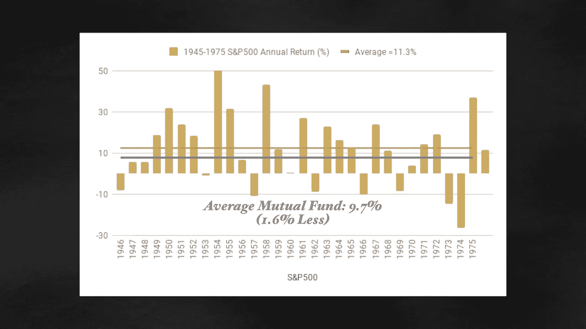**

# **起航**

**巧合的是，1975 年，在一次失败的合并后，他被罢免了首席执行官一职。他很快就推出了指数基金计划。他相信，他能以极低的成本创造比大多数基金更好的业绩。**

**他建立了一个摊位，以表明“巨大的回报来自成本的微小差异”。**

**它的逻辑非常简单。**

**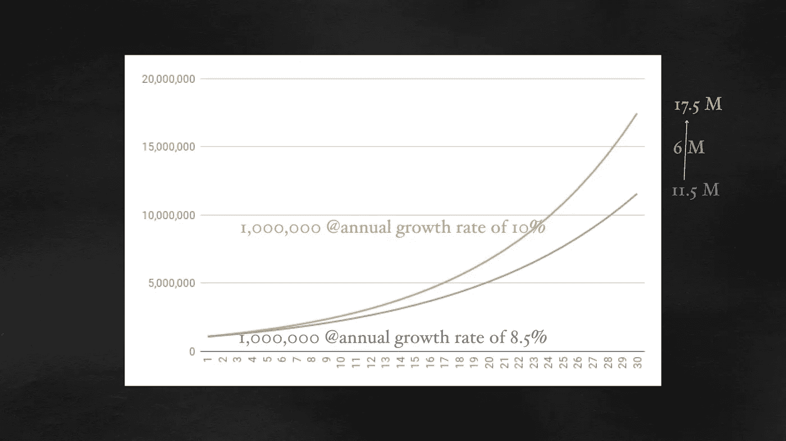**

**年回报率为 10%的 100 万美元投资在 30 年后将价值 1750 万美元，如果回报率为 8.5%(使用 1.5%的成本差异)，将价值 1150 万美元。差额是初始投资的 6 倍。**

**这是一家新公司的第一块石头，该公司以纳尔逊上将的船只“前卫号”命名。这个名字是一个明确的信号:**

*   **该公司是一个新的逻辑概念的先锋:指数基金**
*   **这不会被轻易阻止**

**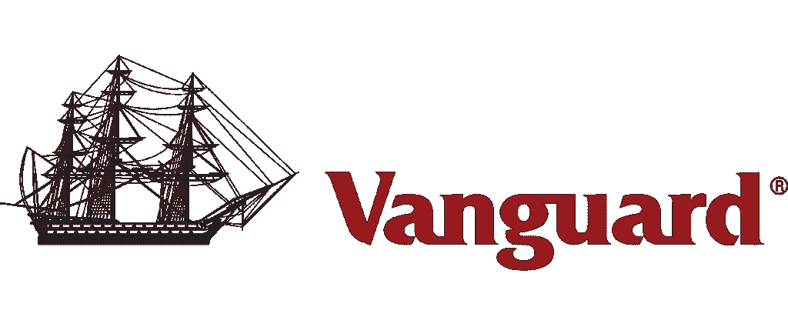**

# **逆风**

**第一只基金以 S&P500 为基础，费用设定为 0.5%，平均基金费用为 2%，或高出 1.5%。该基金只是要以最低的成本达到市场平均水平。一个非常简单的想法，但却是革命性的。**

## **博格尔的愚蠢**

**业内人士并没有被吓到，他们认为这很可笑。这个概念很快被贴上了“博格勒的愚蠢”的标签。**

**大型资产管理公司富达(Fidelity)的董事长宣称，这永远行不通。**

**平均的概念听起来很平庸。另一个竞争者拿出一张传单，上面写着:“谁想让一个普通的外科医生给谁做手术，就让一个普通的律师给谁出主意。”**

******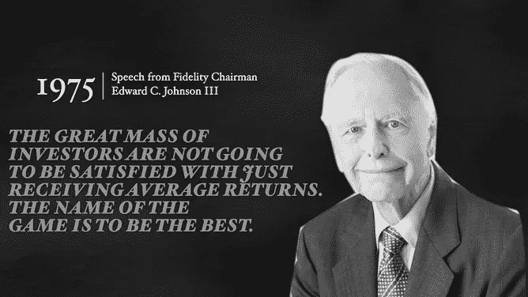******

**对我们今天的许多人来说，指数基金是一个显而易见的选择，但如果你站在 70 年代投资者(今天仍有许多投资者)的角度，这是违背直觉的。**

**你怎样才能打败那些互相竞争的高技能专业资产经理，并通过冷静地跟随市场，通过做最少的努力来打败市场？**

**(简而言之:投资者形成了市场，因此他们无法战胜市场)**

**当时只有 3 个人的先锋指数基金团队进行了一次路演，筹集了 1.5 亿美元。经过几周的紧张营销，他们筹集了 1140 万美元。整个 70 年代，管理的资产(AUM)停留在类似的水平。该基金肯定一直在亏本运营。**

**50 个基点在交易费 20 个基点和管理费 30 个基点之间分配。1100 万 x 0.30% =每年 3.3 万美元。即使在 70 年代，3 英镑的薪水和所有相关费用也不算多。幸运的是，该公司仍然与威灵顿有着千丝万缕的联系，传统资金总计超过 10 亿 AUM 元，所以它活了下来。**

**一直熬到 80 年代。然而，正如预测的那样，它年复一年地表现出色。这个概念正在成为现实。事情开始好转。先锋号正在航行和成长，但它必须再等十年才能到达一个真正的转折点。**

## **先锋舰队**

**20 世纪 90 年代，一切都开始朝着先锋的方向发展。**

*   **互联网让每个人都很容易获取数据(雅虎财经诞生于 1994 年)**
*   **有很多好的报道**
*   **Bogle 经常出现在电视上，虽然他并不总是得到最好的问题，但他非常清楚地表达了他的信息。**

**数十亿美元在流动。每个人都注意到，甚至富达推出了指数基金和一种新的指数工具，即 ETF 或交易所交易基金。**

**Vanguard 基于同样的概念发起了更多的基金，reso 使用正在进行的海军比喻，它开始看起来很像这样。**

**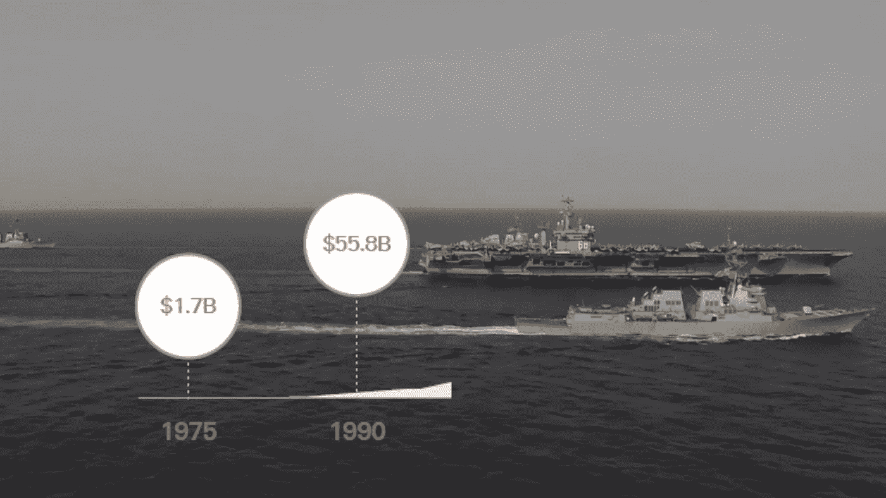**

# **被动攻击**

**先锋飙升，并保持快速增长，直到今天。AUM 现在有超过 5 万亿美元。如果它今天推出，它会被称为一个颠覆性的创业公司，但这个词在当时从未被使用过。**

**更重要的是，这个想法已经超越了先锋。它永远改变了我们的投资方式。我们现在称之为‘被动投资’。你只是跟着市场走，而不是试图战胜市场的积极投资。到 2024 年，被动投资将超过主动投资。**

**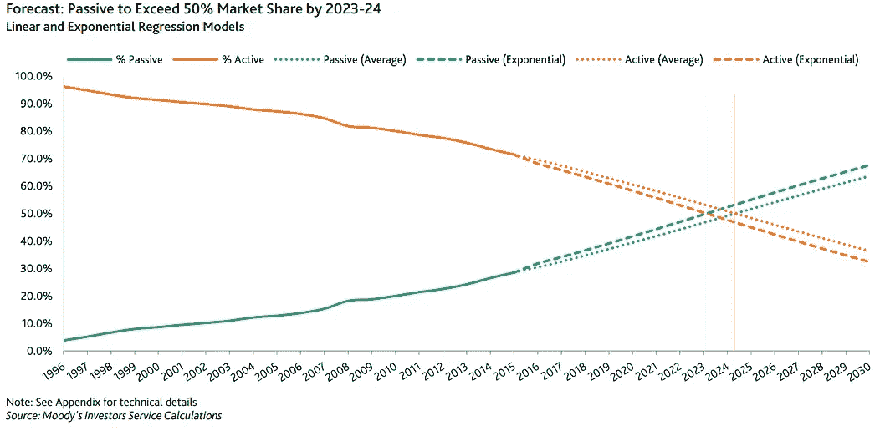****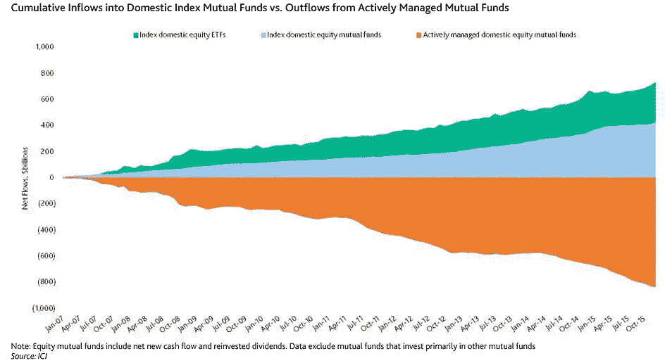**

**Passive v. Active Investment: Source Moody’s**

**投资者有了更多的选择。共同基金费用继续下降。先锋基金的平均费用现在是 11 个基点。2019 年 1 月，富达推出首只 0%手续费指数基金。**

**有了 1 万亿美元的直接和间接储蓄，投资者群体应该心存感激。沃伦·巴菲特，最成功的投资者，也是博格尔最热情的支持者之一。**

**指数基金如今如此受欢迎，以至于人们很容易忘记杰克·博格尔在创建它们时是多么勇敢和顽强。**

**被动投资的想法最终肯定会出现。然而，它姗姗来迟的成功很好地提醒了我们，即使是有数据和诺贝尔奖级理论支持的最好的想法，也只是一个想法，直到一个人或团队付出艰苦的努力将其转化为现实。这对今天和明天的创业公司和创新者来说是一个很好的教训。**

**如果你想要类似的故事以及视频格式的金融概念分析，我们刚刚推出了一个 YouTube 频道，专门播放有意义的金融故事。就像 Vanguard 一样，这是一个大约 1000+订户的适度开始，所以如果你[订阅](https://www.youtube.com/channel/UCIVDZZ2reIURr1tCoQ4ZF9Q?sub_confirmation=1)或给我一些反馈，我会很高兴。**

** [## 投资公司

### 烹饪是一个奇观，厨房是一个剧院。来自世界上最好的食品工匠的故事和菜肴…

www.youtube.com](https://www.youtube.com/channel/UCIVDZZ2reIURr1tCoQ4ZF9Q?view_as=subscriber) 

## 来自 DDI 的相关故事:

 [## 为什么数据会改变投资管理

### 有人称之为“新石油”虽然它与黑金没有什么相似之处，但它的不断商品化…

medium.com](https://medium.com/datadriveninvestor/why-data-will-transform-investment-management-4a60966c1c81)  [## 投资算法快速指南

### 让我们想象一下 30 年前的股市…

medium.com](https://medium.com/datadriveninvestor/a-quick-guide-to-investment-algorithms-628450b9dc55)**