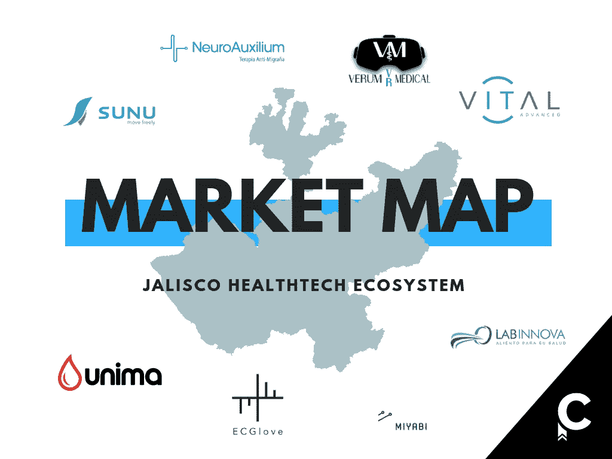

# 哈利斯科，领先的健康技术中心。

> 原文：<https://medium.datadriveninvestor.com/jalisco-leading-healthtech-hub-1a8ccfc70bfc?source=collection_archive---------23----------------------->

[瓜达拉哈拉](https://www.contxto.com/2018/12/jalisco-leading-fintech-hub/)欣欣向荣，人们。不仅仅是在 T2 金融科技和消费软件方面。

医疗保健行业拥有几个优秀的人才库和大学，如 UdeG、UAG 和 Tecnológico de Monterrey，由于企业家愿意并能够开发推动该行业发展的技术，医疗保健行业正在走向巅峰；随之而来的是数百万人的健康和内心的平静。

总体而言，墨西哥目前是推动医疗技术领域变革的主要经济体之一。[它几乎是整个拉丁美洲唯一的健康设备制造商](https://saludiario.com/mexico-principal-exportador-de-dispositivos-medicos-en-latinoamerica/)，仅在两年内(从 2018 年到 2020 年)[它预计将以 5.3%的惊人速度增长，比包括日本、美国、德国、瑞士和意大利在内的大多数发达国家都要快。](https://saludiario.com/se-fortalece-tecnologia-medica-en-jalisco/)

哈利斯科州是领先的主要州之一。以下初创公司只是众多公司中的一小部分，它们创造出令人惊叹的东西来改善行业内的流程和人们的生活质量。

# **苏努(**[**https://www.sunu.io/**](https://www.sunu.io/es/index.html)**)**

外观酷炫的腕带，帮助盲人或视障人士自由自信地移动。它结合了尖端的虚拟现实和雷达技术来检测和分析环境，当有东西挡路时通知和警告用户。

# **乌尼玛(**[**https://www.unima.com.mx/**](https://www.unima.com.mx/nsite/index.html)**)**

在快速廉价地诊断传染病方面，Unima 是王者。只需要一滴血、一张诊断试纸和一部照相手机就能确定病人的情况。当然，这项技术在幕后要复杂得多，但它的易用性正是用户喜欢的。

# **ECGlobe(**[**https://www.ecglove.com/**](https://www.ecglove.com/)**)**

这些人找到了进入你内心的方法。俗气，但却是真的。他们开发了一种手套，只需将它压在患者的胸部，就可以洞察患者的心脏状态。这是完美的便携式心电图，兄弟！

# **宫比拉拉(**[**【http://miyabilabs.com/】**](http://miyabilabs.com/main-page)**)**

注意缺陷多动障碍是真实存在的。Miyabi 实验室旨在通过让患者沉浸在基于虚拟现实的游戏中来改善这一问题，以提高他们的注意力并评估他们的表现。说真的！我小时候这些人在哪里？

# **神经辅助系统(**[**http://neuroauxilium.com/**](http://neuroauxilium.com/)**)**

没有止痛药。非侵入性。没有副作用。如果您患有偏头痛，无论是急性还是慢性，您肯定需要尝试 Neuroauxilium 的神经刺激治疗。最重要的是，他们还利用自己的技术治疗眼部疾病(如黄斑变性、近视、散光等)。

# **Verum VR 医疗(**[**http://www.verumvrmedical.com/**](http://www.verumvrmedical.com/)**)**

这是给未来一代医生的。Verum 利用虚拟现实技术的力量，从 3D 和清晰的视觉角度教授和解释医学概念、外科手术和疾病治疗。远远超出了传统的保健教科书，姐妹。

# **生命进阶(******)****

**Medisist 整合了一个结合远程医疗、移动软件、物联网和其他技术的系统，以创建这个 360 医疗平台。他们提供 24/7 全天候监控和协助等服务，以及交互式在线医疗记录和与生物医学设备的互连。没时间浪费了。**

# ****拉宾诺娃(**[**http://www.labinnova.com.mx/**](http://www.labinnova.com.mx/)**)****

**忘记侵入性的，不舒服的，昂贵的实验室检查。Labinnova 允许患者通过他们的呼吸样本来检测乳腺癌。听起来很疯狂。是真的。该公司开发了一种系统和算法，以更有效的方式识别这种病理的组成部分。对不舒服的抓胸方法说再见。**

**我觉得这个行业很吸引人。我发现做这些突破的人是天才。如果你想发现更多颠覆旧工业的墨西哥人才，请继续关注。**

**哈利斯科越来越大了，宝贝。**

**风险投资。**

**[到议会入口](https://cortesvictorh.com/author/cortesvictorh/)**

****Publicada**2018 年 10 月 22 日**

***原载于 2018 年 10 月 22 日*[*cortesvictorh.com*](https://cortesvictorh.com/2018/10/22/jalisco-leading-healthtech-hub/)*。***