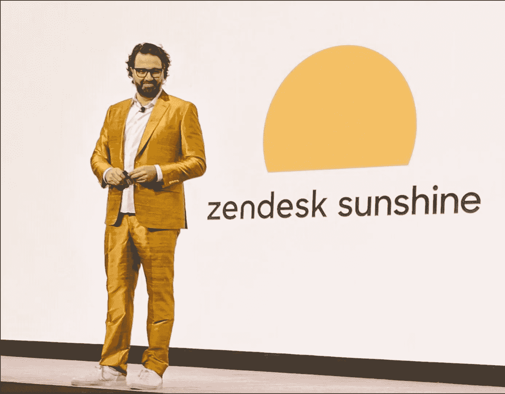
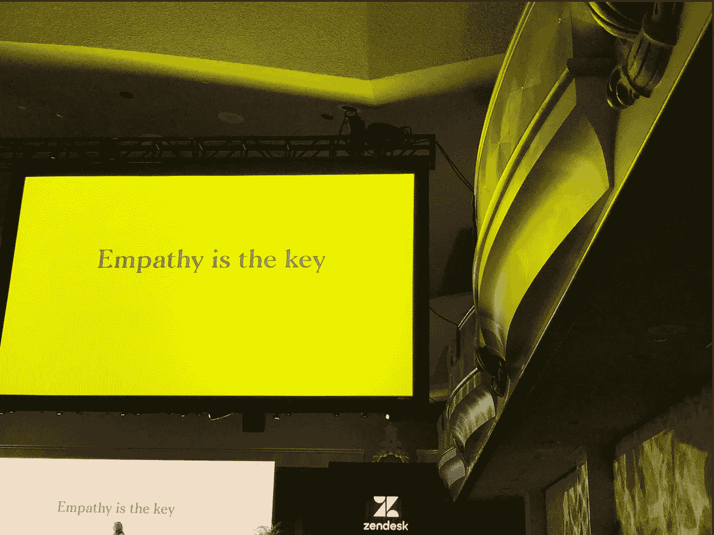
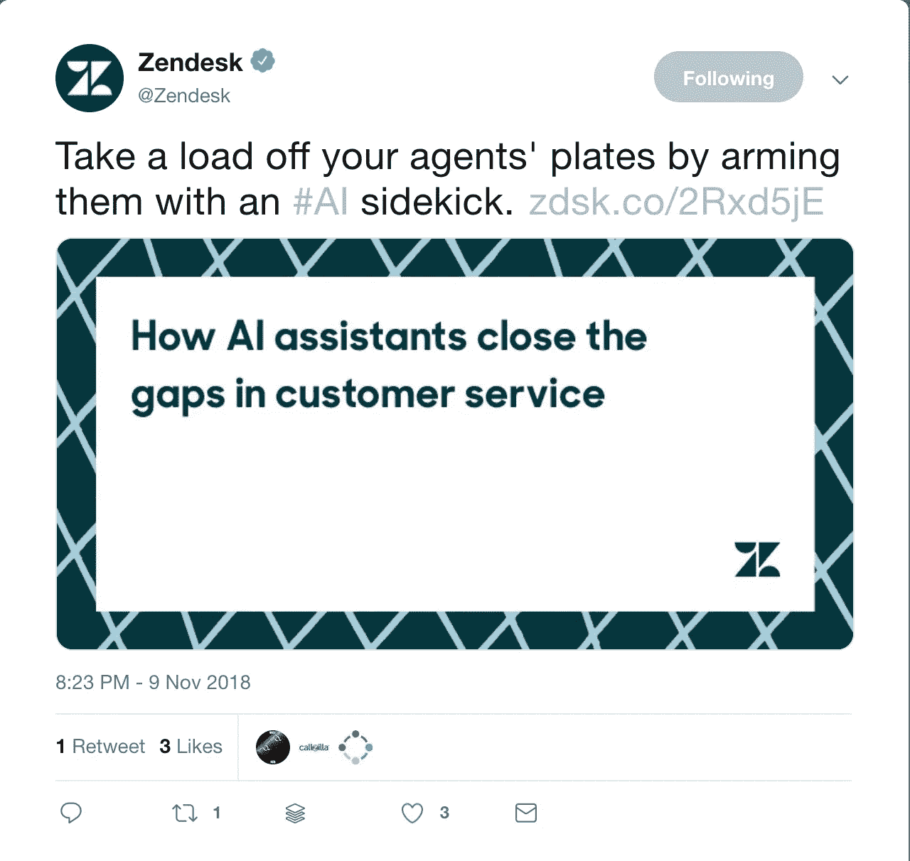
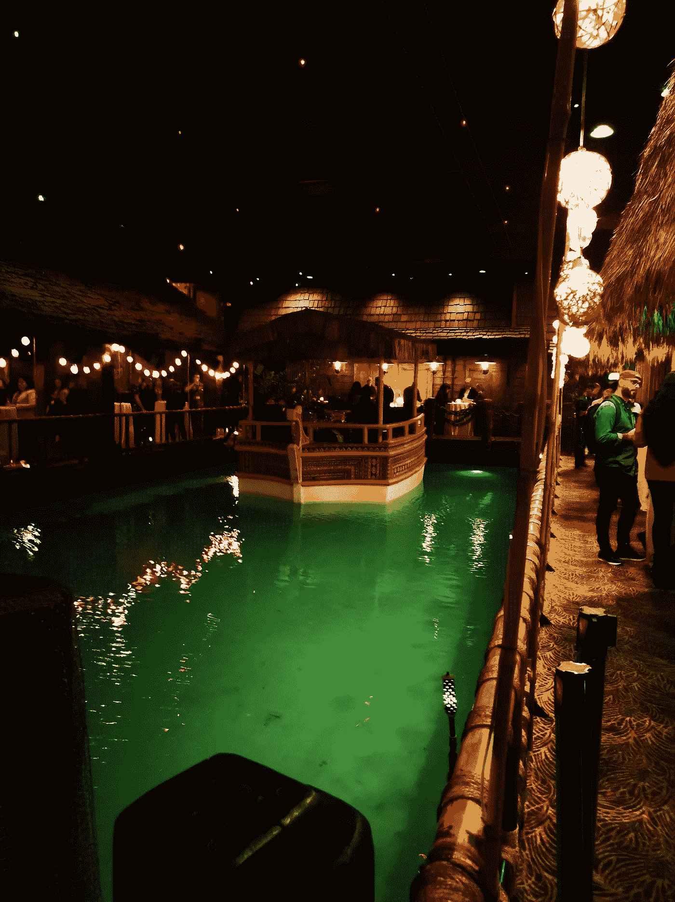
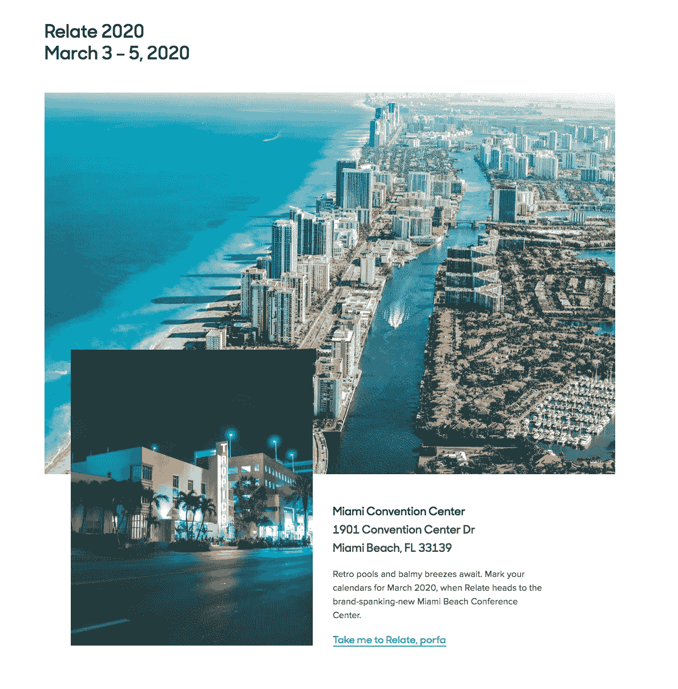

# Zendesk Relate 2018 的 Jatana

> 原文：<https://medium.datadriveninvestor.com/jatana-at-zendesk-relate-2018-f520f20ee96?source=collection_archive---------18----------------------->

我们的第一次恋爱结束了！

这是美妙的三天，有很多激动人心的谈话、产品发布、与现有客户和潜在客户、朋友和合作伙伴、新面孔和熟悉的人的会面！

我们带回家的主要知识是什么？(很快将到达[站 F](https://stationf.co/) ，作为 Zendesk 启动程序的一部分，Jatana 正在那里移动)。

## 我们需要一个更好的裁缝(看看下面米克尔穿的衣服！)

## 像 [Jatana](https://www.jatana.ai/) 这样的解决方案是当下的需要。

随着越来越多的公司开始使用人工智能(即使我相信全球只有不到 1%的公司已经部署了 AI)，我们可以为客户体验的世界带来的影响就越大。

事实上，你在不需要人工智能的任务上节省的时间越多，你就可以花更多的时间为你的客户创造惊人的体验。

像 Jatana 这样的解决方案可以帮助您自动进行电子邮件对话，提高客户满意度。

## 重要的是要采取整体的方法，将几个数据源连接在一起。

正因如此，Zendesk 引入了[阳光](https://www.zendesk.com/platform/)，根据下面在 [TechCrunch](https://techcrunch.com/2018/11/13/zendesk-shifts-to-platform-play-with-zendesk-sunshine-launch/) 上对 Mikkel Svane 的采访。

> “在接下来的几年里，你会在我们的路线图上看到更多，以真正实现我们的平台使命，我们的最终目标是成为一个无处不在的 CRM 平台，任何人都可以构建任何类型的面向客户的应用程序，并真正受益于公共云和阳光框架，让数据在服务、供应商和应用程序之间无缝流动。”——Mikkel Svane，Zendesk

## 同理心是王道

Always!

没有任何技术可以取代它。

[还没有](https://hackernoon.com/frontier-ai-how-far-are-we-from-artificial-general-intelligence-really-5b13b1ebcd4e)，至少！

## 聊天机器人即将起飞！

聊天机器人市场刚刚起步，我们在 Relate 采访的几乎每一家公司都在寻求与客户进行智能和自动化的互动。让我们知道 [BotSupply](https://www.botsupply.ai/) 是否能有所帮助；)

## 费尔蒙特有有史以来最酷的酒吧！

## 永远不要离开你的桌子！

## 保持健康和身材。下一个相关的是在迈阿密！

下次见！