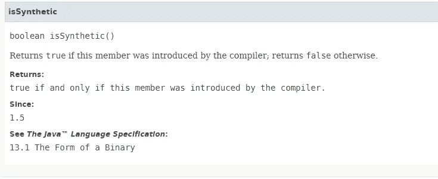

# Java 合成方法——这些是什么？

> 原文：<https://medium.datadriveninvestor.com/java-synthetic-methods-what-are-these-52f77efb347a?source=collection_archive---------1----------------------->


Photo by [Rene Böhmer](https://unsplash.com/@qrenep?utm_source=medium&utm_medium=referral) on [Unsplash](https://unsplash.com?utm_source=medium&utm_medium=referral)

*本博客原载于我的博客@linqz.io* [*此处*](https://www.linqz.io/2019/12/what-is-a-java-synthetic-method.html) *。*

我确信几乎所有的 Java 开发人员都使用过 Java 的反射 API，如果你是那些好奇的人之一，浏览过 [javadoc](https://docs.oracle.com/javase/8/docs/api/java/lang/reflect/Member.html) 上的所有函数，那么你一定见过这个[member . issynetic()](https://docs.oracle.com/javase/8/docs/api/java/lang/reflect/Member.html#isSynthetic())(如果你没有，不要担心你会学到一些有趣的东西)。



那么正如文档中简单地说“编译器引入的成员”，这是否意味着编译器改变了我们的代码呢？经过四处搜索，如果我们按 JLS(Java 语言规范)-13.1 综合的说法是:

> 如果 Java 编译器发出的构造与源代码中显式或隐式声明的构造不对应，则必须将其标记为*合成*，除非发出的构造是类初始化方法

这些方法由 Java 编译器创建，作为 [**类型擦除**](https://docs.oracle.com/javase/tutorial/java/generics/erasure.html) **的结果，或者当嵌套私有类的私有方法或变量被访问时。**

[](https://www.datadriveninvestor.com/2019/02/21/best-coding-languages-to-learn-in-2019/) [## 2019 年最值得学习的编码语言|数据驱动的投资者

### 在我读大学的那几年，我跳过了很多次夜游去学习 Java，希望有一天它能帮助我在…

www.datadriveninvestor.com](https://www.datadriveninvestor.com/2019/02/21/best-coding-languages-to-learn-in-2019/) 

因此，在接下来的几个步骤中，我将向您展示创建合成方法、类或成员变量的一些情况(下面可能不是完整的列表，如果其他人在场，请告诉我，Java 代码已经上传到 Github [**这里**](https://github.com/root0109/synthetic-concept) ):

让我们看一下下面的例子。我们的**合成匿名测试类生成**

1.  **合成匿名测试**

```
import lombok.Data;
[@Data](http://twitter.com/Data)
public class **SyntheticAnonymousTest**
{
 interface **Callback**<T>
 {
  String call(T value);
 }public static void main(String[] args)
 {
  System.out.println(new Callback<String>()
  {
   [@Override](http://twitter.com/Override)
   public String call(String value)
   {
    return ("Synthetic Anonymous " + value);
   }
  }.call("Test"));
 }
}
```

如果您编译上面的 java 代码，它会生成下面的 synthetic**synthetic anonymoustest $ 1 . class**，通过反汇编您会看到下面的代码:

```
SyntheticAnonymousTest$1.class 
SyntheticAnonymousTest$Callback.class 
SyntheticAnonymousTest.class$ javap SyntheticAnonymousTest$1.class

**class com.mytest.SyntheticAnonymousTest$1 implements com.mytest.SyntheticAnonymousTest$Callback<java.lang.String> {
  com.mytest.SyntheticAnonymousTest$1();
  public java.lang.String call(java.lang.String);
  public java.lang.String call(java.lang.Object);
}**$ javap SyntheticAnonymousTest$Callback.class

interface com.mytest.SyntheticAnonymousTest$Callback<T> {
  public abstract java.lang.String call(T);
}$ javap SyntheticAnonymousTest.class

public class com.mytest.SyntheticAnonymousTest {
  public static void main(java.lang.String[]);
  public boolean equals(java.lang.Object);
  protected boolean canEqual(java.lang.Object);
  public int hashCode();
  public java.lang.String toString();
  public com.mytest.SyntheticAnonymousTest();
}
```

所以上面的实验生成了**一个**类的合成代码。现在想象一下，如果你的代码有数百个这种类型的类，那么下一个问题就是

# **它们对性能有影响吗？**

## 答案是肯定/否定的。

因此，它的代价非常小，即额外的方法及其相关的调用成本，这对**企业级应用**中的大多数用例来说是无关紧要的，微不足道的(因为我们在服务器上拥有足够的内存，即至少 4GB 以上),但在基于 **Android 的**手机上的 Java 代码并非如此。

在 Android 手机上，你的任务是优化内存的使用，这些额外的方法可能会增加成千上万个不需要的方法*，因为我们的代码中到处都有这些嵌套/匿名类(包括库)。*

*如果你查看 Android 开发者博客，你会得出以下结论:*

1.  *Android app 有 [64K 方法限制](https://developer.android.com/studio/build/multidex.html#about)(无 multidex)。所以浪费几千个方法作为不需要的合成方法是不明智的。*
2.  *[访问器的性能比直接字段访问](https://developer.android.com/training/articles/perf-tips.html#GettersSetters)慢。*

*由于上述方法限制适用于 Android，因此它对基于移动的 Java 应用程序有较大影响，但对基于企业级 Java 的应用程序没有影响，因为没有内存限制且升级成本较低。*

*此外，我试图在下面的例子中编写一个全面而详细的解释，这些例子生成了合成成员/类等，快速浏览一下:*

*2.**综合功能测试***

```
*import java.util.function.Function;
import lombok.Data;
[@Data](http://twitter.com/Data)
public class **SyntheticFunctionTest**
{
 public static final Function<String, String> returnString = new Function<String, String>()
 {
  public String apply(String value)
  {
   return "Synthetic Function " + value;
  }
 }; public static void main(String[] args)
 {
  System.out.println(returnString.apply("Test"));
 }
}*
```

*如果您编译上面的 java 代码，它会生成下面的 synthetic**synthetic function test $ 1 . class**，通过反汇编您会看到下面的代码:*

```
***SyntheticFunctionTest$1.class**
SyntheticFunctionTest.class$ javap **SyntheticFunctionTest$1.class**
class com.mytest.SyntheticFunctionTest$1 implements java.util.function.Function<java.lang.String, java.lang.String> {
  com.mytest.SyntheticFunctionTest$1();
 ** public java.lang.String apply(java.lang.String);
  public java.lang.Object apply(java.lang.Object);**
}$ javap SyntheticFunctionTest.class
public class com.mytest.SyntheticFunctionTest {
  public static final java.util.function.Function<java.lang.String, java.lang.String> returnString;
  static {};
  public static void main(java.lang.String[]);
  public boolean equals(java.lang.Object);
  protected boolean canEqual(java.lang.Object);
  public int hashCode();
  public java.lang.String toString();
  public com.mytest.SyntheticFunctionTest();
}*
```

***3。合成基因测试***

```
*import java.util.Date;
import lombok.Data;
[@Data](http://twitter.com/Data)
public class **SyntheticGenericTest**<A extends CharSequence, B extends Date>
{
 public static void main(String[] args)
 {
  NestedClass<String, Date> nestedClass = new NestedClass<>();
  System.out.println(nestedClass.getData());
 } private static final class **NestedClass**<A, B>
 {
  private A testA;
  private B testB; private Object getData()
  {
   return getTestString() + "-" + getTestDate();
  } public A getTestString()
  {
   return testA;
  } public B getTestDate()
  {
   return testB;
  }
 }
}*
```

*如果你编译上面的 java 代码，它生成下面合成的 **access$1** 方法**生成的**，通过反汇编你看到下面的代码:*

```
*SyntheticGenericTest$NestedClass.class
SyntheticGenericTest.class$ javap SyntheticGenericTest$NestedClass.class

final class com.mytest.SyntheticGenericTest$NestedClass<A, B> {
  public A getTestString();
  public B getTestDate();
  com.mytest.SyntheticGenericTest$NestedClass(com.mytest.SyntheticGenericTest$NestedClass);
 ** static java.lang.Object access$1(com.mytest.SyntheticGenericTest$NestedClass);**
}$ javap SyntheticGenericTest.class

public class com.mytest.SyntheticGenericTest<A extends java.lang.CharSequence, B extends java.util.Date> {
  public static void main(java.lang.String[]);
  public boolean equals(java.lang.Object);
  protected boolean canEqual(java.lang.Object);
  public int hashCode();
  public java.lang.String toString();
  public com.mytest.SyntheticGenericTest();
}*
```

*4.**综合测试***

```
*import lombok.Data;
[@Data](http://twitter.com/Data)
public class **SyntheticInnerTest**
{
 public static void main(String[] args)
 {
  SyntheticInnerTest syntheticTest = new SyntheticInnerTest();
  NestedClass nestedClass = syntheticTest.new NestedClass();
  System.out.println(nestedClass.getResult());
 } private static String displayText(String test)
 {
  return test;
 } private final class **NestedClass**
 {
  private final String testString = "Synthetic Nested String : "; private String getResult()
  {
   return SyntheticInnerTest.displayText(testString);
  }
 }
}*
```

*如果你编译上面的 java 代码，它会生成下面的合成**这个。$0** **access$0** 和 **access$1** 方法是在父类和子类中生成的，通过反汇编可以看到下面的代码:*

```
*SyntheticInnerTest.class
SyntheticInnerTest$NestedClass.class$ javap SyntheticInnerTest$NestedClass.class

final class com.mytest.SyntheticInnerTest$NestedClass {
  **final com.mytest.SyntheticInnerTest this$0;**
  com.mytest.SyntheticInnerTest$NestedClass(com.mytest.SyntheticInnerTest, com.mytest.SyntheticInnerTest$NestedClass);
  static java.lang.String **access$1(com.mytest.SyntheticInnerTest$NestedClass);**
}$ javap SyntheticInnerTest.class

public class com.mytest.SyntheticInnerTest {
  public static void main(java.lang.String[]);
  public boolean equals(java.lang.Object);
  protected boolean canEqual(java.lang.Object);
  public int hashCode();
  public java.lang.String toString();
  public com.mytest.SyntheticInnerTest();
  **static java.lang.String access$0(java.lang.String);**
}*
```

*5.**人工合成材料测试***

```
*import lombok.Data;
[@Data](http://twitter.com/Data)
public class **SyntheticLambdaTest**
{
 interface Callback<T>
 {
  String call(T value);
 } public static void main(String[] args)
 {
  System.out.println(((Callback<String>) value -> "Synthetic Lambda " + value).call("Test"));
 }
}*
```

*如果您编译上面的 java 代码，您会注意到在反汇编之后没有生成合成方法:*

```
*javap SyntheticLambdaTest.class
javap SyntheticLambdaTest$Callback.class$ javap SyntheticLambdaTest.class

public class com.mytest.SyntheticLambdaTest {
  public static void main(java.lang.String[]);
  public boolean equals(java.lang.Object);
  protected boolean canEqual(java.lang.Object);
  public int hashCode();
  public java.lang.String toString();
  public com.mytest.SyntheticLambdaTest();
}$ javap SyntheticLambdaTest$Callback.class

interface com.mytest.SyntheticLambdaTest$Callback<T> {
  public abstract java.lang.String call(T);
}*
```

*6.**合成方法参考测试***

```
*import java.util.function.Supplier;
import lombok.Data;
[@Data](http://twitter.com/Data)
public class **SyntheticMethodReferenceTest**
{
 private static class Greeter
 {
  public static String sayHi()
  {
   return "Synthetic Hi!";
  }
 } public static void main(String[] args)
 {
  Supplier<String> supplierHi = Greeter::sayHi;
  System.out.println(supplierHi.get());
 }
}*
```

*如果您编译上面的 java 代码，您会注意到在反汇编之后没有生成合成方法:*

```
*SyntheticMethodReferenceTest$Greeter.class
SyntheticMethodReferenceTest.class$ javap SyntheticMethodReferenceTest$Greeter.class

class com.mytest.SyntheticMethodReferenceTest$Greeter {
  public static java.lang.String sayHi();
}$ javap SyntheticMethodReferenceTest.class

public class com.mytest.SyntheticMethodReferenceTest {
  public static void main(java.lang.String[]);
  public boolean equals(java.lang.Object);
  protected boolean canEqual(java.lang.Object);
  public int hashCode();
  public java.lang.String toString();
  public com.mytest.SyntheticMethodReferenceTest();
}*
```

*7.**综合测试***

```
*import java.util.Date;
import lombok.Data;
[@Data](http://twitter.com/Data)
public class **SyntheticTest**
{
 public static void main(String[] args)
 {
  SyntheticTest syntheticTest = new SyntheticTest();
  NestedClass nestedClass = syntheticTest.new NestedClass();
  System.out.println(nestedClass.testString);
  System.out.println(nestedClass.getTestString());
  System.out.println(nestedClass.getData());
  System.out.println(nestedClass.getData1());
 } private final class **NestedClass**
 {
  private String testString = "Synthetic Nested Class : ";
  private Date testDate = new Date(); private String getData()
  {
   return (testString + testDate);
  } private String getData1()
  {
   return (getTestString() + getTestDate());
  } public String getTestString()
  {
   return testString;
  } public Date getTestDate()
  {
   return testDate;
  }
 }
}*
```

*如果你编译上面的 java 代码，它不会生成任何合成类而是生成 **this。$0** 、**访问$1、访问$2 和访问$3** 方法，通过反汇编您会看到生成了以下代码类:*

```
*SyntheticTest$NestedClass.class
SyntheticTest.class$ javap SyntheticTest$NestedClass.classfinal class com.mytest.SyntheticTest$NestedClass {
 ** final com.mytest.SyntheticTest this$0;**
  public java.lang.String getTestString();
  public java.util.Date getTestDate();
  com.mytest.SyntheticTest$NestedClass(com.mytest.SyntheticTest, com.mytest.SyntheticTest$NestedClass);
  static java.lang.String **access$1(com.mytest.SyntheticTest$NestedClass);
  static java.lang.String access$2(com.mytest.SyntheticTest$NestedClass);
  static java.lang.String access$3(com.mytest.SyntheticTest$NestedClass);**
}$ javap SyntheticTest.class
public class com.mytest.SyntheticTest {
  public static void main(java.lang.String[]);
  public boolean equals(java.lang.Object);
  protected boolean canEqual(java.lang.Object);
  public int hashCode();
  public java.lang.String toString();
  public com.mytest.SyntheticTest();
}*
```

*8.**综合注释测试***

```
*import java.lang.annotation.ElementType;
import java.lang.annotation.Retention;
import java.lang.annotation.RetentionPolicy;
import java.lang.annotation.Target;
import lombok.Data;@Data
public class **SyntheticAnnotationTest**
{
 @Retention(RetentionPolicy.SOURCE)
 @Target({ ElementType.METHOD, ElementType.FIELD,  ElementType.CONSTRUCTOR, ElementType.TYPE })
 public @interface Private
 {} @Private
 static String test = "SyntheticAnnotationTest"; public static void main(String[] args)
 {
  System.out.println(test);
 }
}*
```

*如果你编译上面的 java 代码，它**不会**生成任何合成代码，通过反汇编你会看到下面生成的代码类:*

```
*SyntheticAnnotationTest.class
SyntheticAnnotationTest$Private.class$ javap SyntheticAnnotationTest.classpublic class com.mytest.SyntheticAnnotationTest {
  static java.lang.String test;
  static {};
  public static void main(java.lang.String[]);
  public boolean equals(java.lang.Object);
  protected boolean canEqual(java.lang.Object);
  public int hashCode();
  public java.lang.String toString();
  public com.mytest.SyntheticAnnotationTest();
}$ javap SyntheticAnnotationTest$Private.class

public interface com.mytest.SyntheticAnnotationTest$Private extends java.lang.annotation.Annotation {
}*
```

*供参考:*

1.  *[https://www.youtube.com/watch?v=WALV33rWye4](https://www.youtube.com/watch?v=WALV33rWye4)*
2.  *[https://academy . realm . io/posts/360 andev-Jake-Wharton-Java-hidden-costs-Android/](https://academy.realm.io/posts/360andev-jake-wharton-java-hidden-costs-android/)*
3.  *[https://docs . Oracle . com/javase/6/docs/API/Java/lang/reflect/member . html # is synthetic()](https://docs.oracle.com/javase/6/docs/api/java/lang/reflect/Member.html#isSynthetic())*
4.  *[https://faisalferoz . WordPress . com/2010/10/14/how-to-write-secure-Java-code/](https://faisalferoz.wordpress.com/2010/10/14/how-to-write-secure-java-code/)*

*有问题吗？建议？评论？*

*下一步是什么？ [**在媒体上关注我**](https://medium.com/@vaibhav0109) 成为第一个阅读我的故事的人。*