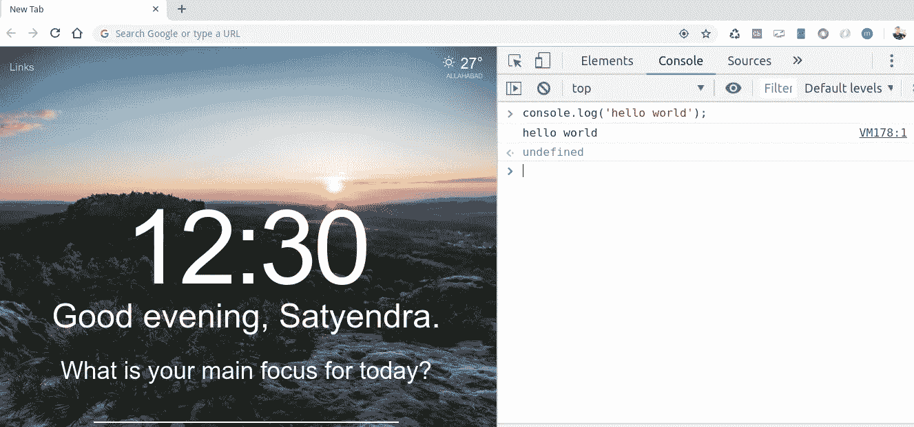

# JavaScript 初学者(01):入门。

> 原文：<https://medium.datadriveninvestor.com/javascript-for-beginners-01-getting-started-56a4e55f43bf?source=collection_archive---------5----------------------->


本指南将帮助你学习 JavaScript 的基础知识。

**学习 JavaScript 之前你应该知道什么？—**

1.  您对互联网和运行在互联网上的 web 应用程序有了大致的了解。
2.  你有一些 HTML 和 CSS 的工作知识。
3.  还需要一些编程经验，但如果不是没有问题，你可以开始学习 JavaScript。

# **简介—**

JavaScript 是一种高级的、面向对象的脚本语言，用于使网站具有交互性，例如在客户端的按钮点击、弹出等动作。JavaScript 也可以在节点等服务器上运行。Js 允许你在服务器端编写 JavaScript 并执行业务逻辑。

在*客户端* JavaScript 控制浏览器及其文档对象模型(DOM)并操纵它们。但是在*服务器端*它执行像与数据库通信、操作文件等任务。

# Java 和 JavaScript —

Java 和 JavaScript 在某些方面是相同的，但在本质上是不同的。Java 有静态类型检查，而 JavaScript 有动态类型检查。JavaScript 提供了基于原型的继承，而不是通常使用的基于类的继承。基于原型的继承在本质上是动态的，也就是说，被继承的内容会因对象而异(关于基于原型的继承的更多内容将在后面的文章中讨论)。

# ECMAScript 规范—

JavaScript 在 ECMA 国际(创建技术标准的组织)中被标准化，以提供基于 JavaScript 的标准化国际编程语言。这个 JavaScript 的标准化版本称为 ECMAScript，在所有支持该标准的应用程序中表现相同。

# JavaScript 入门——

开始使用 JavaScript 非常容易，最初你只需要一个网络浏览器，你可以在网络控制台上看到所有的输出并调试你的 JavaScript 代码，你可以通过键盘快捷键`Ctrl+Shift+i`打开浏览器控制台



Press ctrl+shift+i to open web console

# 你好世界项目—

让我们深入编码部分，打开任何文本编辑器，创建如下的`index.html`—

index.html

你可以在 web 控制台上看到它的输出，它将打印`Hello World!`，这里 console.log()是一个用来在控制台上写消息的方法。console.log()方法非常适用于调试目的。

# JavaScript 中的变量—

在 JavaScript 中有很多方法来声明一个变量并赋值，例如 var，let 和 const。

# var —

最初这是在 JavaScript 中声明变量的唯一方式，但是 ES6 引入了另外两种变量声明方式`let` `const`。

```
//These are the some way to declare a variable using var keyword
var name = 'Satyendra Kannaujiya';
var salary = 5000;
var num = 50;
var bol = true; 
```

## 风险值的范围—

作用域是指代码中可以使用变量的部分。`var`声明是全局作用域还是函数作用域。当在函数外部使用`var`时，它是全局作用域的，而在函数内部使用`var`时，它仅在该函数中可用。

```
var global = 'Hello world';function greet(){
      var name = 'satyendra kannaujiya';
      cosole.log('Hii Good Morning my name is ' + name ); }
```

这里变量`global`是全局范围的，而 as name 是局部范围的，所以如果我们试图在函数之外访问 name，我们将会得到引用错误。

```
var global = 'Hello world';function greet(){
      var name = 'satyendra kannaujiya';
      cosole.log('Hii Good Morning my name is ' + name );}console.log(name) //ReferenceError: name is not defined.
```

`var`也可以重新声明并可以改变变量的值。有一个可变提升的概念，我们将在后面的文章中讨论，现在它已经足够了。

# 让我们—

现在大部分时间`let`用于变量声明，因为它是对`var`的改进。

```
let greet = 'Hello everyone ';
let count = 10;if(count > 5){
   let hii = 'Say hii instead';
    console.log(hii);}
```

`let`是块范围，所以在上面的例子中，我们试图在 if 语句之外超出`hii`，我们将得到`Reference Error.`

与`var`类似，`let`可以更新，但是不能在相同的范围内重新声明。但与`var`不同的是，`let`不能在同一个作用域内重新声明。

```
let address = 'TeliyarGanj, Allahabad India';
address = 'Civil lines Allahabad India'; //This will work finelet address = 'TeliyarGanj, Allahabad India';
let address = 'Civil lines Allahabad'; //This will give error.
```

然而，如果在不同的作用域中声明了相同的变量，也没有问题。

```
let count = 20;
if(count>10){
   let count = 10;
   console.log(count);//Output:10 }
  console.log(count);//Output:20
```

由于这些事实，`let`比`var`更有用，因为有了`let`我们不需要记住在相同范围内声明的变量名。

# 常数—

const 是用`const`关键字声明的，通常用来存储以后不能更改的常量值。`const`也分享了`let`的一些功能，`const`也是块范围。

`const`不能更新或重新声明值

```
const greet = 'Hii everyone';
greet = 'Hello everyone';//TypeError: invalid assignment to const `greet'
```

类似于`let`,如果我们在相同的范围内重新声明，将会出现错误

```
const greet = 'Hii everyone';
const greet = 'Hello everyone'//SyntaxError: redeclaration of const greet.
```

# JavaScript 中的控制流—

JavaScript 提供不同类型控制流语句。

## 块语句—

这是用于对语句集进行分组的非常基本的语句。block 语句由花括号分隔。Block 语句大多与控制流语句一起使用(`for` `if` `while`)。

```
{
statement1....;
statement2....;
statement3....; }let count=0;
while(count<10){
   console.log(count);
   count++; }
```

# 条件语句—

条件语句是在特定条件为真时执行的一组命令。JavaScript 支持两个条件语句`if...else`和`switch.`

# 如果。。。否则—

如果某个条件为真，可以使用`if`来执行一个语句，如果条件为假，可以使用`else`；

```
if(condition){
  statement;}else{
 statement;}
```

# 开关语句—

一个`switch`语句允许程序计算一个表达式，并在此基础上匹配大小写值并执行相应的语句。

```
switch(expression){
       case 1:
       console.log('You selected 1');
       break;
       case 2:
       console.log('You selected 2');
       break;
       case 3:
       console.log('You selected 3');
       break;
       default:
       console.log('You have not selected any one from 1,2 and 3');
      break; }
```

这里首先计算表达式，然后在此基础上执行语句，这里需要 break 语句，因为如果不在每个 case 中都加上 break，那么在 case 表达式满足之后，下面的每个 case 都会自动满足。

暂时就这些了。

在下一篇文章中，我们将讨论使用 JavaScript 的 DOM 操作。

# 感谢阅读！！:)