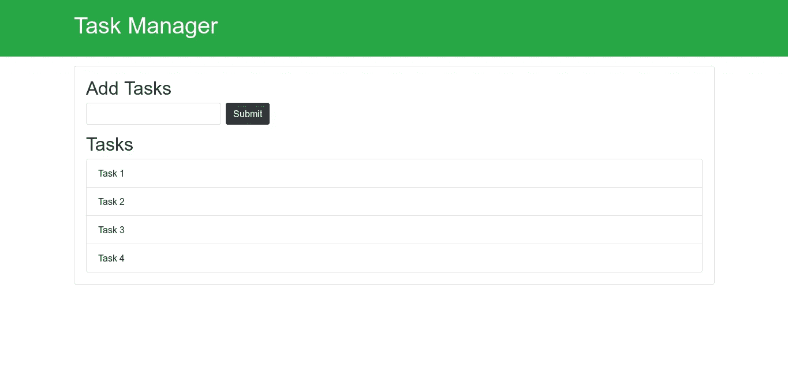

# JavaScript 初学者(02): DOM 操纵速成班。

> 原文：<https://medium.datadriveninvestor.com/javascript-for-beginners-02-dom-manipulation-crash-course-12194e195e2?source=collection_archive---------10----------------------->

[](http://www.track.datadriveninvestor.com/Split11-20)

Poster created using Piktochart.com

在本文中，我们将学习如何使用 DOM，比如改变样式、改变元素内容、事件监听器等等。

下面是用来做的页面，这是一个简单的 HTML 页面，我创建了包括引导，所以包含一些引导类只是为了好看。

页面包含一个标题和一个卡片，其中有一个表单和任务列表，我们将在此页面上执行操作。



The page on which we will perform manipulation

这是代码片段，你可以复制代码，然后和我一起看这篇文章。

# 让我们开始吧—

开始之前，让我们了解一下 DOM 是什么—

文档对象模型(DOM)是 HTML 文档的结构化表示。

1.  浏览器创建的元素树。
2.  JavaScript 可以用来读/写/操作 DOM。
3.  DOM 是面向对象的，意味着每个元素都有自己的属性和方法。


DOM tree.

你已经在网上看到了这个图，浏览器给了我们一个窗口对象，它代表浏览器本身，它是顶级对象，然后我们有一个文档对象，它基本上是 DOM 的核心，然后我们有元素的根，它是`<html>`元素，在它里面我们有像`<head>`、`<body>`这样的子元素，以类似的方式`<head>`有子元素`<title>`，而`<body>`有子元素`<a>` `<h1>` 。我们还有一个与标签`<a>`相关联的属性`href`，以及与`<title>`、`<a>`和`<h1>`相关联的文本，也可以说是节点。

所有这些看起来像树的东西加在一起就是 DOM，我们可以用 JavaScript 来操作它，我们就要这么做了。

# 所以让我们深入编码部分——

因此，让我们首先检查`document`对象，创建一个 JavaScript 文件`dom.js`并像我所做的那样包含在`index.html`中，并打开浏览器控制台以查看输出。

```
//EXAMINE THE DOCUMENT OBJECTconsole.log(document.URL) //Output: file:///home/satyendra/Medium/Js_series/Dom_manipulation/index.htmlconsole.log(document.title); //Output: Task Manager
This will give the title of the document.console.log(document.doctype) // <!DOCTYPE html>
This will give the type here we are using doctype htmlconsole.log(document.head) // <head>
This will give the details of head part.console.log(document.all) //This give the collection of every element that are inside that perticular page.Similarly you can examine all the properties of document object.
```

要操作 DOM 中的元素，首先需要选择它。有许多方法来选择 DOM 元素。

1.  getElementById
2.  getElementsByClassName
3.  getElementsByTagName
4.  查询选择器
5.  querySelectorAll

## getElementById —

如果我们想选择标题

```
var headerTitle = document.getElementById('header-title');you can also do something with this like changing the text content,
headerTitle.textContent = 'hello';//you can give the border of the element
headerTitle.style.borderBottom = 'solid 3px #000';
```

## getElementsByClassName —

注意这是 getelements plural，意思是我们可以一次选择多个元素。假设我们需要所有的任务，并且每个任务都有一个类`list-group-item`

```
var tasks = document.getElementsByClassName('list-group-item');if we want to perform some manipulation to any one of the list item we can do for example for the task2 we can change the content
like thistasks[1].textContent = "tello";but if we want to perform same manipulation on every item of the list we do in a different way for example if we want to change the background color of all the list itemfor(var i=0;i<tasks.length;i++){
        item[i].style.backgroundColor = 'f4f4f4';}
```

## getElementsByTagName —

这与`getElementsByClassName`类似，但它使用 tagname，而不是通过类名选择。

```
//Lets grab all the li of the pagevar li = document.getElementsByTagName('li');
 li[1].textContent = 'Hello 2';
 li[1].style.fontWeight = 'bold';
 li[1].style.backgroundColor = 'yellow';for(var i = 0; i < li.length; i++){
   li[i].style.backgroundColor = '#f4f4f4';
 }
```

## 查询选择器—

这是选择的现代方式，它返回文档中与指定的或选择器组匹配的第一个元素。如果没有找到匹配，则返回`null`。

```
/ var header = document.querySelector('#main-header');
// header.style.borderBottom = 'solid 4px #ccc';// var input = document.querySelector('input');
// input.value = 'Hello World'
```

## querySelectorAll —

这表示与指定的选择器组匹配的所有文档元素的列表。

```
var titles = document.querySelectorAll('.title');titles[0].textContent = 'Hello';var odd = document.querySelectorAll('li:nth-child(odd)'); 
var even= document.querySelectorAll('li:nth-child(even)');for(var i = 0; i < odd.length; i++){
   odd[i].style.backgroundColor = '#f4f4f4';
  even[i].style.backgroundColor = '#ccc';
```

# 穿越 DOM——

DOM 树中的节点相互之间具有层级关系，最顶层的节点是根节点，并且它们没有任何父节点，否则每个节点恰好有一个父节点，并且一个节点可以有多个子节点，并且具有相同父节点的节点被称为兄弟节点。

```
<html><head>
       <title>This is title</title></head>
   <body>
        <h1>DOM Crash Course</h1>
         <p>Hello world !!</p></body></html>
```

这里`html`是 DOM 的根节点，`head`和`body`是`html`的子节点，`head`和`body`是彼此的兄弟节点。

遍历 DOM 意味着在 DOM 中上下移动，寻找父节点、子节点和兄弟节点。

假设我们想要 id 为 items 的父节点`ul`。

```
var itemList = document.querySelector('#items');console.log(itemList.parentNode) //This will print the parent node of <ul> which is <div id="main" class="card card-body"></div>//we can also style ititemList.parentNode.style.backgroundColor = '#f4f4f4';//we can also find the parent of parent
console.log(itemList.parentNode.parentNode);//This will give the div with id of container.
```

同样，我们可以找到任何元素的子节点——

```
var itemList = document.querySelector('#items');console.log(itemList.children);//This will give the array of all the child node .//We can access the particular child 
console.log(itemList.children[1]);
itemList.children[1].style.backgroundColor = 'yellow';
```

像父节点和子节点一样，我们也可以访问任何节点的兄弟节点

```
//You can use property like nextElementSibling and previousElementSiblingconsole.log(itemList.nextElementSibling);//This will give the null because there is no any next sibling of ul elementconsole.log(itemList.previousElementSibling);//This will give the h2 element.itemList.previousElementSibling.style.color = 'green';
```

# 从 JavaScript 创建 DOM 元素—

我们也可以使用 JavaScript 创建 DOM 元素。

```
//Create a new div element.
var newDiv = document.createElement('div');//Add class
newDiv.className='hello';//Add id
newDiv.id = 'hello1';//Add attributenewDiv.setAttribute('title','Hello Div');//if you want to create a text inside div you can create text nodevar textNode = document.createTextNode('Hello world');//add this textNode to the newDiv as ChildnewDiv.appendChild(textNode);//Finally add this newDiv to the DOM , lets put this before the header-titlevar container = document.querySelector('header .container');
var h1 = document.querySelector(header h1);container.insertBefore(newDiv,h1);
```

# 将 EventListener 添加到 DOM 元素—

HTML DOM 允许 JavaScript 对 HTML 事件作出反应，当事件发生时可以执行 JavaScript 代码，比如鼠标点击，鼠标移动，改变输入字段等等

JavaScript 提供了不同的方式来与事件交互—

## 内嵌事件处理程序—

```
<a href="link.com" onclick="dosomething();">A link</a> //This willcall dosomething function when link will clicked.
```

## DOM 事件处理程序—

您可以使用 DOM 属性`on<event>.`分配一个处理程序

```
window.onload = () => {
  console.log("window loaded");
}
```

## 使用 addEventListener —

这是处理事件的现代方式，`addEventListener()`设置一个函数，当目标元素上发生特定事件时，将调用该函数。

```
//select the submit button and add a click event on thatvar button = document.getElementById('button');button.addEventListener('click',function(){

           console.log("Button Clicked");})//Here at the place of function you can also use a named function defined outside.button.addEventListener('click',buttonClick);//This function changes the text of header-title when button is clicked.function buttonClick(){
      document.getElementById('header-title').textContent = 'Changed';
```

这些是事件监听器的基础，还有很多事件可以练习。

你可以在这里阅读这个系列的前几篇文章

[JavaScript 初学者(01):入门](https://medium.com/datadriveninvestor/javascript-for-beginners-01-getting-started-56a4e55f43bf)

# 感谢阅读:)