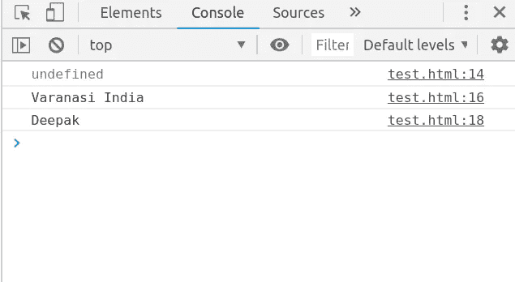
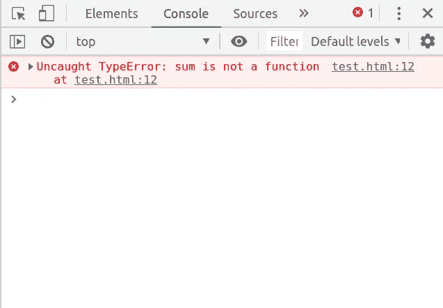
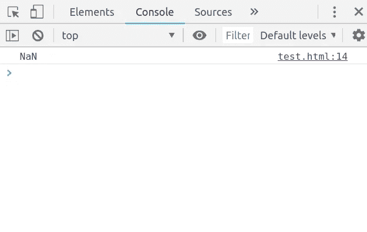
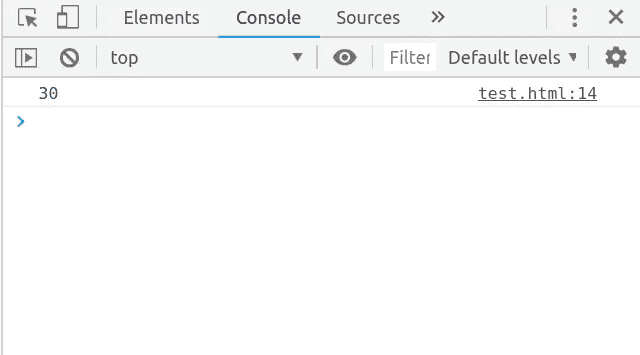

# JavaScript 初学者(03):理解 JavaScript 中的提升。

> 原文：<https://medium.datadriveninvestor.com/javascript-for-beginners-03-understand-hoisting-in-javascript-4d0df03e60cc?source=collection_archive---------15----------------------->

[](http://www.track.datadriveninvestor.com/1126A)

Image from thecreativedev.com

JavaScript 中的提升是指将变量和函数声明提升或提升到其作用域的顶部。

提升到顶部意味着您可以在实际声明变量之前引用该变量，因为 JavaScript 引擎知道它们存在于作用域中，并且不会给出任何错误。

让我们通过例子来理解—

```
hoisting();
function hoisting(){console.log(name);
      var address = 'Varanasi India';
      console.log(address);
      var name = 'Deepak';
      console.log(name);}
```

输出—



Output of above code.

这里我们看到函数被成功执行，而它是在被调用之后被声明的，因为函数声明被提升到了顶部，因此我们可以在代码中的任何地方定义函数，并且在作用域中可用。我们不需要先声明后调用。

现在，变量 first log 发生的事情给了`undefined`注意，它没有给我们任何错误，而通常如果变量不存在，我们会在 JavaScript 中得到`ReferenceError`，这背后的原因是变量`name`被提升到函数的顶部，JavaScript 引擎知道这个变量的存在。

但是这里我们在第一个日志语句中得到值`undefined` ，因为在提升中只有**声明被提升**到顶部，而不是定义，所以当一个变量刚被声明时它就被赋值`undefined`

在这里，所有的日志都运行良好。

让我们再举一个例子——

```
sum(); 
var sum = function(){
  console.log(a+b);
}
var a=10,b=20;
```

输出—



Output of above code.

这里我使用函数表达式而不是函数声明，这将给出错误`TypeError: sum is not a function`，因为 JavaScript 引擎知道变量 sum 存在于作用域中，但它不知道该变量的类型，或者你可以说它不知道`sum`是函数。

因此，当使用函数表达式时，总是在声明函数之后调用它。

```
var sum = function(){
  console.log(a+b);
}
sum();
var a=10,b=20;
```

输出—



output of above code.

它给出输出`NaN`，因为`a`和`b`的值在这里没有定义，因为它在下面被定义为函数声明。如果我们把变量`a`和`b`放在函数上面，它会给出正确的结果。

```
var a=10,b=20;
var sum = function(){
  console.log(a+b);
}
sum();
```

输出—



output of the above code.

因此，为了避免这类问题，最好在函数或作用域的顶部声明变量。

# ECMAScript 2015(ES6) —

在 ECMAScript 2015 之前，只有一种方法来声明变量`var`，这是一个函数范围，并被提升到范围的顶部。没有办法声明块范围变量和常量变量。所以 ECMAScript 引入了两个新的关键字来声明变量，它们是`let`和。`const`

# 让我们—

`let`允许你声明被限制在该块范围内的变量。这与`var`不同，在`var`中，变量被声明具有全局作用域，或者函数是在函数中定义的。`let`也不会像`var`一样在同一范围内被吊到顶部。

```
var a =10;
if(a==10){let a=20;
   console.log(a) //20}
console.log(a) // 10
```

使用`let`我们只能在同一个范围内声明一个变量一次，否则会出错，但是使用`var`可以多次声明一个变量，这是我们代码中许多错误的根源。所以最好用`let`而不是`var`。

```
let a =10;
if(a==10){
  let a=20;
   console.log(a) ;let a=30 // This will give Syntax error that a has already been declared.  
}
console.log(a)
```

# 常数—

`const`的作用域也与`let`相似，但它用于定义常量，该常量不能通过重新赋值来改变，也不能重新声明。`const`变量必须有初始值，也就是说，当一个变量被声明时，在同一个语句中必须有它的值。`const`变量也不像`var`一样被吊起。

```
let a =10;
if(a==10){
  const b=20;
   console.log(b) ;
   b=30;  // This will give error : Assignment to constant variable.
}
```

这篇文章是“JavaScript 初学者”系列的一部分，你可以在这里找到前一篇文章

[JavaScript 初学者(01):入门](https://medium.com/datadriveninvestor/javascript-for-beginners-01-getting-started-56a4e55f43bf)

[JavaScript 初学者(02): DOM 操纵速成班。](https://medium.com/datadriveninvestor/javascript-for-beginners-02-dom-manipulation-crash-course-12194e195e2)

# 谢谢:)

## 如果你觉得这篇文章有帮助，请👏以示支持。