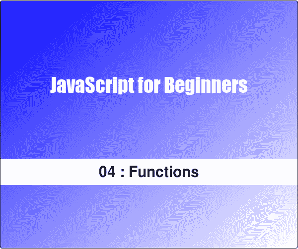
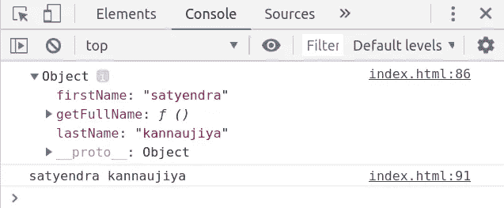
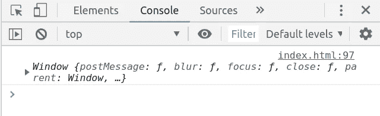

# JavaScript 初学者(04):关于 JavaScript 函数的一切

> 原文：<https://medium.datadriveninvestor.com/javascript-for-beginners-04-function-in-javascript-dcc6ca18b3f8?source=collection_archive---------11----------------------->

[](http://www.track.datadriveninvestor.com/J12U)

函数是一个 JavaScript 过程——一组执行特定任务语句。函数包含一组语句。函数是 JavaScript 的基本单位。它们主要用于代码重用、数据隐藏等等。

以下是我们将在本文中涉及的主题列表—

1.  句法
2.  函数调用
3.  返回值
4.  `this`功能内
5.  IIFE(立即调用的函数表达式)
6.  功能提升
7.  箭头功能
8.  递归
9.  复试

# 语法—

在 JavaScript 中创建函数有很多方法，比如函数声明、函数表达式和箭头函数。

## 功能声明—

函数声明是定义函数的老方法。

```
function sayHello(){console.log('Hello Everyone');
}
sayHello();
```

## 函数表达式—

函数可以赋给一个变量，称为函数表达式。

```
var sayHello = function(){ console.log('Hello Everyone');
}
sayHello(); 
```

## 箭头功能—

ES6 引入了一种新的方法来定义一个不包含`function`关键字的函数，它只包含参数列表和一个由等号和大于号(= >)组成的箭头符号。

```
//Syntaxvar sum = (num1,num2) => num1+num2;sum(5,6) //Output : 11var square = num => num*num;square(5);  //Output : 25
```

在 arrow 函数中，如果只有一个语句，则不需要 return 语句，它隐式返回该语句，如果只有一个参数，则不需要括号。

# 函数调用—

函数在被调用时被执行，任何函数都可以用一对括号来调用，括号中可以包含零个或多个由逗号分隔的参数。每一个自变量包含能够被指定为一个函数的参数名称的值。当参数个数和参数个数不匹配时，不会发生运行时错误。如果我们传递给许多参数值，多余的值将被忽略。如果我们传递的参数值太少，`undefined`值将被赋给缺失的值。

调用函数有不同方式——

## 方法调用模式—

当一个函数被存储为一个对象的属性时，我们称之为方法。所以当一个方法被调用时，它被绑定到那个对象。

```
var student = {
       firstName : 'John',
       lastName : 'Doe',
       getFullName : function(){
             return this.firstName + ' ' + this.lastName }} student.getFullName(); //Output : John Doe
```

## 函数调用—

当函数是对象的属性时，它可以作为函数被调用。

```
function sum(a,b){
         return a+b;
}
sum(5,4) //Output : 9
```

## 构造函数调用—

当使用`new`关键字调用一个函数时，它就是构造函数调用。

```
 function student(firstName,lastName){
                this.firstName = firstName,            
                this.lastName = lastName } var student1 = new student('John','Doe'); //Invocation.
    student1.firstName // Output : John
```

# 返回值—

当调用函数时，它从第一条语句开始执行，并在点击关闭函数体的}时结束。这使得函数将控制权返回给它被调用的那部分程序。

return 语句可以用来从函数中返回一些东西，当 return 语句被执行时，函数立即返回而不执行剩余的语句。

函数总是返回值，如果没有指定返回值，那么返回`undefined`。

```
// No return statement is specified.
function doSomething(){}console.log(doSomething()) //Output : undefined //Here we are returning a string value.
function doSomething(){
      return 'returned something';}
console.log(doSomething()) //Output : returned something.
```

# `this`功能内—

取决于如何调用函数，比如当函数是对象的属性时，访问我们通常使用的方法。运算符，该函数中的`this`的值就是对象本身。

```
var Person = {
     firstName : "satyendra",
     lastName : "kannaujiya",
     getFullName : function(){
        console.log(this);
        return this.firstName + " " + this.lastName;
     }
  }console.log(Person.getFullName());
```

这里的值是人对象本身。



“this” is the object itself.

现在，当函数不属于任何对象时，`this`的值就是`window`对象。

```
function greet(){console.log(this);   // Here the value of this is window object.
alert("Good Morning!!"); }
  greet();
```



Here the value of this is Window Object.

在 JavaScript 中，我们可以通过使用`call()`方法显式传递函数要使用的`this`值。让我们看看下面的例子——

```
var Person = {
       name : 'John',
       age : 25
   }function greet(city){
        alert("Hi " + this.name + 'welcome in ' + city);
    }
 greet.call(Person,'Allahabad');  //Output : Hi John welcome in Allahabad.
```

这里第一个参数是`this`的值。

# IIFE(立即调用的函数表达式)—

生命是一个 JavaScript 函数，一旦被定义就开始运行。这是一个匿名函数，称为自执行函数。

```
(function(){
 alert('Hello from IIFE');
})()
```

这里它包含一组`()`，函数被封装在其中，这有助于防止从外部访问函数的变量，而`()`的第二部分负责立即执行函数。

将寿命分配给变量存储的是函数结果，而不是函数本身。

```
var result = (function(){var name = 'satyendra';
          return name;
})()console.log(result);//Output : satyendra
```

# 功能提升—

在 JavaScript 中函数基本上有两种定义方式，即*函数* *声明*和*函数表达式*。

## 功能声明—

在 JavaScript 中函数的声明一般都被挂在最上面，所以我们可以在它被声明之前使用它。

```
// Hoisted on the top.
sum(5,4); //Output : 9 
function sum(a,b){
    return a+b;}
```

## 函数表达式—

当函数被用作表达式时，它不会被提升。

```
sum(5,4); //TypeError: sum is not a functionvar sum = function(a,b){
    return a+b;
}
```

所以当我们使用函数表达式时，最好是在声明函数之后调用它。

```
var sum =function(a,b){
    return a+b;
}
sum(5,4); //Output : 9 
```

# 箭头功能—

箭头函数是 ES6 中引入的定义函数的更短方式。

```
var sum  = (a,b)=>{
    return a+b;
}
console.log(sum(3,4)); //Output : 7
```

如你所见，arrow 函数不需要`function`关键字，它只包含一组括号和一个`=>`操作符。在 arrow 函数中，如果只有一个参数，则不需要在参数周围放一组括号；如果函数中只有语句，则不需要返回语句。

```
var square = a => a*a;console.log(square(5)); //Output : 25
```

箭头函数的另一个好处是，`this`与每个箭头函数没有绑定。

```
// Not using arrow function
function Person(){
   this.age = 25;
   setInterval(function(){
       this.age++;
       console.log(this.age);
   },1000);
}var pp = new Person(); //Output : NaN
                                  NaN
                                  ...
```

这里我们得到了输出`NaN`,因为 setInterval 中的函数有自己的`this`,它没有得到任何`age`属性。在 ES6 之前，这个问题是通过将`this`的值赋给变量来解决的。

```
function Person(){
   var that = this; this.age = 25;
   setInterval(function(){
       that.age++;
       console.log(that.age);
   },1000);
}var pp = new Person(); //Output : 26 27 ...
```

这个问题也可以通过 arrow 函数来解决，因为 arrow 函数没有自己的`this`值，而是使用封闭词法范围的`this`值。

```
function Person(){

   this.age = 25;
   setInterval(()=>{
       this.age++;
       console.log(this.age);
   },1000);
}var pp = new Person(); //Output : 26 27 ...
```

# 递归—

递归函数是调用自身的函数。通过使用递归算法，我们可以很容易地解决许多问题，如汉诺塔，二叉树遍历等。

```
// Program of finding factorial.function factorial(num){
    if(num == 0 || num==1)
    return 1;
    else
  return num*factorial(num-1);
}console.log(factorial(5)); //Output : 120
```

# 复试—

在 JavaScript 中，函数是第一类对象，即函数可以存储在变量中，作为参数传递给函数，并从函数返回。

回调是传递给另一个函数的函数，稍后可以在外部函数中调用它来完成某些功能。

```
function callback(){
    console.log('Within callback function ...');
}function outerFunction(callback){console.log('Within outerFunction ...');
  callback();}
outerFunction(callback); //Here callback function are passes as a argument.
```

回调基本上用于异步编程。这是一个同步回调函数。

```
function firstFunction(){
   console.log("first function");
}function secondFunction(){
 console.log("second function");}firstFunction();
secondFunction();//Output -- first function
            second function
```

现在让我们再举一个例子——

```
function firstFunction(){
   setTimeout(function(){
       console.log("first function");
   },1000);   
}
function secondFunction(){
 console.log("second function");}
firstFunction();
secondFunction();//Output--
second function
first function
```

如你所见，我们没有得到预期的输出，所以要解决这个问题，我们可以将 secondFunction 作为参数传递给 firstFunction，然后在 first function 完成执行时调用它。

```
function firstFunction(secondfunction){
   setTimeout(function(){
       console.log("first function");
       secondfunction()
   },1000);   
}
function secondFunction(){
 console.log("second function");}
firstFunction(secondFunction);Output-
first function
second function
```

所以这里我们得到了正确的结果。

*本文是 JavaScript 初学者系列的一部分* —

[JavaScript:入门。](https://medium.com/datadriveninvestor/javascript-for-beginners-01-getting-started-56a4e55f43bf)

[DOM 操纵速成班。](https://medium.com/datadriveninvestor/javascript-for-beginners-02-dom-manipulation-crash-course-12194e195e2)

[理解 JavaScript 中的提升。](https://medium.com/datadriveninvestor/javascript-for-beginners-03-understand-hoisting-in-javascript-4d0df03e60cc)

# 感谢阅读:)

如果你喜欢这篇文章，请👏以示支持。