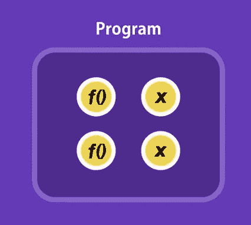
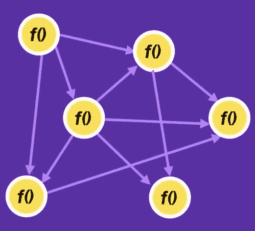
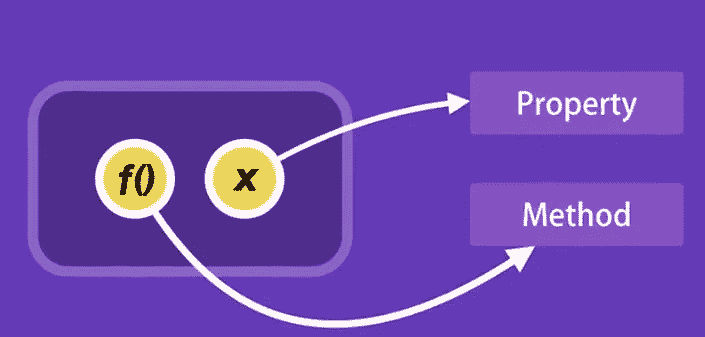
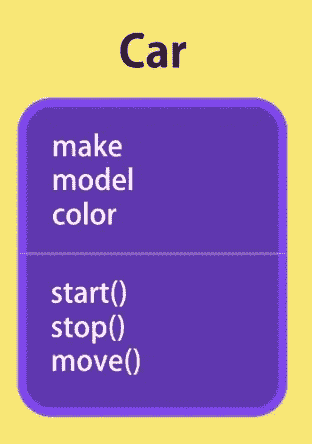
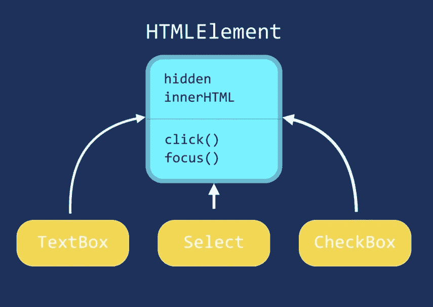
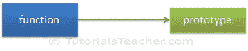
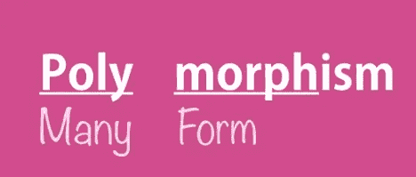

# 面向初学者的 JavaScript):面向对象编程变得简单。

> 原文：<https://medium.datadriveninvestor.com/javascript-for-beginners-05-object-oriented-programming-made-simple-dd5dee141e12?source=collection_archive---------5----------------------->

[](http://www.track.datadriveninvestor.com/1B9E)

面向对象编程是一种基本上以对象而不是功能为中心的编程范式，或者你可以理解为面向对象编程不是一种编程语言或任何工具，它只是一种解决实际问题的编程风格。

在面向对象编程之前，我们有过程式编程，在这种编程中，我们将程序分成一组函数，数据存储在一组变量中，函数对变量进行操作。



Function and variable in Procedural Programming

这种技术通常非常简单明了，但会使代码变得非常复杂，因为代码中充满了不同的功能，而功能之间的相互依赖使代码变得更加复杂。



Interdependency of function which lead to problem in procedural programming.

有许多语言支持面向对象的编程范式，如 C#、Java、Ruby、Python、JavaScript 等等。

现在让我们从对象创建开始，在 JavaScript 中有许多方法来创建对象

1.对象文字

```
Object Literalsvar Person = {
    name : 'Rakesh yadav',
    age : 23,
    address: {
       city: Varanasi,
       State: Uttar Pradesh,
       Country: India}}
We can invoke the above object property and method using . operatorconsole.log(Person.name);
```

2.使用对象原型

```
function Student(){
      }
  Student.prototype.name='Rakesh Yadav';
  Student.prototype.age=23;var stu1 = new Student();
console.log(stu1.name); //Rakesh yadav
```

3.使用构造函数

```
function Student(name,age){
    this.name =  name;
    this.age  = age;}var student1 = new Student('Rakesh yadav',23);console.log('Name of student is ' + student1.name);
```

面向对象编程中主要有 4 个核心概念，它们是

1.  包装
2.  抽象
3.  遗产
4.  多态性

## 封装—

在面向对象编程中，我们将一组相关的变量和对它们进行操作的函数组合成一个对象，这就是我们所说的封装。在这里，我们将这些变量称为属性，将函数称为方法。



Encapsulation

让我们以现实生活中的汽车为例，这里的汽车是一个具有属性的对象，如品牌、型号、颜色和方法，如启动、停止和移动。



Car object with property and method.

现在让我们举个例子——

下面是我们计算雇员工资的代码，这里我们首先声明计算雇员工资的变量和方法。这基本上是程序性的做法。

```
let baseSalery = 30000;
let overtime = 10;
let rate = 20;function getWage(baseSalery,overtime,rate){
    return basesalery + (overtime * rate); } 
```

我们可以应用面向对象的概念封装将相关的变量和属性绑定在一个单元中。

```
let employee = { baseSalery: 30000,
      overtime: 10,
      rate:  20,
      getWage: function(){ return this.baseSalery + (this.overtime*this.rate); }};employee.getWage();
```

这是面向对象的方式，我们将变量和方法组合在一个对象中，这就是所谓的封装。

## 抽象—


Electricity board

让我们把电板想象成一个物体，这个电板内部有一个复杂的逻辑，只有几个按钮在外面，你可以与之交互，对于任何动作，你只需简单地切换按钮，你不关心里面发生了什么，所有的复杂性对你来说都是隐藏的。这是实践中的抽象。

我们可以在我们的对象中使用同样的技术，我们可以从外部获得一些属性和方法。抽象使界面更简单，也减少了变化的影响。

让我们以 circle 对象为例，它包含一些属性和方法—

```
function Circle(radius){ this.radius = radius;
   this.defaultLocation = {x: 0,y: 0};
   this.computeOptimumLocation = function(){ //....
   };
   this.draw = function(){ this.computeOptimumLocation();
      console.log('draw'); };}
const circle = new Circle();
```

这里我们可以看到一些方法，比如 computeOptimumLocation 和 defaultLocation 对象，如果它们对我们创建的所有对象都可见，那么它们就是危险的。所以我们可以把它藏起来，让外人无法改变。


Abstraction says show only essential and hide th details

我们可以通过创建对象、方法和属性的局部变量，使其不可从外部访问，我们执行以下操作—

```
function Circle(radius){ this.radius = radius;
   let defaultLocation = {x: 0,y: 0};
   let computeOptimumLocation = function(){ //....
   };
   this.draw = function(){this.computeOptimumLocation();
      console.log('draw');};}
const circle = new Circle();Here object circle can not access object defaultLocation  and method computeOptimumLocation.
```

## 继承—

继承是一种允许您删除冗余代码的机制。让我们以一些 HTML 元素为例，如文本框、选择框、复选框等。


HTML Element

所有这些元素都有一些共同属性，如 hidden、innerHTML 和方法，如 click()、focus()。

因此，我们可以在一个通用对象中定义一次，称为 HTML element 对象，并帮助其他对象继承该对象的属性和方法，而不是为每种类型的 HTML 元素重新定义所有的方法和属性。因此，通过这种方式，继承帮助我们删除冗余代码。



Inheritance.

在 JavaScript 中，继承是基于原型的，所以让我们先来理解什么是原型

原型是 JavaScript 对象相互继承特性的机制。

```
function Student() {
                this.name = 'John';
                this.gender = 'Male';
}

var studObj1 = new Student();
studObj1.age = 15;
alert(studObj1.age); // 15

var studObj2 = new Student();
alert(studObj2.age); // undefined
```

正如您在上面的示例中看到的，age 属性被附加到 studObj1 实例。但是，studObj2 实例没有 age 属性，因为它仅在 studObj1 实例上定义。

那么，如果我们想在以后的阶段给一个函数添加新的属性，并在所有实例之间共享，该怎么办呢？

答案是**原型**。

在 JavaScript 中，默认情况下，原型是与每个函数和对象关联的对象，其中函数的原型属性是可访问和可修改的，而对象的原型属性是不可见的。

默认情况下，每个函数都包含一个原型对象。



Prototype in JavaScript

prototype 对象是一种特殊类型的可枚举对象，可以将附加属性附加到它上面，这些属性将在其构造函数的所有实例中共享。

因此，在上面的例子中使用一个函数的 prototype 属性，以使所有对象都有 age 属性，如下所示。

```
function Student() {
                this.name = 'John';
                this.gender = 'M';
}

Student.prototype.age = 15;

var studObj1 = new Student();
alert(studObj1.age); // 15

var studObj2 = new Student();
alert(studObj2.age); // 15
```

所以为了在 JavaScript 中实现继承，我们将实现原型继承—

让我们举个例子——

```
function Person(firstName, lastName) {
    this.FirstName = firstName || "unknown";
    this.LastName = lastName || "unknown";
};

Person.prototype.getFullName = function () {
    return this.FirstName + " " + this.LastName;
}
```

上面我们已经创建了带有两个参数的 Person 函数，我们还添加了 getFullName 方法作为原型对象。

现在，我们想要创建从 Person 类继承的 Student 类，这样我们就不必在 Student 类中重新定义 FirstName、LastName 和 getFullName()方法。下面是一个继承 Person 类的学生类。

```
function Person(firstName, lastName) {
    this.FirstName = firstName || "unknown";
    this.LastName = lastName || "unknown";            
}

Person.prototype.getFullName = function () {
    return this.FirstName + " " + this.LastName;
}
function Student(firstName, lastName, schoolName, grade)
{
    Person.call(this, firstName, lastName);

    this.SchoolName = schoolName || "unknown";
    this.Grade = grade || 0;
}
//Student.prototype = Person.prototype;
Student.prototype = new Person();
Student.prototype.constructor = Student;

var std = new Student("James","Bond", "XYZ", 10);

alert(std.getFullName()); // James Bond
alert(std instanceof Student); // true
alert(std instanceof Person); // true
```

这样我们就可以在 JavaScript 中实现继承。

## 多态性—



Polymorphism

在一般的面向对象编程中，多态性是一个概念，我们可以根据数据类型或参数数量以不同的方式执行单个操作。

你可以以自己为例来理解多态性，因为你的行为取决于情境，比如如果你在教室里，你会表现得像个学生，如果你在家里，你会表现得像个儿子/女儿，所以这里一个动作有不同的形式，这就是我们所说的多态性。

```
var shape = function (){};
	shape.prototype.draw = function(){
		return "i am generic shape";
	}
	//circle
	var circle = function(){}
	circle.prototype = Object.create(shape.prototype);
	circle.prototype.draw= function(){
		return "i am a circle";
	}
	//triangle
	var triangle = function (){}
	triangle.prototype = Object.create(shape.prototype);
	triangle.prototype.draw= function(size){
		return "this is triangle";
	}
	//printing shapes
	var shapes = [new shape(), new circle(), new triangle(23)];
	shapes.forEach (function (shapeList){
		console.log(shapeList.draw());
	});
```

这里，圆形和三角形函数都继承了 shape 函数并覆盖了 draw 方法。

# 注意—

这些并不是用 JavaScript 实现面向对象编程的唯一方式，在这方面这是非常灵活的。

# 感谢阅读:)

如果你喜欢这篇文章，请👏。

本文是 JavaScript 初学者系列文章的一部分

面向初学者的 JavaScript):入门。

[初学 JavaScript(02):DOM 操纵速成班](https://medium.com/datadriveninvestor/javascript-for-beginners-02-dom-manipulation-crash-course-12194e195e2)

[JavaScript 初学者(03):理解 JavaScript 中的提升。](https://medium.com/datadriveninvestor/javascript-for-beginners-03-understand-hoisting-in-javascript-4d0df03e60cc)

[JavaScript 初学者(04):关于 JavaScript 函数的一切](https://medium.com/datadriveninvestor/javascript-for-beginners-04-function-in-javascript-dcc6ca18b3f8)