# JavaScript 初学者(06):关于数组的一切

> 原文：<https://medium.datadriveninvestor.com/javascript-for-beginners-06-everything-about-arrays-a8c1058fd681?source=collection_archive---------22----------------------->

[](http://www.track.datadriveninvestor.com/1B9E)

每种编程语言都提供数据类型来存储变量值，并且需要数据结构来以有效的方式管理数据。

在 JavaScript 中，有两种数据类型—

## 原始数据类型—

*   布尔代数学体系的
*   数字
*   线
*   空
*   不明确的
*   符号对象

## 非原始数据类型—

在 JavaScript 中，除了上面的原始数据类型对象。

对象提供了一种以键值格式存储数据的方式，这很好。

但是当我们想要以有序的方式存储一组数据时，仅仅使用 object 是不方便的，因为它没有提供一种以有序的方式存储数据的方法。

为了解决这些问题，存在一种以有序方式存储数据的数据结构*数组*。

JavaScript `Array`是一个高级对象，用于数组的构造。

## 创建一个数组—

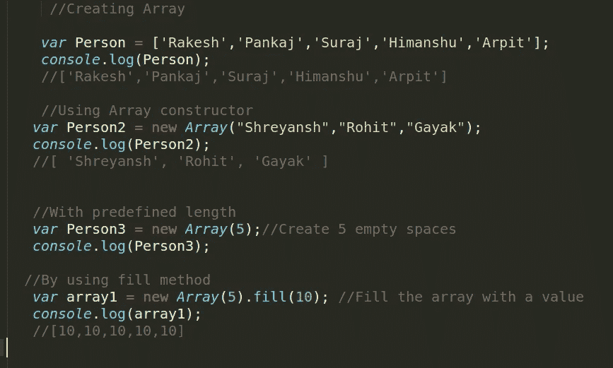

## 访问数组项目—

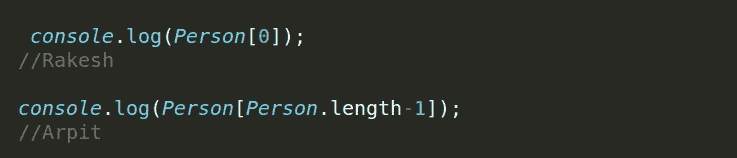

## 迭代数组—

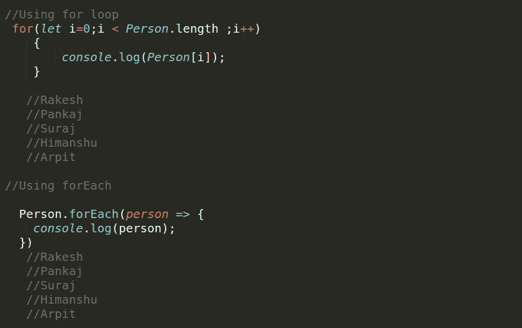

## 在数组末尾添加—

我们可以使用 push 方法添加到数组的末尾。

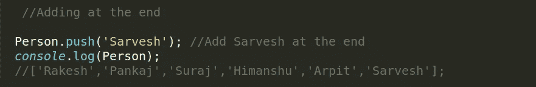

## 从数组末尾删除一个元素—

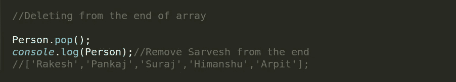

## 在数组前面添加—

我们可以使用数组的`unshift`方法在数组前面添加一个元素。

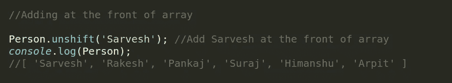

## 从阵列的前面移除—

为了从数组中移除数组，我们可以使用`shift`方法。

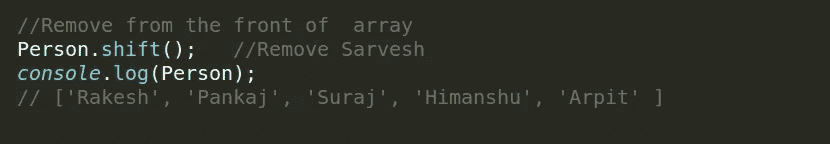

## 查找项目的索引—

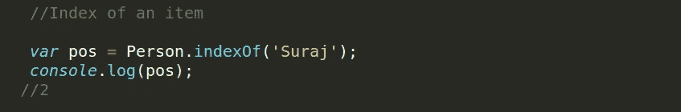

## 一些重要的方法—

有一些非常有用的方法在数组中被非常频繁地使用。

## 找到—

方法返回数组中满足所提供测试函数的第一个元素的值。否则返回`undefined`。

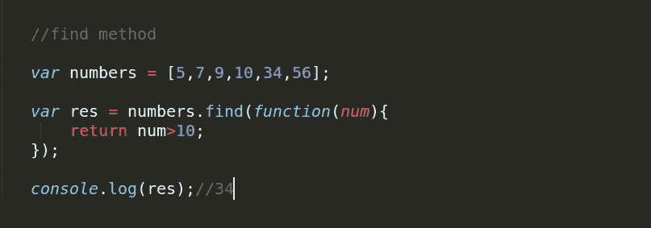

## 排序—

`sort`方法根据提供的比较函数对提供的数组进行就地排序。

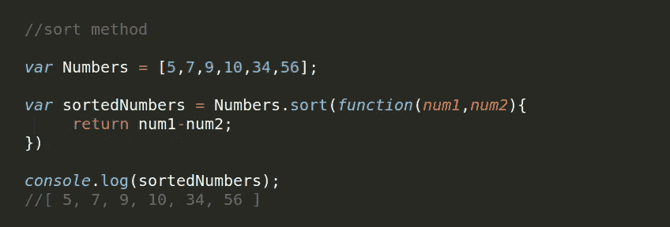

*   如果`compareFunction(a, b)`小于 0，则将`a`排序至低于`b`的索引(即`a`先出现)。
*   如果`compareFunction(a, b)`返回 0，保持`a`和`b`相对于彼此不变，但是相对于所有不同的元素排序。
*   如果`compareFunction(a, b)`大于 0，则将`b`排序至低于`a`的索引(即`b`排在第一位)。
*   当给定一对特定的元素`a`和`b`作为其两个参数时，`compareFunction(a, b)`必须始终返回相同的值。如果返回不一致的结果，则排序顺序是未定义的。

## 一些—

`**some()**`方法测试数组中是否至少有一个元素通过了由提供的函数实现的测试。

如果回调函数为数组中的元素返回 true 值，则返回 true，否则返回 false。

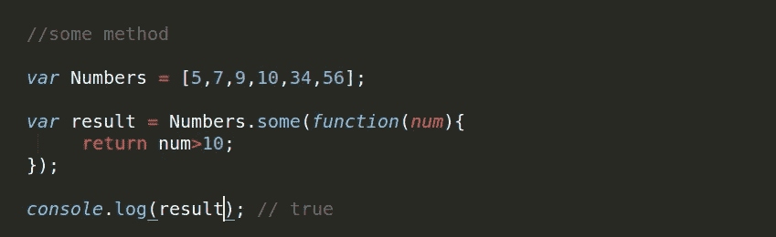

## 切片—

`**slice()**`方法将数组的一部分的浅拷贝返回到从`begin`到`end`(不包括`end`)中选择的新数组对象中。原始数组不会被修改。

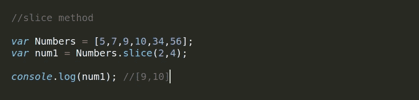

## 拼接—

`**splice()**`方法通过移除或替换现有元素和/或添加新元素来改变数组的内容。

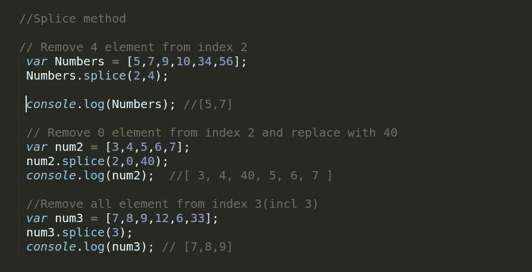

## 地图—

`**map()**`方法创建一个新的数组，其结果是在调用数组中的每个元素上调用一个提供的函数。

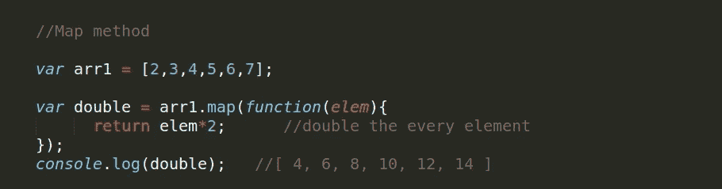

## 过滤器—

`**filter()**`方法创建一个新的数组，其中所有元素都通过了由提供的函数实现的测试。

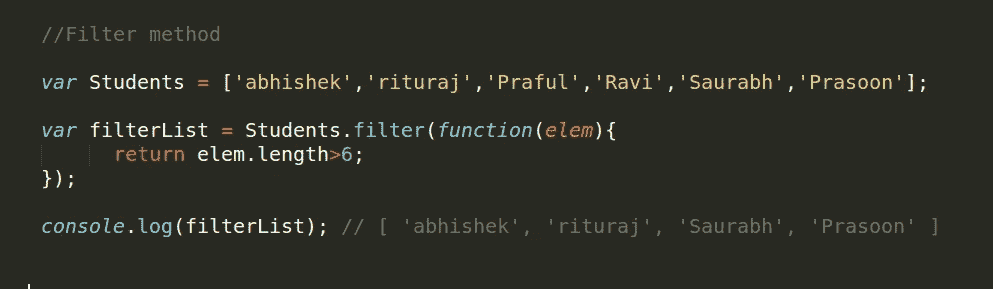

如果没有元素满足测试条件，将返回空数组。

## 减少—

`reduce()`方法用于在数组的每个元素上应用一个函数来产生一个单一的输出。

下面是 reduce 函数的语法

```
let res = arr.reduce(callback);//You can also provide a initial valuelet result = arr.reduce(callback,initialValue);
```

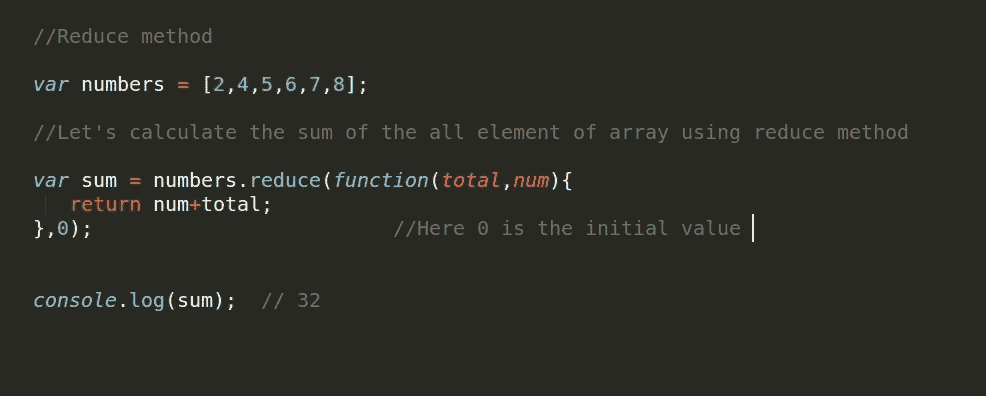

## 感谢阅读:)

本文是 JavaScript 初学者系列文章的一部分

[JavaScript 初学者(01):入门。](https://medium.com/datadriveninvestor/javascript-for-beginners-01-getting-started-56a4e55f43bf)

[初学者 JavaScript(02):DOM 操作速成班](https://medium.com/datadriveninvestor/javascript-for-beginners-02-dom-manipulation-crash-course-12194e195e2)

[JavaScript 初学者(03):理解 JavaScript 中的提升。](https://medium.com/datadriveninvestor/javascript-for-beginners-03-understand-hoisting-in-javascript-4d0df03e60cc)

[JavaScript 初学者(04):关于 JavaScript 函数的一切](https://medium.com/datadriveninvestor/javascript-for-beginners-04-function-in-javascript-dcc6ca18b3f8)。

面向初学者的 JavaScript):面向对象编程变得简单。