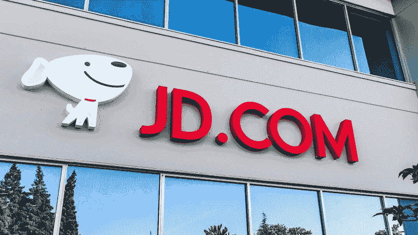
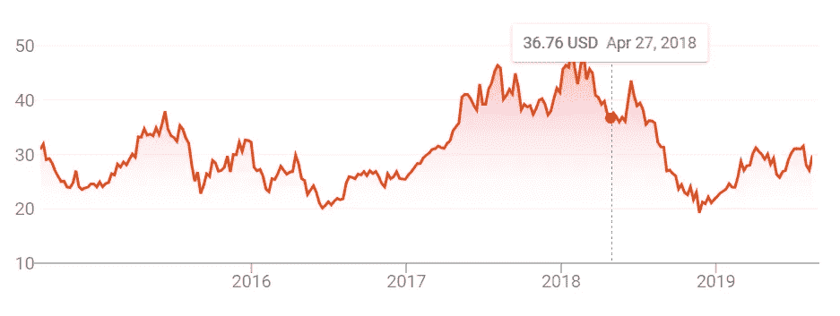
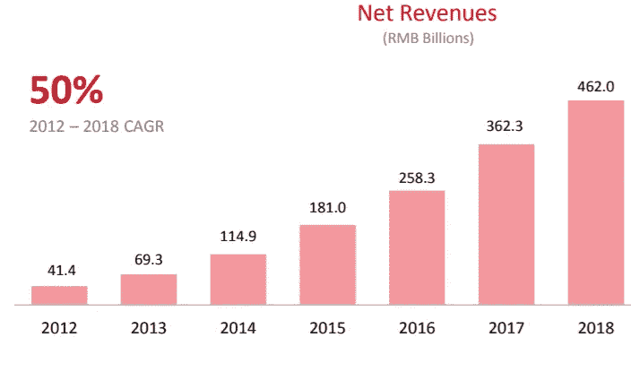
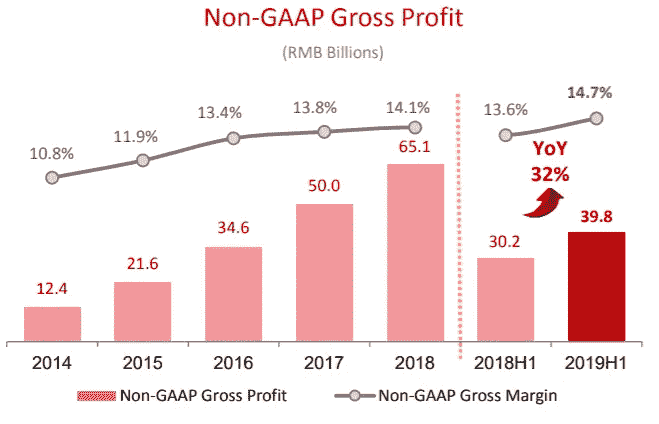
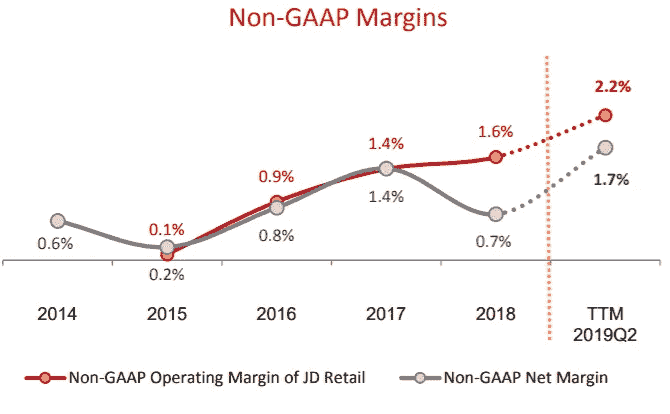

# JD.com 将是一家价值 2500 亿美元的公司

> 原文：<https://medium.datadriveninvestor.com/jd-com-will-be-a-250-billion-company-2b8bc5aa7a85?source=collection_archive---------2----------------------->

**注:本文原载于* [*市场兄弟传媒*](https://marketbrothersmedia.com/jd-com-will-be-a-250-billion-company/) *。*

JD.com 在中国经营着一个庞大的在线业务。与普遍看法相反，它是中国零售商中最“像亚马逊”的，尽管阿里巴巴在美国更大、更知名。JD [在过去一周发布了收益](http://ir.jd.com/news-releases/news-release-details/jdcom-announces-second-quarter-2019-results)，并在一系列指标上击败了它，这导致股票在新闻发布后飙升了 10%以上。

投资者对京东的不满有几个原因，包括对首席执行官的强奸指控(这很严重，但可能不会影响业务)，宏观层面的逆风，以及阿里巴巴的竞争。

> 如果你客观上仍然喜欢这项业务，那么 30%的折扣是买入股票的绝佳时机

 [## 动荡迫使暴风雨中的平静|数据驱动的投资者

### 自然界中很少有东西是直线行进的，尤其是经济。当投资者和消费者希望平静时…

www.datadriveninvestor.com](https://www.datadriveninvestor.com/2019/03/25/volatility-compels-calm-amid-the-storm/) 

由于最近的消息，该股已反弹至 30 年代，但仍较 2018 年的历史高点大幅下跌:

现在，明确一点，你永远不应该仅仅因为股价下跌就投资一支股票。然而，如果你客观上仍然喜欢这项业务，那么 30%的折扣是买入股票的绝佳时机。我认为，即使最近价格上涨，我们与 JD.com 仍处于那个区域。

我将讲述我喜欢京东的业务和财务轨迹的几个原因，以及为什么它准备成为一家价值 2500 亿美元的公司。

# 可持续的收入和用户增长

上个季度，京东的收入增长了 23%，至 219 亿美元(以美元计)。这比前几个季度有所加速，因为中国经济放缓和贸易战担忧带来了(投机性)负面影响。从收益报告中提供的图表可以看出，JD 多年来一直保持着高销售额增长:

他们还显示，第二季度用户增长强劲，从去年同期的 3.105 亿增加到 3.21 亿。京东专注于进入“低线城市”，也就是他们所说的农村地区，以扩大他们的客户群和总的潜在市场。看起来他们还远未达到用户饱和，因为中国有超过 10 亿人将在未来十年内全部上网。

# 稳定的利润增长

> 在过去几年里，京东已经从一个基本上收支平衡的企业变成了一个真正有利润的企业

这是 JD 在一段时间内毛利润和营业利润的长期增长图表:

是的，我知道这些是非 GAAP 数字，但我很懒，这是他们在收益报告中提供的数字。

在过去几年里，京东已经从一家基本上收支平衡的企业变成了一家真正有利润的企业，这主要是由零售领域的规模经济推动的。管理层还认为，在可预见的未来，这种扩张还将继续。他们在[电话会议](https://finance.yahoo.com/news/jd-com-inc-jd-q2-162311930.html)上表示，他们**“应该会为业务**产生一位数的综合净利润”。这将是目前水平的一大飞跃，但 JD 可以凭借其在自动化和效率方面的密集投资来实现这一目标。

# 核心业务的利润率比你想象的要高

投资者可能会对京东微薄的运营利润望而却步。然而，仅在本季度，核心零售业务就带来了超过 10 亿美元的营业收入(OI ),利润率为 2.7%。按年计算，这只市值 455 亿美元的股票的投资回报率超过 40 亿美元。

包括技术和物流在内的“其他业务”部门本季度运营亏损 3 亿美元，严重影响了总运营利润率。

> 仅在本季度，核心零售业务就带来了超过 10 亿美元的营业收入(OI ),利润率为 2.7%

# 巨大的现金流数字

仅在本季度，京东就产生了 26 亿美元的自由现金流，而且他们仍在大力投资物流和技术领域。这也不是一次性的。去年，他们在第二季度生产了 20 亿美元的 FCF，对资本支出产生了近 10 亿美元的负面影响。

不管怎么说，京东已经变成了一台现金流机器，这将使他们能够**对业务进行再投资，而不必稀释股东或带来更多债务。**

# 开发护城河

很多人将阿里巴巴视为对 JD.com 的威胁，但在我看来，他们是双头垄断的中国在线零售系统中唯一的参与者。腾讯(根本不怎么做零售)和沃尔玛都投资了京东，所以来自他们的竞争似乎不太可能。亚马逊在中国也非常艰难。

对于任何一家初创公司来说，进入市场并夺取市场份额都是很困难的。人们使用 JD.com 是因为它提供几乎全中国的同一天或一天送达服务，网站上有数百万种不同的产品。一个暴发户不可能凭空复制它。京东花费了数十亿的 R&D 和资本支出来开发这个高效的履行中心网络。JD 100%有强大的护城河；随着规模的扩大，这种差距只会越来越大。

# 有意义的副业

> 他们很少偏离自己的核心能力领域

除了一个小型投资部门，京东的“其他”部门主要是物流/交付计划。这基本上是他们的亚马逊履行和亚马逊运输版本，将允许他们进入电子商务垂直领域的另一部分。

此外，京东的所有技术投资都在零售/配送领域。他们很少偏离自己的核心竞争力领域，这是我喜欢这家公司的一点。当然，毫无疑问，京东可以增加一个像阿里巴巴一样的云或消费者支付应用程序，以加速短期内的销售增长。但我相信，从长远来看，不要在经济的不同领域过度扩张将会有回报。他们可以专注于提高自己作为全球最高效、最受技术驱动的零售企业的领先地位。

# 为什么 JD.com 能成为 2500 亿美元的公司

我认为 JD.com 很有可能取代百度，成为中国第三大科技巨头。论点很简单:销售增长和利润扩张将继续，导致未来十年盈利能力的大幅增长。

请记住，在电话会议中，京东高管重申了他们高个位数净利润率的长期目标。假设这个数字最终在 7.5%左右。我们还假设京东可以在未来 10 年保持 12%的销售增长率(从当前水平放缓，大数定律开始发挥作用)。考虑到这两个假设，下面的图表跟踪了 JD 从 2019 年到 2028 年底的净收入。

很明显，十年内的增长不会如此精确或一致。然而，如果京东在未来十年以 12%的速度增长(如果你问我，这是一个很低的数字)，并像它声称的那样将其净利润率提高到 7.5%，那么它将在 2029 年产生 156.5 亿美元的净收入。保守的市盈率为 18 倍(对于一只成熟但不停滞的股票来说，这是相当平均的水平)，京东的市值将为 2817 亿美元。如今，它的市值为 455 亿美元。

现在，就像任何投资一样，无法保证京东会继续保持强劲的销售增长，或者能够达到较高的个位数净利润率。然而，我认为他们有很大的机会这样做，特别是因为他们在自动化和物流方面的投资类似于亚马逊。