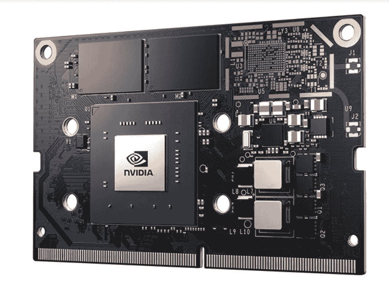
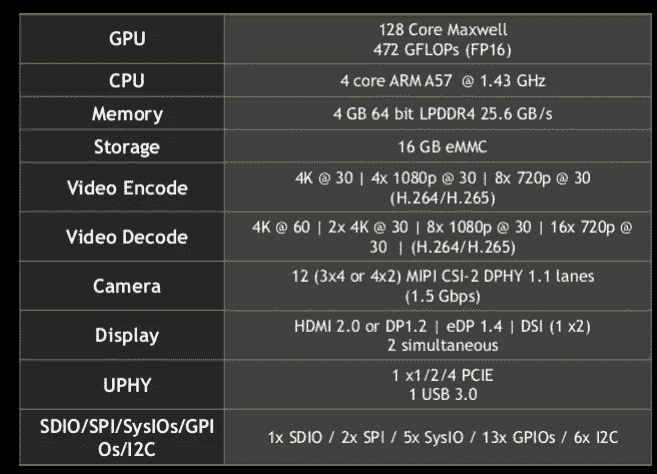
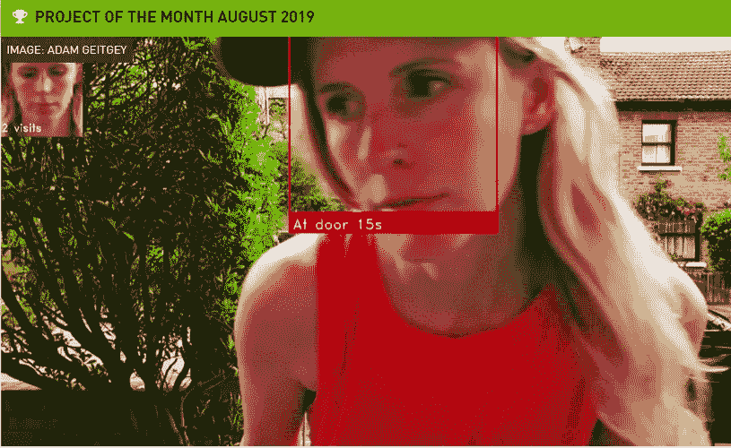
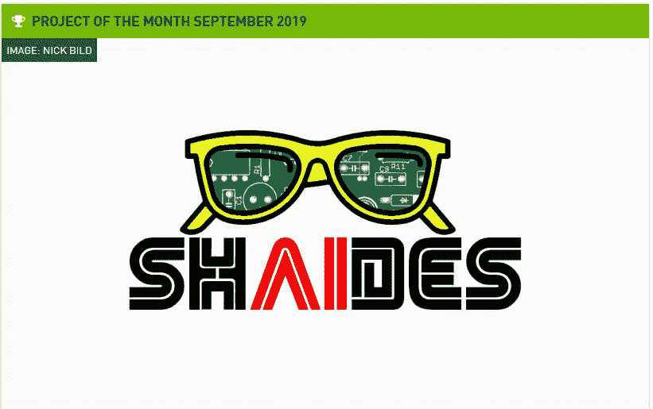
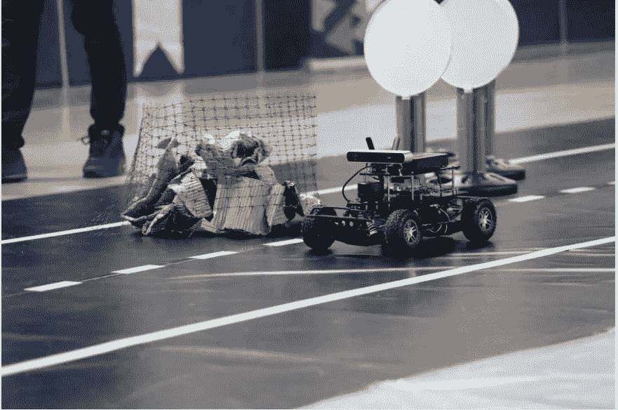
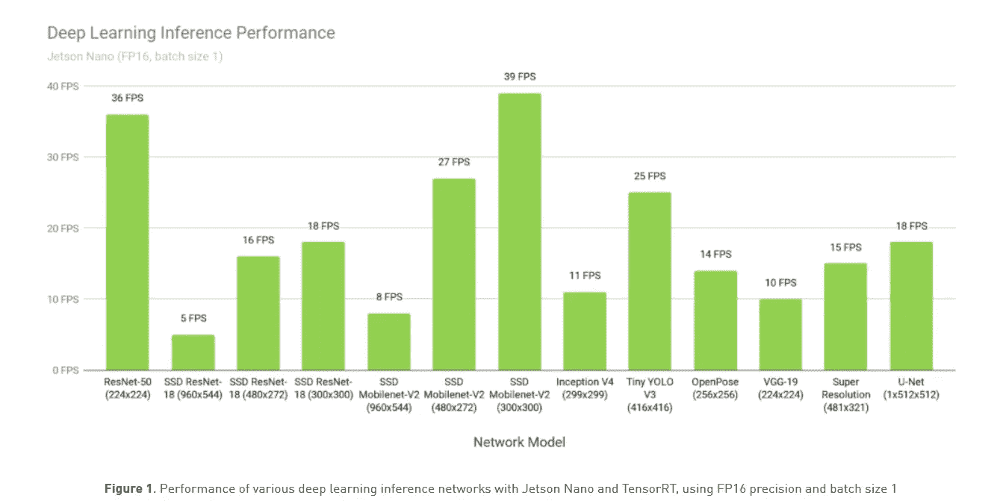
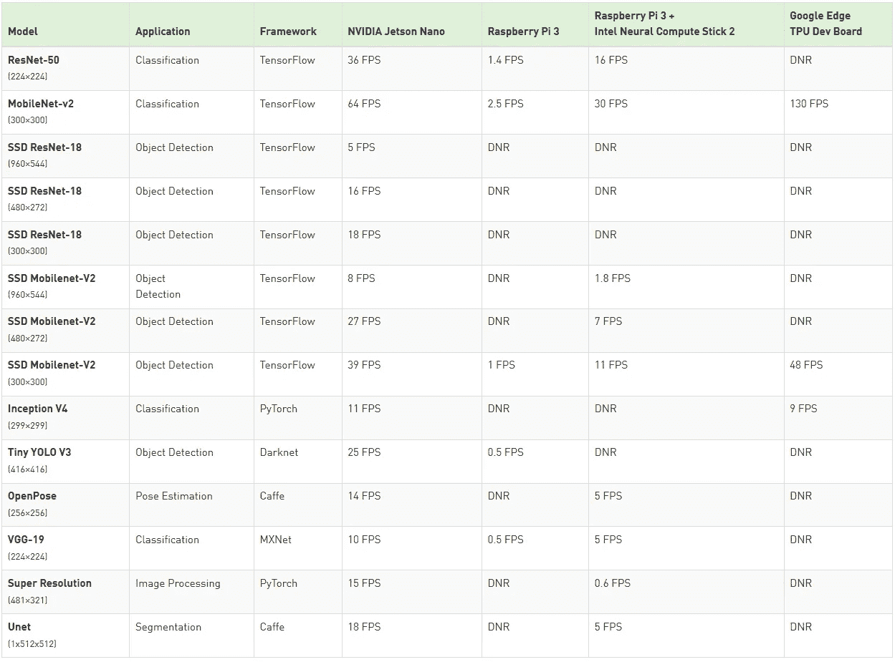
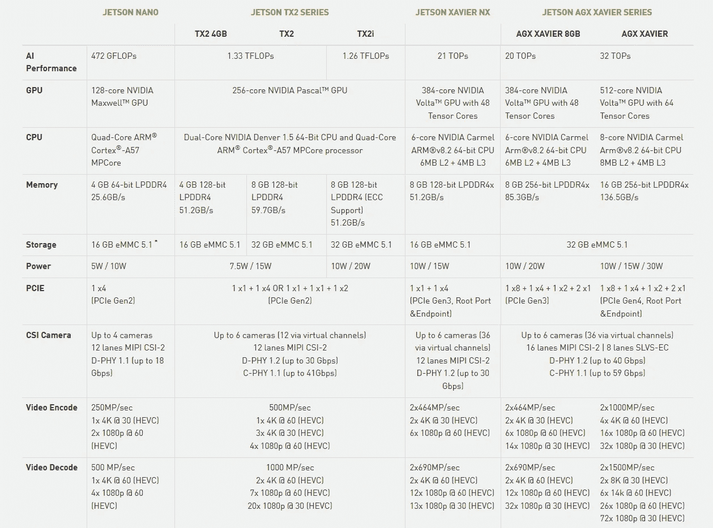

# 杰特森纳米-英伟达的袖珍人工智能发电站

> 原文：<https://medium.datadriveninvestor.com/jetson-nano-nvidias-pocket-size-ai-powerhouse-56db4799c1fe?source=collection_archive---------0----------------------->

组块理解:口袋 AI 来了！！！

Source: Nvidia

在计算机视觉、深度学习、机器学习、IOT 等领域，当前的技术世界依赖于低功耗计算设备，如果他们希望将其智能应用引入消费者市场，以及谁(消费者)希望投资合理的资金作为智能购买的一部分，并减轻钱包的负担，这就是以下产品出现的情况，如 Rasberry Pi、英特尔的 Movidius NCS、谷歌 Coral USB 加速器，以及最新加入这一**联盟的 *Nvidia Jetson Nano* 。**

> *信息:到目前为止，我已经在 Jetson Nano 上花了相当多的时间，并开发了一些令人兴奋的机器人应用程序，人工智能的东西(作为一个战略项目的一部分)，所以我有资格分享我的经验。*

 [## 机器学习的外汇交易挑战|数据驱动的投资者

### 机器学习是人工智能的一个分支，之前占据了很多头条。人们是…

www.datadriveninvestor.com](https://www.datadriveninvestor.com/2019/02/18/the-challenge-of-forex-trading-for-machine-learning/) 

# 认识一下 Nvidia 的 Jetson Nano:

## *尺寸方面*:

Jetson Nano 模块只有 70 x 45 毫米，是最小的 Jetson 设备。这种生产就绪型模块系统(SOM)在将人工智能部署到多个行业(从智能城市到机器人)的边缘设备方面发挥了巨大作用。

## 性能:

Jetson Nano 为快速运行现代人工智能算法提供了 472 GFLOPs。它并行运行多个神经网络，同时处理多个高分辨率传感器，非常适合入门级网络录像机(NVR)、家用机器人和具有全面分析功能的智能网关等应用。

## 功率:

Jetson Nano 让您自由地在边缘创新。体验强大高效的人工智能、计算机视觉和高性能计算，功耗仅为 5 至 10 瓦。

> *注意:这里是 472 GFLOPS @*[***16 位精度***](https://en.wikipedia.org/wiki/Half-precision_floating-point_format) *并且你需要一个更冷的风扇来为 Nano 散热，否则你会在使用几个月后看到功率激增，并且 Nano 可能会在运行多个 AI 应用程序时突然关机(我知道它的头旋转数，仍将在本文后面深入解释，敬请关注)*

***看规格 Shee* t:**

Source: Nvidia

> ***本人观察:***
> 
> *4 GB 的 RAM 比 Rasberry Pi 好很多，Google Coral Stick 也可能≥ Intel Movidius 神经电脑棒，存储内存最高可以扩展到 64GB(根据我的测试)。*
> 
> @ 5 W 它将运行 2 个内核，而@ 10 W 它将运行所有 4 个内核。
> 
> **支持 TensorFlow、PyTorch、OpenCV、Dlib】和 **Caffe** 库，目前**不支持**，因为硬件架构是 ARM 处理器。**
> 
> 它具有作为视频编码 c(即 en **Co** der 和**Dec**order)的 **Gstreamer，它是 FFMPEG 的替代。**
> 
> **尽量购买 Nvidia 指南**规定的电源 **电源，而不是其他电源。好吧，我们继续。**
> 
> 跟随这个免费的 Jetson Nano 课程，在 *上获得一些 [*。即使没有手也可以继续*](https://courses.nvidia.com/courses/course-v1:DLI+C-RX-02+V1/about)*

# 杰特森·纳诺带来了:

*   它**支持 Ubuntu 18.04** 。
*   通过[***JetPack SDK***](https://developer.nvidia.com/embedded/jetpack)提供用于构建 AI 应用程序和 CPU 分析工具的开发工具和综合库。
*   支持**张量 RT** 用于图像分类、分割和对象检测神经网络的高性能推理。
*   **灵活编写和构建基于 Cuda 和 cuDNN** 的库。
*   支持 **MS Visual Studio 代码，PyCharm** 进行编程。
*   **支持机器人 ROS melody**。

# Jetson Nano 的应用:

Nvidia 社区已经做了很多项目并分享了，点击这个链接:[https://developer . Nvidia . com/embedded/Community/jetson-projects](https://developer.nvidia.com/embedded/community/jetson-projects)

**有些很酷的项目是**:

*   ***智能门铃摄像头:***

Source:[https://medium.com/@ageitgey/build-a-hardware-based-face-recognition-system-for-150-with-the-nvidia-jetson-nano-and-python-a25cb8c891fd](https://medium.com/@ageitgey/build-a-hardware-based-face-recognition-system-for-150-with-the-nvidia-jetson-nano-and-python-a25cb8c891fd)

*   **沙伊兹**:

Link : [https://github.com/nickbild/shaides/](https://github.com/nickbild/shaides/)

基于手势控制家中支持 IOT 的设备。

*   **ROS 和 Jetson 纳米动力自主机器人:**

Source : [https://www.stereolabs.com/blog/ros-and-nvidia-jetson-nano/](https://www.stereolabs.com/blog/ros-and-nvidia-jetson-nano/)

> M ***我的工作包括把上面显示的一些类似的概念和 Android 的东西放在一起玩*** 。

*   **OpenALPR 车牌检测:**

Source : [https://github.com/openalpr/openalpr](https://github.com/openalpr/openalpr)

对于执法和安全机构而言，这是一款出色的实时和边缘设备应用程序。

# **前方激动人心的机会:**

**NVIDIA 将送出数千份奖品**，包括一次前往 NVIDIA GTC 2020 的 ***付费旅行，一辆全新的泰坦 RTX，一套 Jetson AGX Xavier 开发者套件，以及可以用于下一个项目的公共云计算积分。此外，我们还将提供特殊奖励，如 NVIDIA Shield 和免费访问 NVIDIA 世界级在线深度学习学院(DLI)的课程。***

此外，一个项目将被选为特殊的**“AI****社会影响奖”**，该奖项旨在表彰利用人工智能的力量对人们的生活和/或我们周围的环境产生明确而积极影响的解决方案。

*来源:*[*https://www.hackster.io/contests/NVIDIA*](https://www.hackster.io/contests/NVIDIA)

## **如何在 Jetson Nano 上运行深度学习和高级计算机视觉应用:**

*   在 Jetson Nano 上构建计算机视觉和深度学习的过程与您在笔记本电脑、台式机或任何其他高端机器上构建非常相似。
*   对于直接部署同一个模型，**将无法发挥全部潜力**，因为大多数模型都是默认按照 32 位浮点精度设置/构建的，这将减慢 Jetson Nano 上的检测和分类，如果模型转换为 16 位精度，这一行(*472 GFLOPS @*[***16 位精度***](https://en.wikipedia.org/wiki/Half-precision_floating-point_format)*)将实现。*
*   *[跟随此](https://www.dlology.com/blog/how-to-run-keras-model-on-jetson-nano/)链接，这有助于将模型转换为 TensorRT 推理兼容格式(这帮助我将 MobileNet SSD 从 2 FPS 优化为 15 FPS，这与 ROS 库同时运行接近实时)。*
*   *有关 16 位与 32 位的更多信息，请阅读此[**https://docs . NVIDIA . com/deep learning/SDK/mixed-precision-training/index . html**](https://docs.nvidia.com/deeplearning/sdk/mixed-precision-training/index.html)*

# ***基准规格表:***

**

*Source: Nvidia*

**

*Source: Nvidia*

***杰特森和它的哥哥们相处得怎么样***

**

*Source: [https://developer.nvidia.com/embedded/develop/hardware](https://developer.nvidia.com/embedded/develop/hardware)*

## ***你口袋里的 AI 未来:***

**看到了像****Jetson Nano****这样的设备可以执行的功能，以及可以围绕它构建的各种应用程序，我真的很好奇，它还可以部署在哪里，可以在我们的生活和学习中产生最大的影响。**

> *请鼓掌，如果你喜欢，请分享，如果你需要更多关于 Jetson Nano 及其功能的信息，请发表评论。*

****参考:****

1.  *NVIDIA for Images and Projects info[https://developer . NVIDIA . com/embedded/jetson-nano-developer-kit](https://developer.nvidia.com/embedded/jetson-nano-developer-kit)*
2.  *根据我的经验观察和技巧。*

*不断学习的朋友(_/\_)！！！*

**

*If Liked :-)*