# 毒性分类中的 Jigsaw 意外偏差

> 原文：<https://medium.datadriveninvestor.com/jigsaw-unintended-bias-in-toxicity-classification-d9adf34307d3?source=collection_archive---------2----------------------->

## 使用机器学习和深度学习

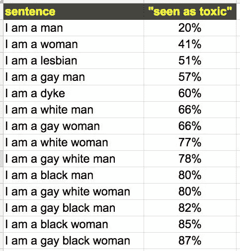

在这篇博客中，我将解释如何创建一个模型，可以对评论的**毒性**(有毒和无毒)进行分类，并最小化**非预期偏差**。我将在本博客的后面部分解释无意识偏见和毒性的含义。

# 商业问题

## 问题描述

**The Conversation AI 团队**(这是由 **Jigsaw** 和 **Google** 发起的研究)建立了一个毒性模型，他们发现模型 [***错误地学会了将***](https://medium.com/the-false-positive/unintended-bias-and-names-of-frequently-targeted-groups-8e0b81f80a23) 经常被攻击的身份名称与毒性联系起来。因此，该模型预测了那些包含诸如**同性恋**、**黑人**、**穆斯林**、**白人**、**女同性恋、**等词语的评论的高毒性，即使这些评论实际上并没有毒性(例如，我是一名女同性恋。).发生这种情况是因为数据集是从这样的词(或身份)被认为是高度冒犯的来源收集的。需要建立一个模型，该模型可以发现评论中的毒性，并最小化关于某些**身份**的**非预期偏差**。

*   一个 ***有毒评论*** 是攻击性的评论，有时会让一些人离开讨论(在公共论坛上)。

## **问题陈述**

**由**对话人工智能团队**构建的模型有**非预期偏差**的问题，这必须被移除(或最小化),因此实际上没有毒性的评论将被预测为有毒，这对我们的业务不利。**

**[](https://www.datadriveninvestor.com/2019/02/08/machine-learning-in-finance/) [## 金融中的机器学习|数据驱动的投资者

### 在我们讲述一些机器学习金融应用之前，我们先来了解一下什么是机器学习。机器…

www.datadriveninvestor.com](https://www.datadriveninvestor.com/2019/02/08/machine-learning-in-finance/) 

## 目标和约束

**目标**

*   预测评论是否有毒。
*   最大限度地减少意外偏差。

**约束**

*   没有严格的延迟要求。

# 数据

> **免责声明:**本次比赛的数据集包含可能被视为亵渎、粗俗或冒犯的文本。

## 数据概述

本研究的数据集从 [***Kaggle***](https://www.kaggle.com/c/jigsaw-unintended-bias-in-toxicity-classification/data) 下载。有一个名为 ***train.csv*** 的训练数据文件和一个名为 ***test.csv*** 的测试文件。训练数据中有 45 列，测试数据中有两列。两列测试数据的名称分别是***id***&***comment _ text***。因此，只有文本数据将用于训练模型。在训练数据中有许多身份，但只有少数身份是必需的，这些身份是 ***男性、女性、同性恋、基督徒、犹太人、穆斯林、黑人、白人、精神病患者或精神病患者。这些恒等式将有助于计算最终的度量。***

# 将现实世界的问题映射到机器学习问题

## 机器学习问题的类型

这是一个二元分类任务。目标标签`0`表示无毒评论，目标标签`1`表示有毒评论。

## 绩效指标

它的基本性能指标是`**AUC**`(曲线下面积)，但我们将使用一个结合了总体-AUC 和偏差-AUC 的指标。再经过 [*这个*](https://www.kaggle.com/c/jigsaw-unintended-bias-in-toxicity-classification/overview/evaluation) 和 [*这个*](https://www.kaggle.com/dborkan/benchmark-kernel) 环节就明白多了。这是我们的主要指标，通过最大化该值，我们可以减少预测中的意外偏差。我将使用整个数据的混淆矩阵和每个身份的混淆矩阵作为次要度量。这将有助于我了解我的模型做得好/不好，这是为了**【身份】**。

> 让我们看看我们的最终得分(指标)。

## **总体 AUC**

这是整个数据集的 ROC-AUC。

## **偏差 AUC**

大多数非预期偏差的度量标准基于**身份**或人口统计学亚组划分测试数据，然后单独计算每个亚组的度量标准。对于我们的 **Bias-AUC** 指标，我们还将按亚组(或身份)划分数据。然而，我们的指标不是单独计算子组的指标，而是将子组与其余数据进行比较，我们称之为**“背景”**数据。

让我们定义一些参数来定义我们的三个**偏差-AUC** 指标:

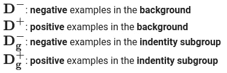

以上所有四个集合都是整个数据集的子集。

> **注:**此处**背景**数据是指不包括**子群/身份**的全部数据的子集。当我们将计算我们的偏倚-AUC 时，我们将使用这个**背景**数据和这个**亚组的联合。**

**亚组 AUC:** 这将只计算给定亚组的 AUC。制作数据集的两个子集，*一个*将具有目标标签为 1 的相应**s**s*子组，*第二个*子集将具有目标标签为 0* 的相应*子组。现在取这两个子集的并集，然后计算这个集合的 AUC。更简单地说，获取一个亚组的所有样本(阳性和阴性)，然后计算 AUC。*

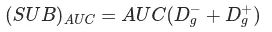

**BPSN(背景阳性，亚组阴性)AUC:** 这将计算背景中的*阳性样本和亚组*中的*阴性样本的 AUC。从数据集创建两个子集，第一个子集将具有目标标签为 1 且给定子组为假的数据点，第二个子集将具有给定 ***子组/身份*** 的目标标签为 0 的数据点。现在取这两个子集的并集，计算 **AUC** 值。*

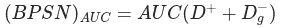

**BNSP(背景阴性，亚组阳性)AUC:** 这将计算背景中的*阴性样本和亚组/身份*中的*阳性样本的 AUC。从数据集创建两个子集，第一个子集将具有目标标签为 0 且给定子组为假的数据点，第二个子集将具有给定 ***子组/身份*** 的目标标签为 1 的数据点。现在取这两个子集的并集，并计算 **AUC** 值。*

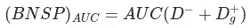

**偏倚 AUC 的广义均值:**为了将每个个体的偏倚 AUC 合并成一个总体指标，我们计算它们的广义均值，定义如下—

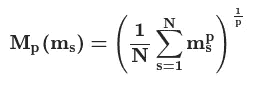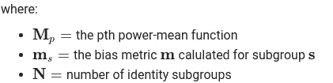

注意:Kaggle 已经设置了 *p* ， **p =-5** 的值。

**最终指标/得分/AUC**

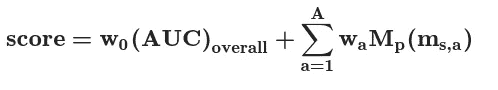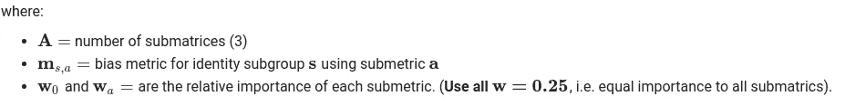

# 探索性数据分析

在做了一些谷歌搜索和浏览了多篇文章后，我设计了 14 个新功能。

1.  `**word_count**`:句子的总字数
2.  `**char_count**`:句子总字数(`**word_count**` < = `**char_count**`)
3.  `**word_density**`:句子中的单词密度
4.  `**total_length**`:句子的总长度(包括多余空格、特殊字符等。)
5.  `**capitals**`:句子中大写字符的个数
6.  `**caps_vs_length**`:大写单词数占句子总长度的比例。caps _ vs _ length = capitals total _ length
7.  `**punc_count**`:句子中标点的数量
8.  `**num_exclamation_marks**`:感叹号数量(**！**)
9.  `**exlamation_vs_punc_count**`:感叹号数量占标点符号总数的比例。exla mation _ vs _ punc _ count = num _ exla mation _ markspunc _ count
10.  `**num_question_marks**`:问号的个数(**？**
11.  `**question_vs_punc_count**`:问号数量占标点总数的比例。
12.  `**num_symbols**`:符号数( **@、#、$、%、&、*、~** )
13.  `**num_unique_words**`:句子中唯一单词的个数
14.  `**words_vs_unique**`:唯一字占总字数的比例 word _ vs _ unique = num _ unique _ word _ count

文本数据包含符号、特殊字符、HTML 标签等。我将使用下面的代码删除它们。

## 手工制作特征的单变量分析

有 14 个特征，让我们看看一些特征的盒图、小提琴图和分布图。

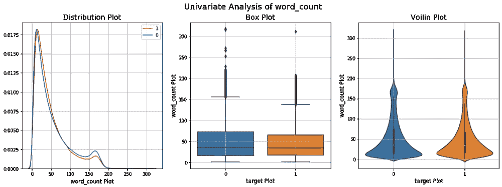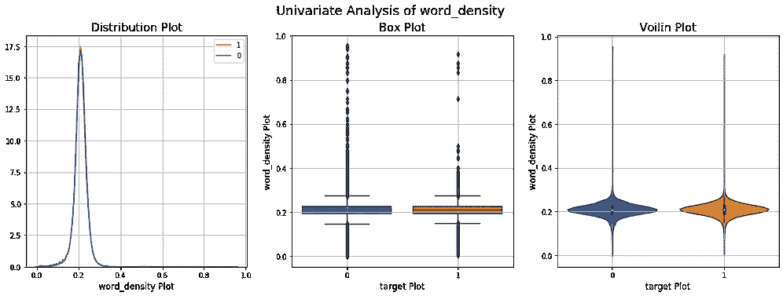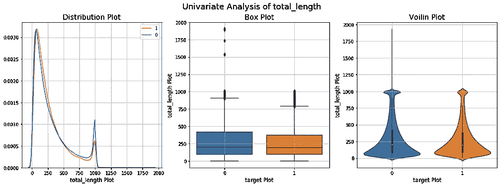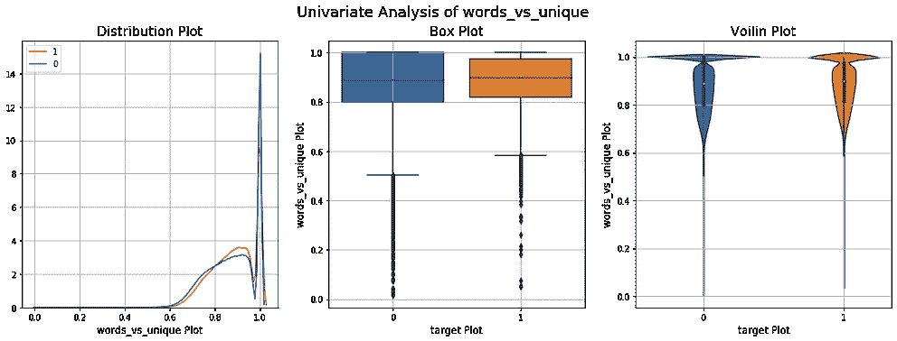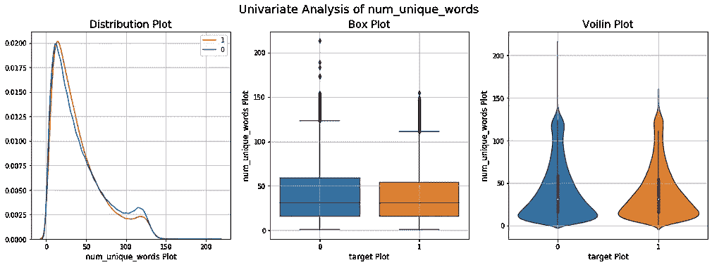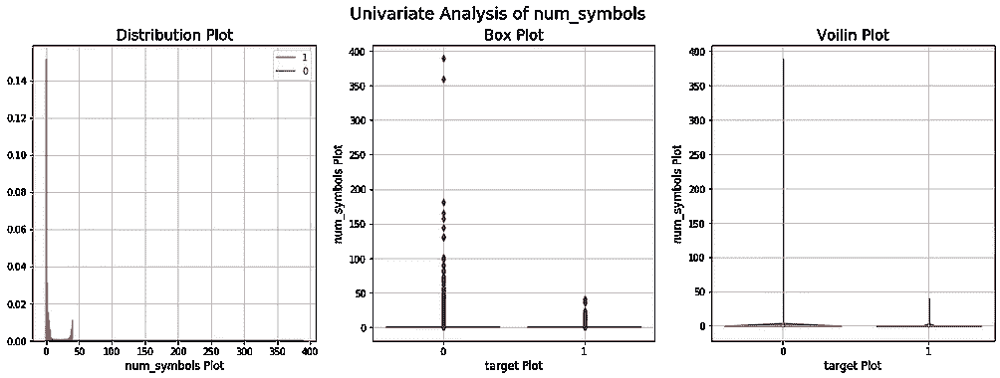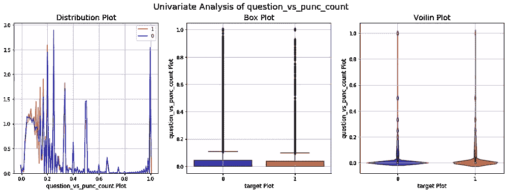

Univariate Analysis of Hand Crafted Features

看了上面的内容，可以看出几乎所有的手工制作的特征都不太好分类，因为两个类的分布几乎是重叠的。所以它们在分类中可能不会起到很重要的作用。但我会留着它们来训练我的模特。

## 手工制作特征的二元分析

让我们使用 **t-SNE 将 14 个手工制作的特征(14 维)嵌入到 2 维中。**我将使用不同的 ***困惑度&n _ 迭代*** 组合来实现这一点。

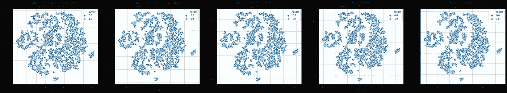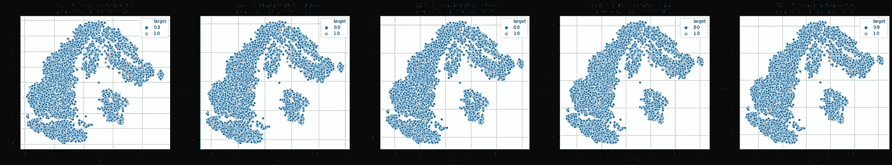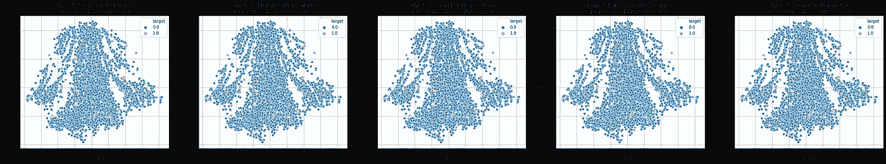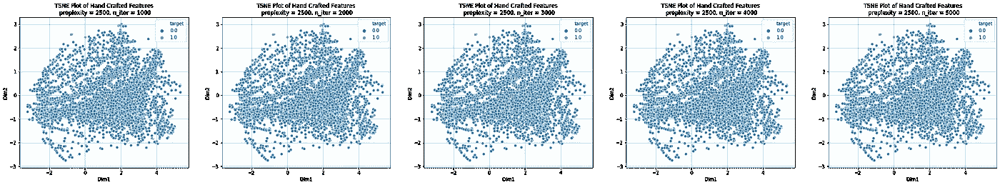

t-SNE Plot of Hand Crafted Features

这 14 个特征可能对分类帮助不大。数据集高度不平衡，这就是为什么我们在上面的图中主要看到对应于目标标签 0 的蓝点。大标签 0 在训练数据集中的百分比是 92%。

## 拆分数据

在 *train.csv* 文件中有 180 万个数据点。我要分成 80-10-10 份。拆分后，有 140 万(约。)和 180k(大约。)交叉验证(CV)和测试数据集中的数据点。我使用了分层分裂，因为数据集是高度不平衡的。

## 分割后训练/CV/测试数据集中`comment_text`特征的稳定性

如果测试/CV 数据集的大多数单词都在训练数据集中，则文本数据将是稳定的。让我们用文氏图把它形象化。

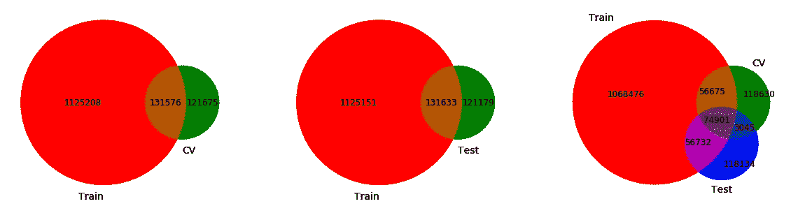

看了上面的文氏图后，我可以说文本数据不是很稳定。

# 机器学习模型

## …向量化…

我决定使用 BoW(一元和二元)对文本数据进行矢量化，因为在尝试了一个简单的模型(逻辑回归)后，我发现 BoW 的性能要好得多。我还使用了一个预先训练好的 word2vec 模型，将每个单词编码成 200 个维度。

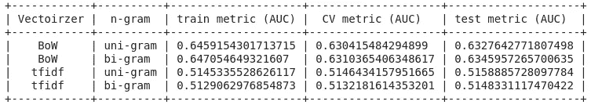

## 经典 ML 模型

我尝试过各种 ML 模型，如逻辑回归、决策树、随机森林(RF)和 GBDT 模型。avg-W2V 矢量化的性能非常差，所以我没有调优 RF 和 GBDT 模型。如果你想知道我是如何调整和训练模型的，去 GitHub 上我的笔记本看看。

> **注意:我将只解释我用于最终预测的那些模型。**

**逻辑回归**

它是一个线性分类器，试图找到可以分离两个类(二元类)的超平面。它最小化 ***对数损失*** 以找到权重和偏差，并且这些参数定义了参数。给定数据集来训练模型，模型可能会过度拟合。因此，为了避免过度拟合，我们添加了一些正则优化。我们把这个正则子乘以***λ***，这就是所谓的超参数。如果***λ***值高，这意味着我们更重视正则化，而不重视 ***损失。*** 该超参数需要使用 ***交叉验证*** 数据集进行校准。我们应该选择给出我们的度量的最佳值的超参数的值。

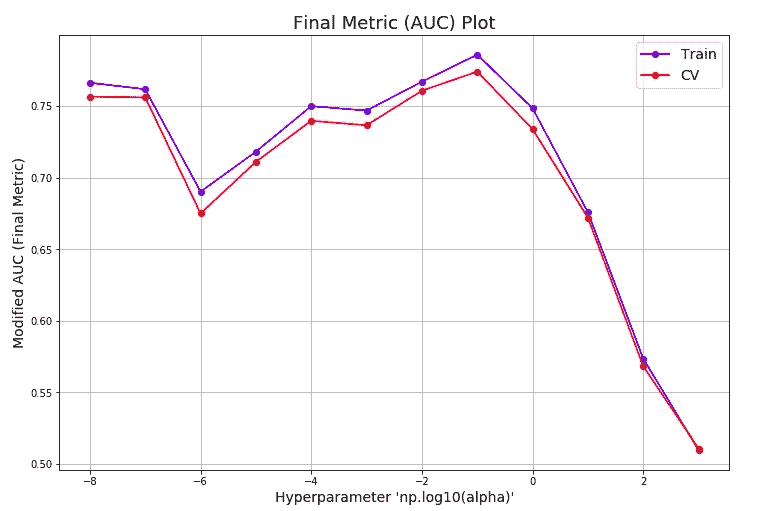

为此我使用 SGDClassifier，它使用 ***alpha*** 超参数，与 ***lambda 完全相反。*** 从上图我们可以看出 ***alpha = 10**-1*** 给出了我们度量的最佳值。所以我们的模型要用这个超参数来训练。

**GBDT(梯度推进决策树)**

这是一个集合模型。在这个模型中，每个基础学习者都根据前一个基础学习者的错误进行训练。这个模型减少了偏差，并保持方差几乎不变。偏差减少，因为每个基础学习者都在前一个基础学习者的错误上被训练，并且方差保持不变，因为非常浅(即，决策树具有小的深度)。这个模型有各种超参数，所以我用***RandomizedSearchCV***来调优超参数。

## 深度学习模型

使用经典 ML，我没有得到很好的性能。我使用 ML 得到的最佳性能是使用 GBDT 模型的 0.78 final-AUC。所以我应用了一些简单的 DL 模型。一个模型是一个非常简单的模型，它使用 ***BoW*** 矢量器进行训练，但是这个模型的性能也不好。DL 的第二个模型包括一些 Conv1D 层，然后是密集层，该模型给出了非常好的性能。在第二个模型中使用了单词嵌入。从这个模型中，我得到了 **0.88** final-AUC 值。

**型号-1**

在第一个 DL 模型中，我使用了 ***弓*** 矢量化数据来训练模型。在这种情况下，我只使用了 MLP。这个简单的模型比所有经典的 ML 模型表现得更好。

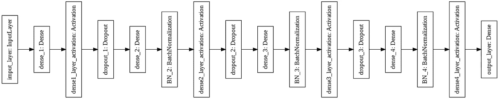

```
Total params: 643,041 
Trainable params: 642,929 
Non-trainable params: 112
```

**型号 2**

在这个模型中，我使用了单词嵌入和一些卷积层。这个模型给了我一个非常好的表现。

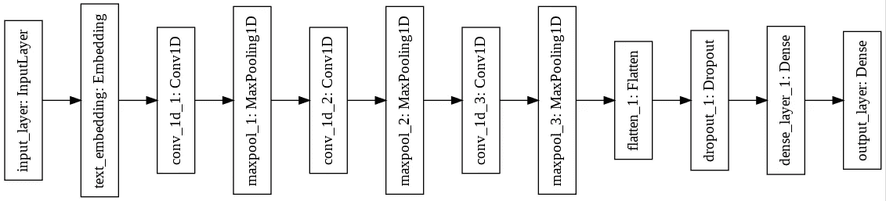

```
Total params: 57,193,513 
Trainable params: 182,913 
Non-trainable params: 57,010,600
```

**型号-3**

在前两个模型中，我使用了 **LSTM** 和**双向 LSTM** 来训练模型。在以前的模型中，没有长期依赖性，而在我们的情况下(文本数据)，需要长期依赖性。每个 LSTM 单元具有单元状态作为输入，并且这个单元状态是前一层的 LSMT 单元的。这种单元状态有助于保持长期依赖性。

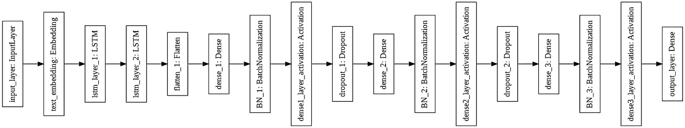

```
Total params: 57,128,617
Trainable params: 117,905 
Non-trainable params: 57,010,712
```

**型号 4**

在这个模型中，我使用了两个双向 GRU 层。gru 的培训费用比 LSTM 低，而双向 rnn 的培训费用非常高。在模型-3 中，依赖性是从左到右，而这里的依赖性是从两个方向(从左到右和从右到左)。

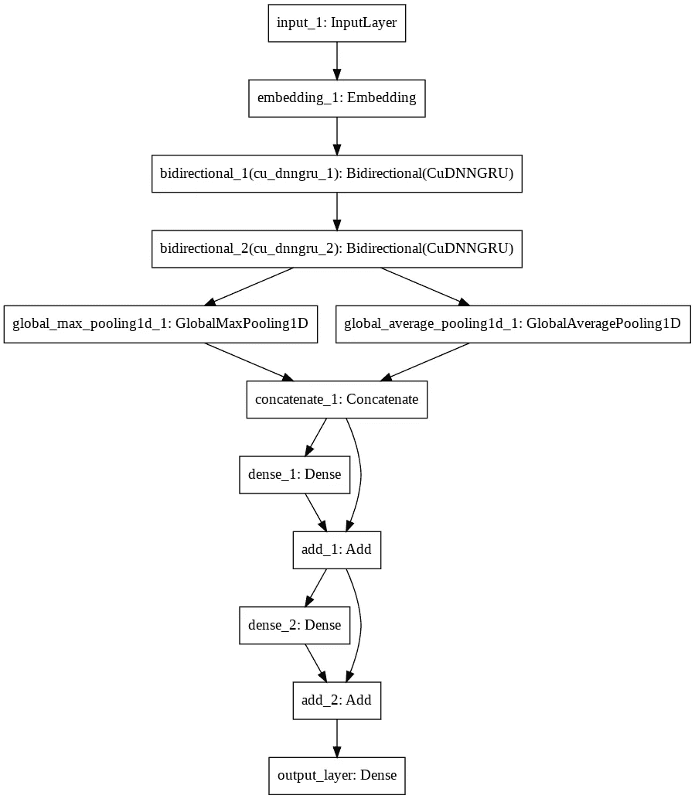

This architecture is taken from [***here***](https://www.theseus.fi/bitstream/handle/10024/226938/Quan_Do.pdf)

最后两个模型给出了非常好的性能，双向给出了 **0.9023 final-AUC。**

## 堆叠最好的模型

在尝试了各种模型之后，我将在文本数据上表现非常好的模型进行了堆叠。所以我选择了所有的 DL 模型和 2 个经典的 ML 模型(逻辑回归和 GBDT 模型)。我赋予每个模型的权重与其在测试数据上的表现(最终 AUC 值)成比例。

要找到最终的 AUC 值:

要绘制混淆矩阵:

对于最后的预测:

上面代码的输出:

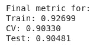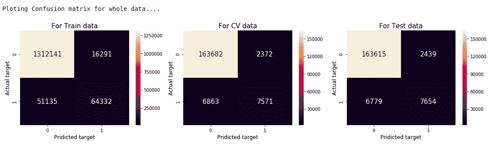

Confusion Matrix for Whole data

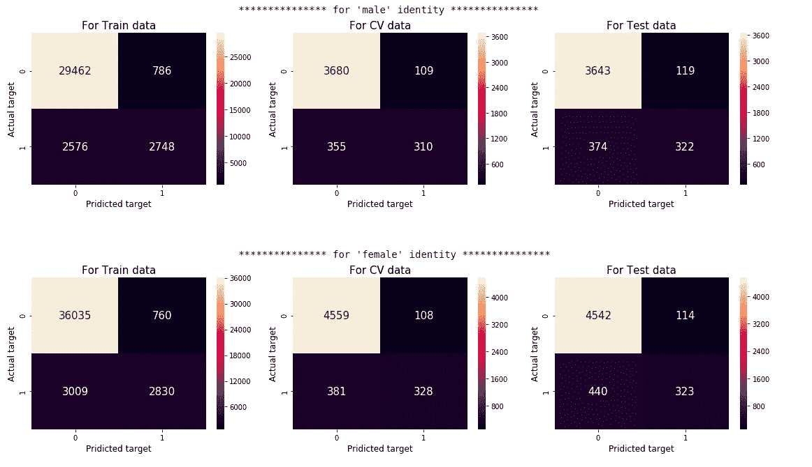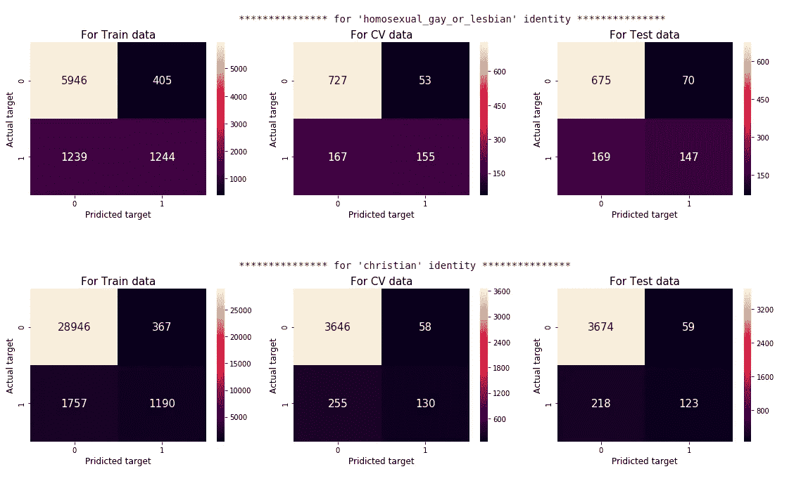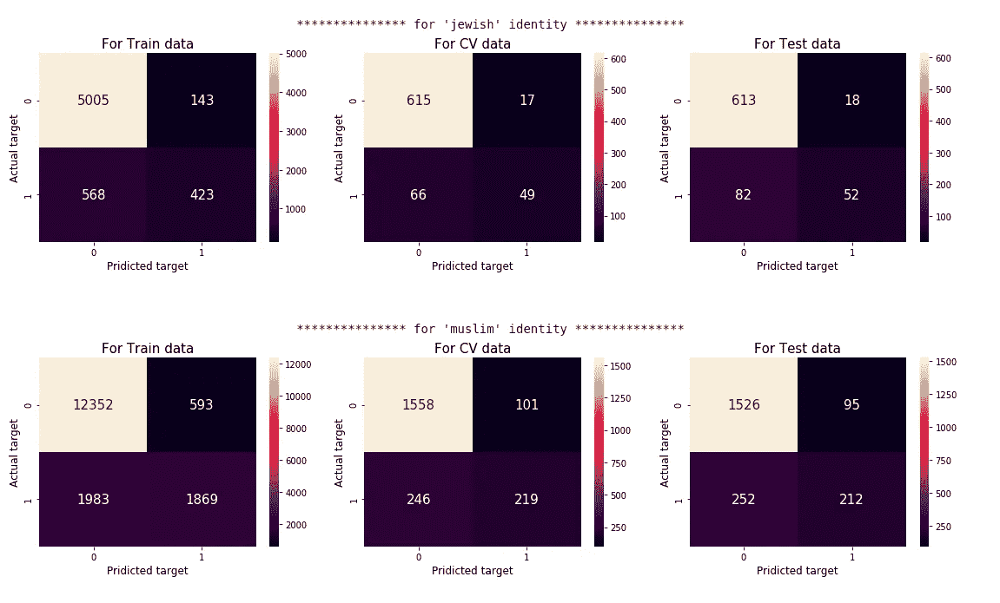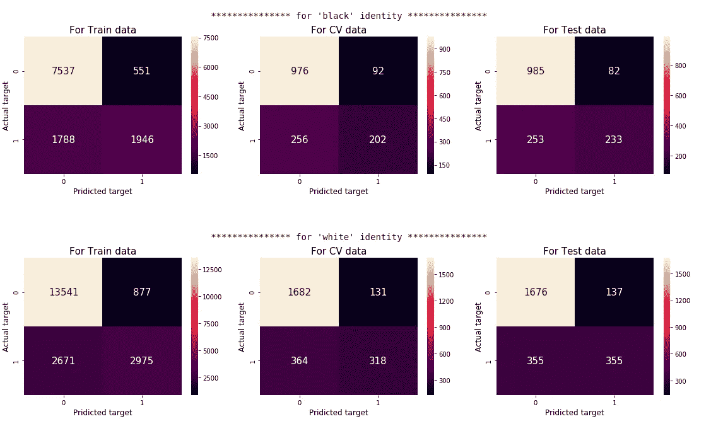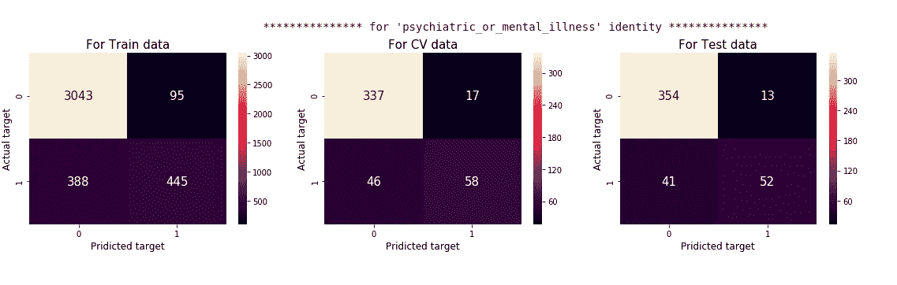

Confusion Matrix for Each Identity/subgroup

# 结论

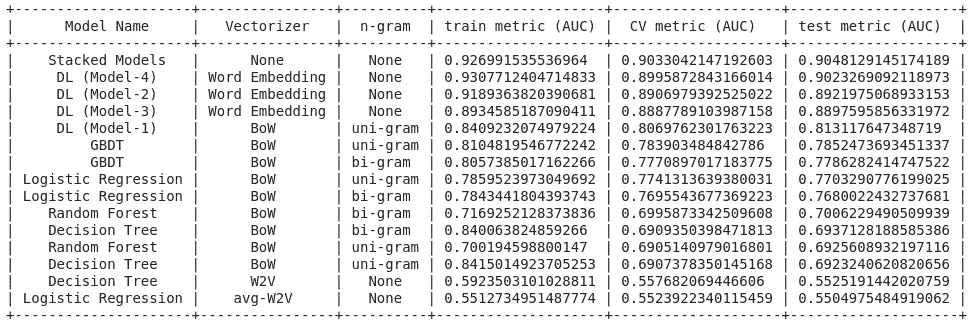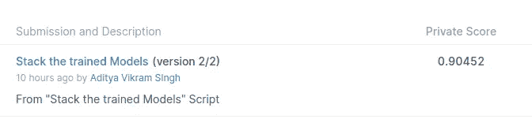

在所有这些模型中，堆叠模型的性能更好。双向模型(模型-4)在训练数据上给出 0.93 最终 AUC，在测试数据上给出 0.9023 最终 AUC。堆叠模型在测试中给出最高的最终 AUC 0.9048，在训练数据中给出最高的最终 and 0.927。如果使用每个单词的高维向量表示法(如 300 维),可以进一步改进序列模型。但这需要很长时间来训练模型。

[](https://github.com/aditya-5842/Uninteded-Bias-Reduction/blob/master/Jigsaw%20Unintended%20Bias%20in%20Toxicity%20Classification.ipynb) [## aditya-5842/非插入偏差减少

### 链接到我的笔记本

github.com](https://github.com/aditya-5842/Uninteded-Bias-Reduction/blob/master/Jigsaw%20Unintended%20Bias%20in%20Toxicity%20Classification.ipynb) 

# 参考资料:

*   [https://www . ka ggle . com/c/jigsaw-unintended-bias-in-toxicity-class ification/overview/evaluation](https://www.kaggle.com/c/jigsaw-unintended-bias-in-toxicity-classification/overview/evaluation)
*   https://www.kaggle.com/dborkan/benchmark-kernel
*   【https://arxiv.org/abs/1903.04561 
*   [https://www . Theseus . fi/bitstream/handle/10024/226938/Quan _ do . pdf](https://www.theseus.fi/bitstream/handle/10024/226938/Quan_Do.pdf)
*   [https://www . ka ggle . com/c/jigsaw-unintended-bias-in-toxicity-classification/data](https://www.kaggle.com/c/jigsaw-unintended-bias-in-toxicity-classification/data)
*   [https://medium . com/the-false-positive/unintended-bias-and-names-of-frequency-targeted-groups-8e0b 81 f80a 23](https://medium.com/the-false-positive/unintended-bias-and-names-of-frequently-targeted-groups-8e0b81f80a23)
*   [https://twitter.com/jessamyn/status/901476036956782593](https://twitter.com/jessamyn/status/901476036956782593)**