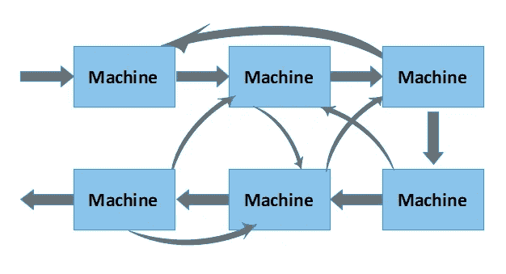
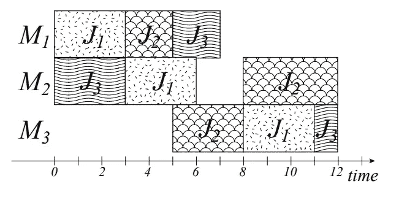
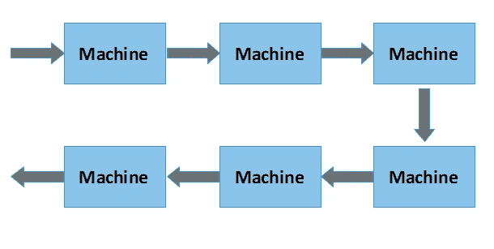
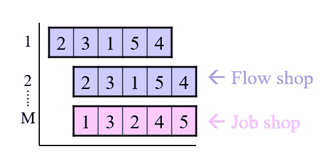

# 作业车间调度问题(JSSP):综述

> 原文：<https://medium.datadriveninvestor.com/job-shop-scheduling-problem-jssp-an-overview-cd99970a02f8?source=collection_archive---------0----------------------->

大自然一直是人类的巨大灵感。所有人工智能的伟大努力都有其与自然现象相关的根本原因。你有没有想过在蜜蜂或蚁群中任务是如何分配的？我对探索蜜蜂自身如何协调和分配任务很感兴趣。听起来很有趣，对吗？；)

好吧。在我的童年，我的父亲曾经告诉我，在一个蜂群中有一个蜂王和工蜂。女王给每只蜜蜂一些任务。事实上，在一个蜂群中，蜂王会给下属和工蜂分配任务，从而维持连续的工作流程和日复一日的平衡。但是女王是如何记录任务的，工作和生活的平衡是如何保持的。当我对此进行研究时，我发现了一些有趣的机制，它们利用信号和线索来维持群体层面的行动协调。研究证明，像蜜蜂、蚂蚁、黄蜂等群居昆虫，甚至人类在生态上的成功，都取决于他们同心协力的能力。所以时间安排是社会行为的一个主要要求。

 [## 艾预测:“颠覆，然后是生产力”|数据驱动的投资者

### 人们越来越担心，随着机器学习和互联网的普及，所有白领工作都将消失

www.datadriveninvestor.com](https://www.datadriveninvestor.com/2018/08/06/ai-forecast-disruption-then-productivity/) 

调度是将共享资源分配给竞争活动。受上述现象的启发，这篇博文详细探讨了与计算机科学相关的调度问题。

# **作业车间调度(JSS)**

**作业车间调度(JSS)** 或**作业车间问题** ( **JSP** )是计算机科学和运筹学中一个流行的优化问题。

这着重于在特定时间将任务分配给资源。

## 什么是工作商店？

车间是一个工作场所，其中有许多通用工作站，用于执行各种工作。

JSSP 最基本的版本是:

> 给定的具有不同加工时间的 **n 个**工件 **J1，J2，…，Jn** ，这些工件需要在具有不同加工能力的 **m 台机器**上调度，同时尽量使**最大完工时间**。

最大完工时间是调度的总长度(即当所有的工件都完成加工时)。

每个作业由一系列任务组成，这些任务必须按照给定的顺序执行，并且每个任务必须在特定的机器上处理。

## 车间作业问题的约束

车间作业问题有三个主要约束:

*   在某个作业的前一个任务完成之前，该作业的任何任务都不能开始。
*   一台机器一次只能处理一项任务。
*   任务一旦开始，就必须运行到完成。

## 描述作业车间调度问题的因素

根据对车间作业调度的研究和实验，下列变量影响最大。

1.  到达模式
2.  机器数量(工作站)
3.  工作顺序
4.  绩效评估标准

## 到达模式的类型

工件到达机器的方式有两种，静态或动态。

*   static-n 个工件到达闲置车间，必须安排工作
*   动态—间歇到达(这通常是随机的)

## 工作顺序的类型

*   固定的、重复的顺序——流水车间
*   随机序列—所有可能的模式

## 作业调度的性能评价标准

大多数研究的性能标准是基于遵循最优作业调度启发。

*   完成所有工作的总时间
*   车间作业的平均时间
*   迟
*   车间平均工作数量
*   机器的利用
*   工人的利用

Illustration of Job Shop Scheduling

## JSS 的代表权

甘特图是直观表示 JSSP 解的一种方便的方法。

A Grant chart representation of a 3x3 problem. Source: [link](http://www.kecl.ntt.co.jp/as/members/yamada/galbk.pdf)

J1-JBOY3 乐队代表工作

M1-M3 代表机器

这个解的长度是 12，这是第一次当三个作业都完成时。但是，注意这不是最优解！

可以在[这里](https://developers.google.com/optimization/scheduling/job_shop)找到一个很好的 python 实现来最小化最大完成时间。

 [## Job Shop 问题| OR-Tools | Google 开发者

### 一个常见的调度问题是车间作业，即多个工件在几台机器上加工。每项工作…

developers.google.com](https://developers.google.com/optimization/scheduling/job_shop) 

# 流水车间调度

流水车间调度是作业车间调度的一种特殊情况，其中所有作业都有严格的执行顺序。它遵循线性方式。

FSS 最基本的版本是:

> 给定的不同加工时间的 **n** 工件 **J1，J2，…，Jn** ，需要在 **m 台机器**上调度。
> 
> 工作的第 *i* 个操作必须在第 *i* 个机器上执行。没有一台机器能同时完成多项操作。
> 
> 一个作业中的操作必须按照指定的顺序执行。第一道工序在第一台机器上执行，然后(当第一道工序完成时)第二道工序在第二台机器上执行，依此类推，直到第 *n* 道工序。
> 
> 这里的问题是确定这样的最优安排，一个尽可能最短的总作业执行完成时间。

Illustration of Flow Shop Scheduling

# Job Shop 还是 Flow Shop？

基本上，大多数处理高混合、小批量产品的小型机械加工厂通常使用车间模式。像汽车这样的大批量制造商使用流水车间模式。

两种调度之间任务序列处理方式的根本区别如下所示。

Job Shop vs Flow Shop

# 解决车间作业问题

为了解决调度问题，在计算机科学和运筹学中已经提出了广泛的解决方案。

## 约翰逊法则

在运筹学中，**约翰逊法则**是在两个工作中心安排工作的最常用方法。它的主要目标是找到一个最优的工件序列来缩短最大完工时间。它还致力于减少两个工作中心之间的空闲时间。

## **统计方法**

在计算机科学中，为了调度和优化，已经进行了大量的开发和研究。遗传算法、蚁群优化、模拟退火(SA)、人工神经网络、多智能体系统是其中的一些方法。这些技术中的每一种在计算上都有所不同，因为它们可以提供不同的方法和优化能力。

然而，在计算机科学和运筹学领域，调度优化仍然是一个具有挑战性的问题。当前的大多数解决方案都无法应对环境的不确定性、任务和代理的动态行为，并且不具有适应性。甚至缺乏可实时实施的解决方案。因此，为了解决这个问题，需要实现一个变通解决方案。

我希望你通过这篇博文对作业调度问题有一个清晰的认识。如果你对这篇博文有任何问题或评论，请在下面留下你的评论。

干杯！

# 参考

[1]http://www.kecl.ntt.co.jp/as/members/yamada/galbk.pdf

[2][https://en.wikipedia.org/wiki/Flow_shop_scheduling](https://en.wikipedia.org/wiki/Flow_shop_scheduling)

[https://en.wikipedia.org/wiki/Johnson%27s_rule](https://en.wikipedia.org/wiki/Johnson%27s_rule)

[4][http://courses . Washington . edu/ie 337/Job % 20 shop % 20 scheduling . pdf](http://courses.washington.edu/ie337/Job%20Shop%20Scheduling.pdf)

[5][https://developers . Google . com/optimization/scheduling/job _ shop](https://developers.google.com/optimization/scheduling/job_shop)