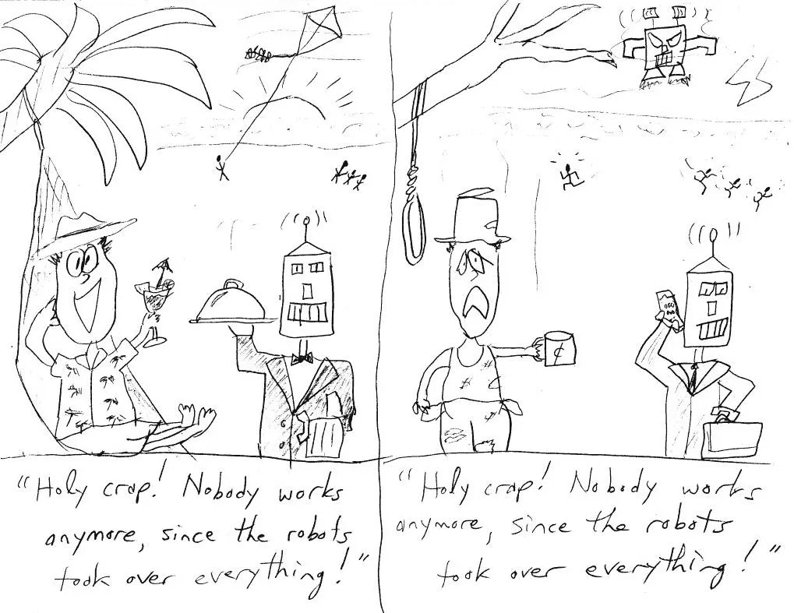

# 机器人的工作和每个人的钱

> 原文：<https://medium.datadriveninvestor.com/jobs-for-the-robots-and-money-for-everybody-f40d5c51717b?source=collection_archive---------23----------------------->

机器人来了！他们会抢走我们所有的工作！

在过去几年成为美国政治焦点的关于煤矿工人失业、对华贸易战和打击移民的辩论中，这一观点明显缺失。尽管关于这些话题的言论可能有些危言耸听，但不知何故，工作自动化的想法被认为更加危言耸听。但真正的区别在于，后者很可能是(并且已经被证明是)真实的。

了解谁是真正的罪魁祸首可能会有所帮助。每篇关于人工智能的文章似乎都以长着发光的红眼睛的无皮终结者为特色。这意味着，当你闷闷不乐地把你最喜欢的咖啡杯和你孩子的照片放在一个纸箱里，然后登上电梯时，一个人形机器人将[真的坐在你的办公桌前](https://www.washingtonpost.com/news/wonk/wp/2017/11/30/robots-could-soon-replace-nearly-a-third-of-the-u-s-workforce/?noredirect=on&utm_term=.2ac9a2b30afe)。这是一种隐喻，但实际上不会这样。我这么说是因为我充分意识到我在我的愚蠢漫画中已经做到了这一点(然而，太空入侵者机器人杀死海滩上的人是一个令人不寒而栗的预言，因为根据摩尔定律[太空入侵者变得更快更危险](http://qr.ae/TUNJww)。)

想象一下，在电脑普及之前，你有一份会计的白领工作。你工作日的大部分时间会用在使用加法机，比较“A 列”和“B 列”，检查总数是否正确相加。当你的办公室有了一台电脑，并且你开始在 MS Excel 中使用它，你会有什么感觉？毫无疑问，新工具需要一个学习过程。但是比较这些列在相对较短的时间内会变得容易得多。你不会诅咒刚刚偷走你工作的机器。相反，你会享受你新发现的生产力和效率，现在会有时间做分析和其他增加真正价值的活动。

随着每个版本的 Excel 变得越来越复杂，您的分析能力也越来越强。如果你能跟上，这是好事。如果你的工作场所是公平的，你应该期望得到更多的报酬。如果不是，那么你有技能带去就业市场，找到一个是。银行出纳员和自动取款机也存在类似的情况——出纳员可以做更高级的工作，因为他们不再需要不断地为人们点钞。

但是如果你跟不上进度，那么你可能有问题。当计算机可以在更短的时间内处理所有乏味的“A 栏到 B 栏”的工作时，一个有三名辅助簿记员的会计师办公室就可以通过削减这三项工作中的一项或多项来节省资金。银行出纳员也是如此，美国宇航局的“计算机”(实际上曾经是一个职位名称)被真正的“计算机”(现代定义)取代，除非他们能够学习 FORTRAN 语言，并将潜在的篡夺者变成工具，就像玛戈特·李·谢特利的 [*隐藏的人物*](https://amzn.to/2CQlzzZ) 中的多萝西·沃恩的故事一样(由奥塔维亚·斯班瑟在 2016 年的电影改编中饰演)。)

在每一次自动化带来的巨变中，从内德·勒德的织布机到底特律的汽车工业，再到 21 世纪初的文职工作，未来依然模糊不清，不可预测，没有人能预见随之而来的新机遇。一两个世纪前的工厂工人绝不会想到社交媒体顾问、调查性博客作者、YouTube 主持人、人力资源技术项目负责人和 [Twitter 鲨鱼标记者](https://twitter.com/maryleeshark?lang=en)(这实际上是一件事，来自汤姆·弗里德曼的[谢谢你迟到](https://amzn.to/2N3PJEm))。)但不知何故，当似乎没有工作可做时，人类会找到更多的方法来占据时间，创造新的需求，并满足这些需求。这种干扰变成了一件长期的好事，甚至对于那些原本从单调、不愉快和/或危险的工作中被取代的人来说也是如此。

虽然这一积极趋势可以在长期行动中看到，但对于那些突然失业并被剥夺了养活自己和家人的手段的人来说，这只是小小的安慰。这也可以在行动中看到，即使失业数字看起来相对较好。美国人口中有一部分已经停止寻找工作，因此[没有被计入失业总人数](https://www.forbes.com/sites/eriksherman/2018/05/05/sure-unemployment-went-down-because-the-number-of-people-working-did/#3e904baf408b)。自动化和新的效率所造成的破坏具有非常真实的后果，尤其是对穷人而言。

我们应该诅咒“机器人”抢走我们的工作吗？这都是天网和那个令人毛骨悚然的终结者的错吗？

科技失业问题与全球贫富差距不断扩大密切相关。看涨的经济和最近生产率的提高主要有利于采用新技术的公司，然后裁减不必要的人员。这应该不会让任何人感到惊讶，因为这是资本主义的基本公式。这一问题没有出现在政治辩论中(至少在美国)的原因是，将科技失业作为一个真正的问题将意味着财富不平等。任何一个支持财富不平等的政客(超越选举年的口头承诺)都会疏远竞选捐助者。

在资本主义经济中，公司提高生产率，然后节省劳动力，没有义务帮助失业的人。所以游戏里有几个大赢家，也有很多大输家。对失业者的联邦援助可以提供一些缓解，但是如果到 2034 年 [47%的现有工作将实现自动化的话就不行了。(是的，图中是另一个机器人在做某人的案头工作。)](https://www.huffingtonpost.co.uk/2014/01/17/rise-of-the-machines-economist_n_4616931.html?guccounter=1)

那么，我们准备好抛弃整个资本主义体系，重新实施 20 世纪共产主义国家的失败实验了吗？我当然不希望如此。即使抛开这种制度下自上而下控制资源分配不可避免的人权暴行，市场动力的消失和创新的停滞也是如此，而创新原本是所有新财富的源泉。解决方案是在中间的某个地方，一如既往。市场应该允许人们自由赚钱，但钱永远不应该是“免费的”。那些从自由市场体系中获益最大的人应该承担维持该体系运行的成本，而财富不平等(一端)或令人窒息的自上而下的政府控制(另一端)都可能导致该体系停滞和/或停止。

未来几十年自动化对就业的大规模破坏可能导致两种可能的未来:一种是我们都从经济收益中受益(程度不同)，另一种是我们都没有。当我们走向一个工人可以重新就业并为未来的工作做好准备的世界时，有很多事情需要考虑。他们需要训练、健康和有生产力。这些都是复杂的问题，需要复杂的解决方案。[医疗保健很复杂](https://www.theguardian.com/us-news/video/2017/feb/27/trump-healthcare-complicated-budget-video)(他的说法没有错，只是应该更好地了解)，教育很复杂([这里有](https://steemit.com/education/@chekohler/why-the-current-education-system-is-antequated-falacy)一篇由 [@chekohler](https://steemit.com/@chekohler) 写的关于这一点的好文章)，总体而言，整个局面很复杂。但在短期内，财富不平等有一个简单的解决方案:从上层拿一些钱，给底层。

做到这一点的最公平和负责任的方式是普及基本收入。

杨安泽在这个平台上竞选 2020 年美国总统；他最近做客[山姆·哈里斯的*觉醒*播客](https://samharris.org/podcasts/130-universal-basic-income/)，为每个 18-64 岁的美国公民每月提供 1000 美元的 UBI。这不足以完全弥补任何人失去的收入，因此它保持了工人努力找工作或寻找更好工作的动力。但这足以让工人们更容易摆脱长期失业/就业不足的困境。这也是一个明确的数字量，因此，如果在实施该计划和收集数据后发现太多或不够，可以明确地调整该数字。作为一个预算项目，它虽然雄心勃勃，但它有潜力以一种比 2008 年银行救助更好的方式刺激经济。我不会重述整个论点；你可以在他的网站上了解更多。(注意:我想澄清一下，我提到杨安泽是因为我对他的想法感兴趣；在撰写本文时，我与他或任何其他政治活动都没有联系。)

然而，UBI 的成功实施仍有一些问题需要解决:

为每个人提供统一数量的想法是一种生硬的手段，而且每个人的需求也不尽相同。众所周知，政府不善于公平地评估经济需求。这可以通过利用市场力量的方式来解决，至少可以部分解决，并且是加密货币的一个强有力的用例。参见[斯科特·桑坦斯](https://medium.com/@2noame)的这篇文章。

另一个问题是,“普遍性”必须仅仅如此。它可以在一个国家的边界内，甚至在一个较小的社区内有效地完成。但如果财富不平等问题是全球性的，那么补救措施也需要有同样的范围。人们可以想象一个发达国家承诺给每个公民每月 1000 美元，然后一个已经严重的移民或难民危机变得更加严重，特别是在同一个发达国家的边境上，那里的公民身份因该计划而受到觊觎，甚至比其他情况下更受觊觎。在全球范围内，最需要帮助的人是最不可能得到帮助的，因为如果他们是任何国家的公民，那么这个国家很可能是一个没有能力实施 UBI 计划的穷国。加密货币在 UBI 分发中的另一个强大用例。全球 UBI 的想法将很难实施；加密货币可能会让这变得稍微容易一些，尽管仍然很复杂。

从意识形态上来说，UBI 的接受者应该有完全的自由去花掉他们需要的钱。这将责任推给了个人，并允许市场自然繁荣，很难将此作为一个目标。但是讨论中有一个务实的方面需要考虑。如果 UBI 的想法被放在美国政治舞台上，它会立即被描绘成一个“免费的施舍”。这么说让我很痛苦，但对于选择了[这个家伙](https://www.youtube.com/watch?v=uNXgjnBpxGI)的选民来说，这需要变得更加友好。

对当前政府援助项目的批评指向欺诈，以及一小部分(被极大夸大的)个人财务管理不善的人。成瘾行为，如阿片类药物、酗酒和赌博，可能需要通过对收益的一些控制来解决，因为无条件的现金支付可能会使这些成瘾。如果 UBI 的分发是使用加密货币和智能合约来完成的，那么至少其中的一部分可以被管理，或者，如果这对于技术的去中心化精神来说是有问题的，可以被激励。这可以通过一种常识性的方式来实现，如果以某种方式花费，例如预防性医疗保健、营养、教育和其他可以帮助个人长期更具生产力的类别，则允许支付稍微多一点。这也可以帮助一些人摆脱上瘾和其他坏习惯的循环，如果只是作为现金支付而不加斟酌地使用，这可能很难打破。

这也为加密货币和智能合约的另一个用例打开了大门:如果政府可以制定向公民支付的规则，那么公民也应该能够制定向政府支付的规则。如果以这种方式纳税，个人所得税负债的一部分可能只能用于个人批准的资助项目。如果以正确的方式实施(即，不是更多的钱=更大的影响力)，这可以让公民在选举日之外参与政府的集体决策。

毫无疑问，这些都不是好主意。鉴于政府处理此类事情的历史，很容易看出其中任何一个可能会出错。但是，随着安全支付和收集任何项目进展的有效数据的技术到位，我们有机会进行一些真正有用的实验。这将让我们看到什么是有效的，并支持它，或者看到什么是无效的，并在它像政府项目一样拖延几十年之前将其扼杀。我们的民选官员需要参与进来，商界也是如此。这可能需要一种文化上的转变，现在看来，这似乎是一个遥远的梦想。但是，当一个好的想法被付诸实践，人们看到它实际上是可行的，即使在这个时代，证据也很难否认。当这个想法是“每个人都有 T2 的钱”时，它会有所帮助。

*原载于 2018 年 9 月 16 日*[*steemit.com*](https://steemit.com/technology/@keving34/jobs-for-the-robots-and-money-for-everybody)*。*