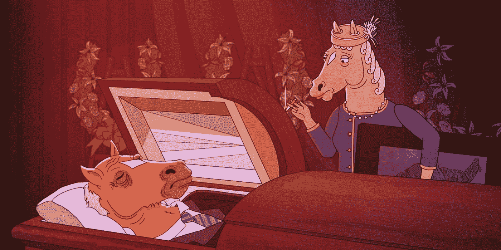
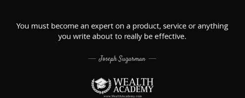
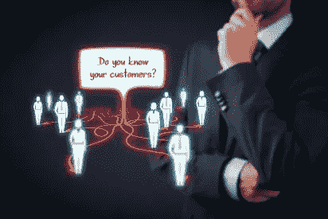
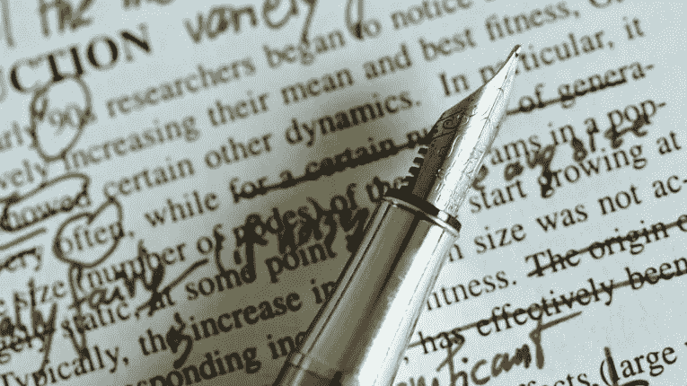
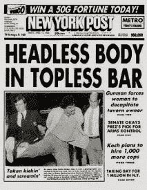

# 约瑟夫·舒格曼:撰写引人注目的销售文案的 5 个关键

> 原文：<https://medium.datadriveninvestor.com/joseph-sugarman-5-keys-to-writing-compelling-copy-that-sells-569cc2f58395?source=collection_archive---------3----------------------->

你有没有想过像约瑟夫·舒格曼这样的传奇文案知道什么，而你不知道？

他们写出引人注目、高转化率的文案的秘诀是什么？

他们如何克服“空白页”综合症，并总是设法拿出有效的文本来“催眠”读者并创造大量销售？

一度，我也想知道这些问题的答案。

谢天谢地，我有机会在我们的一次现场活动中提到传奇人物约瑟夫·舒格曼本人。

Joe 是一位著名的文案，也是畅销书[、《广告周刊文案手册》](https://www.amazon.com/Adweek-Copywriting-Handbook-Advertising-Copywriters/dp/0470051248)和[成功力量](https://www.amazon.com/Success-Forces-Joseph-Sugarman/dp/0809270617)的作者。

他还因其搞笑的长篇大论和对直销和营销的创新思维而闻名。

# 以下是约瑟夫·舒格曼成为文案天才的五大秘诀:

# 1.你必须成为写有效文案的专家

为了写出令人信服的文案，你必须先成为这方面的专家。不管你推广的是什么产品或服务，都是如此。

你需要收集所有的信息，了解报价的每一个细节。只有这样，你才能精心制作有说服力的销售论据，并通过出色的文案有效地向客户销售。

这不是什么新的或突破性的东西，但是很多人仍然忽视了研究的重要性。但是，当你写一个特定的产品时，你需要知道它是如何工作的——从里到外。

如果你对你推销的产品只有模糊的了解，你会很难找到一个好的角度，并以最好的角度来展示它。

因此，你绝对 ***需要*** 投入必要的时间进行全面的产品研究。

约瑟夫·舒格曼在《广告周刊文案手册》中分享的故事向你展示了研究的重要性。事实上，他花了整整三天的时间研究一款手表，然后决定用激光技术作为他的研究角度。

他表示，这个小细节带来了数百万美元的销售额。

所以，在你坐下来开始打字之前——确保你知道你要向观众介绍的产品或服务的所有信息。

# 2.了解谁是你的客户，他们的动机是什么

除了了解你要写的产品，你还需要了解你要写的世卫组织。你的文案风格很大程度上取决于你想吸引的人群。

为了能够有效地向特定人群销售，你需要知道他们对什么感兴趣，他们喜欢什么，他们的动机是什么，以及他们是如何思考的。

了解他们的需求是至关重要的。你还需要了解他们最大的痛点是什么。

这将使你能够把你的提议作为他们所面临问题的完美解决方案。

此外，了解你的客户将帮助你调整你的词汇。如果你使用他们日常生活中使用的语言，人们会发现你的信息更容易理解。

此外，了解受众将有助于您确定需要关注哪些优势，以促进销售并消除任何购买异议。

# 3.明白初稿往往很糟糕

关于文案写作有一个普遍的误解…

人们通常认为有经验的广告文案只是坐下来，在一天之内写下一整页的销售。

因此，当他们努力寻找合适的词，并且花 15 分钟写一个句子时，他们认为自己没有能力写出有效的文案。

但是，事情是这样的……***写出有效的销售文案是一个多层次的过程。***

它从一个草稿开始，那只不过是你的文稿的一个框架；一些可以建立的东西。

例如，约瑟夫·舒格曼认为他的初稿比其他人的都糟糕。但是，他之后如何处理他的副本才是最重要的。

*因此，他对克服“空白页综合症”的建议很简单:只管写。*

乔敦促我们赶快写。简单地在页面上得到一些东西。

与把所有东西都记在脑子里相比，当我们写下东西时，更容易组织事情并提出令人信服的销售论点。

此外，你不应该指望当场拿出完美的副本。最常见的情况是，需要多次修改，直到你想出最好的表达方式。

**所以，有效的文案其实关键在于编辑。**

当你有了一个起点(初稿)，就更容易收集你的想法，并将其转化为伟大的销售论点。

底线是——不要试图在第一次尝试时就把一切都做到完美。专注于创建一个工作框架，你可以通过几次编辑将它精炼成一个伟大的作品。

# 4.广告中的所有元素都旨在做一件事:让你阅读文案的第一句话

当考虑网站和广告文案时，人们往往会被设计所吸引。他们想要完美的颜色，令人惊叹的图像来强化信息，视觉上吸引人的布局，等等…但是，你知道这一切的意义是什么吗？是为了让你读这份报告的第一行。

第一行至关重要，因为读者只需几秒钟就能下定决心。

如果第一行不能抓住他们的注意力，激发他们的兴趣，他们可能就不会费心去读剩下的部分了。如果第一句不够有说服力，没有传达出最大的利益，你所有的努力都将是徒劳的。

因此，花尽可能多的时间来确保你的第一句话尽可能有力。

它需要简洁明了，仅仅通过阅读这一句话，读者就应该对要约的内容以及他们可以从中获得什么有一个很好的了解。

此外，记住视觉效果不应该分散人们对信息的注意力。相信我，这种事经常发生，这是你想避免的。

取而代之的是，确保所有其他的元素都突出了你想用你的文案传达的信息。

# 5.有效地设计你的报价

引用他自己的传说:

你的广告布局和广告的前几段必须创造最有利于销售你的产品或服务的购买环境。—约瑟夫·舒格曼 ***点击推文***

现在，我们来分解一下这种说法。

其核心是，它建议你需要创建一个 ***购买框架*** ，人们将通过它来查看你正在推广的产品或服务。

在网络广告中，这个框架很大程度上取决于你网站的风格和设计。

此外，根据你要传达的信息，你可以使用不同的颜色组合。

例如，促销 flash 的广告经常使用红色和黄色的组合:

另一方面，高价票和高级会员倾向于使用黑色背景上的金色字母。

所有的设计因素共同为每一件产品创造合适的购买环境。

就像我提到的，你不希望这个设计分散观众的注意力。相反，它应该有助于创造一个突出你所推销的产品的环境。

例如，如果你是一家 B2B 公司，你的设计需要干净、简单、专业、整洁。

总而言之，确保它与你的业务、品牌颜色一致，并强化你试图传达的信息。

这样的话，你的文案会自动变得更加有效。

# 最后的想法约瑟夫舒格曼文案

我相信你已经从这篇文章中了解到，文案写作并不像有些人想的那么简单。

它需要全面的研究，以及像样的写作和编辑技能。

最重要的是，单纯的抄袭不会影响购买决定。设计发挥着巨大的作用，正确的颜色和图像可以对你的转化产生积极的影响。

也就是说，复制并不像你被误导的那样困难。你只需要学会克服“空白页综合症”,开始写作。

和其他技能一样，文案也是可以通过实践来学习和完善的。

我相信约瑟夫·舒格曼的这些经验将帮助你成为一名更好的文案，并帮助你制作出引人注目的文案来增加销量。

这些课中你最喜欢哪一节？如果您有任何问题、意见或反馈，请在下面的评论中发表。

想获得更多关于撰写有效文案和完善营销策略的技巧，以实现收入最大化吗？

**喜欢这个？想要我一对一的帮助吗？请在下面留下您的评论**

或者直接联系我们，获得[你的 30 分钟免费收入 Kickstarter 战略会议——点击这里。](https://incomekickstarter.com/yes)

# 准备好成长了吗？

如果你喜欢这篇文章，请点击拍手按钮👏加入我们的[脸书小组](https://www.facebook.com/groups/shaqirhussyin/announcements/)或者在[财富学院](https://wealthacademy.com/)查看更多关于我们的信息

**。。。**

*由*[*Wealthacademy.com*](https://wealthacademy.com/joseph-sugarman-copywriting-lessons/)发布数据驱动投资者