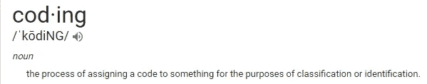

# 数据科学之旅

> 原文：<https://medium.datadriveninvestor.com/journey-to-data-science-e2d0fad5726a?source=collection_archive---------29----------------------->

在一个劳动节的周末，我和朋友去宾夕法尼亚州的波科诺短暂度假。在旅行之前，我们有一些时间来讨论预算，我很乐意跟踪和管理我们的预算，所以我详细地计划和计算了预期的支出，并与大家分享，以使每个人都清楚资金的流向。

我的几个朋友已经在计算机科学领域(网络/应用程序开发)找到了一份相当不错的工作。我们聊了聊我们的学术背景。突然，我的一个朋友，娜塔莉，开始劝我投身于编码！

从那时起，我开始做一些关于编码工作职位及其要求的研究。我在大学学过数学，所以我想找一份有更多数学背景的工作。编码中有许多分支，而 ***【数据科学家】*** 吸引了我的注意力。

我自学了数据科学编程常用的 python。但我很快意识到，要在这个领域找到工作，需要更高的编程教育。读研是学习的一种方式，但是有时间和金钱的问题。我得出结论，编写 bootcamp 对我来说是个不错的选择。

> **纽约有哪些训练营？**

在我寻找训练营的时候，纽约有一些数据科学训练营； ***Flatiron，NYC 数据科学院，总会，字节学院*** 等。

学费都在 15，000 美元左右或略高，课程完成时间约为 12-14 周，课程大纲似乎相似，但开始日期不同！

其中我选择了大会，因为它完全符合我辞职的时间，也是我在接受任何处罚之前做好准备的时间。此外，大会在项目期间有许多休息日(如节假日、圣诞节等)。)这样，如果我落后了，我就有时间赶上来。

> **下一个** *…*

我开始学习*数据科学*已经 4 个月了。即使我经历了我的弱点，突破它的感觉总是很好！我不知道我的数据科学之旅将如何进行，但我会努力学习和挑战。