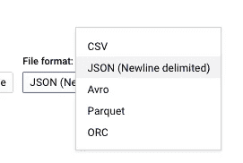
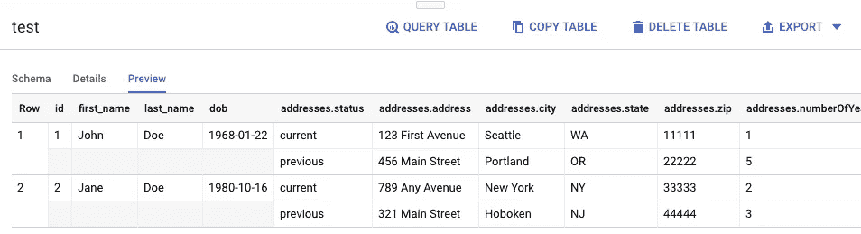

# JSON 解析错误:如何使用 NDJSON 将 JSON 成功加载到 BigQuery 中

> 原文：<https://medium.datadriveninvestor.com/json-parsing-error-how-to-load-json-into-bigquery-successfully-using-ndjson-2b7d94616bcb?source=collection_archive---------1----------------------->

[](http://www.track.datadriveninvestor.com/1B9E)

将 JSON 文件加载到 BigQuery 时可能遇到的多种错误。举个例子，

*   从位置 0 开始的行中出现 JSON 分析错误:应为键
*   意外的字符串结尾；意外的字符串结尾；预期键

如何成功地将 JSON 加载到 BigQuery 中，而不需要调试这类错误？诀窍是使用**换行符分隔的 JSON (ndjson)** 代替标准 JSON，步骤如下。

以下示例显示了从标准 json 格式转换而来的换行符分隔文件。

Newline delimited JSON

standard JSON

[NDJSON](http://ndjson.org/) 是一种存储或流式传输结构化数据的便利格式，可以一次处理一条记录。

*   每一行都是有效的 JSON 值
*   行分隔符是' \n '

# 1.把 JSON 转换成 NDJSON？

```
cat test.json | jq -c '.[]' > testNDJSON.json
```

通过这一行简单的代码，您可以将文件转换并保存为 NDJSON 格式。

# 2.从 BigQuery UI 加载 NDJSON 文件



已成功加载。表格的预览显示它是一个嵌套的 json 文件。



总之，为了每次都能成功地将 JSON 文件加载到 BigQuery 中，您可以遵循以下步骤:

1.  将文件转换成 NDJSON
2.  从 BigQuery UI 加载它

还有一点你要注意:原始的 JSON 需要在最外层有“[]”作为:

```
[
   {
   ...
   },
   {
   ...
   },
   {
   ...
   }
]
```

享受你的“负荷”。