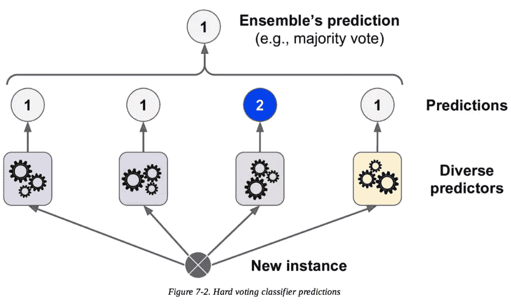

# 虚拟机器学习入门指南

> 原文：<https://medium.datadriveninvestor.com/jump-start-machine-learning-guide-for-dummies-91324b627fb0?source=collection_archive---------11----------------------->

## [**现实世界中的数据科学**](https://medium.com/towards-data-science/data-science-in-the-real-world/home?source=post_page---------------------------)

## 学习基础知识并开始实施。

到目前为止，我已经学了两门关于机器学习的课程。我曾试图跟踪吴恩达的工作，但听他讲话让我头晕，他讲的都是那些理论，而不是实践证明。我在机器学习方面的知识是初级的，但它服务于我的目的——***我想构建产品，并简单地知道使用哪些算法来增加一些智能。在这篇文章中，我会告诉你我学到了什么，这样你也可以这样做。***

> 首先，什么是机器学习？这是当你向机器展示一些样本数据时，它使用这些数据来学习模式并预测未知(即新)数据的结果。

 [## 金融中的机器学习|数据驱动的投资者

### 在我们讲述一些机器学习金融应用之前，我们先来了解一下什么是机器学习。机器…

www.datadriveninvestor.com](https://www.datadriveninvestor.com/2019/02/08/machine-learning-in-finance/) 

有三种类型的机器学习算法。

*   **监督学习** —当你给机器一些有标签的数据时，即关于数据是什么的信息。比如你告诉它，有四个轮子的物体是汽车，有两个轮子的物体是自行车。然后，机器可以根据你提供的数据进行预测。监督学习有两种基本类型:

1.  分类— *分类*是当你必须给一个数据分配一个标签(分类变量)的时候，比如问机器一个未知的水果是苹果还是香蕉。
2.  回归— *回归*是当你必须预测一个数值(连续变量)时，例如，预测**减少癌症可能需要多少**次化疗。

*   **无监督学习** —这是当你只是向机器提供一些数据，并要求它识别模式，而没有任何进一步的澄清。机器倾向于根据模式将数据分组，这被称为**聚类**。*强化学习*也是另一种无监督学习方法，机器基于奖惩进行学习。
*   **半监督学习** —这是算法使用少量已标记数据和大量未标记数据的时候。

# 决策树算法

这是他们在任何入门课程中教给你的第一个算法。这是一种监督学习算法，这意味着你需要带标签的数据(数据必须有意义，即每一部分意味着什么或代表什么，通常是具有适当名称的数据列的形式)。

该算法将数据分成如上所示的分类树。这是它创建树的方式:

它选择一个起点，然后向下到下一个属性，将数据分成不同的类，然后对下一个点重复同样的操作，直到树结束。一旦一个连续的分支堆栈完成，它就返回构建任何剩余的分支，直到所有的数据都被表示出来。

对于该算法很重要的两个计算是:

1.  **熵** —当所有样本数据属于同一类时，熵为零(最小)。当正反例数量相等时，熵为 1(最大值)。该算法知道在哪里结束一个分支，使用熵，即(当它在零)。
2.  **信息增益** —信息增益是随着新分支的创建，熵的减少。如果一个新的数据分支的创建没有减少熵，那么这个分支就不是一个好的分割。

> 要实现这种算法，您需要将数据分成训练集、验证集和测试集。为了确保您拥有最佳的树模型，您应该比较训练、验证和测试之间的错误率。与训练数据相比，最佳模型应该在测试和验证集上具有低错误率。

[下面是如何用 Python 实现决策树。](https://www.datacamp.com/community/tutorials/decision-tree-classification-python)

# k-最近邻算法

k-最近邻算法计算数据点与其邻居的距离和相似性，并对其进行聚类。该算法用于分类和回归。

下面介绍如何用 Python 实现 KNN。

# 一元线性回归

当两个变量之间的关系可以用直线绘制时，即正相关或负相关时，使用该算法。这条线是用一种叫做**梯度下降**的方法得到的。下面的视频解释一下。

# 逻辑回归

与线性回归不同，物流回归是一条 S 型曲线。它既可以用于分类，也可以用于回归。

# 朴素贝叶斯

这是一个简单的分类器，根据简单的概率预测数据属于哪个类别。这种类型的算法适用于预测欺诈、计算信用评分、批准贷款、创建推荐引擎等用例。朴素贝叶斯是:

*   对孤立噪声点具有鲁棒性。
*   通过在概率估计计算期间忽略实例来处理缺失值。
*   对无关属性具有鲁棒性。

下面介绍如何用 Python 实现朴素贝叶斯。

# 正规化

正则化是提高机器学习模型性能的方法。在正则化过程中，我们减少了不相关变量的权重，从而提高了模型的准确性。但是，重要的是不要让权重变为零，这样模型就不会过度拟合训练数据，即它只在训练数据上表现良好，而在测试数据上有很高的错误率。

# 支持向量机

支持向量机是一种大间隔分类器。它使用一条线对数据进行聚类，以最佳方式将数据分类。在大型数据集上，SVM 的性能可能会很慢。

[下面是如何用 Python 实现 SVM。](https://www.datacamp.com/community/tutorials/svm-classification-scikit-learn-python)

# 建模文本

在许多情况下，我们可能需要对文本进行矢量化，因为大多数模型都与数字相关。所以如果我们用一个数字向量来表示文本，会更方便。

## 词汇袋模型

为了在文本上应用机器学习，我们可以创建单词“包”，然后将其与单词字典进行比较，以识别相似性。

# 数据集不平衡

数据集不平衡是机器学习中的问题，其中一个类中的数据总数(正)远远小于另一个类中的数据总数(负)。

假设我们从数据集不平衡的数据中创建了两个模型。为了确定哪个模型表现更好，我们创建了一个混淆矩阵，即一个用于**描述分类模型**(或“分类器”)在一组真实值已知的测试数据上的表现的表格。

TP =真阳性，TN =真阴性，FP =假阳性，FN =假阴性。

# 集成学习

集成学习是指我们使用多种机器学习算法来预测结果，并用它们作为投票来确定最准确的预测。这样，与仅使用单一算法相比，预测的准确性通常更好。

流行的集合方法:

1.  bagging——这是指我们使用同一算法的多个模型，使用随机选取的不同数据子集。我们创建数据“包”来训练模型，其中相同的数据**可能**出现在多个包中。
2.  助推——助推是装袋的一个微小变化。在 boosting 中，我们用一包数据来训练我们的模型，然后用我们的训练数据来测试它。对于每个错误的预测，我们将这些数据点包含在下一个数据包中(该数据包包含随机选择的其他数据点),以再次训练我们的模型。我们重复这个过程，直到我们对表现满意为止。

这只是一个简单的介绍。你现在可以开始在你构建的产品上实现机器学习了。例如，通过用 Python 创建机器学习微服务，您可以在下一个项目中使用朴素贝叶斯算法对您的数据实现一个推荐系统。或者，你可以继续深入研究机器学习。

> 希望这篇文章对你在现实世界中利用数据科学有所帮助。如果你喜欢它的内容，别忘了鼓掌。